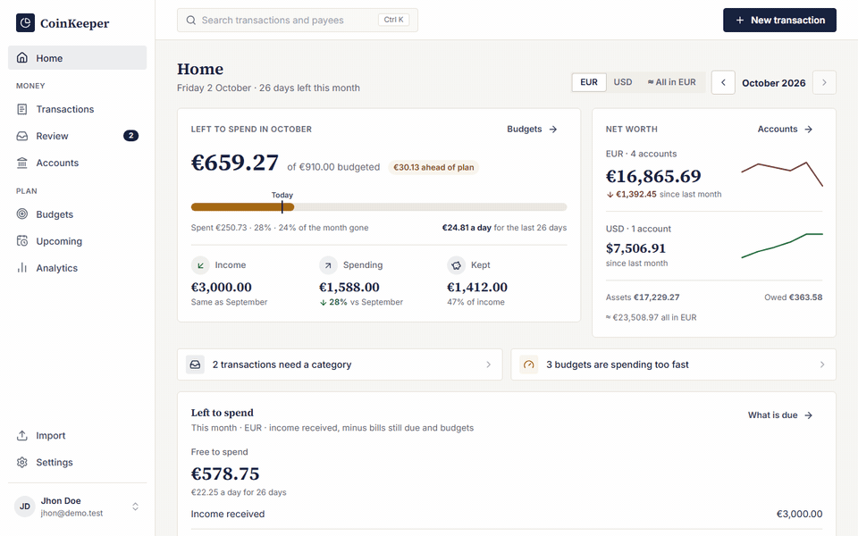

<div align="center">

# CoinKeeper

**A self-hosted budget and spending tracker for one household and a homelab.**

[](https://github.com/lucasvallejodev/my-budget-tracker/actions/workflows/quality.yml)
[](https://github.com/lucasvallejodev/my-budget-tracker/actions/workflows/playwright.yml)
[](https://github.com/lucasvallejodev/my-budget-tracker/actions/workflows/codeql.yml)




</div>

CoinKeeper keeps a ledger of every movement of money across your accounts, in the currency of each account, and turns it into balances, net worth, spending breakdowns, budgets, a review inbox and a view of the bills, subscriptions and income still to come. It runs on your own machine or server, with its own sign-in and no third-party services: your financial data stays in your PostgreSQL database.

> [!NOTE]
> **Work in progress.** I built CoinKeeper for my own homelab and personal use, so its features follow what my household needs and it changes often. Anyone is welcome to run it, but expect rough edges, schema migrations between versions and no stability guarantees yet. Back up your database before you update.

## Contents

- [Features](#features)
- [Design principles](#design-principles)
- [Tech stack](#tech-stack)
- [Getting started](#getting-started)
- [Self-hosting with Docker](#self-hosting-with-docker)
- [Commands](#commands)
- [Repository layout](#repository-layout)
- [Documentation](#documentation)

## Features

| Feature                                                                   | What it does                                                                                                                                |
| ------------------------------------------------------------------------- | ------------------------------------------------------------------------------------------------------------------------------------------- |
| [Home](docs/features/dashboard.md)                                        | Left to spend this month, free to spend after bills still due, income, spending, net worth and what needs your attention, on one page       |
| [Accounts](docs/features/accounts.md)                                     | Checking, savings, cash, credit cards and loans, with net worth over time and balances projected over the next 30 days                      |
| [Transactions](docs/features/transactions.md)                             | Record, split between categories, duplicate, filter, search, export to CSV and delete with Undo                                             |
| [Transfers and credit cards](docs/features/transfers-and-credit-cards.md) | Move money between your own accounts or pay a card; transfers never count as spending                                                       |
| [Budgets](docs/features/budgets.md)                                       | Monthly limits per category with a pace-aware status, periods that start on payday, limits suggested from recent months and copy last month |
| [Upcoming and recurring payments](docs/features/recurring.md)             | Bills, subscriptions and income: what is due, overdue or paid, series found in your history and a subscription review with price changes    |
| [Analytics](docs/features/analytics.md)                                   | Overview, spending, cash flow and payee reports for one month or up to 12, compared with the previous period or the same period last year   |
| [Review](docs/features/review-inbox.md)                                   | An inbox for uncategorized and imported entries, with suggested categories and full keyboard use                                            |
| [CSV import](docs/features/import.md) and [rules](docs/features/rules.md) | Import a bank export with column mapping, duplicate detection and transfer suggestions; rules and payee memory pre-fill categories          |
| [Categories](docs/features/categories.md)                                 | Colored groups and iconed categories, seeded with defaults and fully editable; archiving keeps history                                      |
| [Templates](docs/features/templates.md)                                   | Save the transactions you record often and add them again in two taps                                                                       |
| [Multi-currency](docs/features/multi-currency.md)                         | Accounts in any currency, every figure reported per currency, and an optional converted view labeled with the rate it used                  |
| [Deleted items](docs/features/deleted-items.md)                           | Nothing financial is erased: deleted transactions, transfers, accounts, budgets, rules, templates and recurring payments can be restored    |
| [Account and security](docs/features/account-and-security.md)             | Email and password sign-in (argon2id), HttpOnly cookie sessions you can review and end per device, and rate-limited sign-in                 |

## Design principles

- **Exact money**: amounts are signed integers in minor units with a currency code; nothing is stored as a float.
- **One ledger, many views**: balances, net worth, reports and budgets are all SQL queries over the same `transactions` table, so there are no cached totals to drift.
- **Per currency, always**: different currencies are never added together without an explicit, labeled exchange rate.
- **Transfers are not spending**: a transfer writes two linked rows with no category, so reports never count it.
- **Soft delete**: financial data is archived or soft-deleted, never erased, so every delete can be undone.
- **Your data, your server**: no external accounts, third-party services or bank aggregators; the API owns the database and the browser reaches it only through the API.

## Tech stack

| Layer    | Technology                                                                                                        |
| -------- | ----------------------------------------------------------------------------------------------------------------- |
| Web app  | Next.js 16 (App Router, client only), React 19, TanStack Query, SCSS with BEM                                     |
| API      | Fastify 5, Zod contracts shared with the web app, self-hosted auth (argon2id passwords, HttpOnly cookie sessions) |
| Database | PostgreSQL 17 with Drizzle ORM and SQL migrations                                                                 |
| Tooling  | npm workspaces, TypeScript, Vitest with PGlite, Playwright, ESLint, Stylelint, Docker Compose                     |

The architecture, request flow and invariants are described in [docs/architecture/overview.md](docs/architecture/overview.md).

## Getting started

### Prerequisites

- Node.js 24 and npm 11
- Docker (Docker Desktop on Windows and macOS) for PostgreSQL

### Run it locally

1. Install the dependencies and create your environment file:

   ```bash
   npm ci
   cp .env.example .env
   ```

   Set a URL-safe `POSTGRES_PASSWORD` in `.env`, and use the same value inside `DATABASE_URL`.

2. Start PostgreSQL and apply the migrations:

   ```bash
   npm run db:up
   npm run db:migrate
   ```

3. Start the API and the web app:

   ```bash
   npm run dev
   ```

4. Open http://localhost:3000 and create an account (the password needs 12 to 128 characters). Sign-up creates your settings and seeds the default categories.

The API listens on http://127.0.0.1:4000 and serves its Swagger UI at `/api/docs`. A forgotten password is reset from the command line with `npm run user:reset-password -- <email>`. Step-by-step details and troubleshooting are in the [setup guide](docs/getting-started/setup.md).

### Try it with demo data

To see every screen filled in, seed a local demo user with two years of accounts, transactions, budgets and recurring payments. Set `DEMO_USER_PASSWORD` in `.env`, then run:

```bash
npm run db:seed:demo
```

Sign in with `DEMO_USER_EMAIL` and `DEMO_USER_PASSWORD`. Each run rebuilds the demo user from scratch; see [Demo account](docs/getting-started/demo-account.md).

## Self-hosting with Docker

Docker Compose runs PostgreSQL, a one-shot migration container, the API and the web app from hardened images (read-only filesystems, no capabilities, non-root users):

```bash
cp .env.example .env
docker compose --profile app up -d --build
```

The web app is published on http://localhost:3000 and binds to the loopback interface only. To reach it from other devices on your network, put a reverse proxy that terminates TLS in front of it (such as Caddy or nginx) and set `ALLOWED_ORIGINS` to its public URL. The setup guide covers [serving it on a network](docs/getting-started/setup.md#serving-it-on-a-network-tls-termination), [cookies and HTTPS](docs/getting-started/setup.md#cookies-and-https) and `TRUST_PROXY`.

Back up the database with dated `pg_dump` archives written to `backups/`:

```bash
docker compose --profile backup run --rm backup
```

The restore drill is in [Backups and restore](docs/getting-started/setup.md#backups-and-restore).

## Commands

| Command                                   | Purpose                                                                   |
| ----------------------------------------- | ------------------------------------------------------------------------- |
| `npm run dev`                             | API and web app together (`dev:api` or `dev:web` for one)                 |
| `npm run build` / `npm start`             | Production build of every workspace; `start` serves the web app           |
| `npm run db:up` / `npm run db:down`       | Start or stop the PostgreSQL container (the data volume is kept)          |
| `npm run db:migrate`                      | Apply pending migrations                                                  |
| `npm run db:check`                        | Read-only comparison of the live schema against the migrations            |
| `npm run db:generate`                     | Generate a migration from `apps/api/src/db/schema.ts` changes             |
| `npm run db:seed:demo`                    | Create or refresh the local demo user                                     |
| `npm run db:studio`                       | Drizzle Studio                                                            |
| `npm run user:reset-password -- <email>`  | Set a new password for a user and sign them out everywhere                |
| `npm run lint` / `npm run lint:fix`       | ESLint and Stylelint; `lint:fix` applies every automatic fix              |
| `npm run typecheck`                       | TypeScript check of the root files and every workspace                    |
| `npm test -- --run`                       | Vitest: unit, component, API route and PGlite database tests              |
| `npm run test:coverage`                   | Vitest with an lcov coverage report                                       |
| `npm run test:e2e`                        | Playwright end-to-end tests                                               |
| `npm run lint:dupes` / `npm run knip`     | Duplicated code report (jscpd) and unused files, exports and dependencies |
| `npm run format` / `npm run format:check` | Prettier                                                                  |
| `npm run docs`                            | Serve the documentation site on http://localhost:3010                     |

Before committing, run the full gate:

```bash
npm run lint && npm run typecheck && npm test -- --run && npm run build
```

The full list with every option is in [Commands](docs/getting-started/commands.md).

## Repository layout

| Folder                              | What is inside                                                                                                                                                                      |
| ----------------------------------- | ----------------------------------------------------------------------------------------------------------------------------------------------------------------------------------- |
| `apps/api/`                         | `@coinkeeper/api`, the Fastify REST API: auth and sessions, business rules and queries (`src/modules/`), routes (`src/routes/`), the Drizzle schema and SQL migrations (`drizzle/`) |
| `apps/web/`                         | `@coinkeeper/web`, the Next.js client with no server code of its own: pages (`src/app/`), API client (`src/api/`), components (`src/components/`), the SCSS theme (`src/styles/`)   |
| `packages/shared/`                  | `@coinkeeper/shared`: Zod request and response contracts, money, date and CSV helpers, and constants used by both apps                                                              |
| `e2e/`                              | Playwright tests; `playwright.config.ts` sits at the root                                                                                                                           |
| `scripts/`                          | Local ESLint and Stylelint rules                                                                                                                                                    |
| `docs/`                             | Human documentation (Docsify): setup, architecture, feature guides, reference and product research; `docs/assets/` holds diagrams and screenshots                                   |
| `agents/`, `AGENTS.md`, `CLAUDE.md` | Documentation and operating rules for AI coding agents; start at [agents/README.md](agents/README.md)                                                                               |
| `temp/`                             | Scratch space for plans and intermediate files, git-ignored except its README                                                                                                       |
| `docker-compose.yml`, `Dockerfile`  | Local PostgreSQL 17, the hardened `api` and `web` containers and the `backup` profile                                                                                               |

A folder-by-folder tour is in [Project structure](docs/getting-started/project-structure.md).

## Documentation

The full documentation lives in [`docs/`](docs/README.md) and is served as a Docsify site with `npm run docs`.

| Where                                     | For whom  | Contents                                                                                                                                    |
| ----------------------------------------- | --------- | ------------------------------------------------------------------------------------------------------------------------------------------- |
| [docs/](docs/README.md)                   | people    | setup, commands, architecture, data model, money handling, every feature step by step, REST API reference, migrations                       |
| [agents/](agents/README.md)               | AI agents | condensed architecture and data model, conventions, workflows, code-to-docs map                                                             |
| [docs/research/](docs/research/README.md) | product   | one report per budgeting app studied, the [ranked feature opportunities](docs/research/feature-opportunities.md) and the UI design research |
| [docs/legacy/](docs/legacy/README.md)     | history   | the original redesign proposal, research reports and earlier migration notes                                                                |
