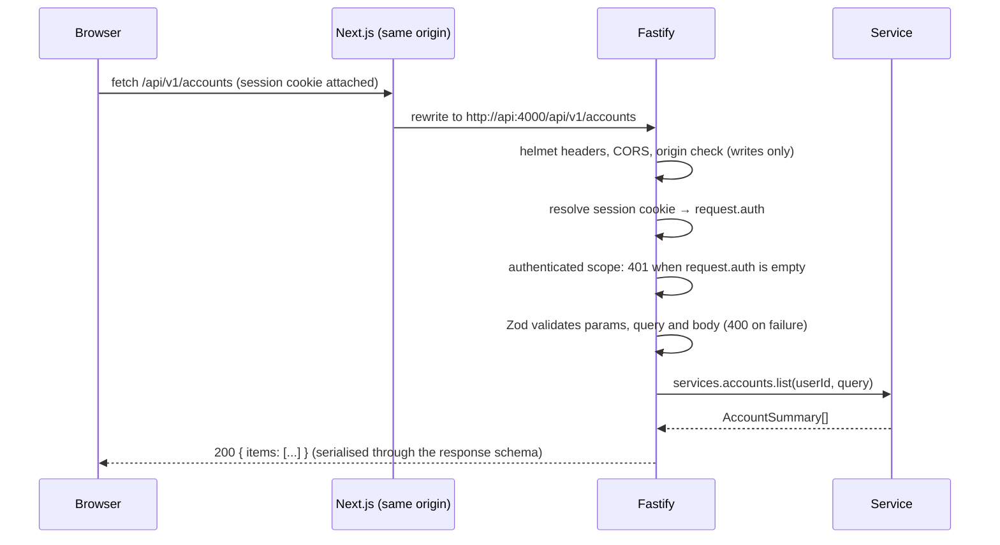

# API service

> Summary: the Fastify service in `apps/api`: folder layout, how a request flows through plugins and routes, sign-up, sign-in and cookie sessions, the layers that keep other sites and strangers out, error responses, soft deletes, and how to add or test an endpoint.

The API is a standalone Fastify 5 application (`@coinkeeper/api`). It owns the database: the Drizzle schema, the migrations, every business rule and every query. The web app talks to it over HTTP under `/api/v1`. The endpoint list is in the [REST API reference](../reference/rest-api.md).

## Layout

```
apps/api/
├─ drizzle/                 SQL migrations and Drizzle snapshots (0000_init.sql is the whole schema)
├─ scripts/                 database.mjs (npm run db:check) and its helper
├─ src/
│  ├─ server.ts             Entry point: loads .env, opens the pool, builds the app, listens, purges expired sessions hourly
│  ├─ app.ts                buildApp({ config, db }): registers compilers, services, plugins and routes; never listens (tests use it)
│  ├─ config.ts             Environment variables validated with Zod (see Configuration)
│  ├─ environment.ts        Reads the root .env and opens the database for the server and the CLI
│  ├─ auth/                 passwords.ts (argon2id), sessions.ts (session store), service.ts (sign-up, sign-in, profile, password)
│  ├─ plugins/              security.ts, authentication.ts, error-handler.ts, openapi.ts, context.ts (request.auth, requireAuth)
│  ├─ routes/               One plugin per resource (accounts.ts, transactions.ts, …), inputs.ts (amount parsing), responses.ts
│  ├─ modules/              Domain services (accounts, categories, ledger, payees, reports, fx, import, rules, budgets) and services.ts
│  ├─ db/                   schema.ts, connection.ts (DATABASE_URL checks), index.ts (node-postgres pool)
│  ├─ cli/reset-password.ts npm run user:reset-password -- <email>
│  └─ test/                 database.ts (PGlite with every migration), app.ts (buildApp on PGlite, sign-up helper, inject client)
└─ tsup.config.ts           Production bundle in dist/ (the shared package is bundled in)
```

Request and response shapes are Zod schemas in `packages/shared/src/schema/`. The same schema validates the request in Fastify, types the handler, serialises the response (unknown fields are stripped, so internal columns never leak), documents the endpoint in OpenAPI and validates the web forms.

## Request lifecycle



Routes that need a user are registered inside one scope with an `onRequest` hook (`requireSession`), so forgetting the check on a new route is not possible. Only `GET /health` and `POST /auth/sign-up | sign-in | sign-out` are outside it.

## Sign-up, sign-in and sessions

- **Users** live in `users` (`email` unique and stored lower-case, `password_hash`, optional `name`). Passwords are hashed with argon2id (`@node-rs/argon2`, 19 MiB memory, 2 iterations). Passwords must have 12 to 128 characters.
- **Sign-up** inserts the user and seeds their settings and default categories (`ensureUserBootstrap`) in one transaction, then starts a session. Every table's `user_id` references `users(id) ON DELETE CASCADE`.
- **Sessions** live in `sessions`. The browser holds a random 32-byte token; the database stores only its SHA-256 hash, so a database leak does not expose usable tokens. A session lasts `SESSION_DAYS` (30 by default) and is renewed automatically when less than half of that remains; `last_used_at` is refreshed at most once a minute.
- **Sign-out** deletes the session and clears the cookie. **Changing the password** signs every other session out. `GET /me/sessions` lists active sessions and `DELETE /me/sessions/:id` ends one.
- **Unknown email or wrong password** give the same `401 INVALID_CREDENTIALS` answer, and an unknown email still spends the time of a password check so response times do not reveal which emails exist.
- **Password reset** has no email flow yet. An operator runs `npm run user:reset-password -- <email>` (prompts for the password, or reads `NEW_PASSWORD`); it signs the user out everywhere.

### The session cookie

| Attribute | Value | Why |
| --- | --- | --- |
| Name | `__Host-ck_session` (production), `ck_session` (plain-HTTP development) | The `__Host-` prefix makes browsers accept the cookie only when it is `Secure`, has `Path=/` and no `Domain`, so a subdomain cannot set or read it. |
| `HttpOnly` | yes | Page JavaScript cannot read the token, so an injected script cannot steal it. |
| `Secure` | in production (`COOKIE_SECURE`) | Only sent over HTTPS. |
| `SameSite` | `Lax` | The browser does not attach the cookie to requests started by other sites (forms, `fetch`, images); it only sends it on our own pages and on top-level navigation to us. |
| `Expires` | session expiry | Renewed with the session. |

## Who can reach the API, and what stops them

CORS is only one of several layers, and it is not the one that keeps strangers out. CORS is a rule browsers enforce: JavaScript on another site may send a request, but the browser hides the response unless the server allows that site. It does nothing against `curl`, scripts or other servers. What actually protects the data is the session check.

```
Browser ──► https://app.example.com   (Next.js, the only public entry point)
               └─ /api/* forwarded ──► Fastify on a private network ──► PostgreSQL
```

| Layer | What it does | Where |
| --- | --- | --- |
| 1. Network | Fastify is not published to the internet; Next.js forwards `/api/*` to it. In development it listens on `127.0.0.1`. | `API_HOST`, Docker Compose network |
| 2. Session check | Every route except health and sign-up/in/out needs a valid session: no cookie, an unknown token or an expired one → `401`. This is what stops a stranger. | `plugins/authentication.ts`, `routes/index.ts` |
| 3. Cookie attributes | `HttpOnly`, `Secure`, `SameSite=Lax`, `__Host-` prefix (table above). | `plugins/authentication.ts` |
| 4. Origin check (CSRF) | For `POST`, `PUT`, `PATCH` and `DELETE`, a browser always sends `Origin`; if it is not in `ALLOWED_ORIGINS`, or `Sec-Fetch-Site` says `cross-site`, the answer is `403 ORIGIN_NOT_ALLOWED`. Requests without either header (scripts, `curl`) still need a session. | `plugins/security.ts` |
| 5. CORS | Registered with the `CORS_ORIGINS` allow-list, empty by default: no `Access-Control-Allow-Origin` header, so no other site's JavaScript can read a response. | `plugins/security.ts` |
| 6. Security headers | `@fastify/helmet`: `X-Frame-Options`, `X-Content-Type-Options`, HSTS and friends. | `plugins/security.ts` |
| 7. Rate limiting | Sign-up, sign-in and password change: `AUTH_ATTEMPTS_PER_MINUTE` per client IP (10 by default) → `429 RATE_LIMITED`. `TRUST_PROXY` makes the real IP come from `X-Forwarded-For`. | `routes/auth.ts` |
| 8. Ownership | Every service filters by `user_id`; ids of other users answer `404`. | `modules/*` |

What each kind of caller meets:

| Caller | Result |
| --- | --- |
| A stranger with `curl` | `401` on everything except sign-up/in (rate limited). |
| `evil.example` calling `fetch` while you are signed in | The browser leaves the cookie off (`SameSite`), the origin check answers `403`, and without CORS headers the script could not read a response anyway. |
| `evil.example` submitting a hidden form | No cookie, wrong `Origin`, and the endpoints only accept JSON. |
| You, from a script | Allowed: sign in, keep the cookie, send it back. |

Other applications (a mobile app, integrations) should get personal access tokens sent as `Authorization: Bearer …` rather than cookies; that is future work. To let a web app on another origin call the API, add it to `CORS_ORIGINS` (it is then also accepted by the origin check).

## Errors

Every error has the same body:

```json
{ "error": { "code": "INVALID_REQUEST", "message": "Use YYYY-MM-DD", "fields": { "date": "Use YYYY-MM-DD" } } }
```

| Status | `code` | When |
| --- | --- | --- |
| 400 | `INVALID_REQUEST` | The request does not match its schema (`fields` names each problem), an amount cannot be parsed, a cursor is invalid. |
| 401 | `UNAUTHENTICATED`, `INVALID_CREDENTIALS` | No valid session; wrong email or password. |
| 403 | `ORIGIN_NOT_ALLOWED`, `FORBIDDEN` | Cross-site write; wrong current password. |
| 404 | `NOT_FOUND` | Unknown route, or a record that does not exist or belongs to someone else. |
| 409 | `CONFLICT`, `EMAIL_TAKEN` | Duplicate payee name or email, account currency locked, account with transactions, transfer leg edited as a plain transaction, restoring into a deleted account, unarchiving a category of an archived group. |
| 422 | `RULE_VIOLATION` | A business rule refused the change (unknown currency, archived account, system group, amounts that do not pair up). |
| 429 | `RATE_LIMITED` | Too many sign-in attempts. |
| 500 | `INTERNAL` | Anything unexpected; the details are logged, never returned. |

Services throw `ServiceError(message, status, code)`; `plugins/error-handler.ts` turns it, Zod validation errors and PostgreSQL unique or foreign-key violations into the body above.

## Soft deletes

Financial data is never removed from the database. `DELETE` sets `deleted_at` and the row disappears from every list, balance, report, budget and conversion; the matching `POST …/restore` clears it again.

| Resource | Delete | Restore | See deleted rows |
| --- | --- | --- | --- |
| Transactions | `DELETE /transactions/:id` | `POST /transactions/:id/restore` | `GET /transactions?deleted=true` |
| Transfers (both legs) | `DELETE /transfers/:transferId` | `POST /transfers/:transferId/restore` | `GET /transactions?deleted=true&kind=transfer` |
| Accounts (only without live transactions; archive otherwise) | `DELETE /accounts/:id` | `POST /accounts/:id/restore` | `GET /accounts?deleted=true` |
| Rules | `DELETE /rules/:id` | `POST /rules/:id/restore` | `GET /rules?deleted=true` |
| Budgets | `DELETE /budgets/:id` | `POST /budgets/:id/restore` (upserting the same month, category and currency also revives it) | `GET /budgets?month=…&deleted=true` |
| Exchange rates | `DELETE /exchange-rates/:base/:quote/:date` | `POST …/restore` (or `PUT` the rate again) | `GET /exchange-rates?deleted=true` |

Categories, category groups and payees are archived instead (`POST …/archive`, `POST …/unarchive`), because history keeps pointing at them. Restoring checks the rules again: a transaction whose account was deleted cannot come back until the account does (`409`); a transaction whose category was archived meanwhile comes back uncategorised and waiting for review; a bank row that was deleted and then imported again cannot be restored twice (`409`). Only sessions are deleted for real, and users are removed with everything they own (`ON DELETE CASCADE`) — there is no endpoint for that yet.

## Configuration

Read from the environment (and the root `.env` in development):

| Variable | Default | Meaning |
| --- | --- | --- |
| `DATABASE_URL` | — (required) | Direct PostgreSQL URL. |
| `API_HOST`, `API_PORT` | `127.0.0.1`, `4000` | Where Fastify listens. Use `0.0.0.0` inside a container. |
| `ALLOWED_ORIGINS` | `http://localhost:3000` | Comma-separated origins allowed to send writes (the web app's public URL). |
| `CORS_ORIGINS` | empty | Comma-separated origins allowed to read responses cross-origin. |
| `COOKIE_SECURE` | `true` in production | Adds `Secure` and switches to the `__Host-` cookie name. |
| `SESSION_DAYS` | `30` | Session lifetime. |
| `AUTH_ATTEMPTS_PER_MINUTE` | `10` | Rate limit for sign-up, sign-in and password change. |
| `TRUST_PROXY` | `true` | Read the client IP from `X-Forwarded-For` (Next.js or a reverse proxy sits in front). |
| `API_DOCS` | `true` outside production | Serve Swagger UI at `/api/docs` (the JSON document is at `/api/docs/json`). |
| `LOG_LEVEL` | `info` | Pino log level. |

## Adding an endpoint

1. Put the request and response schemas in `packages/shared/src/schema/<domain>.ts` (inputs end in `Schema`, their types in `Values`; responses are Zod objects with inferred types).
2. Add or extend the service function in `apps/api/src/modules/<domain>/service.ts`; it takes `userId` first, checks ownership, throws `ServiceError` and returns the response type.
3. Register the route in `apps/api/src/routes/<resource>.ts` with `schema: { params, querystring, body, response: withErrors({ 200: … }), tags }`. Use `userIdOf(request)` for the user. Commands are `POST /<resource>/:id/<verb>`; deletes answer `204` and are soft.
4. Test it in `apps/api/src/routes/*.test.ts` with `createTestApp()` and `signUp()` (`src/test/app.ts`): the happy path, validation (`400`), another user's id (`404`) and the rule it enforces.
5. Add the row to the [REST API reference](../reference/rest-api.md).

## Transition

The web app still reads through its own route handlers and writes through server actions (`apps/web/src/app/api`, `apps/web/src/app/(main)/actions.ts`) with Clerk sign-in, against its own copy of the services. Switching it to this API and removing Clerk is the next step; until then both exist side by side.
