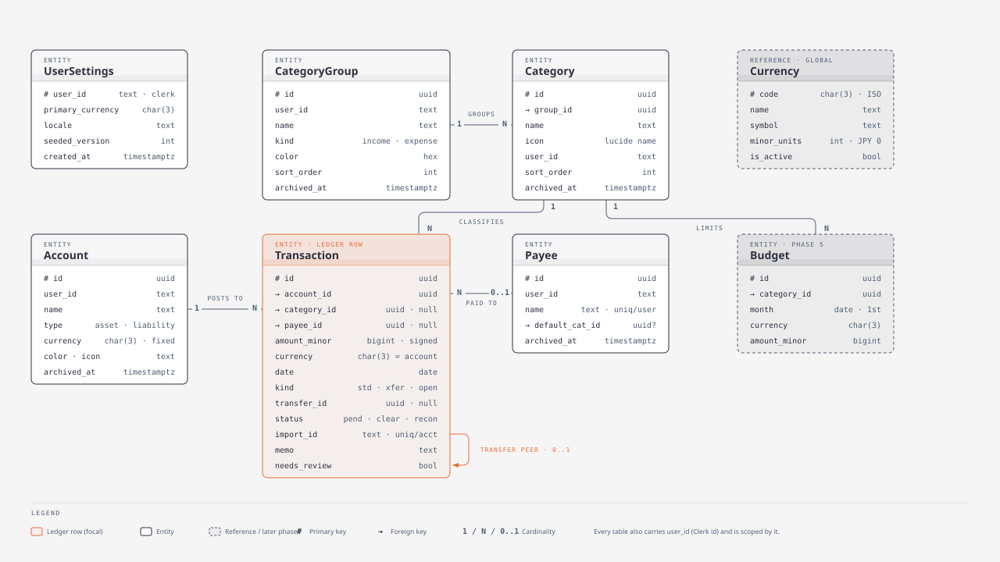
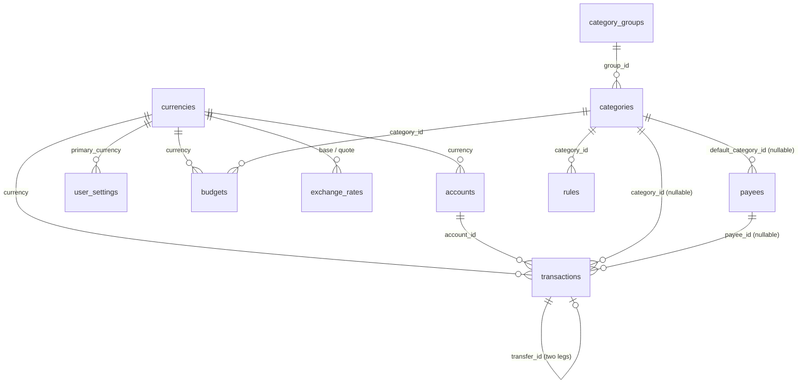

# Data model

> Summary: every table, its columns and constraints, the relationships between them, and the invariants that keep the ledger consistent.

The schema lives in `apps/web/src/db/schema.ts`; the SQL that created it is `apps/web/drizzle/0001_ledger.sql`. All tables use text UUID primary keys generated by the application, `created_at`/`updated_at` timestamps with time zone, and a `user_id` column holding the Clerk user id (except the global `currencies` table).



## Relationships



## Tables

### `currencies` (global reference)

Seeded by migration with 27 currencies. Not scoped by user.

| Column | Type | Notes |
| --- | --- | --- |
| `code` | char(3) PK | ISO-4217 code, e.g. `EUR` |
| `name` | text | display name |
| `symbol` | text | display symbol |
| `minor_units` | int | decimal digits: 2 for EUR, 0 for JPY, 3 for KWD |
| `is_active` | bool | hidden from pickers when false |

### `user_settings`

One row per user, created on the first authenticated request.

| Column | Type | Notes |
| --- | --- | --- |
| `user_id` | text PK | Clerk id |
| `primary_currency` | char(3) → currencies | default for new accounts and for converted totals |
| `locale` | text | reserved for number and date formatting |
| `seeded_version` | int, nullable | version of the default taxonomy that was seeded; null until seeding completes |
| `show_converted_totals` | bool | dashboard toggle |

### `accounts`

| Column | Type | Notes |
| --- | --- | --- |
| `type` | enum `checking, savings, cash, credit_card, loan, investment, other` | drives labels, icons and sidebar grouping |
| `classification` | enum `asset, liability` | derived from `type` in the service: cards and loans are liabilities |
| `currency` | char(3) → currencies | fixed once the account has transactions |
| `name`, `institution`, `account_number`, `color`, `icon`, `notes` | text | descriptive |
| `counts_in_spending` | bool, default true | false for investment accounts, whose movements are not spending |
| `archived_at` | timestamptz, nullable | archived accounts keep history but leave pickers |
| `deleted_at` | timestamptz, nullable | soft delete; only allowed with no transactions |

There is no balance column. Balance is `SUM(amount_minor)` over the account's live transactions; an opening balance is a transaction of kind `opening`.

### `category_groups` and `categories`

| `category_groups` | Type | Notes |
| --- | --- | --- |
| `name` | text | |
| `kind` | enum `income, expense` | decides whether a category's rows count as income or spending |
| `color` | text | hex; the only colour in the system, inherited by categories |
| `sort_order` | int | manual ordering |
| `is_system` | bool | the Income group; cannot be archived or change kind |
| `archived_at` | timestamptz, nullable | |

| `categories` | Type | Notes |
| --- | --- | --- |
| `group_id` | → category_groups | |
| `name` | text | |
| `icon` | text | a key of the curated icon registry, validated by Zod |
| `sort_order` | int | manual ordering inside the group |
| `archived_at` | timestamptz, nullable | archived categories are hidden from pickers but still resolve for history |

### `payees`

| Column | Type | Notes |
| --- | --- | --- |
| `name` | text | unique per user (`payees_user_name_key`) |
| `default_category_id` | → categories, nullable | pre-filled on new transactions; learned from usage |
| `archived_at` | timestamptz, nullable | |

### `transactions` (the ledger)

| Column | Type | Notes |
| --- | --- | --- |
| `account_id` | → accounts | |
| `category_id` | → categories, nullable | null = uncategorised; must be null unless `kind = 'standard'` |
| `payee_id` | → payees, nullable | |
| `amount_minor` | bigint | **signed**: negative = money out, positive = money in; never zero |
| `currency` | char(3) → currencies | copied from the account at write time |
| `date` | date | calendar date without time |
| `kind` | enum `standard, transfer, opening` | see below |
| `transfer_id` | text, nullable | shared by exactly two rows in two different accounts |
| `status` | enum `pending, cleared, reconciled` | manual entries start `cleared`, imports `pending` |
| `needs_review` | bool | set when saved without a category, when imported, or when its category is archived without a replacement |
| `excluded` | bool | keep in balances, leave out of reports |
| `memo` | text | free text |
| `import_id` | text, nullable | dedupe key; unique per account where not null |
| `original_payee` | text, nullable | raw description from a bank file, never rewritten |
| `deleted_at` | timestamptz, nullable | soft delete |

Constraints and indexes:

```sql
CHECK (kind = 'standard' OR category_id IS NULL)            -- transactions_category_kind_check
CHECK ((kind = 'transfer') = (transfer_id IS NOT NULL))     -- transactions_transfer_kind_check
UNIQUE (account_id, import_id) WHERE import_id IS NOT NULL  -- transactions_account_import_key
INDEX (user_id, date), (account_id, date), (user_id, category_id), (transfer_id)
```

What each `kind` counts for:

| `kind` | Balance and net worth | Spending and income reports | Category |
| --- | --- | --- | --- |
| `standard` | yes | yes (unless `excluded` or the account has `counts_in_spending = false`) | optional |
| `transfer` | yes | never | none |
| `opening` | yes | never | none |

### `exchange_rates`

| Column | Type | Notes |
| --- | --- | --- |
| `user_id`, `base`, `quote`, `date` | composite PK | 1 `base` = `rate` `quote`, valid from `date` until a newer row |
| `rate` | numeric(18,8) | |
| `source` | text | `manual` today; providers can write other values |

### `budgets`

| Column | Type | Notes |
| --- | --- | --- |
| `category_id` | → categories | |
| `month` | date | first day of the month |
| `currency` | char(3) | budgets are per currency, like spending |
| `amount_minor` | bigint | the limit |

Unique on `(category_id, month, currency)`.

### `rules`

| Column | Type | Notes |
| --- | --- | --- |
| `name` | text | display label |
| `pattern` | text | case-insensitive substring matched against payee, bank description and memo |
| `category_id` | → categories | category to apply |
| `priority` | int | lower runs first |

## Invariants the services guarantee

- Every row a user can see carries their `user_id`; cross-user ids resolve to "not found".
- A transfer always has exactly two live legs with opposite signs in different accounts, the same `transfer_id`, no category and no payee.
- Deleting one transfer leg soft-deletes both; editing one edits both.
- An account with live transactions cannot change currency and cannot be deleted, only archived.
- Archiving a category either moves its transactions to another category or leaves them uncategorised with `needs_review = true`.
- `import_id` is deterministic for a given file row (external id, or date + amount + occurrence + payee hash), so re-importing a file is a no-op.

## Legacy data

Migration `0001_ledger` migrated rows from the Prisma-era tables `Account`, `Payee` and `Transaction` when they existed: amounts were multiplied by 100 and signed by the old `type`, the currency defaulted to EUR, and categories were dropped (the old ids pointed at hard-coded constants) with `needs_review = true`, so migrated transactions show up in the review inbox. The old tables and the two monthly-history tables were then dropped. Details in [Database migrations](../reference/migrations.md).
