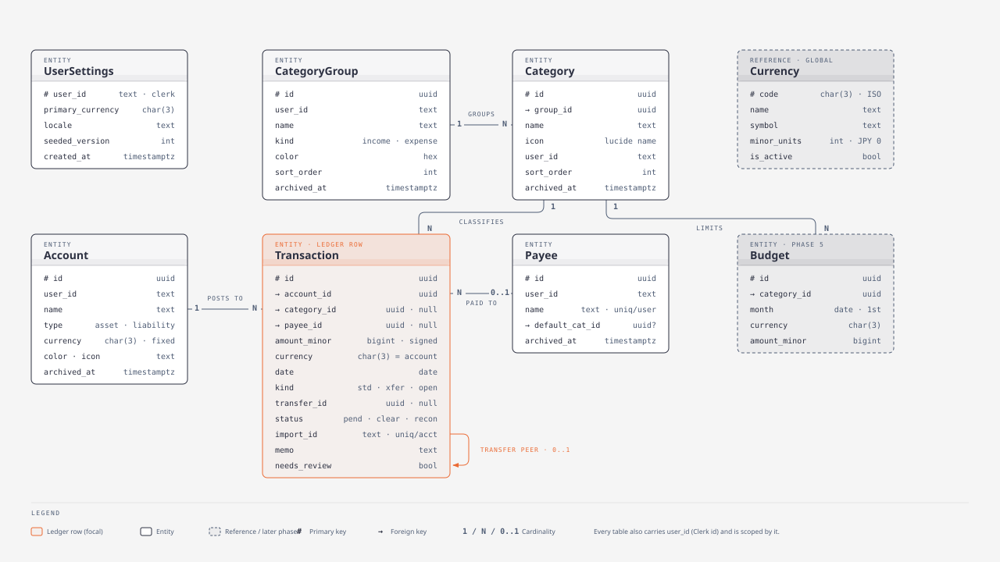
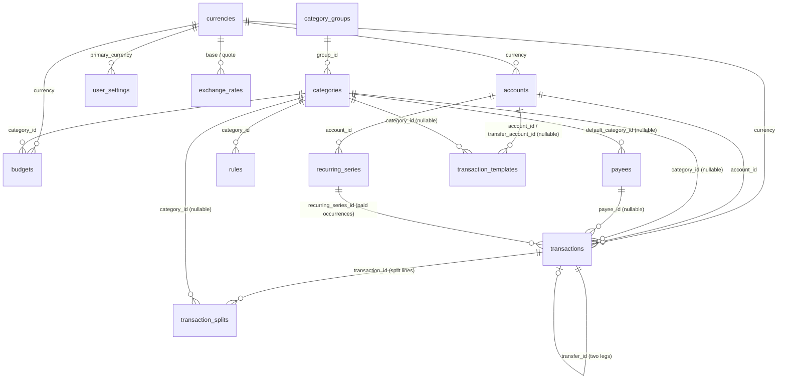

# Data model

> Summary: every table, its columns and constraints, the relationships between them, and the invariants that keep the ledger consistent.

The schema lives in `apps/api/src/db/schema.ts` (the API owns the database); the SQL that creates it is `apps/api/drizzle/0000_init.sql` plus the later migrations listed in [Database migrations](../reference/migrations.md). All tables use text UUID primary keys generated by the application, `created_at`/`updated_at` timestamps with time zone, and a `user_id` column referencing `users(id)` (except the global `currencies` table and `users` itself).



## Users, sessions and deletion

- `users` holds the account you sign in with: a unique lower-case `email`, the argon2id `password_hash`, an optional `name` and `last_sign_in_at`. Every other table's `user_id` references `users(id) ON DELETE CASCADE`.
- `sessions` holds one row per signed-in browser: the SHA-256 `token_hash` of the cookie token (never the token itself), `expires_at`, `last_used_at`, `user_agent` and `ip_address`. These rows are deleted on sign-out, revocation and expiry.
- Financial rows are never deleted: `transactions`, `accounts`, `rules`, `budgets`, `exchange_rates`, `transaction_templates`, `transaction_splits`, `recurring_series` and `budget_period_starts` have a `deleted_at` timestamp that hides them from lists, balances and reports until they are restored. Categories, groups and payees are archived with `archived_at`. See [API service › Soft deletes](api.md#soft-deletes).

## Relationships


```mermaid
erDiagram
  currencies ||--o{ accounts : "currency"
  currencies ||--o{ transactions : "currency"
  currencies ||--o{ user_settings : "primary_currency"
  currencies ||--o{ budgets : "currency"
  currencies ||--o{ exchange_rates : "base / quote"
  accounts ||--o{ transactions : "account_id"
  category_groups ||--o{ categories : "group_id"
  categories ||--o{ transactions : "category_id (nullable)"
  categories ||--o{ payees : "default_category_id (nullable)"
  categories ||--o{ budgets : "category_id"
  categories ||--o{ rules : "category_id"
  payees ||--o{ transactions : "payee_id (nullable)"
  recurring_series ||--o{ transactions : "recurring_series_id (paid occurrences)"
  accounts ||--o{ recurring_series : "account_id"
  transactions ||--o{ transaction_splits : "transaction_id (split lines)"
  categories ||--o{ transaction_splits : "category_id (nullable)"
  accounts ||--o{ transaction_templates : "account_id / transfer_account_id (nullable)"
  categories ||--o{ transaction_templates : "category_id (nullable)"
  transactions ||--o| transactions : "transfer_id (two legs)"
```

## Tables

### `currencies` (global reference)

Seeded by migration with 27 currencies. Not scoped by user.

| Column        | Type       | Notes                                           |
| ------------- | ---------- | ----------------------------------------------- |
| `code`        | char(3) PK | ISO-4217 code, e.g. `EUR`                       |
| `name`        | text       | display name                                    |
| `symbol`      | text       | display symbol                                  |
| `minor_units` | int        | decimal digits: 2 for EUR, 0 for JPY, 3 for KWD |
| `is_active`   | bool       | hidden from pickers when false                  |

### `user_settings`

One row per user, created at sign-up in the same transaction as the user.

| Column                  | Type                   | Notes                                                                                                                                                            |
| ----------------------- | ---------------------- | ---------------------------------------------------------------------------------------------------------------------------------------------------------------- |
| `user_id`               | text PK → users        | the owner                                                                                                                                                        |
| `primary_currency`      | char(3) → currencies   | default for new accounts and for converted totals                                                                                                                |
| `locale`                | text                   | reserved for number and date formatting                                                                                                                          |
| `seeded_version`        | int, nullable          | version of the default taxonomy that was seeded; null until seeding completes                                                                                    |
| `show_converted_totals` | bool                   | Home toggle                                                                                                                                                      |
| `allow_emoji`           | bool, default false    | lets the web app offer emoji next to the curated icons in icon pickers; a UI preference the API does not enforce                                                 |
| `period_rule`           | jsonb                  | the budget period rule: `{ kind: calendar }` (default), `{ kind: fixed_day, day }` or `{ kind: before_month_end, workingDays }`, validated by `periodRuleSchema` |
| `weekend_days`          | int[], default `{0,6}` | days a period start moves away from (0 is Sunday)                                                                                                                |

### `accounts`

| Column                                                            | Type                                                                 | Notes                                                                                 |
| ----------------------------------------------------------------- | -------------------------------------------------------------------- | ------------------------------------------------------------------------------------- |
| `type`                                                            | enum `checking, savings, cash, credit_card, loan, investment, other` | drives labels, icons and sidebar grouping                                             |
| `classification`                                                  | enum `asset, liability`                                              | derived from `type` in the service: cards and loans are liabilities                   |
| `currency`                                                        | char(3) → currencies                                                 | fixed once the account has transactions                                               |
| `name`, `institution`, `account_number`, `color`, `icon`, `notes` | text                                                                 | descriptive; `icon` is a curated icon name or a single emoji, `color` a six-digit hex |
| `counts_in_spending`                                              | bool, default true                                                   | false for investment accounts, whose movements are not spending                       |
| `archived_at`                                                     | timestamptz, nullable                                                | archived accounts keep history but leave pickers                                      |
| `deleted_at`                                                      | timestamptz, nullable                                                | soft delete; only allowed with no transactions                                        |

There is no balance column. Balance is `SUM(amount_minor)` over the account's live transactions; an opening balance is a transaction of kind `opening`.

### `category_groups` and `categories`

| `category_groups` | Type                   | Notes                                                         |
| ----------------- | ---------------------- | ------------------------------------------------------------- |
| `name`            | text                   |                                                               |
| `kind`            | enum `income, expense` | decides whether a category's rows count as income or spending |
| `color`           | text                   | hex; the only colour in the system, inherited by categories   |
| `sort_order`      | int                    | manual ordering                                               |
| `is_system`       | bool                   | the Income group; cannot be archived or change kind           |
| `archived_at`     | timestamptz, nullable  |                                                               |

| `categories`  | Type                  | Notes                                                                                 |
| ------------- | --------------------- | ------------------------------------------------------------------------------------- |
| `group_id`    | → category_groups     |                                                                                       |
| `name`        | text                  |                                                                                       |
| `icon`        | text                  | a key of the curated icon registry or a single emoji, validated by Zod (`iconSchema`) |
| `sort_order`  | int                   | manual ordering inside the group                                                      |
| `archived_at` | timestamptz, nullable | archived categories are hidden from pickers but still resolve for history             |

### `payees`

| Column                | Type                   | Notes                                                                                                               |
| --------------------- | ---------------------- | ------------------------------------------------------------------------------------------------------------------- |
| `name`                | text                   | unique per user, case-sensitive (`payees_user_name_key`); the CSV import matches names case-insensitively           |
| `default_category_id` | → categories, nullable | pre-filled on new transactions; learned from usage                                                                  |
| `icon`                | text, nullable         | a curated icon name or a single emoji, drawn next to the payee in lists (transaction rows return it as `payeeIcon`) |
| `color`               | text, nullable         | six-digit hex (`payeeColor` on transaction rows)                                                                    |
| `archived_at`         | timestamptz, nullable  |                                                                                                                     |

### `transactions` (the ledger)

| Column           | Type                                | Notes                                                                                                    |
| ---------------- | ----------------------------------- | -------------------------------------------------------------------------------------------------------- |
| `account_id`     | → accounts                          |                                                                                                          |
| `category_id`    | → categories, nullable              | null = uncategorised; must be null unless `kind = 'standard'`                                            |
| `payee_id`       | → payees, nullable                  |                                                                                                          |
| `amount_minor`   | bigint                              | **signed**: negative = money out, positive = money in; never zero                                        |
| `currency`       | char(3) → currencies                | copied from the account at write time                                                                    |
| `date`           | date                                | calendar date without time                                                                               |
| `kind`           | enum `standard, transfer, opening`  | see below                                                                                                |
| `transfer_id`    | text, nullable                      | shared by exactly two rows in two different accounts                                                     |
| `status`         | enum `pending, cleared, reconciled` | manual entries start `cleared`, imports `pending`                                                        |
| `needs_review`   | bool                                | set when saved without a category, when imported, or when its category is archived without a replacement |
| `excluded`       | bool                                | keep in balances, leave out of reports                                                                   |
| `memo`           | text                                | free text                                                                                                |
| `import_id`      | text, nullable                      | dedupe key; unique per account where not null                                                            |
| `original_payee` | text, nullable                      | raw description from a bank file, never rewritten                                                        |
| `deleted_at`     | timestamptz, nullable               | soft delete                                                                                              |

Constraints and indexes:

```sql
CHECK (kind = 'standard' OR category_id IS NULL)            -- transactions_category_kind_check
CHECK ((kind = 'transfer') = (transfer_id IS NOT NULL))     -- transactions_transfer_kind_check
UNIQUE (account_id, import_id) WHERE import_id IS NOT NULL AND deleted_at IS NULL  -- transactions_account_import_key
INDEX (user_id, date), (account_id, date), (user_id, category_id), (transfer_id)
INDEX (user_id) WHERE needs_review AND deleted_at IS NULL  -- transactions_needs_review_idx, the review badge count
```

What each `kind` counts for:

| `kind`     | Balance and net worth | Spending and income reports                                             | Category |
| ---------- | --------------------- | ----------------------------------------------------------------------- | -------- |
| `standard` | yes                   | yes (unless `excluded` or the account has `counts_in_spending = false`) | optional |
| `transfer` | yes                   | never                                                                   | none     |
| `opening`  | yes                   | never                                                                   | none     |

### `exchange_rates`

| Column                             | Type          | Notes                                                          |
| ---------------------------------- | ------------- | -------------------------------------------------------------- |
| `user_id`, `base`, `quote`, `date` | composite PK  | 1 `base` = `rate` `quote`, valid from `date` until a newer row |
| `rate`                             | numeric(18,8) |                                                                |
| `source`                           | text          | `manual` today; providers can write other values               |

### `budgets`

| Column         | Type         | Notes                                   |
| -------------- | ------------ | --------------------------------------- |
| `category_id`  | → categories |                                         |
| `month`        | date         | first day of the month                  |
| `currency`     | char(3)      | budgets are per currency, like spending |
| `amount_minor` | bigint       | the limit                               |

Unique on `(category_id, month, currency)`.

### `rules`

| Column        | Type         | Notes                                                                       |
| ------------- | ------------ | --------------------------------------------------------------------------- |
| `name`        | text         | display label                                                               |
| `pattern`     | text         | case-insensitive substring matched against payee, bank description and memo |
| `category_id` | → categories | category to apply                                                           |
| `priority`    | int          | lower runs first                                                            |

### `budget_period_starts`

| Column       | Type         | Notes                                                                       |
| ------------ | ------------ | --------------------------------------------------------------------------- |
| `period_key` | text         | the month that names the period, `YYYY-MM`; unique per user among live rows |
| `starts_on`  | date         | the start moved by hand; the period before ends the day before              |
| `deleted_at` | timestamptz? | soft delete; **Use the rule again** sets it                                 |

Periods themselves are computed (`periodRange` in `packages/shared/src/lib/periods.ts`), never stored.

### `recurring_series`

| Column                                 | Type          | Notes                                                                  |
| -------------------------------------- | ------------- | ---------------------------------------------------------------------- |
| `name`                                 | text          | display name                                                           |
| `kind`                                 | enum          | `bill`, `subscription`, `income`, `other`                              |
| `account_id`                           | → accounts    | where it is paid from or into; its currency is copied into `currency`  |
| `payee_id`                             | → payees?     | matched against new transactions                                       |
| `category_id`                          | → categories? | used when recording a payment and for budgets                          |
| `amount_minor`                         | bigint        | expected amount, signed, never 0                                       |
| `amount_min_minor`, `amount_max_minor` | bigint?       | match range; 7.5 % either side when empty                              |
| `cadence`, `interval`                  | enum, int     | `weekly`, `monthly` or `yearly`, every `interval` (≥ 1)                |
| `anchor_date`, `end_date`              | date, date?   | first due date; no occurrence after the end                            |
| `match_window_days`                    | int           | days either side of a due date that a payment may fall (default 3)     |
| `record_mode`                          | enum          | `match_only`, or `create_pending` to create the due payment for review |
| `source`                               | enum          | `manual` or `detected`                                                 |
| `status`                               | enum          | `active`, `paused`, `ended`                                            |
| `deleted_at`                           | timestamptz?  | soft delete                                                            |

A paid occurrence is a transaction whose `recurring_series_id` and `recurring_due_on` are set (both or neither, `transactions_recurring_pair_check`); `transactions_recurring_occurrence_key` keeps one live payment per series and due date. Occurrences themselves are computed, never stored.

### `transaction_splits`

| Column           | Type           | Notes                                                                  |
| ---------------- | -------------- | ---------------------------------------------------------------------- |
| `transaction_id` | → transactions | the split transaction (standard only; its own `category_id` is `NULL`) |
| `category_id`    | → categories?  | `NULL` only when its category was archived without a replacement       |
| `amount_minor`   | bigint         | signed like the parent, never 0; the live lines add up to the parent   |
| `memo`           | text           | optional note for the line                                             |
| `sort_order`     | int            | display order                                                          |
| `deleted_at`     | timestamptz?   | lines are replaced by soft-deleting the old ones                       |

Reports read one row per live line through `categoryLines` (a transaction without lines reads as itself), so a split counts in several categories while balances still use the parent.

### `transaction_templates`

| Column                | Type          | Notes                                                                         |
| --------------------- | ------------- | ----------------------------------------------------------------------------- |
| `name`                | text          | unique per user among live templates                                          |
| `kind`                | enum          | `standard` or `transfer` (the `transaction_kind` enum, `opening` refused)     |
| `account_id`          | → accounts?   | source account; required when `amount_minor` is set                           |
| `transfer_account_id` | → accounts?   | destination, transfers only                                                   |
| `category_id`         | → categories? | standard templates only                                                       |
| `payee_id`            | → payees?     | standard templates only                                                       |
| `amount_minor`        | bigint?       | signed for standard templates, positive for transfers, `null` = ask each time |
| `memo`                | text          | copied onto the transaction                                                   |
| `sort_order`          | int           | manual order in Settings                                                      |
| `last_used_at`        | timestamptz?  | set when a transaction or transfer is recorded with its `templateId`          |
| `deleted_at`          | timestamptz?  | soft delete                                                                   |

A template is not part of the ledger: it never counts in balances, reports or budgets.

## Invariants the services guarantee

- Every row a user can see carries their `user_id`; cross-user ids resolve to "not found".
- A transfer always has exactly two live legs with opposite signs in different accounts, the same `transfer_id`, no category and no payee.
- Deleting one transfer leg soft-deletes both; editing one edits both.
- An account with live transactions cannot change currency and cannot be deleted, only archived.
- Archiving a category either moves its transactions and split lines to another category or leaves them uncategorised with `needs_review = true` on the transaction.
- The live lines of a split transaction add up to its amount, share its sign and number at least two; changing the amount without new lines is refused.
- `import_id` is deterministic for a given file row (external id, or date + amount + occurrence + payee hash), so re-importing a file is a no-op. The import commit inserts with `ON CONFLICT DO NOTHING` on `transactions_account_import_key`, so committing the same preview twice also imports once.

## Legacy data

The Prisma-era row migration (`0001_ledger` in the old web-app history) is no longer part of the migrations: the history restarted at `0000_init.sql`. See [Database migrations](../reference/migrations.md).
