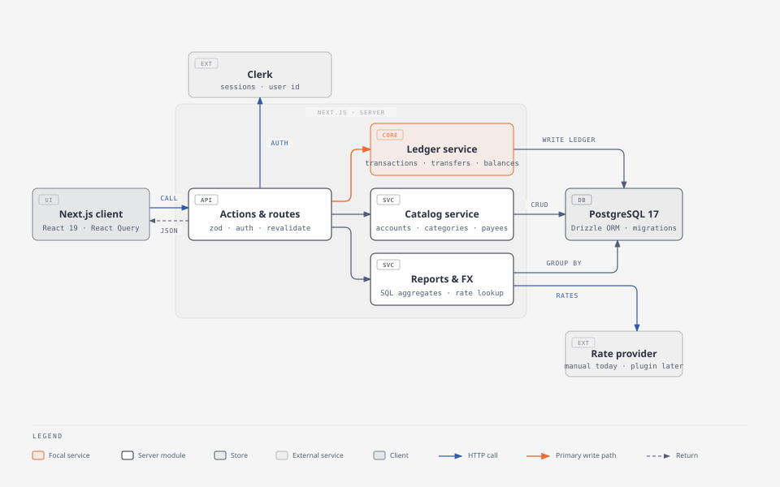
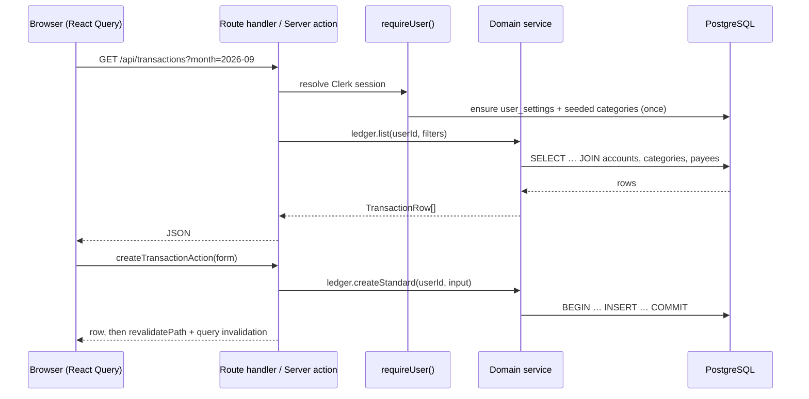

# Architecture overview

> Summary: the layers of the application, how a request flows from the browser to PostgreSQL and back, and the principles every part follows.

## Stack

| Layer | Technology |
| --- | --- |
| UI | React 19, Next.js 16 App Router, SCSS modules, Radix primitives, Recharts, lucide icons |
| Data fetching | TanStack Query on the client, calling route handlers for reads and server actions for writes |
| Server | Next.js server actions and route handlers, a domain service layer, Zod validation |
| Database | PostgreSQL 17 through Drizzle ORM; SQL migrations in `apps/web/drizzle/` |
| Auth | Clerk (sessions, user ids); every row is scoped by `user_id` |
| Tests | Vitest, Testing Library, PGlite (in-memory PostgreSQL), Playwright |

## The picture

Reads go from the client through React Query to a route handler; writes go through a server action. Both resolve the signed-in user, then call a domain service. Services own the business rules and the SQL. The exchange-rate provider sits behind an interface so the manual implementation can be replaced later.

## Request flow

1. **Client** components fetch with the hooks in `use-finance-data.ts`. Every mutation invalidates the query keys listed in `FinanceKeys`, which is cheap for a personal app and avoids stale screens.
2. **Route handlers** (`apps/web/src/app/api/**`) are wrapped by `handle()` in `apps/web/src/server/http.ts`: it resolves the user, serialises the result and maps `ServiceError` to an HTTP status.
3. **Server actions** (`apps/web/src/app/(main)/actions.ts`) parse input with Zod, call the service, then `revalidatePath('/')`. They throw plain `Error`s so the client can show `error.message`.
4. **`requireUser()`** (`apps/web/src/server/auth/require-user.ts`) reads the Clerk session and calls `ensureUserBootstrap`, which creates the user's settings row and seeds the default categories the first time.
5. **Services** (`apps/web/src/server/<domain>/service.ts`) are the only place with business rules and the only place that opens database transactions. They receive a `Db` handle, so tests can run them against PGlite.

## Principles

- **Money is `(amount_minor, currency)`.** Integer minor units, never floats; never add two currencies. See [Money and currencies](money.md).
- **The ledger is the truth.** Balances, net worth and reports are SQL over `transactions`. No stored counters.
- **One row per account movement.** A transfer is two rows sharing a `transfer_id`; a credit-card payment is a transfer. `kind` decides what a row counts for.
- **Categories are data**, scoped per user and seeded from a versioned taxonomy.
- **Uncategorised is a state**, not a category: `category_id IS NULL` plus `needs_review`.
- **Soft delete and archive** everywhere; history stays resolvable.
- **Every write is one database transaction**, with ownership checks before any change.

## Where each rule is enforced

| Rule | Enforced in |
| --- | --- |
| A transfer or opening row has no category; `transfer_id` is set iff `kind = 'transfer'` | CHECK constraints on `transactions` (see [Data model](data-model.md)) |
| Both legs of a transfer are created, edited and deleted together | `ledger.createTransfer`, `updateTransfer`, `remove` |
| An account's currency cannot change once it has transactions | `accounts.update` |
| A transaction's currency equals its account's | `ledger.createStandard` / `updateStandard` copy it from the account |
| Import ids are unique per account | partial unique index `transactions_account_import_key` |
| Rows belong to the signed-in user | every service query filters by `user_id`; ownership helpers throw `not found` |

## Further reading

- [Data model](data-model.md) for tables and relationships
- [Server layer](server.md) for the service catalogue and error handling
- [Frontend](frontend.md) for components, hooks and styling conventions
- The original design rationale in [the legacy proposal](../legacy/redesign-proposal.md)
