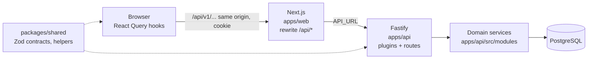
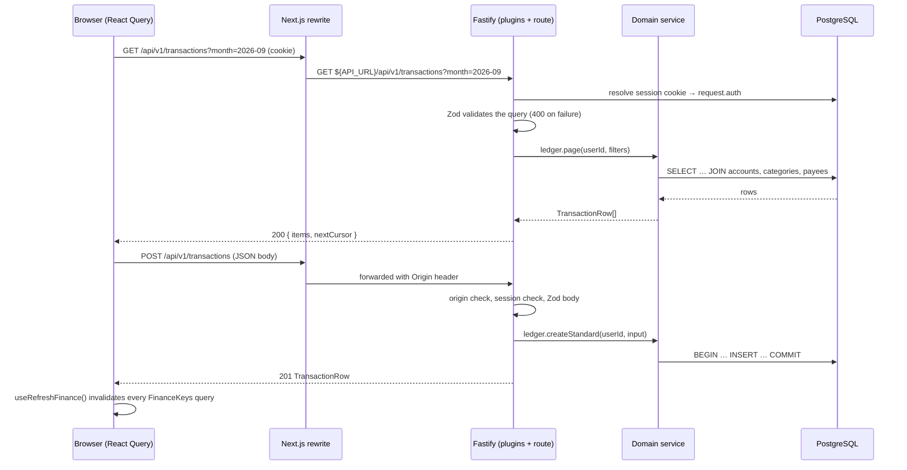

# Architecture overview

> Summary: the three workspaces (Fastify API, Next.js client, shared contracts), how a request flows from the browser through the Next.js rewrite to the API and PostgreSQL, the principles every part follows and where each rule is enforced.

## Stack

| Layer         | Technology                                                                                                                           |
| ------------- | ------------------------------------------------------------------------------------------------------------------------------------ |
| UI            | React 19, Next.js 16 App Router (client only, no server code of its own), SCSS modules, Radix primitives, Recharts, lucide icons     |
| Data fetching | TanStack Query hooks calling the API through `apps/web/src/api/client.ts`; writes through `apps/web/src/api/mutations.ts`            |
| API           | Fastify 5 in `apps/api`, Zod request and response schemas (`fastify-type-provider-zod`), domain services, OpenAPI at `/api/docs`     |
| Contracts     | `packages/shared`: Zod schemas, money, date, pattern and CSV helpers, constants used by both sides                                   |
| Database      | PostgreSQL 17 through Drizzle ORM; SQL migrations in `apps/api/drizzle/`                                                             |
| Auth          | Self-hosted in the API: `users` and `sessions` tables, argon2id passwords, HttpOnly session cookie; every row is scoped by `user_id` |
| Tests         | Vitest, Testing Library, PGlite (in-memory PostgreSQL), Playwright                                                                   |

## The picture

The browser only ever talks to the Next.js origin. Next.js serves the pages and forwards every `/api/*` request to the API (`rewrites` in `apps/web/next.config.ts`), so the session cookie is first-party and no CORS is involved. The API checks the session, validates the request with the shared Zod schema, calls a domain service and serialises the answer through the response schema. Services own the business rules and the SQL. The exchange-rate provider sits behind an interface so the manual implementation can be replaced later.

## Request flow

1. **Client** components read with the hooks in `apps/web/src/components/finance/use-finance-data.ts` and write with the functions in `apps/web/src/api/mutations.ts`. After a write, `useRefreshFinance()` invalidates every key in `FinanceKeys`, which is cheap for a personal app and avoids stale screens. See [Frontend](frontend.md).
2. **Next.js** (`apps/web/next.config.ts`) rewrites `/api/:path*` to `${API_URL}/api/:path*` and adds security headers. `apps/web/src/proxy.ts` redirects page requests without a session cookie to `/sign-in`; it does not validate the session, the API does.
3. **Fastify plugins** (`apps/api/src/plugins/`) add security headers, CORS and the origin check on writes, resolve the session cookie into `request.auth`, and turn errors into one JSON shape. Every route except health and sign-up/in/out requires a session. See [API service](api.md).
4. **Routes** (`apps/api/src/routes/<resource>.ts`) declare their Zod schemas, take the user id from the session and call one service function.
5. **Services** (`apps/api/src/modules/<domain>/service.ts`) are the only place with business rules and the only place that opens database transactions. They receive a `Db` handle, so tests run them against PGlite. See [Domain services](server.md).

## Principles

- **Money is `(amount_minor, currency)`.** Integer minor units, never floats; never add two currencies. See [Money and currencies](money.md).
- **The ledger is the truth.** Balances, net worth and reports are SQL over `transactions`. No stored counters.
- **One row per account movement.** A transfer is two rows sharing a `transfer_id`; a credit-card payment is a transfer. `kind` decides what a row counts for.
- **Categories are data**, scoped per user and seeded from a versioned taxonomy when the user signs up.
- **Uncategorised is a state**, not a category: `category_id IS NULL` plus `needs_review`.
- **Soft delete and archive** everywhere: financial rows get `deleted_at` and can be restored; categories, groups and payees are archived. History stays resolvable.
- **Every write is one database transaction**, with ownership checks before any change.
- **One contract, both sides.** Request and response shapes are defined once in `packages/shared/src/schema/` and used by the API and the web forms.

## Where each rule is enforced

| Rule                                                                                    | Enforced in                                                                                                                  |
| --------------------------------------------------------------------------------------- | ---------------------------------------------------------------------------------------------------------------------------- |
| Only signed-in users reach data                                                         | `requireSession` hook on the authenticated scope in `apps/api/src/routes/index.ts`, `apps/api/src/plugins/authentication.ts` |
| Writes come from an allowed origin                                                      | `apps/api/src/plugins/security.ts` (`ALLOWED_ORIGINS`)                                                                       |
| Requests and responses have the documented shape                                        | Zod schemas from `packages/shared/src/schema/` on every route in `apps/api/src/routes/`                                      |
| A transfer or opening row has no category; `transfer_id` is set iff `kind = 'transfer'` | CHECK constraints on `transactions` (see [Data model](data-model.md))                                                        |
| Both legs of a transfer are created, edited, deleted and restored together              | `apps/api/src/modules/ledger/transfers.ts` (`createTransfer`, `updateTransfer`, `removeTransfer`, `restoreTransfer`)         |
| An account's currency cannot change once it has transactions                            | `apps/api/src/modules/accounts/service.ts` (`update`)                                                                        |
| A transaction's currency equals its account's                                           | `apps/api/src/modules/ledger/standard.ts` copies it from the account                                                         |
| Deleted rows are left out of lists, balances, reports and budgets                       | `deleted_at IS NULL` filters in every service under `apps/api/src/modules/`                                                  |
| Import ids are unique per account among live rows                                       | partial unique index `transactions_account_import_key`                                                                       |
| Rows belong to the signed-in user                                                       | every service query filters by `user_id`; ownership helpers throw `not found`                                                |

## Further reading

- [API service](api.md) for plugins, sessions, security layers and errors
- [Domain services](server.md) for the service catalogue and conventions
- [Data model](data-model.md) for tables and relationships
- [Frontend](frontend.md) for the API client, hooks, components and styling conventions
- The original design rationale in [the legacy proposal](../legacy/redesign-proposal.md)
