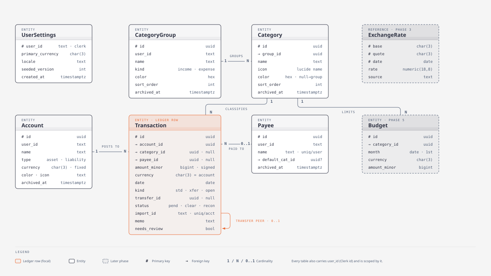
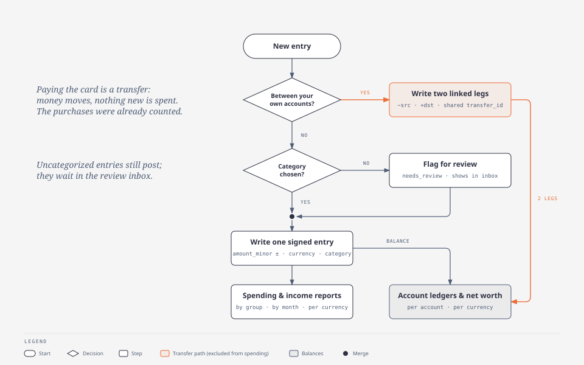
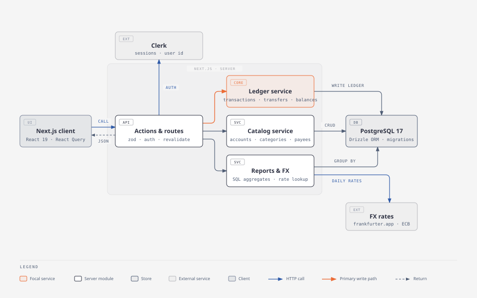
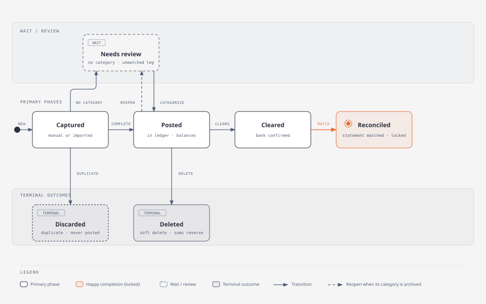

# CoinKeeper redesign proposal — spending tracker foundations

_Date: 2026-09-22 · Branch: `redesign` · Status: proposal for discussion_

This document analyses the current state of the app, summarises what YNAB, Actual Budget, Firefly III, Maybe/Sure, Lunch Money, Monarch and Copilot do for the same problems, and proposes a concrete data model, architecture, product behaviour and phased roadmap for:

1. Multi-currency accounts and reports (shown separately per currency, never silently summed).
2. Credit cards and bank accounts working together, with card settlement recorded as an account transfer that never counts as spending.
3. User-managed categories organised in coloured groups, seeded on sign-up, with optional categories and a "needs review" alert.
4. Foundations for the future import feature (dedupe keys, review inbox, payee memory).

Supporting material lives next to this file:

| What | Where |
| --- | --- |
| Research reports (one per app family) | [research/ynab.md](research/ynab.md) · [research/actual-budget.md](research/actual-budget.md) · [research/firefly-and-maybe.md](research/firefly-and-maybe.md) · [research/multicurrency-and-category-patterns.md](research/multicurrency-and-category-patterns.md) |
| Diagrams (editable HTML + exported SVG) | [diagrams/](diagrams/) |

---

## 0. TL;DR

- **Store money as signed integer minor units plus a currency code.** Today every amount is a `double precision`; that has to change before anything else. Balances become `SUM(amount_minor)` per account, so the cached `balance` column and the two hand-maintained monthly history tables go away.
- **One ledger row per account movement, with a `kind`.** `standard` rows are income/expense; `transfer` rows come in linked pairs (one per account, opposite signs, no category). Paying a credit card is a transfer. Every spending report is `WHERE kind = 'standard'`; every balance and net-worth figure includes all kinds. That single rule delivers the credit-card requirement without special cases.
- **Currency lives on the account and is copied onto each transaction.** A cross-currency transfer is just a pair whose two legs carry different currencies and amounts. Reports and net worth are grouped by currency; a converted total is an optional, clearly labelled extra (phase 3) backed by an `exchange_rates` table fed from the ECB via frankfurter.dev.
- **Categories become user data:** `category_groups` (colour, income/expense kind, order) and `categories` (icon from a curated lucide registry, optional colour override). A versioned default taxonomy is seeded on first sign-in. `category_id` is nullable; uncategorised rows are flagged `needs_review` and surface in a review inbox and a dashboard alert.
- **Ship it in five phases** in this order: money & ledger foundations → categories → transfers & credit cards → multi-currency polish → import & rules. Budgets come after, on top of the same tables.

---

## 1. Where the app is today

### 1.1 Stack and structure

Next.js 16 (App Router, server actions and route handlers), React 19, TanStack Query, Drizzle ORM 0.45 on PostgreSQL 17, Clerk for auth, Zod 4, SCSS modules, Recharts, lucide-react 1.41. Tests run on Vitest with PGlite for real-SQL repository tests. The UI was recently rebuilt (Fundex-inspired shell, dashboard, transactions explorer, accounts, budgets preview, settings preview).

Data access is a single [repository.ts](../src/db/repository.ts) exposed through three GET route handlers (`/api/accounts`, `/api/payees`, `/api/transactions`) and three create server actions in [actions.ts](<../src/app/(main)/actions.ts>), plus a delete action. There is no edit flow for anything.

### 1.2 Current schema

Five tables, retained from the Prisma era: `Account`, `Payee`, `Transaction`, `MonthlyHistory`, `MonthlyCategoryGroupHistory` ([schema.ts](../src/db/schema.ts)). Amounts are `double precision`, IDs are text UUIDs, timestamps are without time zone, soft delete via `isDeleted`/`deletedAt`. Transactions carry `amount` (always positive) plus `type` (`EXPENSE`/`INCOME`), and `categoryId`/`categoryGroupId` as free text that points at the hard-coded constants in [category.ts](../src/constants/category.ts). Transfer columns (`isTransfer`, `transferId`, `linkedAccountId`) exist but nothing writes them; deleting a transfer is explicitly rejected.

### 1.3 Problems found in the code (ordered by impact)

1. **Money is floating point.** `Account.balance`, `Transaction.amount` and both history tables are `double precision`. Sums drift; equality checks lie. Postgres' own docs say not to do this. Every source consulted agrees (see §2).
2. **Aggregates are hand-maintained and already inconsistent.** `createTransaction` and `deleteTransaction` each update the account balance and two monthly rollups inside a DB transaction; there is no update path, no transfer path and no currency dimension, so any new feature (edit, transfer, multi-currency) has to be threaded through three places. The dashboard does not even read these tables: it re-aggregates every transaction on the client. The rollups are pure liability.
3. **Categories are constants, not data.** `Transaction.categoryId` is an unconstrained text slug; the picker, table and CSV export resolve it through `CATEGORY[...]` at render time. Users cannot add, rename or remove anything, and a renamed constant silently orphans history. The picker also renders the group name inside a `<h3>` styled with the group container class, and `categoryGroupId` is duplicated on every row although it is derivable from the category.
4. **Single currency, and two different defaults.** `lib/format.ts` formats as EUR in `es-ES`; `finance/blocks.tsx` `money()` formats as USD in `en-US`. The `CURRENCIES` constant is unused. Nothing stores which currency an account is in.
5. **Total balance mixes assets and liabilities.** The dashboard `BalanceCard` sums every account's balance, so a credit card with spending on it increases "available to use" if its balance is stored positive, or the sum is meaningless if it is negative. Accounts have no asset/liability classification.
6. **No edit or delete UI for transactions**, and no account/payee editing at all. Any mistake is permanent from the user's point of view.
7. **`Icon` bundles the whole lucide library.** `import * as LucideIcons` with a dynamic key lookup defeats tree shaking, which ships roughly 6,000 icon components to the client. A curated registry fixes this and doubles as the validation list for user-chosen icons.
8. **One seeded icon name is invalid on the installed lucide version.** `Spray` (Personal Care Products) does not exist in lucide-react 1.41; the fallback question-mark icon renders instead. `Palmtree`, `ParkingCircle`, `MoreHorizontal` and `HelpCircle` are deprecated aliases (`TreePalm`, `CircleParking`, `Ellipsis`, `CircleHelp`).
9. **Latent validation bug.** `createAccountWithUserSchema` and friends declare `userId: z.string().uuid()`, but Clerk IDs look like `user_2abc…`. The actions do not run those schemas today, which is the only reason nothing fails.
10. **All transactions are loaded and filtered client-side**, the category filter compares display names, and the month calculations in `Overview` mix UTC and local time. Fine at 500 rows, painful at 20,000, and imports will get there quickly.
11. **Budgets and most settings are in-memory previews.** They are labelled honestly, but the budgets page suggests a budget model that does not exist yet.

The good news: the write path already uses DB transactions and row locks, ownership checks are consistent, there is a real integration-test harness on PGlite, and the UI layer is componentised enough that the data model can change underneath it.

---

## 2. What other apps do (research digest)

Four reports were produced by sub-agents and are in [research/](research/). The table condenses the parts that matter for our decisions.

| Question | YNAB | Actual Budget | Firefly III | Maybe / Sure | Lunch Money · Monarch · Copilot |
| --- | --- | --- | --- | --- | --- |
| Money storage | int64 milliunits | integer cents | decimal strings (bcmath) | `decimal(19,4)` | LM: string with 4 dp |
| Currency | one per budget (hard limit) | none (display pref only) | per account + foreign amount per row, cached native amount | per entry; query-time FX join | LM: per account, `to_base` snapshot |
| Transfer | two mirrored rows linked by `transfer_transaction_id`; transfer payee per account | two rows linked by `transferred_id`; category forced NULL between same-status accounts | a transaction *type* (asset→asset); budgets only see withdrawals | `transfers` row links two transactions; `kind` denormalised onto both | Copilot: "Internal Transfer" type, excluded from spending |
| Credit card | account with negative balance + special payment category machinery | plain on-budget account with negative balance; payment is a transfer | liability account; payment is a transfer | `CreditCard` accountable; payment is a transfer with `kind = cc_payment` | LM: `credit` asset type; payment marked transfer |
| Categories | 2 levels, no colour/icon, `hidden`, forced reassignment on delete | 2 levels, no colour/icon, mapping tables on merge | flat labels, no colour/icon | 2 levels, `color` + `lucide_icon` + classification, seeded defaults | Monarch: Type → Group → Category with colour/emoji; LM: group flags inherited |
| Uncategorised | nullable `category_id`, persistent nag | `category IS NULL`, titlebar count | n/a | synthetic bucket in reports | Monarch "Needs Review"; LM `uncleared` |
| Net worth | assets vs debts, one currency | one currency | **split per currency**, optional blend | blended into family currency | LM: converted to primary currency |
| Import dedupe | `import_id` = `YNAB:amount:date:occurrence`, unique per account; ±10-day fuzzy match | `imported_id` exact → ±7-day/amount/payee → any | separate importer app | `import_id`, `idempotency_key`; ±4-day auto transfer matching | LM `external_id` unique per asset |
| Payee → category memory | "2 of last 3" | last 5, need score ≥ 3, per-payee opt-out | rules engine | rules | LM/Monarch rules |

**Conclusions we adopt**

- Integer minor units and signed amounts are the industry norm (YNAB, Actual, Stripe). Decimals are the alternative if we ever need 8-decimal assets; we do not.
- The two-row transfer is universal in the single-entry apps, and it is what makes "card payment is not spending" fall out of the model. Maybe's denormalised `kind` is the cleanest way to filter reports.
- Nobody with a serious user base converts currencies *inside the budget*. Firefly splits reports per currency; Actual has been stuck on this for three years precisely because of the rate question. Our "show per currency, convert only for an optional labelled total" matches Firefly and avoids Actual's blocker.
- Coloured groups + icons is a product decision the envelope apps skipped; Maybe/Sure and Monarch ship it, and their seed lists are good raw material.
- Design the import keys now (`import_id` unique per account, `needs_review`, `status`) even though the importer comes later. Retrofitting them is what hurts.

---

## 3. Design principles for the redesign

1. **A spending tracker first.** We are not building zero-based envelopes. We take YNAB's *one* good idea for cards (payment = transfer) and skip the payment-category machinery.
2. **Money is `(amount_minor, currency)`.** Never add two amounts with different currencies. Group every aggregate by currency. Conversion is a display concern with a visible "as of" date.
3. **The ledger is the truth.** Balances, monthly totals and breakdowns are queries over transactions, never stored counters. Postgres will happily aggregate a personal-finance history in milliseconds with the right indexes.
4. **One row per account movement.** A transfer is two rows that must be created, edited and deleted together. This keeps every account's ledger self-contained (running balances, statements, reconciliation) and makes cross-currency transfers trivial.
5. **`kind` decides where a row shows up.** `standard` → spending/income reports and balances; `transfer` and `opening` → balances only.
6. **Categories are user data with a system-provided starting point.** Two levels, groups carry colour and kind, categories carry icon. Archive, never delete; force a "move to…" choice when history exists.
7. **Uncategorised is a state, not a category.** `category_id IS NULL` plus a `needs_review` flag drive an inbox and a dashboard alert. Nothing blocks posting.
8. **Everything is soft-deleted or archived**, everything is scoped by `user_id`, and every write is one DB transaction.

---

## 4. Target data model



_Editable source: [diagrams/data-model-er.html](diagrams/data-model-er.html)._ Every table also carries `user_id text` (the Clerk id), `created_at`/`updated_at timestamptz`, and is scoped by `user_id` in every query. Dashed entities are later phases.

### 4.1 Tables

New tables use snake_case names; the PascalCase names were only kept for Prisma compatibility and the database is now local. Data is migrated across (§10).

**`user_settings`** — one row per user, created on first sign-in.

| Column | Type | Notes |
| --- | --- | --- |
| `user_id` | text PK | Clerk id |
| `primary_currency` | char(3) | used for defaults and the optional converted total |
| `locale` | text | number/date formatting, default from browser |
| `seeded_version` | int | which default taxonomy version was applied |
| `first_day_of_week`, `date_format` | small prefs | optional |

**`accounts`**

| Column | Type | Notes |
| --- | --- | --- |
| `id` | uuid PK | |
| `type` | enum `checking · savings · cash · credit_card · loan · investment · other` | UI copy and icon only; logic uses `classification` |
| `classification` | enum `asset · liability`, generated from `type` | `credit_card` and `loan` are liabilities |
| `currency` | char(3) | **immutable once the account has a transaction** (enforced in service + trigger) |
| `name`, `institution`, `account_number_last4`, `color`, `icon`, `notes` | text | |
| `counts_in_spending` | bool default true | false for investment/tracking accounts whose movements are not spending |
| `archived_at` | timestamptz null | closed accounts stay for history, hidden from pickers |
| `deleted_at` | timestamptz null | soft delete |

No stored balance. Balance is `SUM(amount_minor)` of non-deleted transactions; an **opening balance** is a `kind = 'opening'` transaction created with the account (Actual's "Starting Balance" pattern), so history and reconciliation both work.

**`category_groups`**

| Column | Type | Notes |
| --- | --- | --- |
| `id` | uuid PK | |
| `name` | text, unique per user among non-archived | |
| `kind` | enum `income · expense` | drives income vs spending in reports |
| `color` | text hex | the group colour used by the donut and pickers |
| `sort_order` | int | manual ordering |
| `is_system` | bool | protects the income group from deletion |
| `archived_at`, `deleted_at` | timestamptz | |

**`categories`**

| Column | Type | Notes |
| --- | --- | --- |
| `id` | uuid PK | |
| `group_id` | uuid FK → category_groups | |
| `name` | text, unique per group among non-archived | |
| `icon` | text | a key of the curated lucide registry (validated server-side) |
| `color` | text hex null | optional override; null means "use the group colour" |
| `sort_order` | int | |
| `archived_at`, `deleted_at` | timestamptz | archived categories stay resolvable for history |

**`payees`** — as today, plus `default_category_id uuid null` (already exists as text), `archived_at`, and later `merged_into_id` for de-duplication.

**`transactions`** — the ledger row.

| Column | Type | Notes |
| --- | --- | --- |
| `id` | uuid PK | |
| `account_id` | uuid FK | |
| `category_id` | uuid FK null | null = uncategorised; **must be null when `kind <> 'standard'`** |
| `payee_id` | uuid FK null | |
| `amount_minor` | bigint | **signed**: negative = money out, positive = money in |
| `currency` | char(3) | copied from the account at write time; check `= account.currency` in service |
| `date` | date | calendar date, no time; month buckets are unambiguous |
| `kind` | enum `standard · transfer · opening` | see §5 |
| `transfer_id` | uuid null | shared by exactly two rows when `kind = 'transfer'` |
| `status` | enum `pending · cleared · reconciled` default `cleared` | manual entries are cleared; imports start pending |
| `needs_review` | bool default false | set when created without a category or by import |
| `excluded` | bool default false | per-row escape hatch: keep in balances, drop from reports |
| `memo` | text | today's `description` |
| `import_id` | text null | dedupe key, `unique (account_id, import_id)` |
| `original_payee` | text null | raw string from a bank file, never rewritten |
| `deleted_at` | timestamptz null | soft delete |

Indexes: `(user_id, date desc)`, `(account_id, date)`, `(user_id, category_id)`, `(transfer_id)`, partial `(user_id) WHERE needs_review AND deleted_at IS NULL`, unique partial `(account_id, import_id) WHERE import_id IS NOT NULL`.

Check constraints:

```sql
CHECK (kind = 'standard' OR category_id IS NULL)              -- transfers/opening carry no category
CHECK ((kind = 'transfer') = (transfer_id IS NOT NULL))       -- transfer_id iff transfer
CHECK (amount_minor <> 0)
```

A deferred trigger (or the service layer, at minimum) guarantees each `transfer_id` has exactly two live rows in two different accounts of the same user.

**`exchange_rates`** (phase 3): `base char(3)`, `quote char(3)`, `date date`, `rate numeric(18,8)`, `source text`; PK `(base, quote, date)`. Rates are only used for the optional converted totals, keyed by the transaction date, never by `now()` (Firefly shipped exactly that bug).

**`budgets`** (phase 5): `category_id`, `month date` (first of month), `currency`, `amount_minor`; unique `(category_id, month, currency)`. Budgets per currency because spending is per currency.

Later, when import arrives: `import_batches`, `rules` (`conditions jsonb`, `actions jsonb`, `priority`), and `rejected_transfer_matches`.

### 4.2 Worked example: the credit-card cycle

Accounts: `Checking` (EUR, asset) and `Visa` (EUR, liability). All amounts in cents.

| Step | Row(s) written | Spending report (Sept) | Checking | Visa |
| --- | --- | --- | --- | --- |
| Open accounts | `opening` +150 000 on Checking; `opening` 0 on Visa | — | 1 500,00 | 0,00 |
| Buy groceries on the card, 3 Sept | `standard` −6 000 on Visa, category Groceries | Groceries 60,00 | 1 500,00 | −60,00 (you owe 60) |
| Dinner on the card, 10 Sept | `standard` −4 500 on Visa, category Restaurants | +45,00 → 105,00 total | 1 500,00 | −105,00 |
| **Pay the card, 25 Sept** | `transfer` −10 500 on Checking **and** `transfer` +10 500 on Visa, same `transfer_id`, no category | **unchanged: 105,00** | 1 395,00 | 0,00 |

The card's ledger shows "Payment from Checking"; the checking ledger shows "Payment to Visa". Net worth on 25 Sept is 1 395 EUR either way. The UI shows liabilities with the sign flipped ("Owed: 105,00"), but the ledger keeps the mathematical sign so `SUM()` is always correct.

Cross-currency transfer, 1 000 EUR from `Checking` (EUR) to `USD Savings` (USD): leg 1 `transfer` −100 000 EUR, leg 2 `transfer` +108 500 USD, same `transfer_id`. No rate is stored; the ratio of the two legs *is* the realised rate including fees. Each currency's net worth moves by its own leg.

### 4.3 Money in code

- Drizzle column: `bigint('amount_minor', { mode: 'number' })`. JS numbers are exact up to 2^53 minor units (about 90 trillion in a 2-decimal currency), which is plenty; switch to `mode: 'bigint'` only if that ever changes.
- A small `Money` module (`src/server/money/`): `minorUnits(currency)` from `Intl.NumberFormat(...).resolvedOptions().maximumFractionDigits` (JPY → 0, KWD → 3), `parseInput("12,50", currency) → 1250`, `format(1250, 'EUR', locale)`, `add`/`negate`, and `allocate()` for future splits. One formatter replaces both `formatCurrency` and `money()`.
- Zod: `amount: z.string()` in the form (never `z.coerce.number()` on money), parsed by `parseInput` in the action; the API returns `amountMinor` + `currency`, and the client formats.

---

## 5. Transfers and credit cards

### 5.1 Behaviour

- **Creating a transfer** (`ledger.createTransfer({from, to, amountFrom, amountTo?, date, memo})`) writes two rows in one DB transaction: `−amountFrom` on `from`, `+amountTo` (defaults to `amountFrom` when currencies match; required when they differ) on `to`, both `kind = 'transfer'`, same `transfer_id`, `category_id = NULL`, `payee_id = NULL`. The UI labels each leg with the *other* account's name, so no transfer payees are needed (Actual/YNAB use payee rows for this; a computed label is simpler for us).
- **Editing** either leg edits both (date, memo, amounts); changing an account moves the leg. **Deleting** either leg soft-deletes both. There is no partial state, so the current "paired transfers must be deleted together" guard becomes the implementation rather than an error.
- **Pay card flow.** On a credit-card account page: "Pay card" → dialog pre-filled with `from = default checking account`, `amount = amount owed`, `date = today`. It is just a transfer with a nicer entry point. Optional later: statement periods and "pay statement balance" vs "pay current balance".
- **Reports.** Spending, income, breakdown by group/category, cash-flow chart: `WHERE kind = 'standard' AND NOT excluded AND account.counts_in_spending`. Balances and net worth: all non-deleted rows. That is the whole exclusion logic; there is no `is_transfer` branching anywhere else.
- **Liabilities.** `classification = 'liability'` accounts display `−balance` as "owed"; net worth = Σ assets + Σ liabilities (liabilities are negative), per currency. Interest charged by the card is a `standard` row on the card (category Financial › Interest & charges); it *is* spending.
- **Loans** behave the same: the payment is a transfer to the loan account; interest can later be a split.

### 5.2 Why not the alternatives

- *Single row with source/destination accounts (Firefly journal)*: every account ledger query becomes a `UNION`, running balances and per-account import become awkward, cross-currency needs a second amount column anyway.
- *A separate `transfers` table (Maybe)*: useful when transfers are *matched after the fact* from two independently imported rows. We get the same effect by setting `transfer_id` + `kind` on two existing rows when the importer matches them, so the extra table is deferred until import.
- *YNAB's credit-card payment category*: solves envelope funding, not tracking; it is the most confusing part of YNAB and is explicitly out of scope.



_Editable source: [diagrams/money-movement-flow.html](diagrams/money-movement-flow.html)._

---

## 6. Multi-currency

### 6.1 Rules

1. Every account has a currency chosen at creation (default: the user's primary currency). It cannot change once the account has any transaction.
2. Every transaction is in its account's currency; the column is copied so reports can `GROUP BY currency` without a join.
3. **Nothing is ever summed across currencies.** Dashboard cards, net worth, monthly totals and breakdowns are rendered once per currency the user actually has. With one currency the UI looks exactly as it does today.
4. Cross-currency transfers require both amounts; the implied rate is shown for information ("1 EUR ≈ 1.085 USD on this transfer").
5. Optional converted total (phase 3): a toggle "Show total in EUR" that converts each currency bucket with the rate for the relevant date (balance date for net worth, transaction date for spending) and labels it "≈ converted at ECB rates as of 22 Sep 2026". Missing rate → the bucket is shown unconverted with a warning, never silently rate 1.
6. Foreign purchases on a card (a EUR card used in USD) are recorded in the card's currency because that is what the bank settles; an optional `original_amount_minor` + `original_currency` pair (Firefly's foreign amount) can be added later for reference.

### 6.2 Rates

`exchange_rates(base, quote, date, rate, source)`. A daily job (or lazy fetch on first need, then cached) pulls `https://api.frankfurter.dev/v1/<date>?base=EUR` for the currencies the user has. Weekends and holidays fall back to the nearest earlier date. Frankfurter is free, key-less, ECB-sourced and covers about 30 major currencies, which matches the app's `CURRENCIES` list; provider choice is isolated behind `fx/provider.ts` so it can be swapped.

### 6.3 UI

- Amounts always show the currency (code or symbol per locale); mixed-currency lists show the code on every row.
- Dashboard: one "Net worth · EUR" card per currency, each with assets / liabilities / net, and a secondary converted line when enabled. Spending donut and cash-flow chart get a currency selector when the user has more than one.
- Settings → Currencies: primary currency, list of enabled currencies for pickers (existing accounts keep theirs), converted-total toggle.

---

## 7. Categories and groups

### 7.1 Model and rules

- Two levels only: **group** (colour, kind income/expense, order) → **category** (icon, optional colour override, order). Children inherit the group's colour and kind, which is what keeps the breakdown donut coherent (one colour per group, shades or icons per category).
- **Seeding on first sign-in**: `ensureUserBootstrap(userId)` runs inside the request that first touches the DB for a new user, wrapped in a transaction with a per-user advisory lock, inserts `user_settings` and the default taxonomy from `src/server/categories/default-taxonomy.ts`, and records `seeded_version`. This works locally without webhooks; a Clerk `user.created` webhook can call the same function later for eagerness. Bumping the taxonomy version never rewrites existing users' data; it only affects new sign-ups (an opt-in "add missing defaults" button can come later).
- **Icons** come from a curated registry `src/components/icons/registry.ts` — explicit named imports (`Home, Car, ShoppingCart, …`) exported as a map; its keys become both the picker's list and a Zod enum for validation. This replaces the `import * as LucideIcons` wildcard and fixes the invalid/deprecated names (`Spray → SprayCan`, `Palmtree → TreePalm`, `ParkingCircle → CircleParking`, `MoreHorizontal → Ellipsis`, `HelpCircle → CircleHelp`). Every icon name in the seed list below was verified against the installed lucide-react 1.41.
- **Colours**: groups pick from a curated palette of ~16 hues (the picker offers swatches; hex is stored so custom values remain possible).
- **Archiving vs deleting**: a category with transactions can be *archived* (hidden from pickers, history intact) or *moved* (user picks a destination category; rows are re-pointed in one transaction, then the category is archived). A category without history is deleted outright. Deleting a group requires it to be empty or offers "move all categories to…". The income group is `is_system` and cannot be deleted, only renamed.
- **Optional category + review**: a `standard` transaction can be saved without a category; it gets `needs_review = true`. The dashboard shows "12 transactions need a category" linking to the review inbox (transactions filtered by `needs_review`, with inline category pickers and a bulk "apply to all from this payee"). Archiving a category *without* moving its rows sets `needs_review = true` on them, so they resurface (the dashed "reopen" transition in the lifecycle diagram).
- **Payee memory**: keep `payees.default_category_id`, pre-fill it in the form, and update it with YNAB's rule (change when 2 of the last 3 transactions for that payee use another category). Imports use it as the first categorisation pass before rules exist.

### 7.2 Default taxonomy (seed v1)

Twelve groups, 55 categories. No "Transfers" group (transfers have `kind`) and no "Uncategorized" row (`NULL` is the state). Icon names are the PascalCase lucide-react exports.

| Group (kind · colour) | Categories (icon) |
| --- | --- |
| **Income** (income · `#16A34A`) | Salary (Banknote) · Freelance & side income (Briefcase) · Investment income (TrendingUp) · Refunds & reimbursements (Receipt) · Other income (HandCoins) |
| **Housing** (expense · `#7C3AED`) | Rent / Mortgage (House) · Home maintenance (Hammer) · Furniture & decor (Sofa) · Home insurance (Shield) · Property tax / HOA (Landmark) |
| **Bills & Utilities** (`#0891B2`) | Electricity & gas (Zap) · Water & waste (Droplets) · Internet & TV (Wifi) · Mobile phone (Smartphone) · Subscriptions (Repeat) |
| **Transportation** (`#EA580C`) | Fuel (Fuel) · Public transit (BusFront) · Taxi & rideshare (CarFront) · Parking & tolls (TrafficCone) · Car payment & insurance (Car) · Repairs & maintenance (Wrench) |
| **Food & Dining** (`#DC2626`) | Groceries (ShoppingCart) · Restaurants & bars (Utensils) · Coffee (Coffee) · Takeout & delivery (Pizza) |
| **Shopping** (`#DB2777`) | Clothing (Shirt) · Electronics (Laptop) · Home & garden (Sprout) · General merchandise (ShoppingBag) · Books & hobbies (BookOpen) |
| **Health & Wellness** (`#059669`) | Doctor & dental (Stethoscope) · Pharmacy (Pill) · Fitness (Dumbbell) · Health insurance (HeartPulse) · Personal care (Scissors) |
| **Entertainment** (`#9333EA`) | Streaming (Tv) · Movies & events (Ticket) · Games (Gamepad2) · Music (Music) · Sports & recreation (Trophy) |
| **Travel** (`#2563EB`) | Flights (Plane) · Lodging (Hotel) · Vacation activities (TreePalm) · Travel misc (Luggage) |
| **Personal & Family** (`#D97706`) | Childcare (Baby) · Education (GraduationCap) · Pets (PawPrint) · Family support (Users) |
| **Financial** (`#475569`) | Bank fees (Landmark) · Interest & charges (Percent) · Taxes (Calculator) · Savings & investments (PiggyBank) · Professional services (FileText) |
| **Gifts & Donations** (`#E11D48`) | Gifts (Gift) · Charity (HandHeart) · Celebrations (PartyPopper) |

The current constants map onto this list one-to-one for the data migration (e.g. `groceries → Groceries`, `rent → Rent / Mortgage`, `streamingServices → Streaming`, `uncategorized → NULL + needs_review`); the few current categories with no counterpart (`laundry`, `medicalDevices`, `accountant`…) are created as extra categories only for users who have transactions in them.

### 7.3 Category manager (Settings → Categories)

Groups as collapsible sections with a colour dot, drag-to-reorder, rename inline, "Add category" per group, "Add group". Category row: icon picker (registry grid with search), name, optional colour override, transaction count, archive/move actions. Archived section at the bottom with restore. The same picker component (grouped, searchable, keyboard-navigable) is reused in the transaction form and the review inbox.

---

## 8. Reports over the ledger

All reports are SQL over `transactions` joined to `accounts` and `categories`; the two history tables are dropped.

```sql
-- Monthly income and spending per currency (dashboard cards, cash-flow chart)
SELECT date_trunc('month', t.date)::date AS month, t.currency,
       SUM(t.amount_minor) FILTER (WHERE g.kind = 'income' OR (g.kind IS NULL AND t.amount_minor > 0)) AS income_minor,
       -SUM(t.amount_minor) FILTER (WHERE g.kind = 'expense' OR (g.kind IS NULL AND t.amount_minor < 0)) AS spending_minor
FROM transactions t
JOIN accounts a ON a.id = t.account_id
LEFT JOIN categories c ON c.id = t.category_id
LEFT JOIN category_groups g ON g.id = c.group_id
WHERE t.user_id = $1 AND t.deleted_at IS NULL
  AND t.kind = 'standard' AND NOT t.excluded AND a.counts_in_spending
  AND t.date >= $2 AND t.date < $3
GROUP BY 1, 2;

-- Breakdown by group for one month and currency (donut, coloured by g.color)
SELECT g.id, g.name, g.color, -SUM(t.amount_minor) AS spent_minor
FROM transactions t
JOIN accounts a ON a.id = t.account_id
LEFT JOIN categories c ON c.id = t.category_id
LEFT JOIN category_groups g ON g.id = c.group_id
WHERE t.user_id = $1 AND t.deleted_at IS NULL AND t.kind = 'standard' AND NOT t.excluded
  AND a.counts_in_spending AND t.currency = $2 AND t.date >= $3 AND t.date < $4
  AND COALESCE(g.kind, 'expense') = 'expense'
GROUP BY 1, 2, 3 ORDER BY spent_minor DESC;   -- g.id NULL = "Uncategorized" slice

-- Balances and net worth per currency (all kinds count)
SELECT a.id, a.currency, a.classification, COALESCE(SUM(t.amount_minor), 0) AS balance_minor
FROM accounts a
LEFT JOIN transactions t ON t.account_id = a.id AND t.deleted_at IS NULL
WHERE a.user_id = $1 AND a.deleted_at IS NULL
GROUP BY 1, 2, 3;
```

Refunds land in their expense category as positive amounts and net the category down, which is what users expect ("Groceries: 60 − 12 refund = 48"). Income-group categories with negative amounts (a salary correction) reduce income the same way.

An account's ledger page uses a window function for the running balance: `SUM(amount_minor) OVER (ORDER BY date, created_at, id)`.

Performance: with the indexes in §4.1 these queries are index scans over one user's rows. If a user ever reaches hundreds of thousands of rows, a materialised monthly view refreshed on write is a drop-in optimisation; nothing in the API shape changes.

---

## 9. Application architecture



_Editable source: [diagrams/architecture.html](diagrams/architecture.html)._

### 9.1 Server modules

Replace the single repository with domain modules, each owning its schema, queries and rules:

```
src/server/
  auth/require-user.ts          currentUser() → { userId } and ensureUserBootstrap()
  money/                        Money helpers, currency metadata, formatting/parsing
  accounts/                     schema.ts (zod) · repository.ts (drizzle) · service.ts · actions.ts
  categories/                   + default-taxonomy.ts · seed.ts · icons registry re-export
  payees/
  ledger/                       transactions.ts · transfers.ts · balances.ts (the "Ledger service")
  reports/                      monthly.ts · breakdown.ts · net-worth.ts (SQL above)
  fx/                           rates.ts · provider.ts (frankfurter)
src/db/schema/                  one file per table group, re-exported from schema.ts
```

- `service.ts` holds invariants (ownership, currency immutability, transfer pairing, category kind checks) and is the only layer that opens DB transactions. Server actions and route handlers are thin: parse with Zod → call service → `revalidatePath`/return JSON.
- Reads: keep React Query on the client for now (it already handles caching/invalidation), but back it with **paginated, filterable** route handlers (`/api/transactions?month=&account=&currency=&needsReview=&cursor=`) and dedicated report endpoints so the client stops re-aggregating. Pages that are static per request (account detail) can be server components calling services directly, as today.
- Mutations: server actions per domain, all invalidating a small set of query keys (`['transactions']`, `['accounts']`, `['reports']`, `['categories']`).
- Tests: the PGlite harness stays; each service gets integration tests for its invariants (transfer pairing, currency immutability, seeding idempotency, report exclusions). The existing `repository.test.ts` cases map onto the ledger service.

### 9.2 Client structure

- `src/components/icons/registry.ts` (+ `Icon` using it), `src/components/money/Amount.tsx` (formats `{amountMinor, currency}` with sign/colour conventions), `CategoryPicker` fed by `['categories']`, `AccountPicker` grouped by classification and currency, `TransactionDialog` with three modes (expense · income · transfer), `ReviewInbox`, `CategoryManager`.
- Feature folders under `src/app/(main)/` keep their pages thin; shared blocks stay in `src/components/finance`.

### 9.3 Transaction lifecycle



_Editable source: [diagrams/transaction-lifecycle.html](diagrams/transaction-lifecycle.html)._ Manual entries go Captured → Posted (cleared) immediately; imported ones land pending and possibly in Needs review; reconciliation locks a row against edits except via an explicit unlock. Deleting reverses nothing by hand any more — balances are sums, so soft-deleting the row is the whole operation.

---

## 10. Migration plan

The local database is small and fresh, so the migration is one Drizzle migration with a data step, run once:

1. Create the new tables and enums.
2. Insert `user_settings` for each distinct `userId` in `Account` (`primary_currency` = `'EUR'` unless decided otherwise, see §12) and seed the default taxonomy per user.
3. `accounts` ← `Account`: `currency = primary_currency`, `classification` from type, `archived_at = deletedAt`.
4. `categories` mapping: build `(userId, old slug) → new category id` from the seed plus extra rows for slugs without a counterpart.
5. `transactions` ← `Transaction`: `amount_minor = round(amount * 100) * (CASE type WHEN 'EXPENSE' THEN -1 ELSE 1 END)`, `currency`, `date = date::date`, `kind = 'standard'`, `category_id` via the mapping (`uncategorized` → NULL + `needs_review`), `memo = description`, `status = 'cleared'`.
6. Verify: for every account, `SUM(amount_minor)` equals `round(Account.balance * 100)`; monthly sums equal `MonthlyHistory` (they should, unless the old tables already drifted, which is worth knowing).
7. Drop `MonthlyHistory`, `MonthlyCategoryGroupHistory`, then the old tables; delete `src/constants/category.ts`.

`scripts/database.mjs` (baseline/check) assumes exactly one migration and can be retired or extended once the second migration exists.

---

## 11. Product proposals beyond the brief

Ideas that fall out of this model cheaply and make the app nicer to live in. None are required for phases 0–4.

- **Quick add bar** on the dashboard: `-12.50 groceries @Visa lunch` parsed into a prefilled transaction (amount, category by name, account by @, memo). Keyboard-first entry is the single biggest driver of consistent tracking.
- **Account groups in the sidebar** (Cash · Cards · Savings & investments · Loans) with per-group subtotals per currency; closed accounts behind a toggle.
- **Card statement view**: for a credit card, group the ledger by statement period (closing day on the account) and show "statement balance", "paid on", "unpaid". The Pay-card dialog offers "statement balance" as a preset.
- **Recurring detection**: same payee and similar amount at monthly cadence → "looks recurring" badge and a projected next date; later, scheduled transactions.
- **Review inbox as a first-class page** (`/review`): uncategorised, pending imports, suggested transfer matches, possible duplicates. This becomes the landing zone for the import feature.
- **Month picker everywhere**: a global month selector in the header (dashboard, analytics, review) instead of "this calendar month" hard-coded.
- **Budgets on the same tables** (phase 5): per-category or per-group monthly limits per currency, rollover optional; the existing budgets UI becomes real with `budgets` + the breakdown query.
- **Export/import round trip**: CSV export already exists; make its columns match the importer's expected columns so a user can edit in a spreadsheet and re-import with `import_id` dedupe.

---

## 12. Phased roadmap

| Phase | Scope | Done when |
| --- | --- | --- |
| **0 · Ledger foundations** | New schema + migration (§4, §10); Money module; signed `amount_minor` + `currency`; opening-balance rows; balances and reports as queries; drop history tables; transaction edit/delete UI; paginated transactions endpoint; account edit/archive. | All existing screens work on the new tables with one currency; PGlite tests cover balances, edit, delete, ownership. |
| **1 · Categories as data** | `category_groups`/`categories`, seeding + `ensureUserBootstrap`, icon registry, category manager, new picker, optional category + `needs_review`, dashboard alert, review inbox (categorise only), payee default-category memory. | User can create/rename/reorder/archive/move groups and categories; breakdown donut uses group colours; uncategorised count visible and clearable. |
| **2 · Transfers & credit cards** | Transfer creation/edit/delete as a pair, transaction dialog transfer mode, Pay-card flow, liability display, net-worth card (assets/liabilities), account groups in sidebar. | Card settlement never appears in spending; account ledgers show both legs with the counterpart name; deleting one leg removes both. |
| **3 · Multi-currency** | Currency on accounts (immutable after use), per-currency cards/charts/tabs, cross-currency transfers with two amounts, `exchange_rates` + frankfurter job, optional converted totals with "as of" label, currency settings. | A user with EUR and USD accounts sees separate figures everywhere, and an optional converted total that states its rate date. |
| **4 · Import & review** | CSV import wizard (column mapping, sign convention), `import_id` dedupe, pending status, three-pass matching against manual rows, transfer-pair suggestions, rules (`payee contains → category`), review inbox completeness. | Re-importing the same file is a no-op; imported rows land in the inbox and can be categorised in bulk. |
| **5 · Budgets** | `budgets` table, monthly limits per category/group per currency, progress on the budgets page, insights. | Budgets page persists and reflects the same spending numbers as the breakdown. |

Phase 0 is the prerequisite for everything and is also the riskiest change to existing data, so it should land alone and be verified with the reconciliation check in §10 step 6.

---

## 13. Decisions to confirm

1. **Minor units (`bigint`) vs `numeric(19,4)`.** Recommendation: minor units. Change only if crypto or sub-cent pricing is ever in scope.
2. **Sign convention.** Recommendation: negative = money out (YNAB/Actual), so balances are plain sums. The UI keeps the Expense/Income toggle.
3. **Seeding trigger.** Recommendation: lazy bootstrap on first authenticated request (works locally and in Docker), Clerk webhook optional later.
4. **Table names.** Recommendation: snake_case new tables; the old PascalCase names only existed for Prisma compatibility.
5. **Default primary currency for the migration.** The code hints at EUR/`es-ES`; confirm before running step 2 of §10.
6. **Budgets granularity.** Per category, per group, or both (group limit as a soft cap)? Only affects phase 5.

---

## 14. Resources

**Research reports (in this repo)**

- [YNAB data model & mechanics](research/ynab.md)
- [Actual Budget architecture](research/actual-budget.md)
- [Firefly III and Maybe/Sure multi-currency modelling](research/firefly-and-maybe.md)
- [Multi-currency engineering & category taxonomy patterns](research/multicurrency-and-category-patterns.md)

**Primary sources worth opening**

- YNAB API OpenAPI spec — https://api.ynab.com/papi/open_api_spec.yaml · Transfers guide — https://support.ynab.com/en_us/transfer-transactions-a-guide-HJOsZz4Jj · Credit cards — https://support.ynab.com/en_us/handling-credit-cards-overview-ry7cNub1s
- Actual Budget schema — https://github.com/actualbudget/actual/blob/master/packages/loot-core/src/server/sql/init.sql · transfer logic — https://github.com/actualbudget/actual/blob/master/packages/loot-core/src/server/transactions/transfer.ts · import matching — https://github.com/actualbudget/actual/blob/master/packages/loot-core/src/server/accounts/sync.ts · multi-currency discussion — https://github.com/actualbudget/actual/issues/3351
- Firefly III transactions & currencies — https://docs.firefly-iii.org/explanation/financial-concepts/transactions/ · https://docs.firefly-iii.org/explanation/financial-concepts/currencies/ · the `now()` rate bug — https://github.com/firefly-iii/firefly-iii/issues/12455
- Maybe schema — https://github.com/maybe-finance/maybe/blob/main/db/schema.rb · `Transaction.kind` — https://github.com/maybe-finance/maybe/blob/main/app/models/transaction.rb · Sure default categories — https://github.com/we-promise/sure/blob/main/app/models/category.rb
- Lunch Money API (transactions, categories, assets) — https://lunchmoney.dev/ · Monarch default categories — https://help.monarch.com/hc/en-us/articles/360048883851-Default-Categories · Copilot credit-card payments — https://help.copilot.money/en/articles/10671434-credit-card-payment-transactions
- Money pattern — https://martinfowler.com/eaaCatalog/money.html · PostgreSQL numeric types — https://www.postgresql.org/docs/current/datatype-numeric.html · Crunchy Data on money in Postgres — https://www.crunchydata.com/blog/working-with-money-in-postgres
- Frankfurter (ECB rates, free, no key) — https://frankfurter.dev/ · Plaid personal-finance category taxonomy — https://plaid.com/documents/transactions-personal-finance-category-taxonomy.csv · Lucide icons — https://lucide.dev/icons/

**Diagrams**

| Diagram | HTML (editable) | SVG |
| --- | --- | --- |
| Target data model (ER) | [data-model-er.html](diagrams/data-model-er.html) | [data-model-er.svg](diagrams/data-model-er.svg) |
| Application architecture | [architecture.html](diagrams/architecture.html) | [architecture.svg](diagrams/architecture.svg) |
| Where each entry lands (flow) | [money-movement-flow.html](diagrams/money-movement-flow.html) | [money-movement-flow.svg](diagrams/money-movement-flow.svg) |
| Transaction lifecycle | [transaction-lifecycle.html](diagrams/transaction-lifecycle.html) | [transaction-lifecycle.svg](diagrams/transaction-lifecycle.svg) |

Diagrams were produced with the diagram-design plugin using its default editorial skin (no project style profile is configured). PNG export needs Playwright (`pip install playwright && playwright install chromium`), which is not installed on this machine; the SVGs render in any browser and on GitHub.
