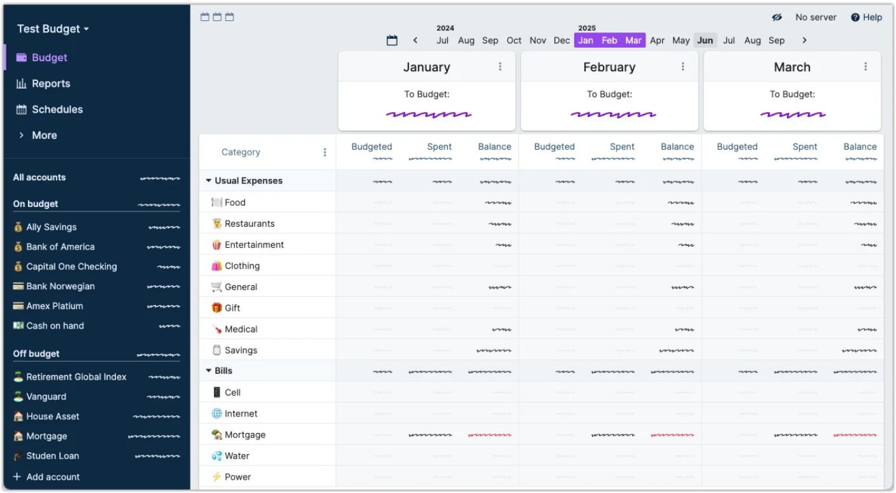
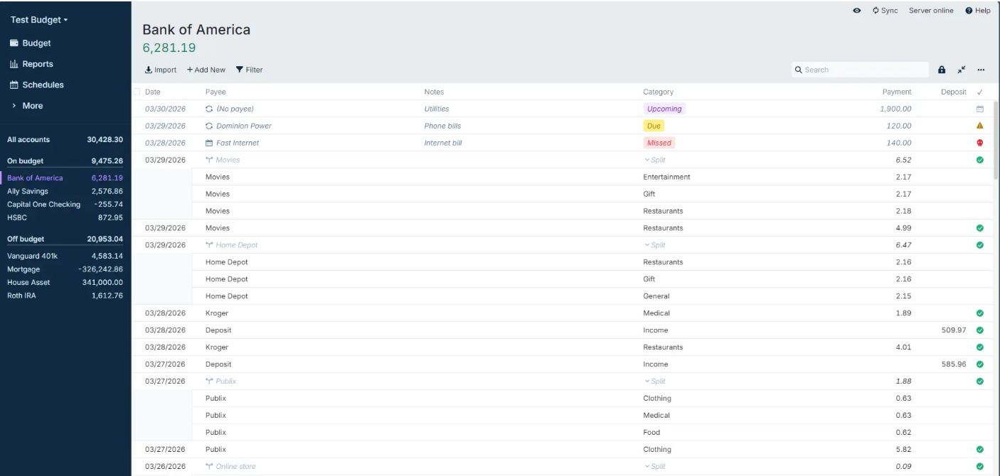

# Actual Budget design

> Summary: Actual Budget is a dense, spreadsheet-first open-source web app with an Inter typeface, a navy and purple palette and color reserved for money signs; CoinKeeper should borrow its redesigned light sidebar that groups accounts with totals under a clear header, the keyboard-first autocomplete for payees and categories, and faded zero amounts so real figures stand out.

Actual Budget is in the design research because it is the closest relative of CoinKeeper: open source, self-hostable, web-based, with manual entry and file import at its core. Its interface is built for speed on a desktop keyboard, and its community has redesigned the sidebar around the same problem CoinKeeper has (navigation and accounts sharing one column). Its category autocomplete is the pattern the owner asked for instead of a modal grid. The budgeting model, schedules and rules are described in the [Actual Budget feature study](../../apps/actual-budget.md). Owner issues are numbered O1 to O8 as in the [current UI review](../current-ui-review.md).

## At a glance

|                  |                                                                                                                                   |
| ---------------- | --------------------------------------------------------------------------------------------------------------------------------- |
| Surfaces studied | Web and desktop app (the same interface), from the official documentation and the project's end-to-end test snapshots             |
| Tone             | Formal and utilitarian: a financial spreadsheet with a neutral voice; near the bank end of the scale, without the polish          |
| Color            | Navy grays for structure, one purple accent for selection and primary actions, green and red only for positive and negative money |
| Type             | Inter (variable); amounts right-aligned in columns with two decimals, the budget's hero figure set large in green                 |
| Iconography      | Line icons in navigation only; no category icons (users type emoji into names); no merchant or bank logos                         |
| Best idea for us | A light sidebar whose account section has its own header, search, collapsible groups and a total per group                        |

## Visual identity

Actual looks like a well-kept spreadsheet: white tables on a pale gray-blue page, hairline borders, small radius, and color used sparingly. The palette comes from the theme files in the source code, so these values are exact:

| Role           | Value                                       | Where it appears                                                                                  |
| -------------- | ------------------------------------------- | ------------------------------------------------------------------------------------------------- |
| Accent         | purple `#8719e0`, selected text `#7a0ecc`   | Selected month, primary buttons (**Add**, **Add new widget**), selected account, placeholder text |
| Positive money | green `#147d64`                             | Account balance in the header, To Budget, income figures                                          |
| Negative money | red `#e12d39`                               | Overspent balances, expense totals in reports                                                     |
| Structure      | navy `#102a43` (classic sidebar), `#243b53` | Sidebar background or sidebar text, headings                                                      |
| Page and table | page `#e8ecf0`, table white, text `#272630` | Canvas behind tables and cards                                                                    |
| Subdued        | navy gray `#9fb3c8`                         | Column labels, secondary text                                                                     |

- **Numbers**: all amounts share one size and weight, and color appears only when a figure is negative or is the month's headline. Zero amounts are drawn in a pale gray close to the page color, so a column of zeros almost disappears and the non-zero figures stand out.
- **Radius and depth**: about 4 px on buttons and inputs; the month summary cards and widget cards have a soft shadow; the tables are flat.
- **Density**: the highest of the apps studied; register rows are about 30 px and the budget shows several months side by side.
- **Iconography**: there are no category icons. The documentation's tips page suggests typing emoji into category and account names, and many users do.
- **Voice**: neutral and literal (**Available funds**, **Overspent in Aug**, **For next month**), with no encouragement or illustration.

_Budget with emoji names, Actual Budget documentation (Tips and tricks). What to notice: without built-in icons, users add emoji to categories and accounts (a card for credit cards, a money bag for bank accounts), which shows the demand for type icons._

## Navigation and layout

The classic sidebar is dark navy: the budget name as a menu, **Budget**, **Reports**, **Schedules** and a **More** group (payees, rules, settings), then every account under **On budget** and **Off budget** headings with their totals, and **+ Add account** at the bottom. Navigation and accounts share the same text style, which is the ambiguity the owner described (O7).

The redesigned sidebar, an experimental feature based on the winning entry of a community design competition, fixes this and is the part most worth studying:

_Redesigned sidebar and budget, Actual Budget documentation (Redesigned sidebar). What to notice: navigation (B) and accounts (C) are separate framed zones, accounts have a header with collapse, search, add and the total, and user-made groups such as Checking and Savings carry their own totals._

- Four zones: budget name with sync status (A), navigation with icons (B), accounts (C) and **Settings** pinned at the bottom (D).
- The accounts header holds collapse-all, find-account and add-account buttons and the total of all open accounts; clicking the header opens every transaction.
- Inside **On budget** and **Off budget**, accounts can be placed in named groups (Checking, Savings, Retirement, Property). Group names are smaller and colored, their totals lighter, and accounts are indented under them. A collapsed group still shows its balance and account count.
- Closed accounts sit in a collapsed section at the end.

Page headers are consistent: the title (an account name, or the month) with the key figure below it in large green, a toolbar of text buttons (**Import**, **Add New**, **Filter**) on the left and search on the right. The budget page replaces the title with a month strip that marks the visible months in purple.

## Home and overview

There is no dashboard. The app opens on the budget, and the "one number" is **To Budget**, set large in green (red when negative) at the bottom of each month's summary card, under four smaller lines (available funds, overspent last month, budgeted, held for next month). The reports dashboard is the closest thing to an overview.

## Accounts

Accounts exist only in the sidebar and as registers; there is no accounts overview page. Types are not told apart by icons or colors: the only built-in split is on budget versus off budget, and the redesigned sidebar adds user-named groups with totals. Liabilities such as a mortgage are negative balances in the same list. Change over time lives in the net worth report and widget, not beside the accounts.

## Transactions and categorizing

The register is a spreadsheet with columns for date, payee, notes, category, payment, deposit and a cleared check. It is built for the keyboard: a new row opens at the top, and each cell is an input with its own picker.

_Account register, Actual Budget documentation (Tour: accounts). What to notice: upcoming, due and missed scheduled payments are pills in the category column, and split transactions indent their parts under a parent row._

- Row anatomy: text only, no icons; payment and deposit in separate columns instead of a colored sign; a green check for cleared rows; tags as colored pills inside notes.
- Uncategorized rows show a purple italic **Categorize** placeholder in the category cell, and a red "uncategorized transactions" link at the top right of the app counts them and opens them as a list. That link is the whole review flow.

_Payee autocomplete, Actual Budget documentation (Transfers). What to notice: the list opens under the cell, filters as you type, highlights the keyboard selection and ends with action buttons._

- The category picker is the same autocomplete: typing filters the list, options are grouped under category group headings (for example **Usual Expenses** › **Food**), each category shows its current budget balance on the right, arrow keys move the highlight, and Enter picks it. A split option sits at the top of the list.
- The popover is dark on a light page, which makes it stand out but also makes it feel like a different app; a light popover with a clear border would suit a single light theme.

## Budgets

The budget is a table with **Budgeted**, **Spent** and **Balance** columns per month, category groups as bold rows on a gray band, and one to several months side by side. The figures are told apart by position and color rules rather than by size:

- **Budgeted** is an editable cell, **Spent** is a negative number, and **Balance** is the only column that turns red when a category is overspent.
- Zero balances are faded almost to invisibility.
- There are no progress bars, pace markers or status labels; the state is the sign and color of the balance.
- The month summary card above the table is the only place with a hero figure.

## Reports and analytics

Reports open on a dashboard of widgets that the user can add, arrange and remove, and a menu at the top switches between several named dashboards.

_Reports dashboard, Actual Budget documentation (Reports). What to notice: summary widgets show one large figure each, and chart widgets carry their headline figure and change in the top right corner._

- Widget types include summary figures (such as income or expenses for a period), net worth, cash flow, spending comparisons (this month against last month, against the budget, against a three-month average), a calendar and custom reports.
- Opening a widget leads to the full report with its own period and filter controls; custom reports switch between table, bar, line, area and donut views.
- Every chart widget follows one card anatomy: title, period in gray, figure and change at the top right, chart below.

## What CoinKeeper could borrow

| Pattern                                                                                                               | Where in CoinKeeper                         | Why it helps                                                                                                                          | Effort |
| --------------------------------------------------------------------------------------------------------------------- | ------------------------------------------- | ------------------------------------------------------------------------------------------------------------------------------------- | ------ |
| Sidebar in framed zones: navigation, then an accounts section with its own header, search, add and total              | Sidebar                                     | Makes it obvious which rows navigate and which are accounts; fixes O7                                                                 | Medium |
| Account groups with a total per group, collapsible, showing count and balance when collapsed                          | Sidebar, Accounts                           | Shows cash, savings and credit apart without new data; supports O6                                                                    | Medium |
| Type-ahead category autocomplete grouped by category group, keyboard-driven, showing each category's remaining budget | Category picker, Review inbox, Transactions | Replaces the modal grid with a compact field, keeps review rows one line tall and warns before an over-budget choice; fixes O2 and O3 | Medium |
| A header count of uncategorized transactions that opens the list                                                      | Top bar or sidebar, Review inbox            | A quiet, always-visible entry to review instead of a large dashboard widget                                                           | Small  |
| Faded zero amounts in tables                                                                                          | Budgets, Analytics, Accounts                | Lets real figures stand out in dense tables at no cost                                                                                | Small  |
| One card anatomy for report widgets: title, period, figure and change top right, chart below                          | Analytics, Dashboard                        | Gives every chart the same reading order and a headline figure                                                                        | Small  |
| Report dashboards of widgets that open full reports                                                                   | Analytics                                   | One way to split the long Analytics page into an overview plus sub-pages; fixes O4                                                    | Large  |

## What not to copy

- The dark navy classic sidebar and dark autocomplete popover: the owner wants one light theme.
- Separate payment and deposit columns: they double the width of the amount and hide the sign; CoinKeeper shows one signed amount.
- A budget with no status labels, bars or pace: color alone on the balance is the problem CoinKeeper already has (O5).
- Emoji typed into names as the icon system: CoinKeeper already has Lucide icons per category; keep them and add type icons for accounts.
- Several months side by side by default: useful for zero-based planners, too dense for a spending tracker's first view.

## Sources

- [Redesigned Sidebar](https://actualbudget.org/docs/experimental/redesigned-sidebar): source of the sidebar screenshot; zones, account groups and collapsing.
- [Design competition: reimagine the Actual Budget sidenav](https://actualbudget.org/blog/design-competition-sidenav): the constraints the redesign had to meet.
- [Tips and tricks](https://actualbudget.org/docs/getting-started/tips-tricks): source of the emoji screenshot.
- [Tour: accounts](https://actualbudget.org/docs/tour/accounts): source of the register screenshot.
- [Transfers](https://actualbudget.org/docs/transactions/transfers): source of the autocomplete screenshot.
- [Reports](https://actualbudget.org/docs/reports/): source of the reports dashboard screenshot; widget types.
- [Tour: budget](https://actualbudget.org/docs/tour/budget) and [Tour: user interface](https://actualbudget.org/docs/tour/user-interface): budget layout and the classic sidebar.
- [Light theme tokens](https://github.com/actualbudget/actual/blob/master/packages/component-library/src/themes/light.css) and [palette](https://github.com/actualbudget/actual/blob/master/packages/component-library/src/themes/palette.css): exact color values.
- [End-to-end test snapshots](https://github.com/actualbudget/actual/tree/master/packages/desktop-client/e2e) and [CategoryAutocomplete.tsx](https://github.com/actualbudget/actual/blob/master/packages/desktop-client/src/components/autocomplete/CategoryAutocomplete.tsx): the grouped category autocomplete, its balances and the split option.
