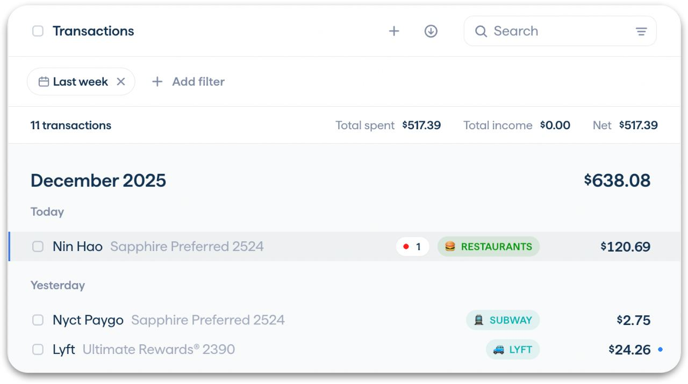

# Copilot Money design

> Summary: Copilot is the most polished app in the category, with navy type on near-white cards, emoji category chips and pace-colored charts; CoinKeeper should borrow its inline category autocomplete anchored to the row, its "left of budgeted" hero with an ideal-pace line, and budget bars colored by pace rather than by share spent.

Copilot is in the design research as the visual benchmark: an Apple Design Award finalist whose web app arrived in December 2025. Its review loop and pace-aware budgets are the closest existing answers to two of the owner's complaints, the tall review rows with a modal category picker and budget figures that look alike. The features are covered in the [Copilot Money feature study](../../apps/copilot-money.md); this page looks only at design and hierarchy. The marketing site shows the dark theme; every screenshot here is the light theme from the help center.

## At a glance

|                  |                                                                                                                                                 |
| ---------------- | ----------------------------------------------------------------------------------------------------------------------------------------------- |
| Surfaces studied | web and Mac (help center screenshots), iOS for comparison                                                                                       |
| Tone             | Polished and friendly, closer to expressive than to bank: emoji and colored chips everywhere, but on a calm, well-spaced layout                 |
| Color            | Navy ink, blue for selection and links, green for "under" and gains, yellow to red for pace warnings; each category has its own color and emoji |
| Type             | A geometric sans (the site loads Matter and Jokker); the dollar sign is set small and raised before every amount                                |
| Iconography      | Emoji per category inside tinted chips, institution logos for accounts, outline icons in navigation; merchants appear by name only              |
| Best idea for us | Changing a category from a small popover on the row itself: type two letters, pick, done                                                        |

## Visual identity

The canvas is a pale blue-gray (approximately `#F9FAFC`); cards are white with a hairline border, a faint shadow and a large radius (about 16 px). Text is a dark navy (approximately `#1B2B4B`) rather than black, with slate gray for secondary text, which makes the page feel softer than pure black on white.

Color roles:

- **Selection and links**: blue. The active sidebar item has a pale blue fill (approximately `#EEF5FF`); **View all** and **Accounts** links are gray-blue.
- **Positive and on pace**: green (approximately `#01C94E` for flags, `#52CB84` for chart lines) for "under" flags, gains and on-pace bars.
- **Pace warnings**: yellow through orange to red for categories projected to go over or already over, on bars and on the spending line itself.
- **Categories**: every category has its own color and emoji. A category chip is the emoji plus the name in uppercase, in the category color, on a pale tint of that color (**RESTAURANTS**, **GROCERIES**, **SUBWAY**).

Numbers get special care: every dollar amount sets the `$` smaller and raised (**$120.69**), so the digits carry the weight. Headline figures are medium weight, not bold. Uppercase small labels are reserved for chips and a few section headers.

Iconography: emoji for categories (users pick them, and reviewers mention the custom names, colors and emoji as a reason they like the app), round institution logos for accounts (Chase, Apple), a generic bank glyph in a gray circle for manual accounts, and thin outline icons in the sidebar. Transactions show the merchant as text only; a small **R** box marks a recurring charge.

On the formal-to-playful scale Copilot sits at about two thirds: structured and quiet in layout, playful in its chips and emoji.

## Navigation and layout

On web and Mac a left sidebar of about 210 px holds navigation first (**Dashboard**, **Transactions**, **Accounts**, **Investments**, **Categories**, **Recurrings**), then the accounts, then **Start here**, **Get Help** and **Settings** at the bottom. The accounts sit under collapsible type headers (**Credit card**, **Depository**, **Investment**, **Loan**), one line each: a small colored dot, the name, and the balance in small gray type. They are visibly quieter than the navigation: no icons, lighter text, and a divider between the two blocks.

Pages have a slim top bar with the page title in small type and actions on the right (**Rebalance**, **Edit Budget**, add, download). List pages open the selected item in a right-hand detail pane instead of a dialog. On iOS the same sections are a scrollable row of pill tabs under the app title.

## Home and overview

_Web dashboard, Copilot help center. What to notice: the first card answers "how much can I still spend" with one figure and a pace line, and the sidebar lists accounts quietly under type headers._

The dashboard is a two-column grid with a clear reading order:

1. **Monthly spending** (top left): **$1,722 left** as the hero, **$5,041 budgeted** under it, and a chart of spending so far against a dotted line for the ideal pace. A green flag at the end of the line says **$95 under**; the line is colored along its length, red and orange where spending ran ahead of the ideal and green where it is back under.
2. **Net worth** (top right): the figure, a green percent chip and a range switcher (**1W**, **1M**, **3M**, **YTD**, **1Y**, **ALL**).
3. **Transactions to review**: rows grouped by day with a checkbox, the merchant, the category chip and the amount, then **Mark 2 as reviewed**.
4. **Top categories**: groups and categories with a count badge, emoji, spent, a pace-colored bar and the budget.
5. **Next two weeks**: upcoming recurring charges with date, name, chip and amount.

The one number is the money left in the monthly budget.

## Accounts

_Accounts with a credit card open in the detail pane, Copilot help center. What to notice: credit card rows carry a utilization chip, and each group ends with a total row._

The Accounts page opens with a net worth card (figure, percent chip, line chart, range switcher, and a gear that can split assets and debt into two lines). Groups follow, one per type, each with a collapse triangle and an eye icon. A row shows the institution logo (or a bank glyph for manual accounts), the name with the last four digits in gray, a gray subtitle (**Manual account**, or a relative date such as **3 years ago**), a chip and the balance. For credit cards the chip is the credit utilization with a colored dot: green up to 33%, yellow to orange up to 90%, red above. For other accounts it is the balance change with an arrow. A last row gives the group total and its chip.

Selecting an account opens it on the right: logo, name, balance, the credit limit under it for cards, a chart with its own range switcher, and the account's transactions grouped by day. Investment account lists add a **1M balance change** column with a small red or green sparkline per account. Account types are told apart by grouping and logos, not by a type icon.

## Transactions and categorizing

_Transactions, Copilot help center. What to notice: the filtered set gets its own count and totals, and each row fits merchant, account, category and amount on one line._

The Transactions page puts search and a filter icon in the header, filter chips below (**Last week**, **Add filter**), and a summary line for the filtered set: the count, **Total spent**, **Total income** and **Net**. Rows are grouped by month (with the month total) and by day. Row anatomy: a checkbox, the merchant in ink and the account with its last digits in gray on the same line, optional small badges, the category chip, the amount, and a blue dot when the transaction is unreviewed. Selecting several rows raises a floating action bar (**Category**, **Tag**, more), and the web app supports keyboard shortcuts: arrows to move, **X** to select, **R** to mark reviewed, **C** to change the category.

_Category autocomplete in Transactions to review, Copilot help center. What to notice: the picker is a small popover on the chip, filtered by what you type, with New category and Exclude as the last two actions._

Clicking a category chip opens a popover anchored to it: a search field, the matching categories with their emoji (**Rec Sports**, **Rent**, **Restaurants** for "re"), then **New category "re"** and **Exclude** below a divider. With an empty query the popover shows a **SUGGESTED** section on top, marked with the Copilot Intelligence icon, holding the two categories the model finds most likely. Nothing leaves the row, so the review list stays one line per transaction.

Review is a state, not a place: unreviewed transactions carry the blue dot everywhere, the dashboard shows them first, and **Mark as reviewed** clears a day or a selection at once.

## Budgets

_Categories (budgets) on Mac, Copilot help center. What to notice: bar color follows the pace, so a category can be under budget and still orange._

Budgets live on the **Categories** page. The top card compares spent this month with the total budget around a donut in category colors. The list has three columns: **SPENT**, a bar and **BUDGET**; groups show a count badge and fold. The detail pane on the right shows the selection's spent figure with the amount left under it, a bar chart of past months with the budget as a labeled line, key metrics per year (total spent, average monthly spend), and a table with **SPENT**, **BUDGET** and **LEFT**, where a colored dot after each left amount repeats the state.

The bar color is the state, and it follows pace rather than share:

| Bar              | Meaning                                                 |
| ---------------- | ------------------------------------------------------- |
| Green            | On pace to stay within the budget                       |
| Yellow to orange | Projected to go over at the current rate                |
| Red              | Already over budget                                     |
| Outlined segment | Spending expected from recurring charges not yet posted |

For past months the bars are only green or red. **Rebalance** proposes moving budget between categories so the total stays the same.

## Reports and analytics

Reports are one **Cash Flow** tab with three cards: **Net income**, **Spending** (bars stacked by category) and **Income**. A range bar chooses **Year-to-date**, **Month-to-date**, **Last 12 months**, **Last 3 months** or **Last 4 weeks**, and a comparison setting draws the previous period as a dotted line. On web and Mac, hovering a bar shows its value and the comparison; clicking or **View More** opens key metrics, the category breakdown and then the transactions. Category-level history lives on the Categories page, so Cash Flow stays short.

## What CoinKeeper could borrow

| Pattern                                                                                                                                                         | Where in CoinKeeper                                                                      | Why it helps                                                                                                           | Effort |
| --------------------------------------------------------------------------------------------------------------------------------------------------------------- | ---------------------------------------------------------------------------------------- | ---------------------------------------------------------------------------------------------------------------------- | ------ |
| Category autocomplete in a popover anchored to the row's category chip: search, suggested on top (payee default, recent), then **New category** and **Exclude** | Review inbox (`review-inbox`), transaction table, transaction dialog (`category-picker`) | Rows stay one line tall and the modal grid of tiles goes away, which covers the owner's review and picker complaints   | M      |
| Dashboard hero "€1,722 left of €5,041 budgeted" with actual spending against a dotted ideal-pace line and an "under" or "over" flag, per currency               | Dashboard (`overview`), Budgets header                                                   | Gives the dashboard one answer to read first; the pace math already exists in `packages/shared/src/lib/budget-pace.ts` | M      |
| Budget bars colored by pace (green, amber, red), with a dot or label repeating the state next to the left amount                                                | Budgets page (`budget-progress`, `budget-card`)                                          | Fixes badges and text that disagree today, and makes the state readable without color alone                            | S      |
| Accounts in the sidebar only as a quiet list under type headers: dot, name, gray balance, no icon tiles, divided from navigation                                | Shell (`application-shell`)                                                              | If accounts stay in the sidebar, they no longer look like navigation buttons                                           | S      |
| A summary line for any filtered transaction list: count, total spent, total income, net, per currency                                                           | Transactions page (`transaction-explorer`)                                               | Answers "how much did I spend on this" without a report                                                                | S      |
| One-line rows: payee, account in gray, category chip, amount, and a small dot for unreviewed                                                                    | Transaction table, review inbox                                                          | Denser and calmer than today's stacked rows; review status visible everywhere                                          | S      |
| Detail pane on the right for the selected transaction or account instead of a dialog                                                                            | Transactions, Accounts                                                                   | Keeps the list in view while editing                                                                                   | M      |
| Credit utilization chip on card rows (green to 33%, amber to 90%, red above), once accounts can store a credit limit                                            | Accounts page                                                                            | Tells at a glance whether a card balance is a problem; needs a new credit limit field                                  | M      |

## What not to copy

- **Emoji as the category mark**: they render differently on each operating system and cannot be recolored; CoinKeeper's Lucide icon on a group tint keeps the same benefit consistently.
- **Uppercase category chips everywhere**: they are loud in long lists and truncate early (**TRANSPORT…**, **REC SPOR…**); sentence case with a small icon reads faster.
- **A dark theme as the default presentation**: the owner wants one light theme.
- **Machine-learning suggestions as the only source of "suggested"**: CoinKeeper can fill the same slot with the payee's default category and recent choices, which are explainable.
- **A dollar-only format**: the raised currency symbol is elegant, but CoinKeeper must show EUR and USD side by side with their own symbols and never mix them in one total.

## Sources

- [Copilot Help: Copilot Money for Web](https://help.copilot.money/en/articles/11780342-copilot-money-for-web) (dashboard, accounts, transactions and category autocomplete screenshots; keyboard shortcuts)
- [Copilot Help: Quick Start Guide](https://help.copilot.money/en/articles/11157550-quick-start-guide) (Categories page screenshot)
- [Copilot Help: Dashboard Tab Overview](https://help.copilot.money/en/articles/6045480-dashboard-tab-overview)
- [Copilot Help: Categories Tab Overview](https://help.copilot.money/en/articles/9504513-categories-tab-overview) (bar colors)
- [Copilot Help: Accounts Tab Overview](https://help.copilot.money/en/articles/6213732-accounts-tab-overview)
- [Copilot Help: Credit Utilization](https://help.copilot.money/en/articles/10310069-credit-utilization)
- [Copilot Help: Copilot Money for macOS](https://help.copilot.money/en/articles/6778561-copilot-money-for-macos)
- [Copilot Help: Cash Flow Tab Overview](https://help.copilot.money/en/articles/9682232-cash-flow-tab-overview)
- [Copilot Help: Copilot Intelligence for Spending](https://help.copilot.money/en/articles/8182433-copilot-intelligence-for-spending) (suggested categories)
- [Copilot Help: Transactions Tab Overview](https://help.copilot.money/en/articles/9554412-transactions-tab-overview)
- [Copilot Money: home page](https://www.copilot.money/) (dark theme product shots, fonts loaded by the site)
