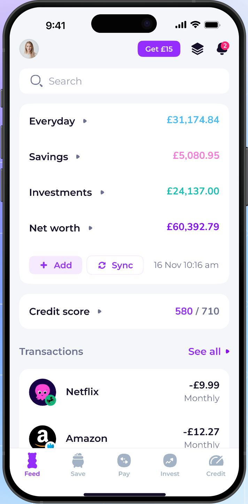
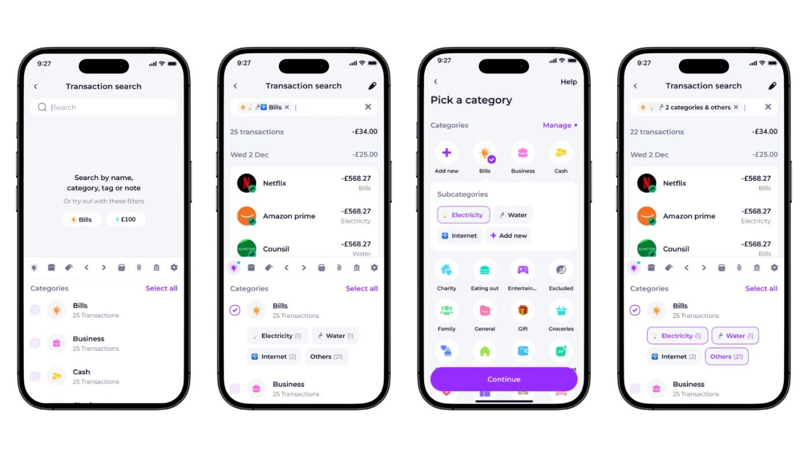
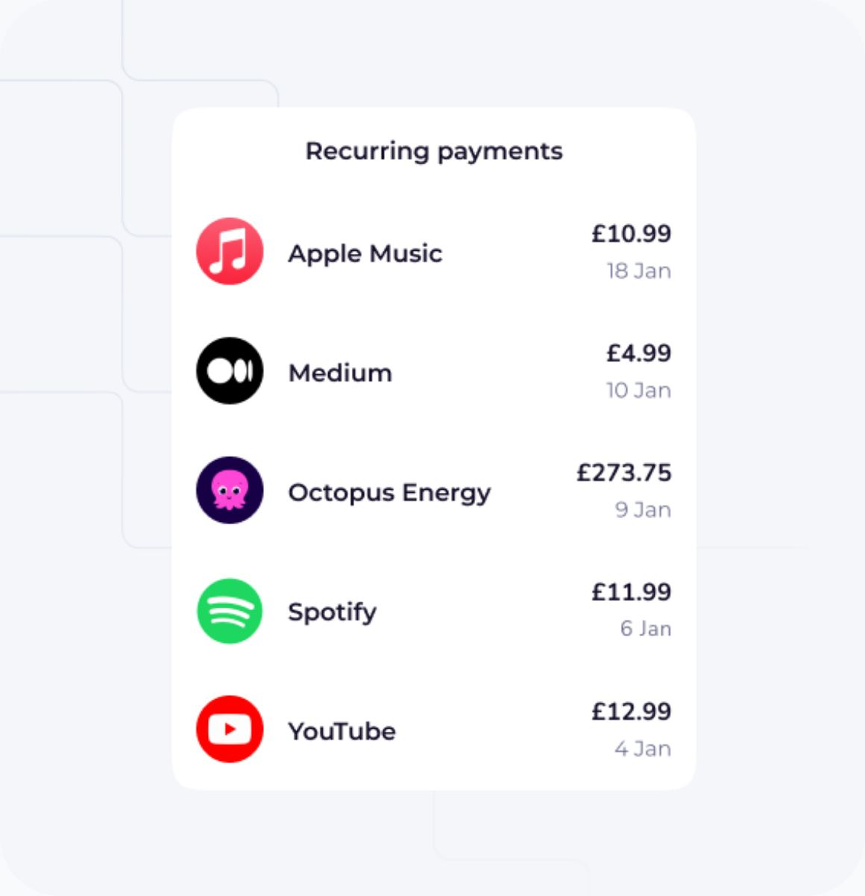
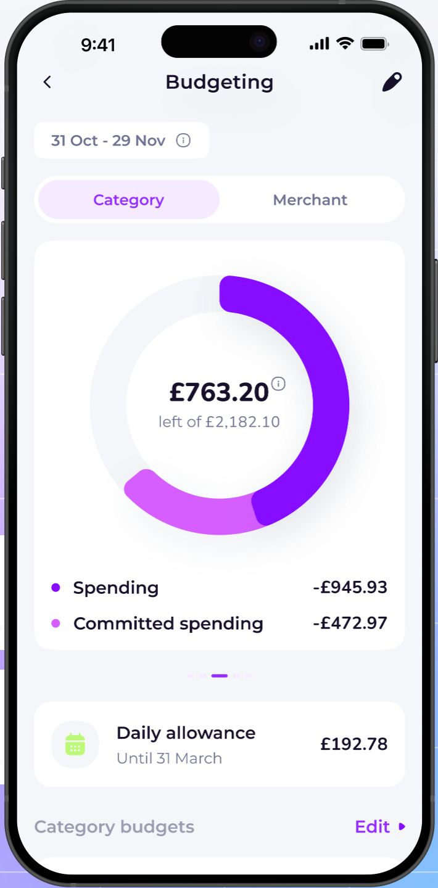
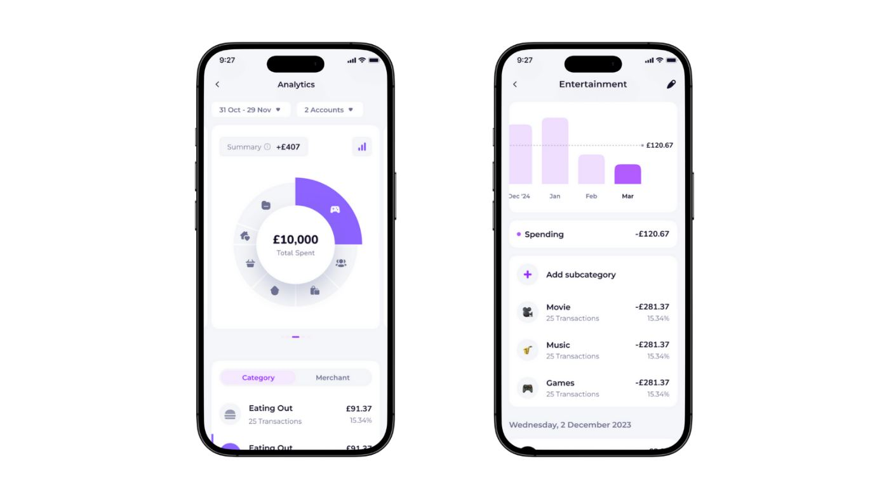

# Emma design

> Summary: Emma's design is a light, violet-branded consumer app of rounded white cards, real merchant logos and multi-colored category glyphs; CoinKeeper should borrow its budget hero that says what is left "of" the total with the per-day allowance in its own card, merchant avatars with a small account badge, and budget rows that state "X left of Y".

Emma sits at the expressive end of the research: a gummy-bear logo, a violet and magenta palette, logos on almost every row and emoji for custom categories. It is in the study because it shows what that expressiveness looks like when it sits on a calm list-and-card layout, and because its budget screen separates "left", "spent", "committed" and "per day" more clearly than CoinKeeper does today. What Emma does is covered in the [Emma feature study](../../apps/emma.md); this page covers how it looks and reads.

## At a glance

|                  |                                                                                                                                                                        |
| ---------------- | ---------------------------------------------------------------------------------------------------------------------------------------------------------------------- |
| Surfaces studied | iOS (marketing site, blog posts, App Store images, community posts); the web dashboard is a subscriber-only beta behind a QR sign-in and has no public screenshots     |
| Tone             | Expressive but orderly: a playful brand and upbeat copy on top of a tidy card-and-list layout                                                                          |
| Color            | Violet (about #8A0DFF) for actions, selection and charts, magenta (about #D55EFE) as the second chart color, one bright hue per account group; amounts stay near-black |
| Type             | A wide geometric sans (it looks like Montserrat; unconfirmed); balances set large with smaller pence                                                                   |
| Iconography      | Real merchant and bank logos in round avatars, duotone category glyphs in pastel circles, emoji for custom categories and net-worth assets                             |
| Best idea for us | One hero figure, "£763.20 left of £2,182.10", with spent and committed as a two-row legend and the daily allowance in a separate card                                  |

## Visual identity

The canvas is a cool light gray (about #F5F6FA, approximate) with white cards, generous radius (around 16 px), no borders and shadows so soft they read as flat. Violet is the only action color: links such as **See all** and **Edit**, the selected half of a segmented control (pale violet fill, violet text), the active tab and the primary button. Charts use violet and magenta together. Red appears only on notification badges.

Color also labels data. On the home screen each account group total has its own hue: Everyday in sky blue, Savings in pink, Investments in teal and Net worth in violet. Spending amounts are near-black with a minus sign rather than red, and incoming money such as round-ups is teal. Balances use the bank convention of a large integer part with smaller pence.

Iconography does most of the expressive work:

- **Merchant logos.** Transactions and recurring payments show the company's real logo in a round avatar (Netflix, Amazon, Spotify, Octopus Energy). They come with Emma's bank sync; the matching is not documented.
- **Account badge.** On transaction rows a small bank logo (for example the green Lloyds horse) overlaps the bottom-right of the merchant avatar, so you see who was paid and from which account without an extra column.
- **Category glyphs.** Built-in categories use duotone glyphs in pastel circles, each in its own hue: a yellow sun for Bills, a teal burger for Eating out, a purple gamepad for Entertainment. Custom categories (a paid feature) are an emoji on a colored circle, and net-worth assets use emoji such as a house and a car.
- **Brand.** The gummy bear doubles as the **Feed** tab icon; older screens used gradient headers with confetti.

The tone is friendly and a little salesy: a **Get £15** referral pill sits in the home header, and the store copy talks about "wasteful subscriptions".

On the scale from formal bank to expressive, Emma is expressive in brand, color and logos but not in layout. What it adds: logos make rows recognizable before you read them, and hued group totals make the home screen scannable. What it costs: the pastel amount colors are hard to read (sky blue, pink and teal on white come out at roughly 2 to 3:1 by our estimate, below the 4.5:1 that normal text needs), the referral pill competes with the balances, and account groups are told apart by hue alone.

## Navigation and layout

A bottom tab bar holds five destinations: **Feed**, **Save**, **Pay**, **Invest** and **Credit**. Budgeting and analytics are reached from cards in the Feed, and screens below the tabs use a plain header: a back chevron, a centered title and one action icon (an edit pencil or a settings gear). Period-based screens put the period in a chip under the title ("31 Oct - 29 Nov"), which is the pay cycle rather than a calendar month.

The web dashboard exists only for paying users behind a QR-code sign-in, so its layout could not be studied.

## Home and overview

_Feed home, Emma website. What to notice: four group totals, each in its own hue, then transactions whose logos carry a small bank badge._

The Feed opens on a search field and then one card of totals: Everyday, Savings, Investments and Net worth, each a label with a disclosure arrow on the left and a colored amount on the right. **Add** and **Sync** buttons and the last sync time close the card. A credit score card follows, then the latest transactions and recurring payments. There is no single hero number on the home screen; the four totals share the same size and only color separates them.

## Accounts

Account groups on the home screen are the entry point. The account detail screen centers the bank's logo above a large balance, shows the overdraft limit in muted text, and adds a violet **True balance** pill (balance minus payments still due this month) that opens a breakdown of current balance, upcoming payments and payments already made, each with its merchant logo. The net-worth screen has a line chart with **1W** to **All** range chips, **Net worth**, **Assets** and **Debt** tabs, and collapsible groups (Current, Savings, Real estate, Vehicles) whose totals repeat the group hue. The screens we found show no dedicated credit-card layout. The account views are shown in the [Emma accounts blog post](https://emma-app.com/blog/new-in-emma-your-accounts-just-got-smarter).

## Transactions and categorizing

_Transaction search and category picker, Emma blog. What to notice: rows are logo, name, amount and category in a tight two-line block; the picker is a four-column icon grid with subcategory chips that open under the chosen parent._

A transaction row is a round logo avatar with the account badge, the merchant name, and on the right the amount over a muted second line (the category, or the frequency for recurring payments). Rows are grouped by day with a day total. Search suggests filter chips (a category, an amount such as "> £100") before you type, and the category filter list shows transaction counts with subcategory chips underneath.

The category picker is a full screen titled **Pick a category**: a four-column grid of round glyph tiles, **Add new** first, a **Manage** link, and a **Continue** button. Choosing a parent opens its subcategories as chips inside the grid (Electricity, Water, Internet) with their own small icons. There is no search box and no recent or suggested row in the picker, which is the same weakness the owner sees in CoinKeeper's modal grid. The transaction detail lists its actions as rows under the logo and amount: category, tags, note, receipt, split and share. Bulk recategorizing uses a checklist of similar transactions with an **Apply edit to N transactions** button.

_Recurring payments, Emma website. What to notice: the logo alone identifies each subscription; amount and next date stack on the right._

Recurring payments are the clearest case of Emma's logo-first rows: logo, name, and the amount over the next payment date, with no category or account shown. The subscriptions screen adds a **Cancel** action on a raised card and a bill reminders switch at the bottom.

## Budgets

_Budgeting, Emma website. What to notice: one hero figure ("left of" the total), a two-row legend for spent and committed, and the daily allowance in its own card._

The budget screen has a clear hierarchy of four figures:

1. **Left** is the hero, set large inside a ring chart, with "left of £2,182.10" in smaller muted text beneath it.
2. **Spending** and **Committed spending** (recurring payments still due) are a two-row legend under the ring, each with a colored dot matching its ring segment and its amount right-aligned.
3. **Daily allowance** sits in a separate card with a calendar icon, the amount on the right and "until" the period end as the subtitle.
4. **Category budgets** follow as rows: glyph, name, amount spent on the right, "£48 left of £400" as the subtitle, and a thin progress bar in the category's own hue.

A **Category** / **Merchant** segmented control switches between category and merchant budgets. Status is carried by the ring filling up and by the "left" wording; there are no on-track or over-limit labels in the screens we saw. The ring looks friendly but makes the spent-to-total ratio hard to judge precisely, and it would not show two currencies side by side.

## Reports and analytics

_Analytics and category detail, Emma blog. What to notice: period and account filters as two chips at the top, a Category / Merchant toggle, and a monthly bar chart with an average line on the drill-down._

Analytics opens with two filter chips (period and accounts), a **Summary** figure (income minus spending), and a ring of total spent whose segments carry category glyphs; only the selected segment is colored, the rest are gray. A **Category** / **Merchant** toggle switches the ranked list below, where each row shows the amount, the transaction count and the share of the total. Tapping a category opens a drill-down with monthly bars against a dashed average, the subcategories with their share, and the transactions by day. Weekly and monthly recaps arrive as message cards in the Feed rather than as a report page.

## What CoinKeeper could borrow

| Pattern                                                                                                        | Where in CoinKeeper                              | Why it helps                                                                                       | Effort |
| -------------------------------------------------------------------------------------------------------------- | ------------------------------------------------ | -------------------------------------------------------------------------------------------------- | ------ |
| Hero "left" figure with "of <total>" in smaller muted text, spent and committed as a legend below              | Budgets header, per currency                     | Fixes the five look-alike figures: one number leads and the others read as its explanation         | S      |
| Daily allowance in its own small card with the period end as subtitle                                          | Budgets header, Dashboard                        | "Left per day" stops competing with the totals and becomes the actionable figure                   | S      |
| Budget row: amount spent on the right, "X left of Y" as the subtitle, a thin bar in the category group's color | Budgets category list                            | Every row says what is left in words, so the bar is not the only signal                            | S      |
| Payee avatar (logo or monogram) with a small account-type badge on its corner                                  | Transactions, Review inbox                       | Shows payee and paying account in one 40 px element instead of an extra column, keeping rows short | M      |
| Suggested filter chips in the empty search state (a category, "over 100")                                      | Transactions search                              | Teaches the filters without a filter panel                                                         | S      |
| Category / Merchant toggle on the same ranked list and on budgets                                              | Analytics sub-pages "By category" and "By payee" | One layout serves two questions, which suits Analytics split into sub-pages                        | M      |

## What not to copy

- **The full-screen icon grid picker.** It has no search, no recents and needs a **Continue** tap; the owner wants a searchable list or autocomplete instead.
- **Pastel hues as the only difference between totals.** Colored text at roughly 2 to 3:1 fails contrast, and color alone cannot carry meaning; use a label or an icon with a neutral amount.
- **The referral pill and upsells in the home header.** They are the same kind of noise as CoinKeeper's promotional sidebar card.
- **A ring chart as the budget hero.** It hides the exact ratio and does not scale to two currencies; a bar with a pace marker reads better.
- **Emoji as category icons.** They render differently on Windows, macOS and Android and clash with CoinKeeper's Lucide set.

## Sources

- [Emma homepage](https://emma-app.com/): Feed home screenshot (`emma-home.jpg`)
- [Emma: Track expenses feature page](https://emma-app.com/features/tracking): Budgeting screenshot (`emma-budgets.jpg`)
- [Emma: Recurring payments feature page](https://emma-app.com/features/recurring-payments): recurring payments screenshot (`emma-subscriptions.jpg`)
- [Emma blog: Introducing subcategories](https://emma-app.com/blog/precision-is-power-introducing-subcategories-for-ultimate-budgeting-control): search, picker and analytics screenshots (`emma-transactions-categories.jpg`, `emma-analytics.jpg`)
- [Emma blog: Your accounts just got smarter](https://emma-app.com/blog/new-in-emma-your-accounts-just-got-smarter): account detail, True balance and net-worth screens
- [Emma: Budgeting feature page](https://emma-app.com/features/tracking/budgeting): category budget rows, daily allowance and merchant budgets
- [Emma Community: Custom category emojis](https://community.emma-app.com/t/new-emma-pro-feature-custom-category-emojis/715): the older category grid with emoji custom categories
- [App Store (UK): Emma](https://apps.apple.com/gb/app/emma-budget-planner-tracker/id1270062373): subscriptions and budgeting store images
- [Help: How do I sign in to the Emma Web Dashboard?](https://help.emma-app.com/en/article/how-do-i-sign-in-to-the-emma-web-dashboard-tyh4i7/): web dashboard access
