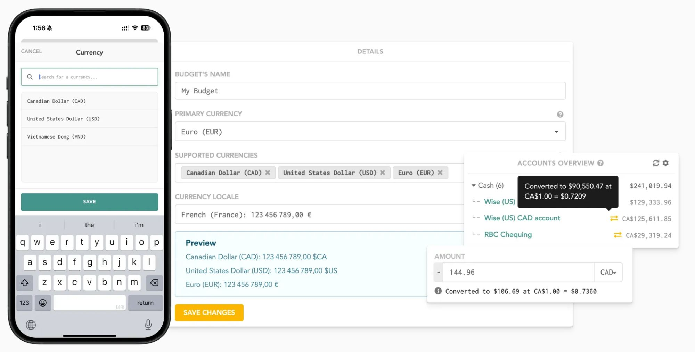
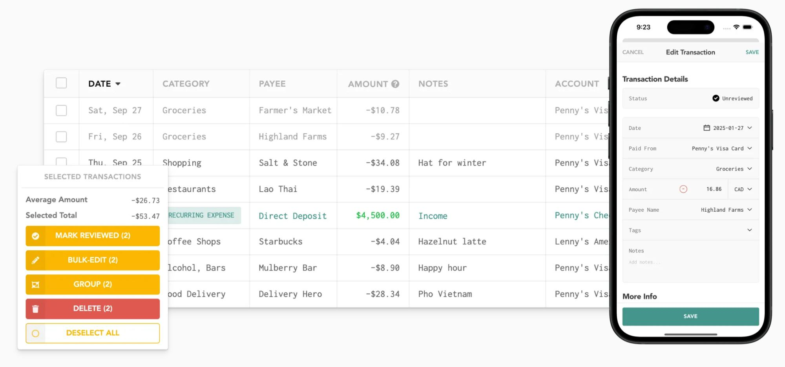
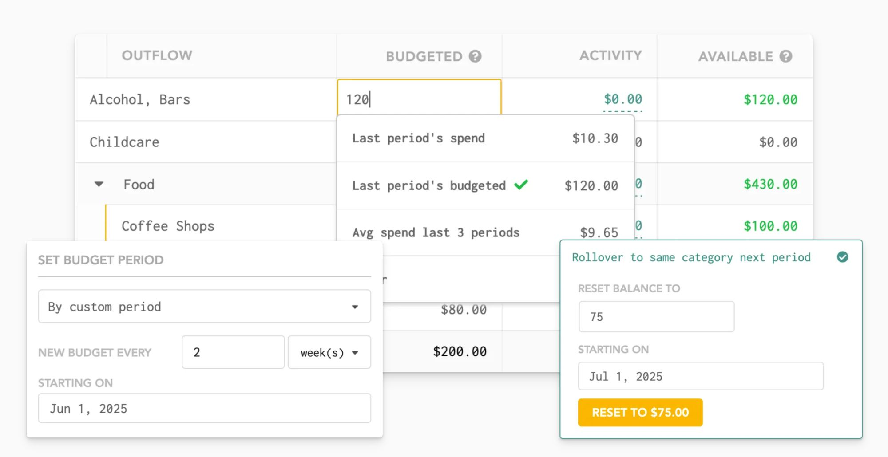

# Lunch Money design

> Summary: Lunch Money's web app is a plain, data-first workspace of white cards, uppercase gray labels and monospaced figures, with one amber accent for actions; CoinKeeper should borrow its three-column overview with a to-do column, the converted-amount marker for foreign-currency balances, and the budget cell that suggests last period's figures.

Lunch Money is in the design research because it is a web-first budgeting tool with the same priorities as CoinKeeper: multi-currency by default, transactions edited in a table, budgets as a table of categories, and reports for people who like to see their data. It is less polished than a bank app, which makes it useful twice: as a source of well-organized screens and as a warning about density. The features themselves are described in the [Lunch Money feature study](../../apps/lunch-money.md). Owner issues are numbered O1 to O8 as in the [current UI review](../current-ui-review.md).

## At a glance

|                  |                                                                                                                        |
| ---------------- | ---------------------------------------------------------------------------------------------------------------------- |
| Surfaces studied | Web (primary); iOS companion shown next to it on the marketing site                                                    |
| Tone             | Utilitarian and a little quirky: a spreadsheet with friendly checklist copy; closer to a tool than to a bank           |
| Color            | Grayscale base, teal for links and income, amber for actions, red for delete and overspending, category colors in bars |
| Type             | Monospaced face for tables and amounts, geometric sans for page titles, small uppercase gray labels for card titles    |
| Iconography      | Illustrated flat icons on task cards, optional emoji in category names, no merchant logos                              |
| Best idea for us | A right-hand column of "things to review" cards on the overview that turn into green checks when done                  |

## Visual identity

The look is a white canvas with thin-bordered cards, card titles in small uppercase gray letters, and almost everything else in a monospaced typeface. Monospace keeps columns of amounts aligned without extra work, at the cost of looking technical.

Colors (approximate hex values read from screenshots):

| Role            | Approximate value             | Where it appears                                                  |
| --------------- | ----------------------------- | ----------------------------------------------------------------- |
| Links and brand | teal `#23877a`                | Account names, category links, card headings you can click        |
| Positive        | green `#1f9d63`               | Income amounts, available budget, savings rate                    |
| Primary action  | amber `#f6b400`               | **Mark reviewed**, **Bulk-edit**, **Save changes**, period arrows |
| Negative        | red `#e05a5a`                 | **Delete**, overspent differences, expense bars in trends         |
| Neutral         | grays `#9a9a9a` to `#f5f5f5`  | Labels, borders, table headers, empty bar tracks                  |
| Category colors | blue, pink, cyan, yellow, red | Only in spending bars and charts                                  |

- **Numbers**: monospaced figures, negative expenses with a minus sign, income in green; totals are bold rather than larger.
- **Radius and depth**: small radius (about 4 px), 1 px gray borders, faint shadows on floating panels.
- **Density**: high; card titles take little space and rows are about 36 px.
- **Illustration**: small flat icons on task cards (gold coins, sliders, a bank building) that gray out when the task is done.
- **Voice**: short and warm on status cards ("All cleared!", "Everything looks good!"), neutral elsewhere.

On the scale from formal bank to expressive, Lunch Money sits slightly toward expressive in words and firmly toward tool in layout.

## Navigation and layout

Navigation is a menu bar with grouped menus rather than a sidebar; the official screenshots crop it out, but the help center places the budget page under a **Finances** menu with transactions, recurring items and analyze, and keeps setup pages (accounts, categories, tags, rules) in their own group. Accounts do not appear in the navigation; they live on the overview's **Accounts Overview** card and on a dedicated accounts page. Pages start with a large title and a period picker on the left ("Month to date: Apr 1, 2024 to Apr 24, 2024" with previous and next arrows); settings for a card sit behind a gear icon in the card's corner.

## Home and overview

The overview is three columns of cards, and the period picker above them drives all of them except the account balances.

_Overview, Lunch Money home page. What to notice: the right column is a checklist of review tasks with green checks, and the spending breakdown pairs each category with a bar, an amount and a share._

1. Left: **Accounts Overview** (grouped balances and estimated net worth), then **Period Summary** (income earned, expenses, net income and savings rate, with recurring and other amounts split out).
2. Center: **Spending Breakdown**, with an income bar and a stacked expense bar at the top, then a table of categories with a bar, the amount, projected spend and a share of the total. Subcategories are indented under their parent.
3. Right: task cards (review transactions, set this month's budget, review recurring items, review accounts), each with an icon, a one-line status and a check that turns green when nothing is left to do.

There is no single hero number. The page answers "what needs my attention" through the task column and "where did money go" through the breakdown, which is a clear split CoinKeeper's dashboard lacks (O1).

## Accounts

Accounts are grouped by type (Cash, Investment, Credit, plus Crypto and Loan) with the number of accounts and a group total, and account names are teal links that open the account's transactions. The grouping can switch to subtype or to assets and liabilities, and sorting to amount or name. Estimated net worth closes the card; history lives on a separate Net Worth page.

Multi-currency presentation is the part to study closely:

_Multi-currency, Lunch Money features page. What to notice: foreign balances keep their own currency with a small exchange icon, and the converted value and rate appear in a tooltip rather than in the row._

- A balance in another currency shows in that currency (for example CA$125,611.85) with a small two-arrow icon; hovering shows the converted amount and the rate used.
- Group totals are in the primary currency; a toggle can show every balance converted.
- The amount field on a transaction has a currency selector, and a line under it states the conversion.

## Transactions and categorizing

The transactions page is a full-width table with uppercase gray headers: date (weekday and day), category, payee, amount, notes and account. Any cell is editable in place, and an arrow at the end of the row opens a **Transaction Details** panel on the right.

_Transactions, Lunch Money features page. What to notice: rows are one line each, income is green, a recurring item is a small chip, and selecting rows opens a panel with the average, the total and the bulk actions._

- Row anatomy: no logos or icons, category as plain text (with an emoji if the user added one), the amount right-aligned, income in green, a teal chip for recurring items.
- Review is a status on the row (reviewed or unreviewed) plus a task card on the overview; it adds no height to rows.
- Selecting rows opens a **Selected Transactions** panel with the average amount, the selected total and large action buttons (mark reviewed, bulk edit, group, delete).
- Category cells open a dropdown list in place; the tag picker is a type-to-search dropdown that also creates a new tag from what you typed.

## Budgets

The budget page is two tables, inflow and outflow, with **Budgeted**, **Activity** and **Available** columns, and a sidebar with a budget status card and a budget overview (budgetable, total budgeted, left to budget, status).

_Budget, Lunch Money features page. What to notice: clicking a budgeted cell offers last period's spend, last period's budget and a three-period average, and the Available column is the only one in color._

- The hero is **Available**: green when there is money left, red when overspent; **Budgeted** and **Activity** stay gray or black.
- Hovering an Available amount explains it (previous balance, this period's activity), so the table needs no extra columns.
- The status card uses three colors: green for balanced, orange for money still to assign, red for over-assigned.
- There is no pace marker; the overview's breakdown can switch its bars to "against budget" to show how much of each budget is used.

## Reports and analytics

Analysis is split into separate pages: **Stats** (period summary numbers), **Trends** (month-by-month charts), **Net Worth**, **Calendar**, and **Analyze**, a query tool that shows the same data as a table, pie, bar, line or stacked bar with a date range, a granularity (day, week, month, year) and a group-by.

_Stats and trends, Lunch Money features page. What to notice: the chart tooltip shows change versus the previous period and buttons that open the matching transactions._

- Drill-down is explicit: tooltips carry **View expenses** and **View income** buttons, and top-category rows have an open-in-transactions icon.
- Change is shown as a colored percentage next to each figure.
- Saved queries turn one-off analysis into reusable reports.

## What CoinKeeper could borrow

| Pattern                                                                                                     | Where in CoinKeeper          | Why it helps                                                                    | Effort |
| ----------------------------------------------------------------------------------------------------------- | ---------------------------- | ------------------------------------------------------------------------------- | ------ |
| A column of review task cards (uncategorized, no budget yet, accounts to check) that turn into checks       | Dashboard                    | Tells the user what to do first and replaces several widgets; fixes O1          | Small  |
| Foreign-currency balances in their own currency with an exchange icon and a tooltip for the converted value | Accounts, sidebar, Dashboard | Keeps per-currency truth visible while offering the approximate total on demand | Small  |
| Suggestions under the budget input (last month's spend, last month's budget, 3-month average)               | Budgets                      | Makes setting a budget one click and reuses data CoinKeeper already has         | Medium |
| Only the Available figure in color, with its explanation on hover                                           | Budgets                      | Separates the hero from its inputs without more columns; fixes O5               | Small  |
| Selection panel showing count, total and average with bulk actions                                          | Transactions, Review inbox   | Speeds up categorizing many rows without making each row taller; fixes O2       | Medium |
| Chart tooltips with a change percentage and a button to open the matching transactions                      | Analytics                    | Gives every chart a path to the underlying transactions                         | Medium |
| Analysis split into Stats, Trends and a query view                                                          | Analytics                    | Supports the owner's sub-page idea with a proven split; fixes O4                | Medium |

## What not to copy

- Monospace everywhere: it aligns numbers but makes names hard to scan; use a sans with tabular figures instead.
- Amber as the action color: it competes with warning states; CoinKeeper needs one brand color for actions and amber only for "near limit".
- Uppercase gray card titles as the only hierarchy: they make every card look equally important.
- A budget page with two tables and a three-part sidebar: too many figures at once, the same problem as O5.
- Summing all currencies into one primary-currency total by default: CoinKeeper only shows a converted total in an explicit "approximate" block.

## Sources

- [Lunch Money home page](https://lunchmoney.app/): source of the overview screenshot.
- [Transactions feature page](https://lunchmoney.app/features/transactions), [Budgeting feature page](https://lunchmoney.app/features/budgeting), [Multi-currency feature page](https://lunchmoney.app/features/multicurrency) and [Stats and trends feature page](https://lunchmoney.app/features/stats-trends): sources of the other screenshots.
- [Overview help article](https://support.lunchmoney.app/home/overview): card contents, grouping and display settings.
- [Transaction actions](https://support.lunchmoney.app/finances/transactions/transaction-actions): inline editing, details panel and bulk edit.
- [Navigating the budget page](https://support.lunchmoney.app/guides/budgeting/step-3-navigating-the-budget-page): columns, hover breakdowns and status colors.
- [Analyze](https://support.lunchmoney.app/finances/analyze): the query tool views and controls.
