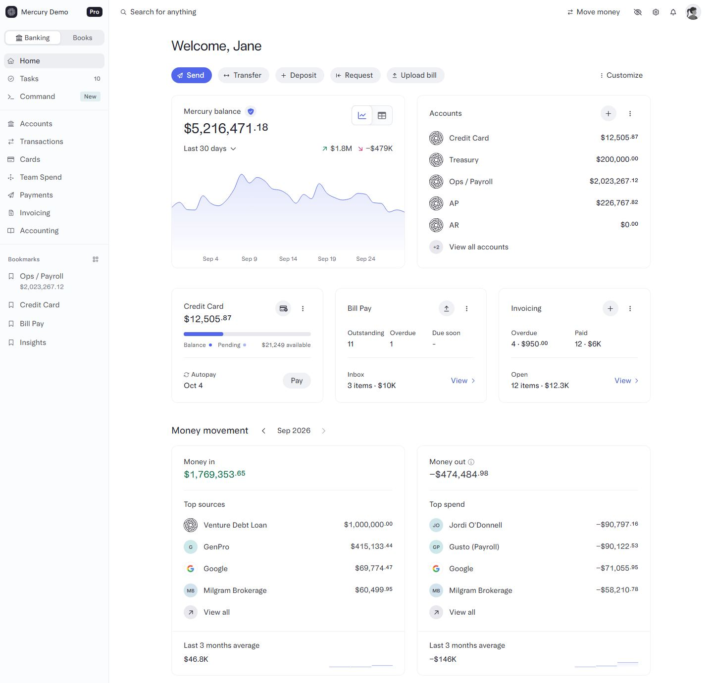
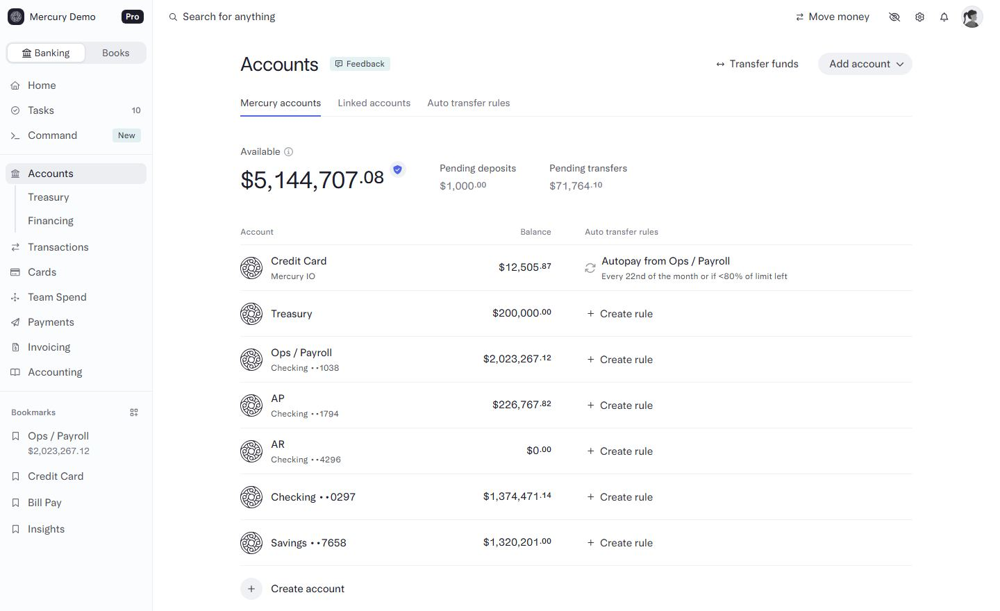
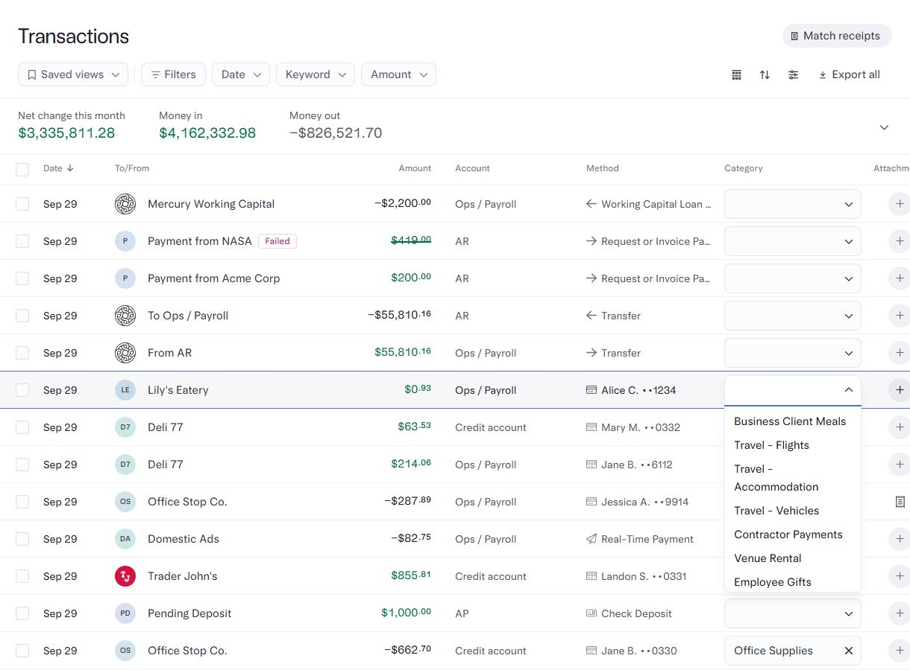
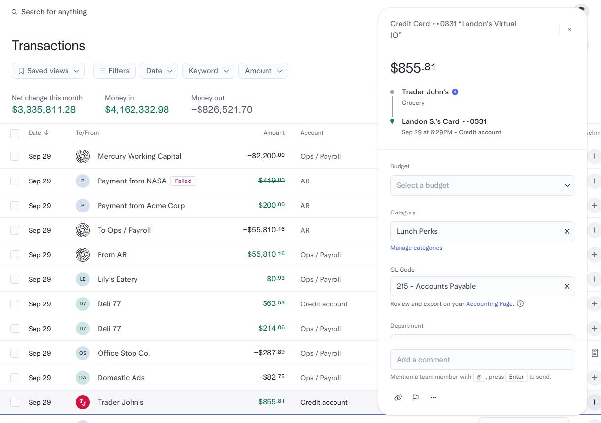
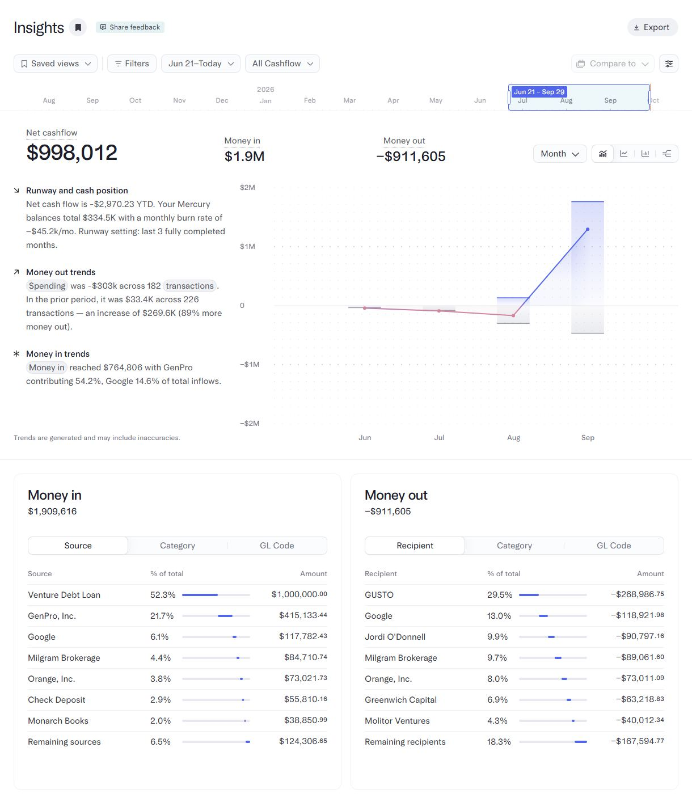

# Mercury design

> Summary: Mercury's web dashboard is a quiet, near-monochrome light UI where one indigo color marks the primary action, green marks only money in, and a custom typeface with small raised cents carries the hierarchy; CoinKeeper should borrow its sidebar with bookmarked accounts, its transaction table with an inline category autocomplete and a side detail panel, and its Insights page with a period brush and "% of total" tables.

Mercury is a US business bank that is often cited as the best-designed banking dashboard on the web. It is in this research because it shows how a bank presents balances, accounts, transactions and cash-flow analytics on a desktop screen, in one calm light theme, which is exactly the surface CoinKeeper targets. There is no feature study for Mercury; this page covers design and hierarchy only. Everything below comes from Mercury's public demo, which shows the real product with sample data and needs no sign-in.

## At a glance

|                  |                                                                                                                                                        |
| ---------------- | ------------------------------------------------------------------------------------------------------------------------------------------------------ |
| Surfaces studied | web (the public demo at `demo.mercury.com`), Mercury blog posts                                                                                        |
| Tone             | Formal bank end of the scale, softened by a first-name greeting and rounded pill buttons; no illustration, no emoji                                    |
| Color            | White and near-white grays; indigo for the one primary action and links; green only for money in; red only for small negative arrows and failure chips |
| Type             | Custom Arcadia Text and Arcadia Display; light-weight display headings; tabular numerals with cents set smaller and raised                             |
| Iconography      | Thin outline icons in navigation; round avatars with the merchant logo when known, tinted initials otherwise; one round mark for own accounts          |
| Best idea for us | The transaction table: filters and a money in / money out strip on top, an inline category autocomplete per row and a side panel for details           |

## Visual identity

The page is white, the sidebar a barely tinted gray (approximately `#FBFCFD`) separated by a hairline. Cards have a thin light-gray border, a radius of about 12 px and no visible shadow; tables have no outer border at all, only hairline row dividers. Density is moderate: table rows are about 50 px tall and the content column is capped at about 970 px on the home page, so a wide monitor shows generous side margins instead of stretched rows.

Color has few, strict roles (all hex values approximate, read from the demo):

- **Action**: indigo (approximately `#5266EB`) fills only the primary button of a screen (**Send** on Home) and colors text links (**View all**, **Manage categories**). Other actions are gray tonal pills (**Transfer**, **Deposit**, **Request**).
- **Money in**: dark green (`#036E43`) for incoming amounts and for the **Money in** and **Net change this month** figures.
- **Money out**: not red. Outgoing amounts use the normal text color with a minus sign; only the small arrow next to **−$479K** on the balance card is pink-red.
- **Status**: a red outlined chip (**Failed**) and a strikethrough amount mark a failed payment.
- **Text**: near-black (about `#1E1E2A`) for primary text and gray (`#535461`) for secondary text such as account names and column headers.

The typeface is Mercury's own Arcadia: Arcadia Display for page titles (28 px at a light weight of about 380, so titles never compete with numbers) and Arcadia Text for everything else, with tabular numerals. Every amount sets the cents smaller and raised (`$5,216,471.18` with a superscript `.18`), which keeps long numbers scannable. Mercury added a dark mode in May 2025, but light is the default and every screen studied here is light.

Tone of voice is plain and short: **Welcome, Jane**, **Money movement**, **Top spend**, **Last 3 months average**.

## Navigation and layout

A fixed left sidebar holds, from top to bottom: the workspace switcher with a plan badge, a **Banking** / **Books** segmented switch, a first group (**Home**, **Tasks** with a count, **Command** with a **New** tag), a divider, the product sections (**Accounts**, **Transactions**, **Cards**, **Team Spend**, **Payments**, **Invoicing**, **Accounting**), and a **Bookmarks** section. Sub-pages appear indented under their parent only while it is active (**Accounts** shows **Treasury** and **Financing**; **Transactions** shows **Insights**), so the tree stays short.

Accounts appear in the sidebar only as bookmarks the user pinned, with a bookmark icon and the balance in small gray text under the name (**Ops / Payroll**, `$2,023,267.12`). They read as shortcuts, not as a second navigation.

A thin top bar carries a global **Search for anything** field on the left and, on the right, **Move money**, a hide-balances eye toggle, settings, notifications and the avatar. Page headers follow one pattern: a large light title on the left, one or two secondary actions on the right (**Transfer funds**, **Add account**, **Export**), and filters on a row beneath.

## Home and overview

_Home, Mercury public demo. What to notice: one large balance with a 30-day chart comes first, and every widget below it answers one question with at most two numbers._

The order is: greeting, a row of action pills, then a two-column hero with **Mercury balance** (the one number, with a trend line and money in / money out for the chosen period) beside an **Accounts** list with right-aligned balances and a **View all accounts** link. Below sit three equal cards (**Credit Card** with a usage bar, **Bill Pay**, **Invoicing**), then **Money movement** with a month stepper and two cards (**Money in**, **Money out**) listing the top four counterparties with avatars and a **Last 3 months average** with a tiny bar sparkline. A recent-transactions table with saved-view chips closes the page. A **Customize** link lets the user reorder or hide widgets. Every card title is a plain label, and each card has at most one action icon in its corner.

## Accounts

_Accounts, Mercury public demo. What to notice: one hero figure with two smaller pending figures beside it, then a plain table where the account type and masked number sit under each name._

The page opens with tabs (**Mercury accounts**, **Linked accounts**, **Auto transfer rules**), then **Available** as the hero figure with **Pending deposits** and **Pending transfers** in smaller gray type beside it. The table lists each account with its type and last digits on a second line (**Checking ••1038**), the balance right-aligned, and a rule column. Account types are told apart by that subtitle, not by color or icon: every Mercury account uses the same round Mercury mark. There is no assets versus liabilities split and no sparkline per account.

The credit card is the exception. On Home and on its own page it shows the balance with a horizontal usage bar in indigo (balance solid, pending lighter), the available credit at the right end of the bar, and the autopay date with a **Pay** button. That bar turns a liability into a readable "how much room is left" figure.

## Transactions and categorizing

_Transactions, Mercury public demo. What to notice: the category cell is a type-ahead combobox inside the row, so categorizing never leaves the table._

The header row holds **Saved views**, **Filters**, **Date**, **Keyword** and **Amount** as outlined dropdown pills, with column, sort and **Export all** controls on the right. A collapsible strip underneath sums the current filter: **Net change this month**, **Money in** and **Money out**. Row anatomy, left to right: checkbox, date, round avatar (merchant logo or tinted initials) with the counterparty name and an optional status chip, amount (green when incoming, strikethrough when failed), account, method with a small icon (card holder and last digits, transfer arrow, check deposit), category and attachment. There is no date grouping; the date is a column.

The category picker is an inline combobox in the row: clicking it opens a short, scrollable text list under the cell and the user can type to filter. A chosen category shows as a filled field with a clear button. There are no icons or colors per category.

_Transaction detail, Mercury public demo. What to notice: the panel floats over the right of the table, so the list stays visible and the next row is one click away._

Clicking a row opens a floating panel on the right: card and account on top, the amount as the largest text, a small vertical timeline from the merchant (with its category, **Grocery**) to the card, then editable **Budget**, **Category** (with a **Manage categories** link), GL code and department fields, and a comment box at the bottom. There is no separate review inbox in the demo; uncategorized rows simply show an empty combobox.

## Budgets

Mercury's banking demo has no category budgets comparable to CoinKeeper's; spending limits exist only as card and team-spend policies, which were not studied.

## Reports and analytics

_Insights, Mercury public demo. What to notice: a month brush sets the period for the whole page, and each breakdown is a table with a thin inline bar instead of a pie chart._

**Insights** is a sub-page of Transactions. Its header has **Saved views**, **Filters**, a date range (**Jun 21–Today**), a flow selector (**All Cashflow**) and **Compare to**. Under it runs a month timeline with a draggable selection brush, so the period is visible and adjustable at once. The body shows three headline figures (**Net cashflow** largest, **Money in**, **Money out**), a granularity dropdown (**Month**) and four chart-type toggles, then a combined bar and line chart. Left of the chart, short written notes summarize runway, money-out trends and money-in trends, with inline chips (**Spending**, **transactions**) that link to the filtered data; Mercury's blog describes these notes as generated and lets the user ask follow-up questions.

The bottom half has two cards, **Money in** and **Money out**, each with a segmented control (**Source** or **Recipient**, **Category**, **GL Code**) and a table of rows with the share as a percentage, a thin indigo bar and the amount. The last row groups the rest (**Remaining recipients**). Rows and chips drill down to the transactions table with the matching filter.

## What CoinKeeper could borrow

| Pattern                                                                                                         | Where in CoinKeeper                     | Why it helps                                                                                                           | Effort |
| --------------------------------------------------------------------------------------------------------------- | --------------------------------------- | ---------------------------------------------------------------------------------------------------------------------- | ------ |
| Inline category combobox in each row, type-ahead list, no modal                                                 | Transactions, Review inbox              | Replaces the big icon-grid modal the owner dislikes and keeps rows compact                                             | M      |
| Floating detail panel on the right of the list                                                                  | Transactions, Review inbox              | Editing one transaction no longer hides the list; the next row is one click away                                       | M      |
| Filter pills plus a summary strip (net change, money in, money out) above the table                             | Transactions                            | The totals of the current filter are always visible without a second page                                              | S      |
| Sidebar with navigation only, plus user-pinned bookmarks that show an account balance in small gray text        | Sidebar                                 | Separates navigation from accounts, which fixes the confusing account list and removes the need for a promotional card | S      |
| One primary color used only for the main action; money out in normal text with a minus sign, green for money in | Whole app, `theme.ts` and `tokens.scss` | Calm screens where the eye goes to the one action and the one number                                                   | S      |
| Cents set smaller and raised in large amounts                                                                   | `Amount` component                      | Long balances read faster while keeping minor-unit precision                                                           | S      |
| Home as a hero balance card with a trend line, then small single-question cards, with a **Customize** option    | Dashboard                               | Answers "what do I look at first" and trims the dashboard to one number per card                                       | M      |
| Insights sub-page with a period brush, headline figures and "% of total" tables with inline bars                | Analytics (as sub-pages)                | Gives Analytics a clear structure and a readable breakdown without pie charts                                          | L      |
| Credit card usage bar with available credit at the end                                                          | Accounts                                | Tells a credit card apart from cash accounts and shows room left at a glance                                           | S      |

## What not to copy

- The accounts table tells types apart only by a gray subtitle and uses the same mark for every account; CoinKeeper needs type icons or grouping (Cash, Credit cards, Savings), as in the Monarch Money design study.
- Categories have no icon or color at all; CoinKeeper's colored groups and Lucide icons carry meaning in charts and lists, so keep them, but show them small and inline.
- One summed balance across accounts: Mercury banks in one currency. CoinKeeper must keep one figure per currency and show any converted total only in an explicitly approximate block.
- Business-only concepts (GL codes, team spend, invoicing, bill pay) and generated trend notes that can be wrong; the demo itself warns that trends may include inaccuracies.
- The dark mode added in 2025; the owner wants a single light theme.

## Sources

- [Mercury public demo, Home](https://demo.mercury.com/dashboard)
- [Mercury public demo, Accounts](https://demo.mercury.com/accounts)
- [Mercury public demo, Transactions](https://demo.mercury.com/transactions)
- [Mercury public demo, Insights](https://demo.mercury.com/insights/overview)
- [Designing in the open (Mercury blog, about the public demo)](https://mercury.com/blog/designing-in-the-open)
- [Introducing Insights (Mercury blog)](https://mercury.com/blog/introducing-insights)
- [May 2025 product updates (Mercury blog, dark mode)](https://mercury.com/blog/may-2025-product-updates)
