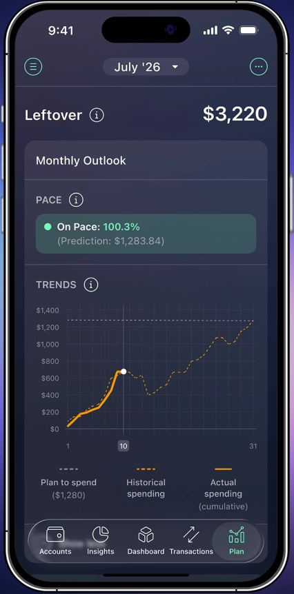
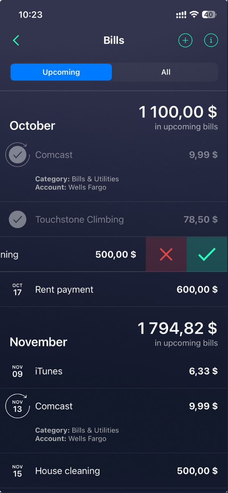
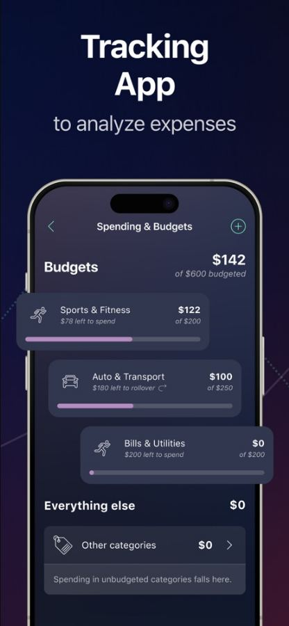
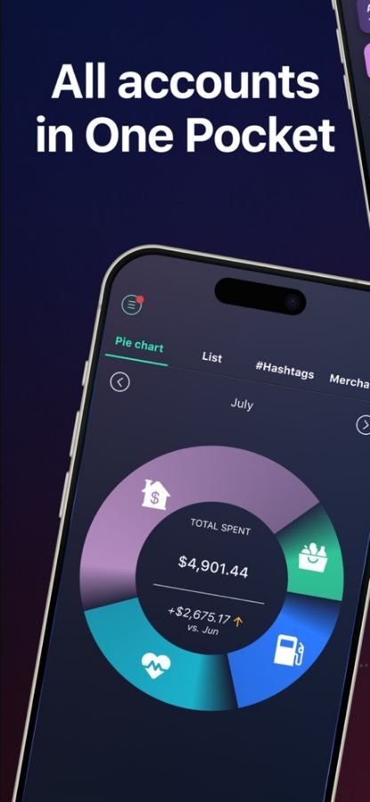
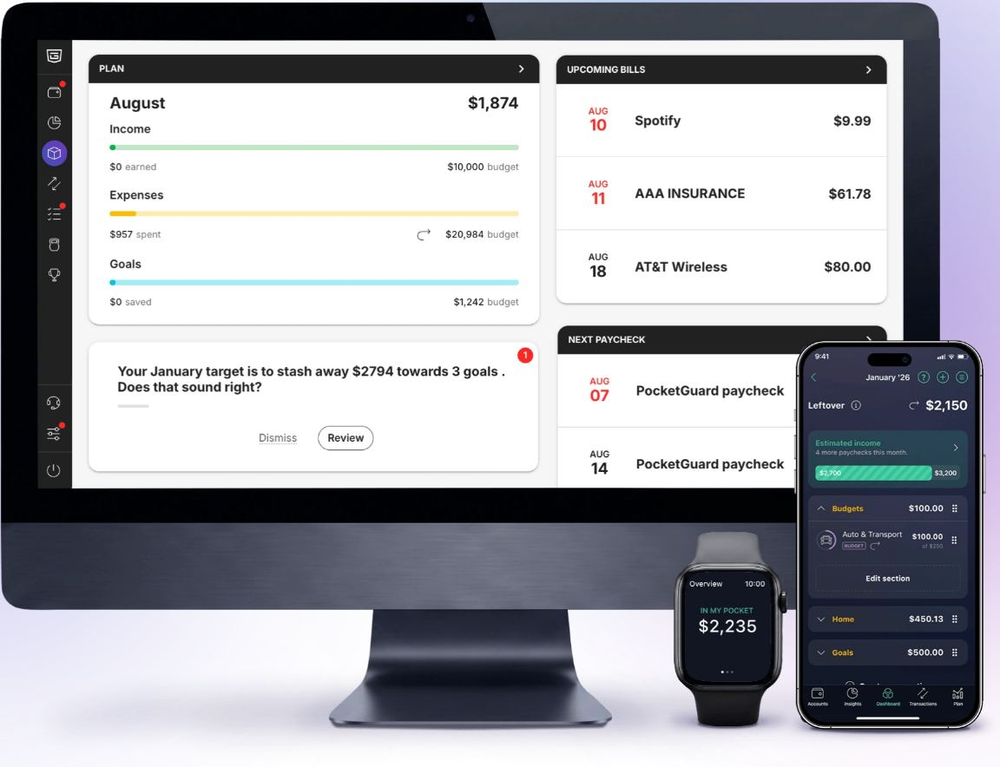

# PocketGuard design

> Summary: PocketGuard's design is a dark navy app organized around one hero number, Leftover, with line icons, date tiles for bills and bright progress bars; CoinKeeper should borrow the hero figure with its explanation directly below it, the Pace status written as words with a colored dot, and budget rows that pair "X of Y" with "Z left to spend", but not the dark theme or its many accent colors.

PocketGuard is in the expressive group because of its bold color and consumer tone, and because its whole interface is built to protect one number: how much you can still spend this month. Its 2026 design is less playful than its reputation suggests: no emoji, no illustrations and no merchant logos in the screens we found, but a dark navy theme with neon accents. It is the clearest example in the research of a "one number first" hierarchy. What PocketGuard does is covered in the [PocketGuard feature study](../../apps/pocketguard.md); this page covers how it looks and reads.

## At a glance

|                  |                                                                                                                                                                                                |
| ---------------- | ---------------------------------------------------------------------------------------------------------------------------------------------------------------------------------------------- |
| Surfaces studied | iOS (help-center stills, App Store images, homepage), web (the homepage's multi-device image)                                                                                                  |
| Tone             | Bold consumer fintech: expressive through a dark theme and bright accents, not through illustration; plain, direct copy                                                                        |
| Color            | Dark navy canvas (about #252942) on mobile; teal green for "on pace" and income, yellow for expenses, cyan for goals, purple for budget bars, amber for section titles; light cards on the web |
| Type             | Clean grotesque (DM Sans on the site, a system-like sans in the app); big bold totals, small caps-style section labels                                                                         |
| Iconography      | Thin line icons for categories and navigation, date tiles instead of logos for bills, outlined tags such as **BILL** and **INCOME** on rows                                                    |
| Best idea for us | Leftover as the first thing on the screen, with the plan that produces it listed underneath in the same order as the formula                                                                   |

## Visual identity

The mobile app is dark: a navy canvas (about #252942, approximate), slightly lighter navy cards (about #2C3144) with a large radius, no borders and white text. Accent colors are assigned to kinds of money rather than to categories: teal green (about #2FD3A0) for income, "on pace" and the active tab, a bright yellow bar for expenses, cyan for goals, purple for budget progress, amber for section titles such as **Regular payments** and **Category Budgets**, and a system blue for the selected segment on the bills screen. Red is kept for overspending. On the web the same content sits on light gray with white cards and black title bars.

Iconography is restrained: thin monoline glyphs for categories (a car, a dumbbell, a receipt), outlined navigation icons, and small outlined tags on rows (**BILL** in yellow, **BUDGET** in purple, **INCOME** in green, **CASH** in gray). Bills do not show company logos in any screen we found; each bill gets a date tile instead, the month abbreviation over the day number, with a circular arrow around it for recurring bills. The store images show accounts as full-color gradient cards (orange to pink for Apple Card, red for other accounts) grouped under the institution's name.

On the scale from formal bank to expressive, PocketGuard sits in the middle: its layout and copy are plain, and its expressiveness comes from the dark theme and the number of bright accents. What that adds: the hero number and the colored bars stand out immediately. What it costs: six accent colors on one screen dilute their meaning, gray secondary text on navy is around 3.7:1 by our estimate (below the 4.5:1 that normal text needs), and the dark mobile app and the light web app look like two different products.

## Navigation and layout

The mobile app has five bottom tabs: **Accounts**, **Insights**, **Dashboard**, **Transactions** and **Plan**, with **Dashboard** in the middle as home. A menu button sits top left, the month switcher ("July '26" with a dropdown) is centered, and help, add and more buttons sit top right. The web app uses a narrow dark icon rail on the left with red notification dots on items that need attention; the page is a two-column grid of cards, each with a black title bar and a chevron to open the full view.

## Home and overview

_Leftover with Pace and trends, PocketGuard homepage. What to notice: the label sits left and the figure right on one line, and the pace is a word and a percentage beside a green dot._

The **Dashboard** tab is home, but the one number lives on the **Plan** tab. Plan opens on **Leftover** and its amount on a single line, label left and figure right, larger than anything else on the screen. Directly below, a **Monthly Outlook** card states the pace in words ("On Pace: 100.3%", with the predicted month total in parentheses) and draws cumulative actual spending against historical spending and a flat dashed line for the plan, with a marker on today's date. The rest of the Plan tab lists what Leftover is made of, in the order of the formula: estimated income as a striped progress bar with "N more paychecks this month", then collapsible amber sections for category budgets, bills, goals and debts, each with its total.

The **Dashboard** tab is a stack of cards: **Plan** (the month's figure with three labeled bars for income earned against estimated, expenses spent against predicted, and goals saved against budgeted), **Upcoming bills** and **Next paychecks**. The Apple Watch shows one figure, "In my pocket".

## Accounts

Accounts are a tab of their own. The store images show them as colored cards grouped under the institution name, with the account's last four digits under its name and the balance on the right, negative for credit cards; the full Accounts screen was not visible in any public image. There is no separate assets and liabilities summary in the screens we found.

## Transactions and categorizing

Transaction rows are dark cards with a line icon, the merchant name, outlined tags underneath (**CASH**, **BILL**, **INCOME**) and the amount on the right, white for spending and green with a plus sign for income. There is no category name on the row; the icon stands for it. No public image shows the category picker, and there is no review queue in the screens we found. The web dashboard shows a coaching card with **Dismiss** and **Review** buttons that asks the user to confirm a suggested target, which is the closest thing to a review flow.

_Bills, PocketGuard help center. What to notice: date tiles replace logos, each month states its total "in upcoming bills", and paid bills are dimmed with a check._

Bills have an **Upcoming** / **All** segmented control, month headers with the month's total "in upcoming bills" right-aligned, and one row per bill with its date tile. A paid bill turns gray with a check mark in place of the tile, an expanded bill shows its category and account, and a swipe reveals red and green buttons to skip or mark it paid.

## Budgets

_Spending and Budgets, PocketGuard on the App Store. What to notice: each row pairs "$122 of $200" on the right with "$78 left to spend" under the name, and unbudgeted spending gets its own "Everything else" row._

The budgets screen opens with a summary on one line, **Budgets** on the left and "$142 of $600 budgeted" on the right. Each budget row has a line icon, the category, "$78 left to spend" in small italics under the name, the amount spent over "of $200" on the right, and a purple bar. A rollover budget says "$180 left to rollover" with a circular arrow. Spending in categories without a budget falls into an **Everything else** section with a one-line explanation, so the total always adds up.

Status is shown three ways: the purple bar, overspending counted in red against Leftover, and the **Pace** card with its green dot and "On Pace" wording. The hero on the budget screen is spent, while the hero on the Plan tab is Leftover, so the two screens lead with opposite figures.

## Reports and analytics

_Insights, PocketGuard on the App Store. What to notice: four tabs split the report into views, and the ring's center compares the month with the previous one._

Insights is organized as tabs across the top: **Pie chart**, **List**, **#Hashtags** and **Merchants**, with the month switcher below. The ring puts white category glyphs inside its segments and "Total spent" in the center with the change against the previous month in a smaller line with an arrow. The Pace trend chart on the Plan tab doubles as the time-based report.

_Web dashboard with the mobile and watch apps, PocketGuard homepage. What to notice: the web uses light cards with black title bars, while the phone stays dark._

## What CoinKeeper could borrow

| Pattern                                                                                                              | Where in CoinKeeper                            | Why it helps                                                                     | Effort |
| -------------------------------------------------------------------------------------------------------------------- | ---------------------------------------------- | -------------------------------------------------------------------------------- | ------ |
| One hero "left to spend this month" line (label left, figure right) at the top, with its ingredients listed below it | Dashboard first card, one line per currency    | Answers "what do I look at first"; the explanation follows in formula order      | M      |
| Pace written as words with a colored dot ("On pace", "Ahead of pace") plus the predicted month total                 | Budgets header and Dashboard budget card       | Status stops relying on color alone and reads differently from the money figures | S      |
| Budget row: "Z left to spend" under the name, "X of Y" on the right                                                  | Budgets category list                          | Separates remaining from spent and total in position and size, not only in label | S      |
| An "Everything else" row for spending in categories without a budget                                                 | Budgets page                                   | The page accounts for all spending, so totals reconcile with Analytics           | S      |
| Date tiles (month over day) and a month total "in upcoming" for scheduled payments; paid ones dimmed with a check    | Dashboard upcoming card, once recurring exists | Dates scan faster than a date column, and the fallback works when no logo exists | S      |
| Outlined type tags on rows (**Transfer**, **Imported**, **Recurring**)                                               | Transactions, Review inbox                     | Adds meaning in one line without a second row, which keeps review rows short     | S      |
| Report views as tabs (by category, list, tags, payees)                                                               | Analytics sub-pages                            | Splits the long Analytics page into focused views with one control               | M      |

## What not to copy

- **The dark navy theme.** The owner wants one light theme, and the mobile and web apps already look like different products.
- **Six accent colors for kinds of money.** Yellow, green, cyan, purple, amber and red on one screen make each color mean less; CoinKeeper needs one brand color plus status colors.
- **Small gray italic subtitles on dark cards.** They carry the most useful figure ("left to spend") at the lowest contrast.
- **Opposite heroes on related screens.** Plan leads with Leftover and Budgets leads with spent; pick one and use it everywhere.
- **Coaching cards with notification dots on the dashboard.** They add the kind of noise the owner already dislikes in CoinKeeper's promotional card.

## Sources

- [PocketGuard homepage](https://pocketguard.com/): Leftover with Pace screenshot and the multi-device image (`pocketguard-leftover-pace.jpg`, `pocketguard-web-dashboard.jpg`); transaction rows, monthly plan and subscriptions cards
- [Help: Bills](https://pocketguard.com/help/bills/): Bills screen and the Dashboard stills (`pocketguard-bills.jpg`)
- [App Store: PocketGuard](https://apps.apple.com/us/app/pocketguard-budget-planner-app/id949414211): budgets, insights, plan and account-card images (`pocketguard-budgets.jpg`, `pocketguard-insights.jpg`)
- [Help: What is Leftover and how it's calculated](https://pocketguard.com/help/leftover/): Plan tab and Plan card stills
- [Help: Category budgets](https://pocketguard.com/help/category-budgets/): budget editing flow
- [PocketGuard Pace product page](https://pocketguard.com/pace/): Pace states and trend chart
