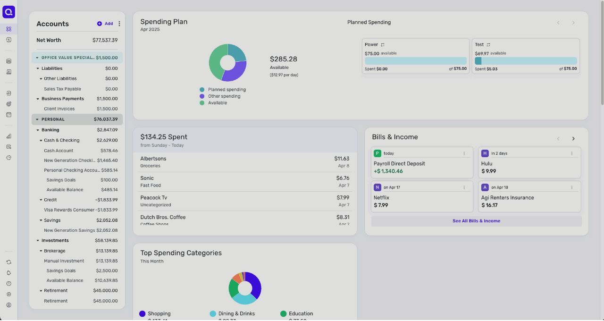
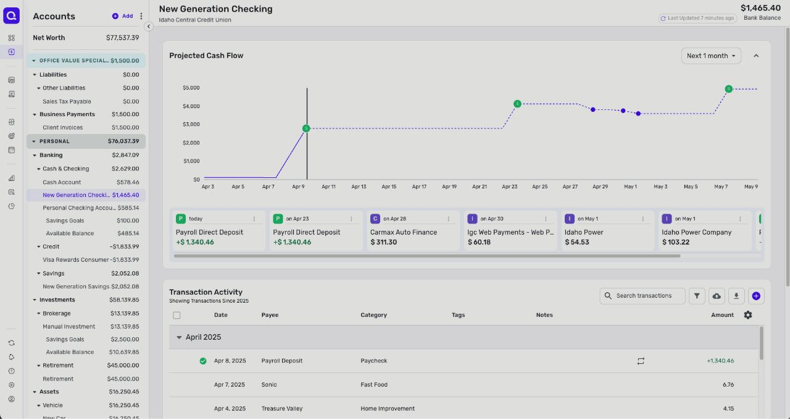
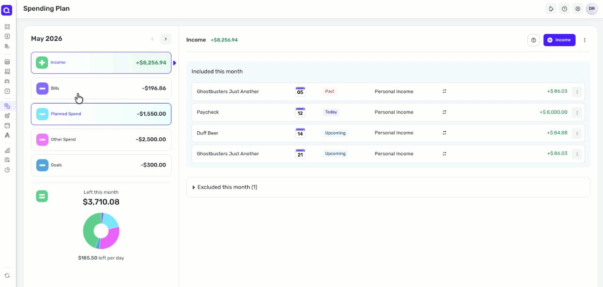
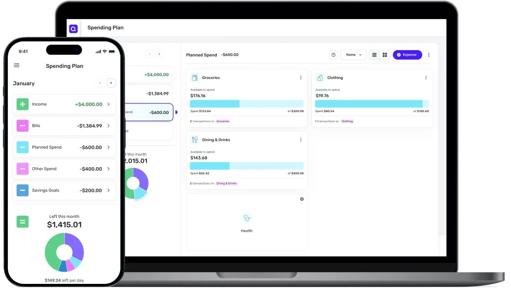
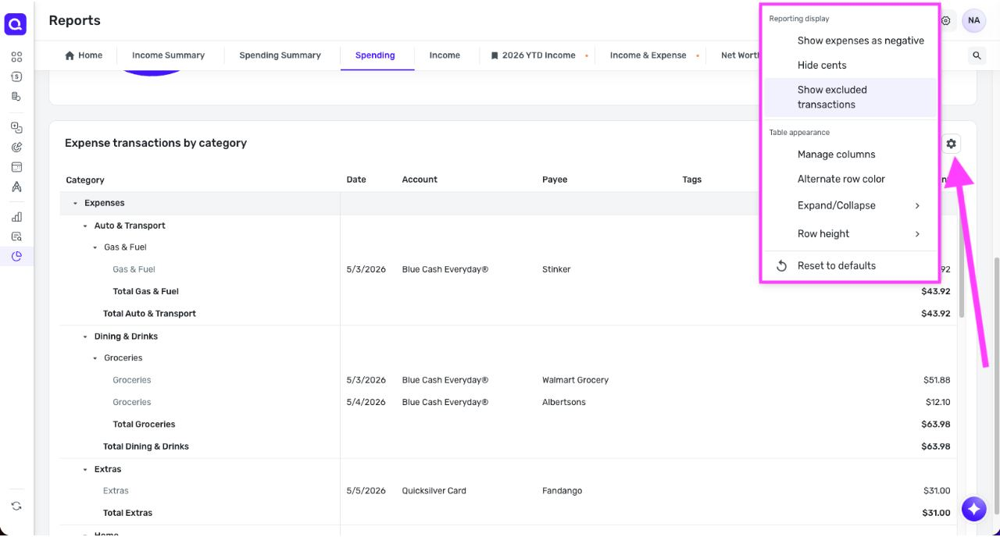

# Quicken Simplifi design

> Summary: Quicken Simplifi's web app is a calm, light fintech layout of rounded white cards on a gray canvas, with an icon rail, a collapsible accounts column and one purple accent; CoinKeeper should borrow the "left this month" hero with a per-day figure, the budget card that leads with "available to spend", and the account page that pairs a projected balance line with upcoming bills.

Simplifi is in the design research because it is the closest of the budgeting apps to the "modern online bank" look the owner wants, while still being built around a budget rather than a bank account. Its web app shows how a desktop layout can keep accounts visible without mixing them into navigation, and how a dashboard of cards can still have one number that comes first. The Spending Plan method and projected balances are described in the [Quicken Simplifi feature study](../../apps/quicken-simplifi.md). Owner issues are numbered O1 to O8 as in the [current UI review](../current-ui-review.md).

## At a glance

|                  |                                                                                                                           |
| ---------------- | ------------------------------------------------------------------------------------------------------------------------- |
| Surfaces studied | Web (primary); iOS shown next to it on the marketing site                                                                 |
| Tone             | Friendly consumer fintech: bank-like structure, a greeting with an emoji, pastel charts; slightly toward expressive       |
| Color            | One purple brand color for actions and selection, green for income, pastel category colors, gray canvas under white cards |
| Type             | Neutral grotesque sans; hero figures large and bold, table amounts regular and right-aligned                              |
| Iconography      | Line icons for categories, colored letter tiles for payees and bills, small 3D-style illustrations in empty states        |
| Best idea for us | One hero figure per plan ("left this month") with its per-day allowance underneath                                        |

## Visual identity

Simplifi uses a light gray canvas, white cards with a radius of about 12 px and a thin border, and almost no shadow. The single saturated color is purple; everything else is either gray text or a pastel data color. The result reads like a bank app that has a sense of humor in its details (a waving-hand greeting, illustrated empty states).

Colors (approximate hex values read from screenshots):

| Role               | Approximate value                          | Where it appears                                                       |
| ------------------ | ------------------------------------------ | ---------------------------------------------------------------------- |
| Brand and actions  | purple `#4b2ee6`                           | Logo tile, primary buttons (**+ Expense**, **+ Income**), selected nav |
| Positive           | green `#2ea865`                            | Income amounts with a plus sign, income bars, positive change          |
| Spending           | violet `#6c4fe3`                           | Spending bars, net worth line                                          |
| Budget progress    | light cyan `#7ee0f4` on pale cyan track    | Planned-spend progress bars                                            |
| Negative           | coral red `#e0604c`                        | "Left this month" when it goes below zero                              |
| Canvas and borders | gray `#f3f4f6`, border `#e5e7eb`           | Page background, card outlines, table rows                             |
| Category colors    | pastel yellow, cyan, lavender, peach, mint | Donuts and bubble charts only                                          |

- **Numbers**: hero figures (net worth, available, left this month) are large and bold; everything else is regular weight. Income carries a plus sign and green; expenses are shown without a minus in tables unless the user switches **Show expenses as negative** on.
- **Iconography**: every category has a line icon in a tinted square; payees and bills get a colored square with their first letter instead of a logo (a Netflix bill shows an "N" tile).
- **Voice**: plain labels (**Available to spend**, **Left this month**, "$185.50 left per day"), with one personal touch in the greeting.

On the scale from formal bank to expressive, Simplifi sits on the bank side of the middle: structured and neutral, with small playful accents.

## Navigation and layout

Navigation is a narrow icon rail on the left that expands into labels on hover. Items are grouped by thin dividers: **Dashboard**, **Transactions**, **Net Worth**; then **Spending Plan**, **Savings Goals**, **Bills & Income**, **Planning Tools**; then **Investments**, **Watchlist**, **Reports**; with **Refresh** at the bottom. The top bar holds the page title on the left and assistant, notifications, help, settings and the avatar on the right.

Accounts never appear in the navigation rail. On the Dashboard and Transactions pages they sit in a second, collapsible column titled **Accounts** with a **+ Add** button, net worth at the top, then nested groups (Banking › Cash & Checking, Credit, Savings; Investments › Brokerage, Retirement; Assets; Liabilities), each with its total. The selected account is highlighted in purple.

_Dashboard, Quicken Simplifi help center (Using projected cash flow). What to notice: accounts are a separate column with group totals, and the first card leads with the amount available and its per-day figure. The frame is dimmed because it comes from an animated help image._

## Home and overview

The dashboard opens with a greeting and a **Customize** button, then a grid of cards. Twelve tiles are available by default: spending plan, net worth, recent transactions, bills and income, top spending categories, savings goals, watchlist, spending by month, income by month, achievements, investments and credit score. The user can reorder, hide and reset them, and every tile opens its full page.

The "one number" is the spending plan's available amount, shown with its daily allowance next to a three-part donut (planned spending, other spending, available). The card beside it answers the next question, "what did I spend recently", with a headline figure ("$134.25 spent from Sunday to today") above the latest transactions. Bills and income come as small cards with a letter tile, a relative date ("today", "in 2 days") and the amount, green with a plus for income.

## Accounts

Account types are told apart by nested grouping with subtotals rather than by icons or colors, and the tree reads like a bank statement: net worth, then assets, then liabilities. Credit cards sit in a **Credit** group with negative balances in plain text; loans sit under **Liabilities**.

_Account page, Quicken Simplifi help center (Using projected cash flow). What to notice: past balance is a solid line and the projection is dotted with a dot per upcoming bill or paycheck, and the same items appear as cards under the chart._

The account page header has the account and institution names on the left and the balance with its label on the right, plus a "last updated" chip. Under it, the projected cash flow chart has a period selector (next month by default), and a scrolling row of reminder cards lists what the dots stand for. Transactions follow, grouped under month headings.

## Transactions and categorizing

The transactions table has columns for account (shown as the card name with its last four digits), date, status (a **Pending** chip), payee, category and amount, with search, export and add buttons above it. Rows are one line with generous height and spacing, and carry no icons or logos.

- The category cell opens a dropdown list that can also be typed into, and the user can create a new category from it; bulk recategorizing uses an **Edit category** button above the selection.
- Above the table, the **Other Spend** view draws categories as pastel bubbles sized by amount with a percentage, a friendlier alternative to a bar chart for a short list.
- Review is light: there is no separate inbox, and a row's state is a small mark at its start (a green check) or a chip (**Pending**), so it adds no height.

## Budgets

The Spending Plan page has two panes. The left pane lists the month's flows as tappable rows, each with a colored square icon showing its sign: **Income** (plus, green), **Bills**, **Planned Spend**, **Other Spend** and **Goals** (minus, in purple, cyan, pink and blue). Below them, an equals icon introduces **Left this month** in large type, a donut and the daily figure. When the result is negative the equals icon and the donut turn coral red.

_Spending Plan, Quicken Simplifi help center (Understanding your spending plan). What to notice: the page reads as a sum (plus, minus, equals) that ends in one hero figure with a per-day allowance._

The right pane shows the selected flow. Planned spending uses one card per category, and each card puts the remaining amount first:

_Planned spend, Quicken Simplifi product page. What to notice: "Available to spend" is the large figure, the bar shows the share spent, and "spent of budget" sits small underneath with a link to the category's transactions._

- Hierarchy inside a budget card: category icon and name, then the label **Available to spend** with the amount, then a progress bar, then "spent X of Y" in small type, then the number of transactions as a link.
- Bills and income rows carry a calendar date badge and a status chip (**Past**, **Today**, **Upcoming**); items excluded this month fold into a collapsed section.
- There is no pace marker on the bars; the daily allowance on the hero does the pacing job.

## Reports and analytics

Reports open on a home page of report tiles with a panel of saved reports on the right. Each report opened becomes a closable tab in a strip across the top (the **Home** tab stays), and saved reports carry a bookmark icon in their tab. The report types are spending, spending summary, income, income summary, income and expense, net worth, taxes, savings and a monthly summary.

_Spending report, Quicken Simplifi help center (Using reports). What to notice: open reports are tabs, and the table groups transactions under category and subcategory totals with display options behind a gear._

- Spending and income reports break down by category, account, tag or payee, and switch between a summary chart and a transactions view, so the drill-down stays on the same page.
- A date range control and **Filters** sit above every report; dynamic ranges keep saved reports current.
- Display options (hide cents, row height, alternate row colors, show expenses as negative) sit behind a gear rather than on the page.

## What CoinKeeper could borrow

| Pattern                                                                                         | Where in CoinKeeper        | Why it helps                                                                                          | Effort |
| ----------------------------------------------------------------------------------------------- | -------------------------- | ----------------------------------------------------------------------------------------------------- | ------ |
| One hero figure per currency ("left this month") with the daily allowance under it              | Dashboard, Budgets         | Gives the dashboard a first thing to read and replaces the look-alike budget summary; fixes O1 and O5 | Small  |
| Budget card order: name, "available" figure large, bar, "spent X of Y" small, transactions link | Budgets                    | Makes Remaining the hero and demotes the other figures by size, not only by color                     | Small  |
| Accounts as their own collapsible column or page section with nested groups and subtotals       | Sidebar, Accounts          | Keeps accounts out of the navigation rail and shows cash, savings and credit apart; fixes O6 and O7   | Medium |
| Icon rail grouped by dividers (daily use, planning, analysis)                                   | Sidebar                    | Shorter, calmer navigation that leaves room for content                                               | Medium |
| Colored letter tile when no logo is known                                                       | Transactions, Review inbox | A consistent fallback for the merchant-logo idea the owner liked in Rocket Money                      | Small  |
| Account page with a balance line and upcoming items as cards under it                           | Accounts                   | Turns the bland account view into "where this account is heading"                                     | Large  |
| Report tabs with a report home of tiles and saved reports                                       | Analytics                  | A concrete model for Analytics sub-pages; fixes O4                                                    | Medium |

## What not to copy

- Twelve dashboard tiles by default: that is the same overload as O1; start with three or four and let the user add more.
- Expenses shown without a minus sign by default: CoinKeeper stores signed amounts and should show the sign.
- Animated, hover-to-expand navigation: labels that appear only on hover hurt discoverability and keyboard use; keep labels visible on desktop.
- Pastel bubble charts as the main spending view: fun for five categories, unreadable for twenty.
- Credit score, investments and tax tiles: region-specific or sync-dependent, and outside CoinKeeper's scope.

## Sources

- [Quicken Simplifi product page](https://www.quicken.com/products/simplifi): source of the planned spend screenshot.
- [Getting to know your dashboard](https://support.simplifi.quicken.com/en/articles/3357180-getting-to-know-your-dashboard): default tiles and customization.
- [Getting started in Quicken Simplifi](https://support.simplifi.quicken.com/en/articles/4284318-getting-started-in-quicken-simplifi): navigation rail and menu groups.
- [Using projected cash flow](https://support.simplifi.quicken.com/en/articles/3357429-using-projected-cash-flow): source of the dashboard and account page screenshots.
- [Understanding your spending plan](https://support.simplifi.quicken.com/en/articles/4212702-understanding-your-spending-plan): source of the spending plan screenshot.
- [Using reports in Quicken Simplifi](https://support.simplifi.quicken.com/en/articles/4592676-using-reports-in-quicken-simplifi): source of the reports screenshot; report types, tabs and options.
- [How to recategorize a transaction](https://support.simplifi.quicken.com/en/articles/3348227-how-to-recategorize-a-transaction): category dropdown and bulk edit.
