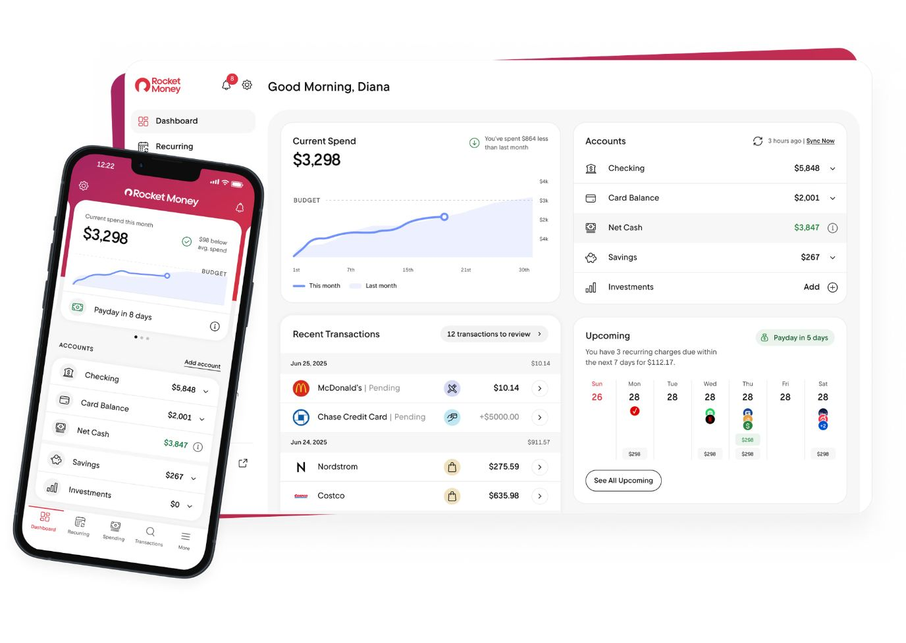
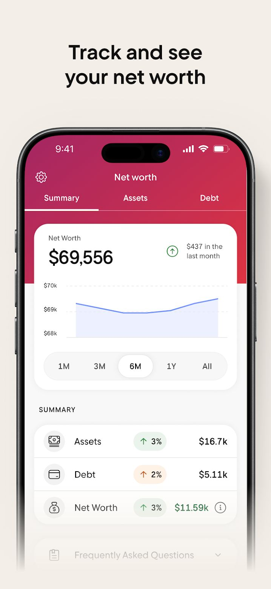
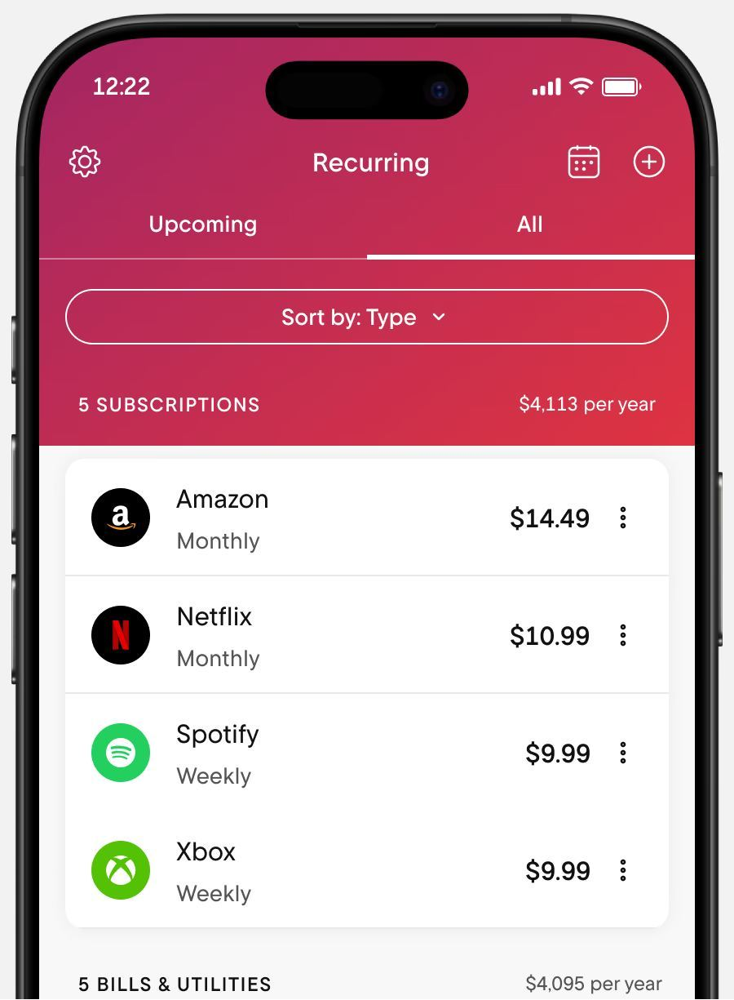
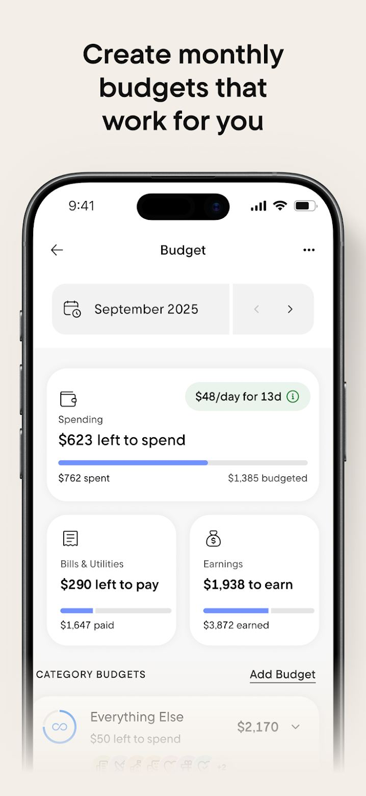
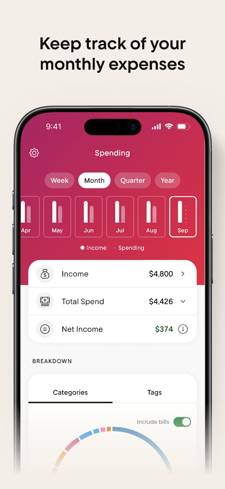

# Rocket Money design

> Summary: Rocket Money is a friendly consumer app with a raspberry-red brand, white cards and company logos on every subscription and transaction; CoinKeeper should borrow its logo or monogram avatars on payee rows, its sentence-style hero figures such as "left to spend", and its change chips that color debt growth as a warning.

Rocket Money is in the design research because the owner likes how it shows Netflix, Spotify and other company logos next to subscriptions and transactions. It also writes its key numbers as short sentences, which is a direct answer to CoinKeeper's Budgets page, where every figure looks alike. The features are covered in the [Rocket Money feature study](../../apps/rocket-money.md); this page looks only at design and hierarchy.

## At a glance

|                  |                                                                                                                                                  |
| ---------------- | ------------------------------------------------------------------------------------------------------------------------------------------------ |
| Surfaces studied | iOS and Android (store screenshots and the marketing site), web dashboard (one official product shot; the web app is Premium only)               |
| Tone             | Friendly consumer app, midway between bank and expressive: plain-language numbers and logos, but no emoji and no illustration inside the product |
| Color            | Raspberry-to-red gradient for brand headers; periwinkle blue for charts and budget bars; green for good news; orange for debt growth             |
| Type             | A rounded grotesque (the site loads Rocket Sans); hero amounts large and regular weight rather than bold                                         |
| Iconography      | Company logos in circles for merchants and subscriptions, a letter monogram when no logo exists, gray outline icons in circles for account types |
| Best idea for us | Every payee row starts with a round logo or a letter monogram, so a list of transactions reads as a list of companies                            |

## Visual identity

The mobile app puts a raspberry-to-red gradient (approximately `#B42A5B` to `#D93245`) behind the top of every tab: the title, the tab switcher and the first card overlap it. Everything below is white cards on a pale gray canvas with a large radius (about 16 px) and no visible borders. The web dashboard drops the gradient: white page, white cards on a pale gray band, and red only in the logo and the notification badge.

Color roles:

- **Brand**: the raspberry-red gradient and the red logo. Because red is the brand, Rocket Money does not use red for overspend or losses.
- **Data**: a periwinkle blue line (approximately `#6F86F0`) over a lavender fill (approximately `#EDF0FF`) for spending charts, and the same blue for budget progress bars. A dashed gray line marks the budget.
- **Positive**: green text and green-tinted chips (approximately `#E9F3EB`) for income, net cash, net income and asset growth; a green check in a circle for "below average spend".
- **Warning**: an orange-tinted chip (approximately `#FBF5E5`) with an orange arrow for debt that went up.

Typography is one rounded sans. Hero figures such as **$3,298** or **$11,592** are the largest text on the screen but set in regular weight; labels above them are small gray text. Section labels in lists are small caps with wide letter spacing (**5 SUBSCRIPTIONS**, **ACCOUNTS**, **SUMMARY**).

Iconography has two families. Companies get their own logo in a 40 px circle: Amazon on black, Netflix on black, Spotify on green, Xbox on green, Dropbox on blue. When there is no logo, the row shows the first letter on a black circle (**R** for Rent). Account types and summary rows use gray outline icons inside light gray circles (a bank building for Checking, a card for Card Balance, a note for Net Cash, a piggy bank for Savings, a bar chart for Investments). On the web dashboard, the category of a transaction is a small outline icon on a pastel rounded square. The logos appear to come with the merchant data from its bank sync; the help center does not describe the source.

The tone is warm and direct: numbers are written as phrases (**$623 left to spend**, **$290 left to pay**, **Payday in 8 days**), and summaries are full sentences with the key figure in bold.

## Navigation and layout

On mobile, a bottom tab bar holds **Dashboard**, **Recurring**, **Spending**, **Transactions** and **More**. Each tab has the same header: settings gear on the left, the title centered, one action on the right (bell, calendar or plus), and optional segmented tabs below (**Upcoming** and **All**; **Summary**, **Assets** and **Debt**).

In the web product shot, a left sidebar has the logo, notification bell and settings at the top, then **Dashboard**, **Recurring** and the other sections. Accounts are not listed in the sidebar; they are a card on the dashboard. The page header is a greeting (**Good Morning, Diana**) rather than a page title.

## Home and overview

_Web dashboard and mobile dashboard, Rocket Money compare page. What to notice: merchant logos on every transaction and on the upcoming calendar, and one derived line, Net Cash, highlighted in green inside the Accounts card._

The web dashboard is a two-by-two grid:

1. **Current Spend**: the month's spending as the hero (**$3,298**), a green note that you spent less than last month, and a line chart of this month against last month with a dashed budget line.
2. **Accounts**: one row per account type (**Checking**, **Card Balance**, **Net Cash**, **Savings**, **Investments**) with an icon, a total and a chevron that expands the type into its accounts. Net Cash, checking minus card debt, is the only green figure.
3. **Recent Transactions**: date headers with the day's total, rows with logo, merchant name, a gray **Pending** tag, category icon, amount and chevron, and a **12 transactions to review** pill in the card header.
4. **Upcoming**: a sentence (three recurring charges due in the next seven days and their total), a **Payday in 5 days** chip, and a week strip where each day shows the logos of what is due.

The mobile dashboard stacks the same content: current spend with the budget line, **Payday in 8 days**, then accounts. The one number is current spend against budget.

## Accounts

_Net Worth tab, Google Play listing. What to notice: the Debt change chip is orange even though it points up, so color follows meaning rather than direction._

Account types are told apart by grouping and by a gray icon per type, not by color: the dashboard lists types, and each expands to its institutions. Credit cards are summed as **Card Balance**, shown as a positive amount in the Accounts card and subtracted in **Net Cash**.

The Net Worth tab has three tabs (**Summary**, **Assets**, **Debt**). The Summary card shows net worth as the hero, the change over the last month beside a green up-arrow circle, a blue area chart and a period switcher (**1M**, **3M**, **6M**, **1Y**, **All**). Under **SUMMARY**, three rows show Assets, Debt and Net Worth, each with an icon, a change chip and the amount. Asset growth is a green chip; debt growth is an orange chip; the net worth amount is green.

## Transactions and categorizing

_Recurring tab, Rocket Money subscriptions feature page. What to notice: logo, name, frequency and amount on two short lines, and a group header that states the yearly cost of all subscriptions._

The recurring list is the clearest example of the row anatomy Rocket Money uses everywhere: a 40 px logo, the company name with a gray second line (the frequency here, the category or **Pending** elsewhere), the amount right-aligned, and a kebab menu. Group headers are small caps with the count on the left and an annualized total on the right (**$4,113 per year**), which turns small monthly charges into a figure people notice. The **Upcoming** view adds a month calendar and splits the list into **Coming up** and **Coming later**, each row with a relative date (**Today**, **in 6 days**).

Categories each have a name, an icon and a color, chosen when you create a custom category, and belong to one of three groups: expenses, earnings or ignored. The transaction detail shows the category under the description, and tapping it opens the category list.

Review is a separate mobile flow: **Category Review** shows the ten most recent transactions one at a time as cards with name, amount and the assigned category. Swiping right accepts it; swiping left opens the category list. On the web dashboard, a count pill in the Recent Transactions header links to the transactions that need review.

## Budgets

_Budget screen, Google Play listing. What to notice: each hero figure is a phrase that says what the number means, and the supporting numbers sit small under the bar._

The Budget screen separates three questions into three cards, each answered by a phrase:

- **Spending**: **$623 left to spend** as the hero, a blue bar, **$762 spent** under its left end and **$1,385 budgeted** under its right end, and a green pill with the daily allowance (**$48/day for 13d**).
- **Bills & Utilities**: **$290 left to pay**, with the amount already paid under the bar.
- **Earnings**: **$1,938 to earn**, with the amount already earned under the bar.

**CATEGORY BUDGETS** follows as a list with a ring per category, the category name, the phrase **$50 left to spend** in gray and the amount on the right. The hero is always what is left, never the budget. The budget excludes bills, so "left to spend" means after bills.

## Reports and analytics

_Spending tab, Google Play listing. What to notice: the period switcher and the month picker are one control, and the summary ends with a sentence that interprets the numbers._

Reports are one **Spending** tab rather than a report section. Segmented pills choose the period length (**Week**, **Month**, **Quarter**, **Year**), and a row of small paired bars, one per period, doubles as the period picker: the selected period is outlined. Below, three rows give **Income**, **Total Spend** (expandable) and **Net Income** in green, followed by a sentence such as **That's 22% left for savings & debt**. **BREAKDOWN** switches between **Categories** and **Tags** and draws a half donut, with an **Include bills** toggle. The Income row has a chevron to its detail, and Total Spend expands in place.

## What CoinKeeper could borrow

| Pattern                                                                                                                                                                            | Where in CoinKeeper                                                                         | Why it helps                                                                                                   | Effort |
| ---------------------------------------------------------------------------------------------------------------------------------------------------------------------------------- | ------------------------------------------------------------------------------------------- | -------------------------------------------------------------------------------------------------------------- | ------ |
| A round avatar at the start of every payee row: a bundled logo for common merchants, otherwise a letter monogram on a color derived from the payee name, with no third-party calls | Transaction table, review inbox, dashboard recent activity, payee settings (`payee-picker`) | Lists read as companies at a glance; the owner's favorite detail in Rocket Money, adapted to a self-hosted app | M      |
| Hero figures written as phrases (**€623 left to spend**, **€290 left to pay**) with spent and budgeted small under the bar, plus a per-day pill                                    | Budgets page (`budget-overview`, `budget-card`), dashboard                                  | Each number says what it means, so Total, Spent, Remaining and Left per day stop looking alike                 | S      |
| Change chips colored by meaning: assets up green, debt up orange, with the arrow still showing direction                                                                           | Accounts summary, net worth card (`net-worth-cards`)                                        | Prevents a rising credit card balance from looking like good news                                              | S      |
| A derived **Net cash** line (cash and checking minus card debt) in the accounts summary, per currency                                                                              | Dashboard, Accounts page                                                                    | Answers "what can I spend right now" without the user doing the subtraction                                    | S      |
| Group headers that annualize recurring costs (**5 subscriptions, €412 per year**)                                                                                                  | A future recurring or upcoming view                                                         | Makes small monthly charges visible                                                                            | S      |
| A week strip with the logos of what is due on each day                                                                                                                             | Dashboard upcoming card                                                                     | Shows cash-tight days without reading a list                                                                   | M      |

## What not to copy

- **A brand gradient behind every screen header**: it is heavy for a calm, bank-like light theme, and a red brand uses up the color CoinKeeper needs for overspend.
- **Swipe-card review on the web**: one card at a time is slower than a compact list with keyboard shortcuts; keep CoinKeeper's review inbox as a list.
- **Logos fetched from a bank-data or logo provider**: CoinKeeper has no sync partner and should not leak payee names to a third party; bundle a small logo set or use monograms.
- **Upsell surfaces inside the product** (QR download cards, cancellation offers, Premium gates on the web): they add noise to the dashboard the owner already finds crowded.
- **Card Balance shown as a positive amount**: CoinKeeper should label card debt as owed, as the [current UI review](../current-ui-review.md) already recommends.

## Sources

- [Rocket Money: compare with Monarch Money](https://www.rocketmoney.com/compare/monarch-money) (web dashboard product shot)
- [Rocket Money: manage subscriptions feature page](https://www.rocketmoney.com/feature/manage-subscriptions) (Recurring screenshot)
- [Rocket Money: create a budget feature page](https://www.rocketmoney.com/feature/create-a-budget)
- [Rocket Money: spending insights feature page](https://www.rocketmoney.com/feature/spending-insights)
- [Rocket Money: net worth feature page](https://www.rocketmoney.com/feature/net-worth)
- [Rocket Money on Google Play](https://play.google.com/store/apps/details?id=com.truebill) (budget, spending and net worth screenshots)
- [Rocket Money Help: Transaction Category Review](https://help.rocketmoney.com/en/articles/13778317-transaction-category-review)
- [Rocket Money Help: Editing and creating transaction categories](https://help.rocketmoney.com/en/articles/3332081-editing-and-creating-transaction-categories)
- [Rocket Money Help: Creating a Budget](https://help.rocketmoney.com/en/articles/2649810-creating-a-budget)
- [Rocket Money Help: Rocket Money for desktop](https://help.rocketmoney.com/en/articles/12166750-rocket-money-for-desktop)
- [Rocket Money: home page](https://www.rocketmoney.com/) (fonts loaded by the site)
