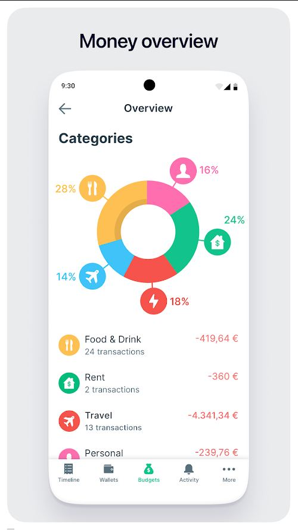
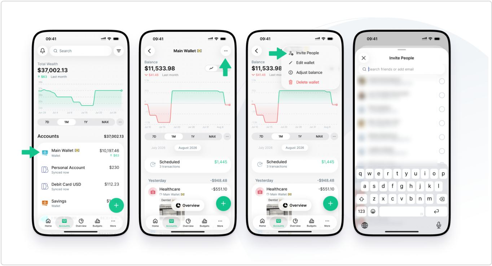
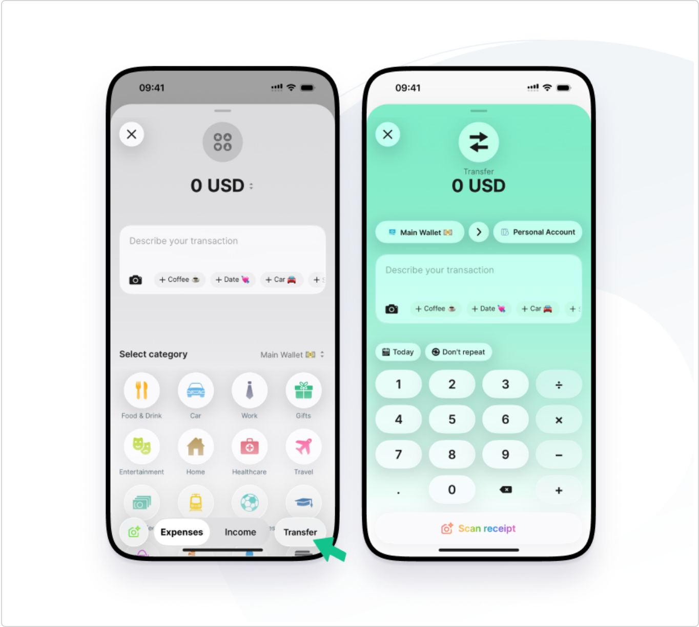
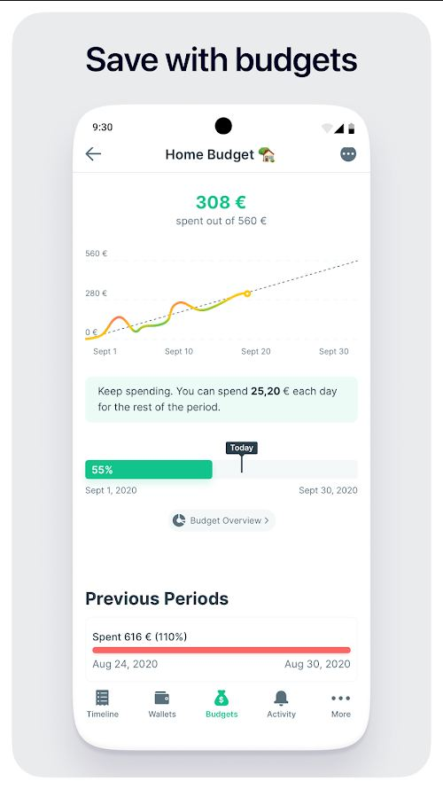
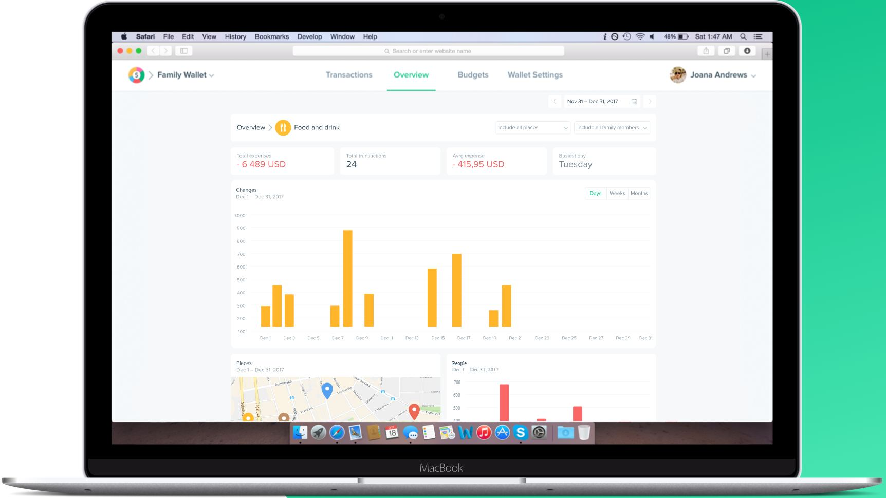

# Spendee design

> Summary: Spendee's design pairs its own bright color for each category with colorful glyph icons, green as the brand and "on track" color, and card-based wallets; CoinKeeper should borrow its budget screen (spending line against an ideal-pace line, a Today marker and a per-day sentence), account rows with a type subtitle and a monthly change, and category colors that carry through from chart to drill-down.

Spendee is one of the four expressive apps in the research. It won a mobile UX award early on and has always sold itself on colorful charts, and in September 2026 it shipped Spendee 6, a redesign that keeps the colorful category icons but moves the rest of the interface toward a neutral, iOS-like look. Seeing both versions shows which expressive parts survived a redesign. What Spendee does is covered in the [Spendee feature study](../../apps/spendee.md); this page covers how it looks and reads.

## At a glance

|                  |                                                                                                                                                            |
| ---------------- | ---------------------------------------------------------------------------------------------------------------------------------------------------------- |
| Surfaces studied | iOS and Android (Spendee 6 help-center images, older Google Play images), web (an older marketing image of the web app)                                    |
| Tone             | Expressive: bright category colors and glyphs, emoji in wallet and label names, jokey insight cards; Spendee 6 calms the chrome around them                |
| Color            | Green (about #13C38C) for brand, the add button, positive change and "on track"; one bright hue per category; red (about #F5534C) for every expense amount |
| Type             | Plain humanist or grotesque sans (Open Sans on the site; Spendee 6 looks like Inter); large amounts with the currency after the number in European formats |
| Iconography      | Multi-colored category glyphs on white or colored circles, bank and wallet logos on account rows, emoji inside wallet and label names                      |
| Best idea for us | The budget detail: spent against an ideal-pace line, a Today flag on the progress bar, and "you can spend 25,20 € each day" as a sentence                  |

## Visual identity

Spendee's signature is the category palette. Each category owns a saturated hue that it repeats in the overview ring, on its icon circle and, on the web, on the bars of its drill-down chart. The approximate values from the store images are yellow #FDC153 (Food & Drink), green #13C38C (Rent), pink #FE6DAE (Personal), red #F5534C and sky blue #41C3FA. The same store image draws Travel in blue on the ring and in red in the list below it, which shows how quickly a large palette drifts. Green doubles as the brand color and the "good" state: the floating add button, positive changes, the **Today** budget bar and the transfer sheet. Every expense amount is red, so a list of normal spending looks alarming, and the same red marks an overspent budget.

The older app used white glyphs on solid colored circles. Spendee 6 flips this to multi-colored illustrative glyphs (a yellow fork and knife, a blue car, a green gift, theater masks) on white circles with a soft shadow, on a very light gray background (about #F4F4F5) with white rounded cards and a floating pill-shaped tab bar. Wallet and label names can carry emoji ("Main Wallet" with a banknote, "Alcohol" with a wine glass), and account rows show the bank or service logo (Coinbase, Revolut) or a wallet glyph.

The tone is playful: insight cards say **Good job!** and compare yearly food spending to a number of chicken nuggets, and Premium is "unlocked with Spiggy". On the scale from formal bank to expressive, the older Spendee sits near the expressive end; Spendee 6 moves toward the middle, with the expressiveness concentrated in category icons and emoji. What it adds: categories are recognizable by color and shape at a glance, which makes the overview ring and lists fast to scan. What it costs: five or more saturated hues plus red and green states compete on one screen, and the green and red text sits around 2.3:1 and 3.4:1 on white by our estimate, below the 4.5:1 that normal text needs.

## Navigation and layout

The mobile app uses a bottom tab bar. The older app had **Timeline**, **Wallets**, **Budgets**, **Activity** and **More**; Spendee 6 has **Home**, **Accounts**, **Overview**, **Budgets** and **More**, plus a green floating add button. Settings, categories, labels, wallets, bank accounts and scheduled transactions live in grouped lists under **More**.

The older web app (from the marketing site) put a wallet switcher at the top left (logo, then "Family Wallet" with a dropdown), four centered tabs (**Transactions**, **Overview**, **Budgets**, **Wallet Settings**) with a green underline for the active one, and the user menu at the top right. The period switcher (arrows and a date range) sits right-aligned under the header. The marketing image is older than the current web app, and the feature study notes that budgets are not yet available on the web.

## Home and overview

_Overview, Spendee on Google Play (pre-6 design). What to notice: each ring segment carries its category icon and percentage in the category's own color._

The overview answers "where did the money go" first: a **Categories** ring whose segments carry a callout bubble with the category icon and its share, then a list of categories with icon, name, transaction count and a red amount. Filters for wallets and grouping ("All Wallets", "By months") and a month strip sit above. The Activity tab adds insight cards in solid green and orange. There is no single safe-to-spend figure on the home or overview screens.

## Accounts

_Accounts and wallet detail, Spendee help center (Spendee 6). What to notice: each account row shows a type subtitle and a monthly change under the balance; the wallet chart turns red below zero._

Spendee 6 opens Accounts on **Total Wealth** with the change since last month in green ("↑ $63 Last month"), an area chart and a **7D** / **1M** / **1Y** / **MAX** segmented control. The **Accounts** list has the grand total in its header. Each row is an icon (a bank glyph or a colored wallet glyph), the name with an optional emoji, a muted subtitle for the type or sync state ("Wallet", "Synced now") and, on the right, the balance over its change. A wallet's detail repeats the pattern, with the chart area green above zero and red below it, a **Scheduled** card with the upcoming total, and transactions grouped by day with a day total.

The older wallet list used one card per wallet: the service logo (Coinbase, Revolut) or a brown wallet glyph, the balance in the wallet's currency with its converted value in gray beside it, member avatars on shared wallets, and a red warning line when a bank connection expired. Neither version separates assets from liabilities or gives credit cards their own treatment.

## Transactions and categorizing

_Add transaction and transfer, Spendee help center (Spendee 6). What to notice: label suggestions appear as chips with emoji under the description, and transfer mode tints the whole sheet green._

Transaction rows are compact: category icon, category or note as the title, the wallet name with a small wallet glyph as the subtitle, and the amount in red on the right, with a converted amount under it when the currency differs. Days are group headers with a day total.

Spendee 6 adds a transaction in one sheet: the amount with a currency switcher at the top, a description field with suggested labels as chips ("+ Coffee" with a coffee emoji), then **Select category** as a four-column grid of colorful icons with the wallet picker beside the heading, and an **Expenses** / **Income** / **Transfer** segmented control at the bottom. Transfer mode tints the sheet mint green and replaces the grid with from-and-to wallet chips and a keypad with arithmetic keys. The category grid has no search; the earlier app used the same grid in a separate **Transaction Category** screen. The screens we found show no review queue for uncategorized transactions.

## Budgets

_Budget detail, Spendee on Google Play. What to notice: spent is compared to a dashed ideal-pace line, the per-day figure is a full sentence, and a Today flag sits on the progress bar._

The budget detail stacks four readings of the same budget, from summary to history:

1. The hero is **spent**, in green, with "spent out of 560 €" underneath. Green here means "fine so far", not "left", which is easy to misread.
2. A cumulative spending line runs against a dashed diagonal from zero to the limit, so ahead or behind pace is visible without arithmetic; the line changes color along its length.
3. A mint box says what to do in plain words: keep spending, you can spend a set amount each day for the rest of the period.
4. A progress bar shows the percentage used with a dark **Today** flag at the share of the period that has passed, followed by **Previous Periods** with their result ("Spent 616 € (110%)" on a red bar).

Budget names can carry an emoji ("Home Budget" with a house). Alerts fire at 75% and 90% of the limit.

## Reports and analytics

_Overview drill-down, Spendee web app on the Spendee homepage (older version). What to notice: a breadcrumb from Overview to one category, four KPI tiles, and a chart drawn in the category's color._

Reports live under **Overview**. On the web, choosing a category opens a drill-down with a breadcrumb ("Overview", then the category with its icon), filters for places and family members, four KPI tiles (**Total expenses**, **Total transactions**, **Avrg expense**, **Busiest day**) and a daily bar chart with **Days**, **Weeks** and **Months** toggles, drawn in the category's yellow. Places (a map) and People (spending per shared-wallet member) follow as cards. On mobile the overview is one scrolling screen per period with the ring and list; the Spendee 6 scheduled screen adds a month calendar with the net amount due on each day.

## What CoinKeeper could borrow

| Pattern                                                                                                    | Where in CoinKeeper                          | Why it helps                                                                                        | Effort |
| ---------------------------------------------------------------------------------------------------------- | -------------------------------------------- | --------------------------------------------------------------------------------------------------- | ------ |
| Cumulative spending line against a dashed ideal-pace line, with a Today marker on the progress bar         | Budgets detail and the Dashboard budget card | Shows ahead or behind pace without reading four figures                                             | M      |
| Per-day allowance written as a sentence in a tinted box                                                    | Budgets header                               | Takes "left per day" out of the row of look-alike figures and makes it an instruction               | S      |
| Account row with a type subtitle ("Wallet", "Credit card") and the monthly change under the balance        | Accounts page                                | Tells account types apart in words and adds the change over time the owner liked in Monarch         | S      |
| Section total in the list header and change vs last month under the page total, with a 1M / 1Y / All range | Accounts page header, per currency           | One headline figure per currency with its trend, before the detail                                  | M      |
| A category drill-down with a breadcrumb, four KPI tiles and a chart in the category group's color          | Analytics "By category" sub-page             | Gives Analytics sub-pages a repeatable layout and ties color to the category the user already knows | M      |
| Suggested chips (recent labels or categories) directly under the description field                         | Transaction form, Review inbox               | One tap for the likely category without opening a picker                                            | M      |

## What not to copy

- **Red for every expense.** Normal spending should be neutral; keep red for over budget and negative balances.
- **A green "spent" hero.** Green on the spent figure reads as money left; the hero should be what is left, and green should mean on track.
- **Five saturated category hues plus red and green states on one screen.** CoinKeeper's group colors should stay as small markers (a dot or an icon tint), not fill charts and text.
- **The icon grid category picker without search.** It repeats the problem the owner already has with CoinKeeper's modal grid.
- **Emoji in wallet and budget names and jokey insight cards.** They render differently per platform and undercut the calm, bank-like tone the owner asked for.

## Sources

- [Help: Shared wallets](https://help.spendee.com/article/224-shared-wallets): Spendee 6 Accounts and wallet detail (`spendee-accounts.jpg`)
- [Help: Transfers](https://help.spendee.com/article/234-transfers): Spendee 6 add-transaction and transfer sheet (`spendee-add-transaction.jpg`)
- [Google Play: Spendee](https://play.google.com/store/apps/details?id=com.cleevio.spendee): Overview and budget detail images (`spendee-overview.jpg`, `spendee-budget.jpg`)
- [Spendee homepage](https://www.spendee.com/): web app image (`spendee-web-overview.jpg`)
- [App Store: Spendee](https://apps.apple.com/us/app/expense-budget-app-spendee/id635861140): older category picker, wallet cards and insight cards
- [Help: Scheduled transactions](https://help.spendee.com/article/229-scheduled-transactions): Spendee 6 calendar of scheduled payments
- [Help: Labels](https://help.spendee.com/article/237-what-are-labels-and-how-to-use-them): labels with emoji and the Spendee 6 More menu
- [Help: How to set or change the currency and exchange rate](https://help.spendee.com/article/231-how-to-setchange-the-currency-and-exchange-rate): currency switcher in the add sheet
- [Help: Budgets](https://help.spendee.com/article/131-budget-my-money): alert thresholds and the daily allowance
