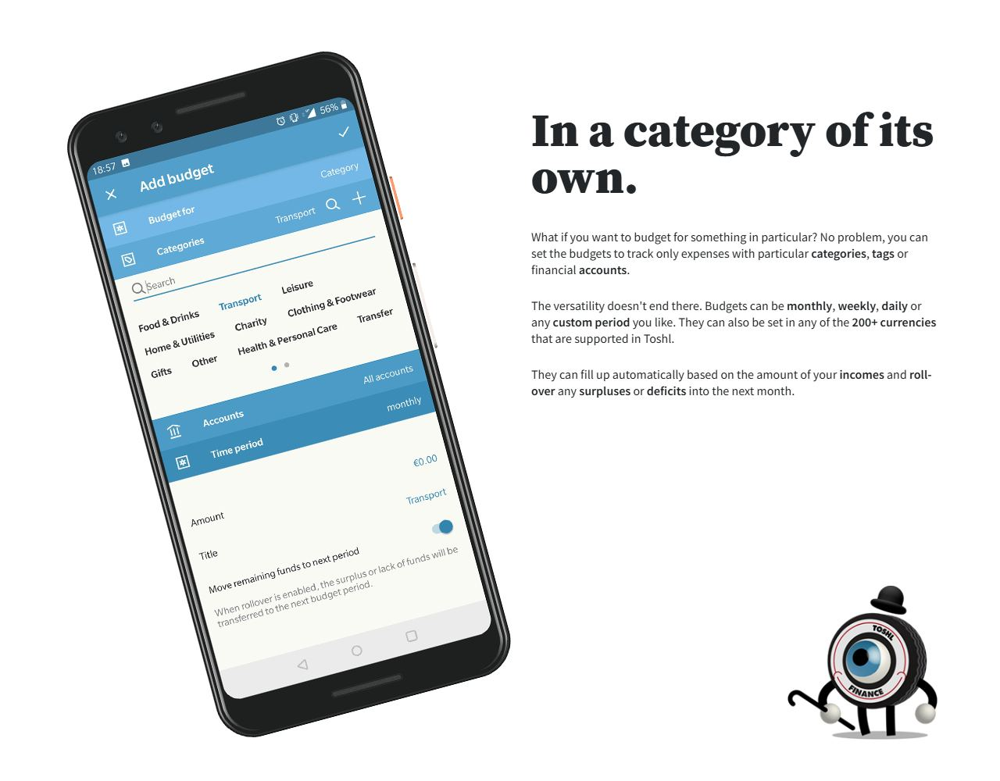
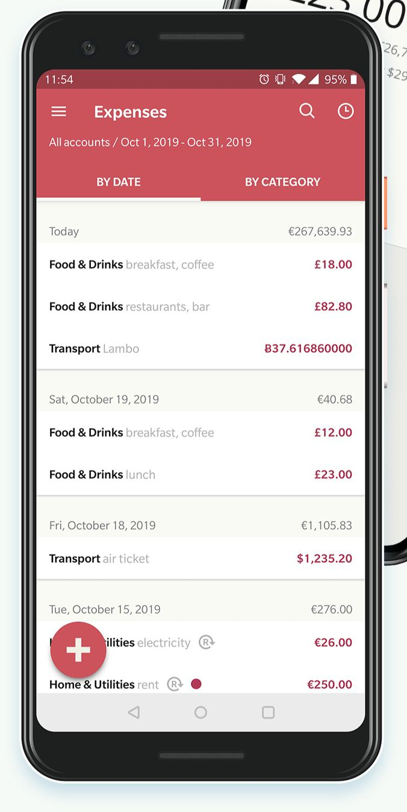
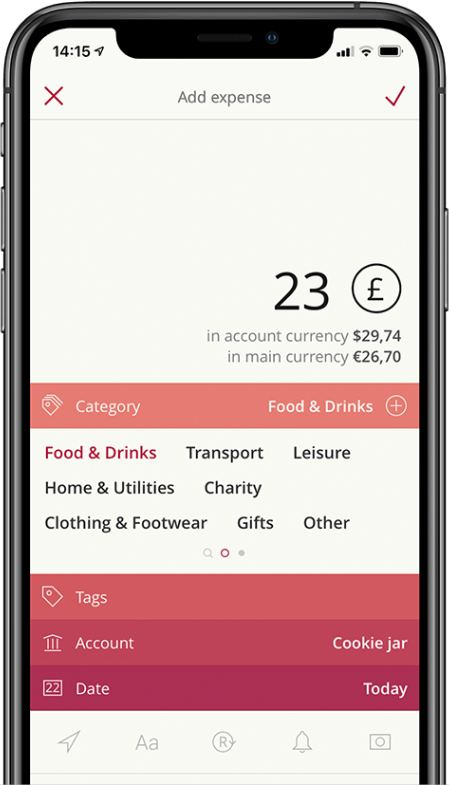
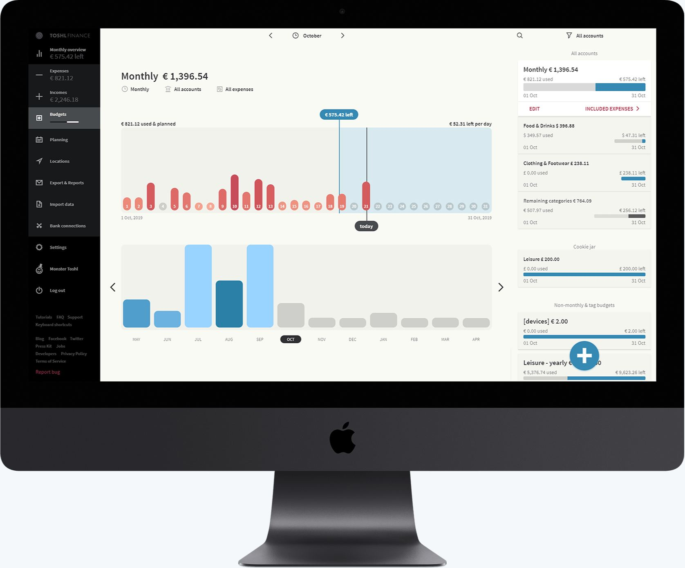
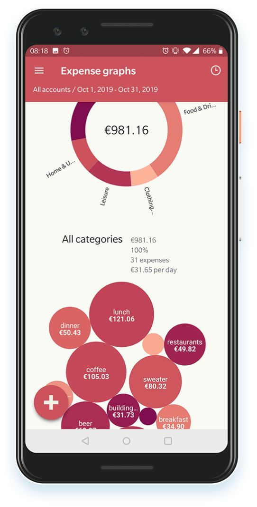

# Toshl Finance design

> Summary: Toshl's design is playful in its brand (monster mascots, a lollipop logo, jokey copy) but typographic and calm in the app itself, with text-only categories, warm off-white screens and a berry, green and blue palette; CoinKeeper should borrow its "today" marker on every budget bar, the dual-currency line under an amount, compact one-line transaction rows, and sidebar items that show one live figure.

Toshl is the most illustrated brand of the four expressive apps: an eyeball-in-a-tire monster in a bowler hat, a lollipop logo and copy such as "On budget. Off worries." It is in the study for its identity, its budgets with time-passed markers, its multi-currency presentation and a web app with a real sidebar. Inside the product the playfulness mostly disappears: categories are words, charts are shades of one hue, and the screens are quiet. What Toshl does is covered in the [Toshl Finance feature study](../../apps/toshl-finance.md); this page covers how it looks and reads.

## At a glance

|                  |                                                                                                                                                                               |
| ---------------- | ----------------------------------------------------------------------------------------------------------------------------------------------------------------------------- |
| Surfaces studied | Web app, Android and iOS (Toshl website product images and App Store images)                                                                                                  |
| Tone             | Expressive brand and marketing (mascots, puns), plain and typographic product; the app itself sits near the middle of the scale                                               |
| Color            | Warm off-white canvas (about #F9FAF4); berry red for expenses (about #B02A4E to #CC535C), green for "left to spend", blue (about #2B80A7) for budgets, near-black web sidebar |
| Type             | Source Sans Pro with black Source Serif Pro headlines on the site; a humanist sans in the app with bold category names and gray tags; iOS sets many labels in italics         |
| Iconography      | Monster illustrations in marketing, the cookie notice and a **Monster Toshl** menu item; line icons in the web sidebar; no category icons (categories are text)               |
| Best idea for us | A "today" marker on every budget bar, main and per category, with "left per day" at the end of the month chart                                                                |

## Visual identity

_Budgeting page, Toshl website. What to notice: the playful parts (serif headline, monster) live around the product, while the Add budget screen itself is plain text on blue bands._

Toshl's identity has two layers. The brand is loud: black serif headlines, the monster mascots (one per feature page, one in the cookie notice), a lollipop logo and puns in every heading. The product is quiet: a warm off-white background (about #F9FAF4, approximate), thin dividers instead of cards on mobile, and color used for meaning rather than decoration. Berry red marks expenses (the expense screens use a red header, about #CC535C, and berry amounts, about #B02A4E), green marks money left to spend, blue marks budgets, and the web sidebar is near-black. The add-expense form stacks its fields as color bands that step from salmon to deep berry.

Categories have no icons in the current app. They are words everywhere: bold in lists, a word cloud in pickers, labels around the edge of charts. Charts use tints of one hue (berry for expenses, blue for budgets) rather than a color per category. Tags appear as gray words after the category name. Some accounts carry a small globe icon (apparently marking bank-connected accounts); bank logos appear only in the bank connection flow.

On the scale from formal bank to expressive, the brand is at the expressive end and the product sits in the middle. What the mascots add: a friendly first impression and a memorable name. What they cost: nothing inside the screens, because they are kept out of them. The in-app costs come from elsewhere: italics and small gray text on off-white reduce legibility, the light green "left to spend" figure is around 3:1 by our estimate, and text-only categories are slower to scan than icons.

## Navigation and layout

The web app has a fixed near-black sidebar with line icons: **Monthly overview**, **Expenses**, **Incomes**, **Budgets**, **Planning**, **Locations**, **Export & Reports**, **Import data**, **Bank connections**, **Settings**, **Monster Toshl** and **Log out**, with help and legal links in small text at the bottom. The first three items carry a live figure under their label ("€575.42 left", the month's expenses, the month's incomes), and the active **Budgets** item shows a tiny progress bar. There is no account list in the sidebar; accounts are a filter.

The top bar is the same on every page: the period switcher centered (arrows around a clock icon and the month), and search and an **All accounts** filter on the right. Page titles follow the pattern "Monthly €1,396.54" with small filter labels under them (period, accounts, expenses included). The phone apps use a hamburger menu with the same items, the period and account filter in the top-right corner, and a round add button bottom left.

## Home and overview

The **Monthly overview** is the home screen. It leads with one figure, "€415.87 left to spend", in green, then a daily bar chart for the month with "used & planned" in red at the left end, "left per day" in green at the right end, a green shaded area for the rest of the month and a **Today** marker. **River flow** shows the same month as a flow diagram: income splits into savings and the budgeted amount, which splits into expenses, planned payments and what is left to spend.

## Accounts

Accounts open in a dark drawer over the current screen: **All accounts** with the total first, then one row per account with its name and balance in the account's own currency (a pound balance for HSBC, a bitcoin amount for Bitfinex), the value in the main currency in gray underneath, the globe icon on connected accounts and a switch to include or exclude it from every view. **Add transfer** and **Edit** sit at the bottom. There are no account type icons, no grouping into assets and liabilities, and no special treatment for credit cards beyond a negative balance.

## Transactions and categorizing

_Expenses, Toshl currencies page. What to notice: each row is one line (category, tags, amount), and amounts stay in the currency they were paid in._

The expense list is dense: **By date** and **By category** tabs, date headers with the day's total on the right, and single-line rows with the category in bold, its tags in gray and the amount in berry red on the right, in the currency it was paid in (euros, pounds, dollars, bitcoin). A small repeat icon marks recurring entries. There is no payee name, logo or account on the row.

_Add expense, Toshl currencies page. What to notice: under the amount, two lines give the value in the account currency and in the main currency._

Adding an expense starts with the amount and a round currency button next to it; two lines underneath convert it to the account currency and the main currency. The category picker is a band of category names laid out as a word cloud across pages, with a search icon on the first page and a plus to add one; the chosen word turns berry. Tags, account and date follow as colored bands, and location, description, repeat, reminder and photo are icons along the bottom. The currency picker lists recently used currencies first, each with its suggested rate.

## Budgets

_Budgets, Toshl web app on the budgeting page. What to notice: the chart marks today and pins the amount left, and each budget card on the right has used and left at opposite ends of its bar._

Budgets are built around time passed:

- **On mobile**, each budget shows its name and total, a large "left to spend" figure in green, and a bar whose used part is gray and whose left part is green or blue, with a thin **today** tick on the bar. Category rows put "£238.11 left" in blue on the right with a small bar and the same tick underneath. An overspent row switches to pink text ("overspent"). Budgets appear to be grouped by the accounts they cover (**All accounts**, or one account such as "Cookie jar"), with a last group for **Non-monthly & tag budgets**.
- **On the web**, the page title is the budget ("Monthly €1,396.54"). A chart of the month has one numbered pill per day, tinted from light to dark red by spending, future days gray, a **today** marker, a blue pin with the amount left, "used & planned" at the left end and "left per day" at the right. Below it, monthly bars show the same budget across the year, with future months gray. The right column lists every budget as a card: name and amount, "used" and "left" at the two ends of a bar, the period's start and end dates, and **Edit** and **Included expenses** links.

Remaining is always the colored figure (and on mobile the largest one) while used is gray, so the two never look alike. Status is carried by the wording ("left" or "overspent") as well as by color.

## Reports and analytics

_Expense graphs, Toshl homepage. What to notice: a summary block (total, share, number of expenses, per day) sits between the ring and the tag bubbles._

Reports are separate screens reached from the menu rather than one long page (**Monthly overview**, **River flow**, **Expense graphs**, **Planning** and **Locations**), and each one reuses the same period and account controls. Expense graphs show a ring of categories labeled around its edge, a summary block (total, share, number of expenses, average per day) and a bubble chart of tags sized by amount in shades of berry. Exports live in their own **Export & Reports** page.

## What CoinKeeper could borrow

| Pattern                                                                                                                | Where in CoinKeeper                    | Why it helps                                                                                                             | Effort |
| ---------------------------------------------------------------------------------------------------------------------- | -------------------------------------- | ------------------------------------------------------------------------------------------------------------------------ | ------ |
| A today tick on every budget bar, main and per category, and "left per day" at the end of the month chart              | Budgets page and Dashboard budget card | Shows pace on each row without extra figures; the per-day value gets a fixed, distinct place                             | S      |
| Remaining as the large colored figure, used in small gray text at the other end of the same bar                        | Budgets header and rows                | Gives the look-alike budget figures different sizes, colors and positions                                                | S      |
| Amount in the paid currency with the main-currency value on a gray line below, marked approximate                      | Accounts rows in a second currency     | Keeps per-currency truth visible while giving a sense of scale, without summing currencies                               | M      |
| Single-line transaction rows (category bold, tags gray, amount right) under date headers with a day total              | Transactions, Review inbox             | Directly answers "review rows are too tall"                                                                              | S      |
| A live figure under a few sidebar items (left to spend under Dashboard, count under Review) instead of an account list | Sidebar                                | Keeps one useful number in view while the sidebar stays pure navigation; with two currencies show a count or dot instead | M      |
| Reports as separate menu entries sharing one period and account filter bar                                             | Analytics sub-pages                    | Splits the long Analytics page and keeps controls in the same place on every sub-page                                    | M      |

## What not to copy

- **The word-cloud category picker.** Words wrapped across pages are hard to scan and to reach by keyboard; a searchable list grouped by category group is better.
- **Text-only categories.** CoinKeeper's group colors and Lucide icons help recognition; dropping them would make lists slower to read.
- **Italics and small gray text on off-white.** They lower contrast and legibility for no gain.
- **Mascots inside the product.** Toshl keeps them to marketing and a menu item; a self-hosted money tool gains little from them beyond, at most, an empty-state illustration.
- **Bubble charts of tags.** Areas are hard to compare; a ranked bar list reads faster.

## Sources

- [Toshl budgeting page](https://toshl.com/budgeting/): web Budgets and the identity section (`toshl-finance-web-budgets.jpg`, `toshl-finance-identity.jpg`); mobile budgets and River flow images
- [Toshl currencies page](https://toshl.com/currencies/): Expenses list and Add expense (`toshl-finance-expenses.jpg`, `toshl-finance-add-expense.jpg`); currency picker with suggested rates
- [Toshl homepage](https://toshl.com/): Expense graphs (`toshl-finance-expense-graphs.jpg`); Monthly overview, River flow and the accounts drawer images
- [App Store: Toshl Finance](https://apps.apple.com/us/app/toshl-finance-best-budget/id921590251): budgets with an overspent row, expenses list and add expense images
- [Blog: How to use the budgets (web app)](https://toshl.com/blog/how-to-use-the-budgets-web-app/): budget bars, markers and colors on the web
