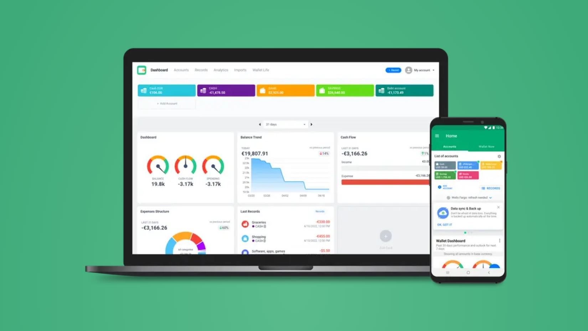
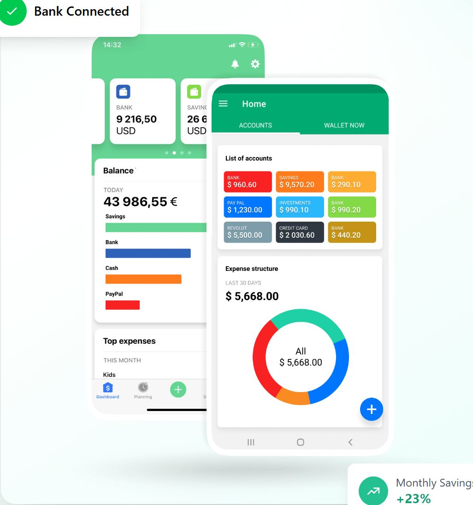
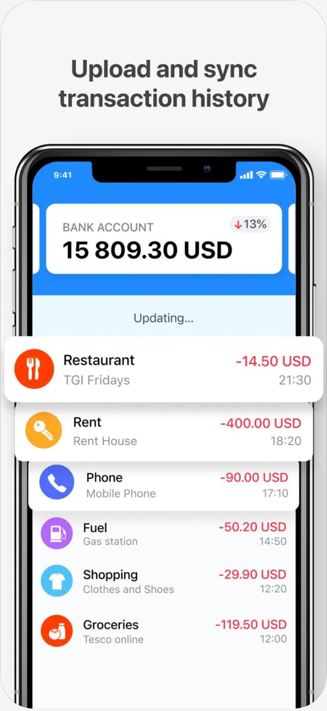
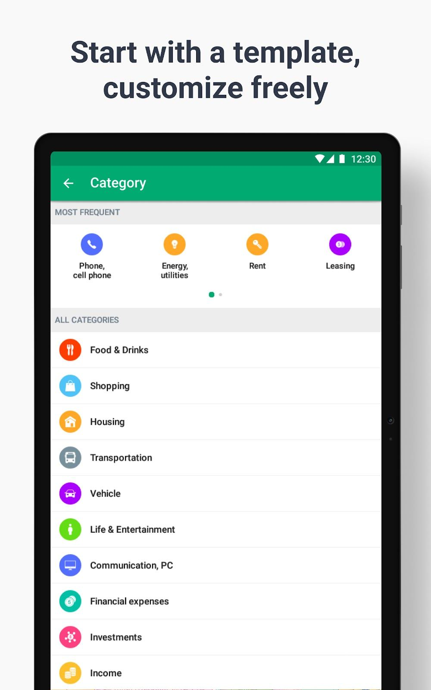
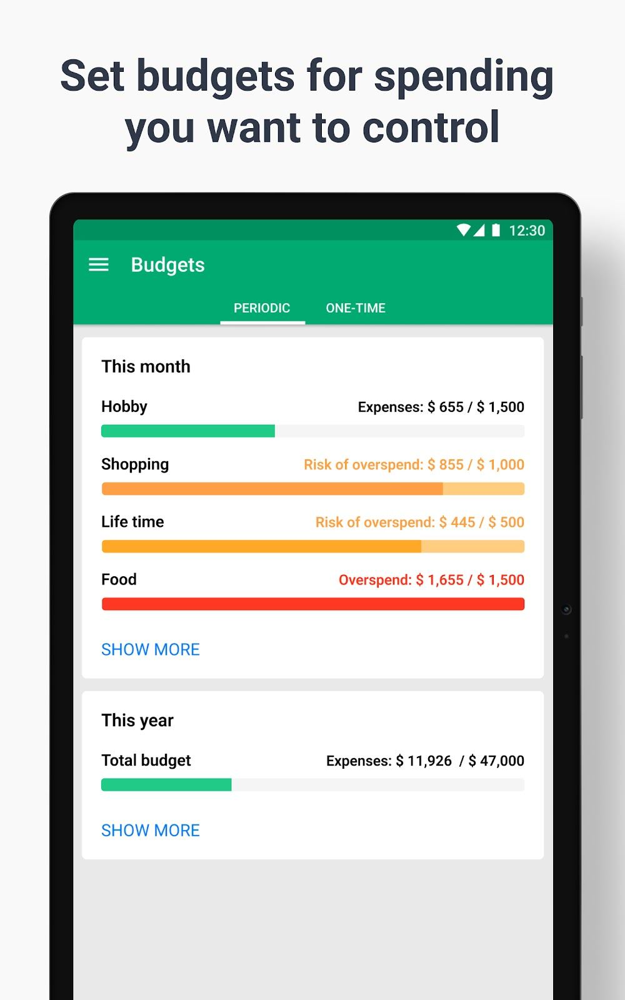

# Wallet by BudgetBakers design

> Summary: Wallet looks like a simple bank app built from Material cards: a green brand, colored account tiles, colored category circles and plain lists; CoinKeeper should borrow its icon and color per account type (shown today only when adding an account), its category list with a frequent-first row, and budget rows that name their state ("Risk of overspend", "Overspend") in the matching color.

Wallet is in the design research because the owner likes its simplicity and its bank style. It is also the only app in this set built for Europe and for several currencies, so its account and record screens deal with the same problems as CoinKeeper's. The features are covered in the [Wallet feature study](../../apps/wallet-budgetbakers.md); this page looks only at design and hierarchy.

## At a glance

|                  |                                                                                                                                           |
| ---------------- | ----------------------------------------------------------------------------------------------------------------------------------------- |
| Surfaces studied | Android and iOS (store screenshots and the marketing site), web app (the product shot on its sign-in page and the help center)            |
| Tone             | Bank-like structure and wording with a bright, toy-box palette; practical rather than playful                                             |
| Color            | Green brand bar and add button; a saturated Material palette for accounts and categories; red for expenses and overspend, orange for risk |
| Type             | Roboto on Android, a system-style sans on iOS, Inter on the website; amounts followed by the currency code                                |
| Iconography      | White glyphs in colored circles for categories, colored rounded squares for account types, no merchant or bank logos in lists             |
| Best idea for us | The add-account chooser's icon and color per account type, applied to every account row so the kind of account shows before its name      |

## Visual identity

Wallet follows Material Design closely. Android screens have a green app bar (approximately `#01AA71`), white cards with a small radius (about 4 px) and a soft shadow on a light gray canvas, uppercase tab labels and a round add button. iOS uses a lighter mint green behind the top of the dashboard and rounder cards. The type is the platform's own sans; small uppercase gray labels (**BANK**, **LAST 30 DAYS**, **MOST FREQUENT**) introduce each value.

Color does three jobs:

- **Brand**: green for the app bar, the iOS header and the center add button. Primary buttons and links are a separate blue (**Set budget**, **SHOW MORE**, the web **+ Record** button).
- **Identity**: every account has a user-chosen color from a saturated palette and every main category has a fixed one: approximately `#FC3E00` for Food & Drinks, `#5ABFEE` for Shopping, `#F4B64D` for Housing, `#909FA6` for Transportation, `#B536E7` for Vehicle, `#60DF17` for Life & Entertainment, `#FA508D` for Investments and `#F7D37D` for Income.
- **State**: expenses in red, income in green, budget risk in orange (approximately `#FF9E46`) and overspend in red (approximately `#FF3723`).

Category icons are white glyphs in a filled circle of the category color. In the add-account chooser, account types use white glyphs in rounded squares: green coins for Cash, a blue bank for Banks, a pink card for Credits, a yellow piggy bank for Savings and a teal chart for Stocks. The lists I found show no merchant or bank logos. Amounts carry the currency code after the number (**-14.50 USD**, **9 216,50 USD**) and follow the locale's separators.

On the formal-to-playful scale Wallet sits in the middle: the layout and vocabulary are a bank's (accounts, records, balance, cash flow), the palette is a toy box.

## Navigation and layout

Each platform navigates differently:

- **Android**: a drawer menu opens from the app bar; the home screen has two tabs (**ACCOUNTS** and **WALLET NOW**, or **BUDGETS** on tablets) and a floating blue add button.
- **iOS**: a bottom bar with **Dashboard**, **Planning**, a green center add button, **Statistics** and **More**.
- **Web**: a horizontal top bar with **Dashboard**, **Accounts**, **Records**, **Analytics**, **Imports** and **Wallet Life**, a blue **+ Record** button and the account menu on the right.

Accounts are part of the content, not the navigation: a row of colored account tiles comes first on the web dashboard and on the Android home. The period control is a select with previous and next arrows (**31 days** on the web, **This month** at the bottom of iOS Statistics).

## Home and overview

_Web dashboard and Android home, Wallet web sign-in page. What to notice: accounts come first as a row of colored tiles, then one period switcher controls every card below._

The web dashboard reads in three layers: account tiles (type label and balance on the account's color), one centered period switcher, then a grid of cards. The cards start with three gauges (**Balance**, **Cash flow**, **Spending**), which BudgetBakers calls financial meters: each turns green, orange or red against a fixed rule, such as this month's spending against last month's, and opens the matching Statistics area. Then come **Balance Trend** with today's balance and a red chip for the change against the previous period, **Cash Flow** with income and expense bars, **Expenses Structure** as a donut, **Last Records**, and an empty **Add card** slot for more widgets.

_iOS dashboard and Android home, BudgetBakers home page. What to notice: the Balance card draws one horizontal bar per account in the account's color, so the split of money is visible without a chart legend._

On mobile the one number is the total balance: the iOS **Balance** card shows **TODAY** and the total, then one bar per account (Savings, Bank, Cash, PayPal) whose length is its share. The Android **List of accounts** is a three-column grid of colored tiles, each with the account type in small caps and the balance, followed by **Expense structure** for the last 30 days. Wallet converts every account into a base currency for these totals.

## Accounts

Each account shows its name in small caps above the balance and currency: on a fill of the account's color on Android and the web, on a white card with a colored icon square on iOS. In the demo data the names mix types (**BANK**, **SAVINGS**, **CREDIT CARD**) with brands (**PAY PAL**, **REVOLUT**), which exposes the weakness: apart from the name and a user-picked color, nothing tells a credit card from a savings account. The one place where types get their own look is the add-account chooser, where Cash, Banks, Credits, Savings and Stocks each have a distinct glyph and color.

Credit cards have their own settings: a credit limit, a due day and a choice between showing **Available Credit** (a positive balance) or **Credit Balance** (a negative amount owed). The Statistics **Credit** tab draws the limit as a donut with the used share, the credit balance and the total limit. There are no sparklines or per-account change figures in the lists; change over time lives in Statistics.

## Transactions and categorizing

_Records list, App Store listing. What to notice: the category is the title of each row and the payee is the subtitle, which puts meaning first and the merchant second._

Wallet calls transactions records. A row has a colored category circle, the category name as the title (**Restaurant**, **Rent**, **Fuel**), the note or payee as a gray subtitle (**TGI Fridays**, **Gas station**), and on the right the amount in red for expenses with the currency code, above the time. The web list adds the account name after a small colored dot. Rows are compact, two short lines each.

_Category picker, Google Play listing. What to notice: a list, not a grid, with the four most used categories on top and colored circles that match the records list._

The category picker is a full screen titled **Category**. A **MOST FREQUENT** row shows four categories as circles with labels, paged with dots. **ALL CATEGORIES** follows as a list of main categories, each with its colored circle; choosing one opens its subcategories. The list is fast to scan because every row has the same height and the circle color repeats the one used in records and charts. The screenshots show no search field.

Review of bank records uses a **Record Confirmation** green check on mobile: new synced records are unconfirmed until you edit and save them or swipe right.

## Budgets

_Budgets, Google Play listing. What to notice: the state is written in words next to the figures and colors the text, the bar and a lighter track together._

Budgets are split into **PERIODIC** and **ONE-TIME** tabs, and periodic budgets are grouped into cards by period (**This month**, **This year**). Each budget is two lines: the name on the left, and on the right one phrase with spent over limit (**Expenses: $655 / $1,500**), then a full-width bar. The state changes three things at once:

| State          | Wording on the right                 | Text color | Bar                                |
| -------------- | ------------------------------------ | ---------- | ---------------------------------- |
| On track       | **Expenses: $655 / $1,500**          | Ink        | Green fill on a gray track         |
| Near the limit | **Risk of overspend: $855 / $1,000** | Orange     | Orange fill on a pale orange track |
| Over           | **Overspend: $1,655 / $1,500**       | Red        | Full red bar                       |

The budget name keeps the same weight in every state, so the eye goes to the colored phrase. The help center says budgets are available on Android and iOS but not yet in the web app.

## Reports and analytics

Statistics is organized by area: balance, outlook (planned payments and a forecast), cash flow, spending, credit and reports. The Android tablet screenshots show them as tabs across the top (**EXPENSES**, **CASH-FLOW**, **SPENDING**, **CREDIT**, **REPORTS**). The iOS app turns them into a hub: a list of cards, each with the area name in small caps, one figure (**BALANCE 13 580.00 USD**, **SPENDING 9 550.90 USD**) and a small glyph of its chart, leading to the full report. The period control sits at the bottom. Spending splits into **Must**, **Need** and **Want** as colored bars, then a ranked list of categories with bars.

## What CoinKeeper could borrow

| Pattern                                                                                                                                               | Where in CoinKeeper                                                       | Why it helps                                                                               | Effort |
| ----------------------------------------------------------------------------------------------------------------------------------------------------- | ------------------------------------------------------------------------- | ------------------------------------------------------------------------------------------ | ------ |
| One fixed Lucide icon and tint per account type (cash, checking, savings, credit card, loan, investment, other) shown before the account name         | Accounts page, dashboard accounts card, account picker (`account-picker`) | Cash, savings and credit cards stop looking alike, which is the owner's Accounts complaint | S      |
| Budget rows that write the state (**On track**, **Risk of overspend**, **Overspend**) next to spent over limit and color text, bar and track together | Budgets page (`budget-card`, `budget-progress`)                           | The state is readable without decoding a color, and color never carries the meaning alone  | S      |
| Category picker as a list: a "most used" or "recent" row on top, then all categories with their colored icon; add a search field                      | Category picker (`category-picker`), review inbox                         | Replaces the modal grid of tiles with something shorter and faster, as the owner asked     | M      |
| A balance card with one horizontal bar per account, in the account type's color, per currency                                                         | Dashboard or Accounts page                                                | Shows where the money sits without a chart legend                                          | S      |
| Currency code after every amount in mixed-currency lists                                                                                              | Transactions, accounts                                                    | Removes doubt when EUR and USD rows sit side by side                                       | S      |
| An analytics hub: one card per report with its key figure and a mini chart, each opening a sub-page                                                   | Analytics page                                                            | Gives the long Analytics page an entry point and matches the owner's sub-page idea         | M      |

## What not to copy

- **User-picked saturated fills for account tiles**: a rainbow of lime, yellow and near-black tiles carries no meaning, and white text is hard to read on the light ones; color should follow the account type.
- **Gauges on the dashboard**: three dials for balance, cash flow and spending take a lot of space to show three numbers; the idea behind them (a status per area that links to its report) works as well as a colored chip beside a figure.
- **Totals converted into one base currency by default**: CoinKeeper keeps currencies separate and converts only in an explicitly approximate block.
- **A web app that lags the mobile apps**: Wallet's web app lacks budgets; CoinKeeper is web first and every screen must be complete there.
- **Material 2 details** such as uppercase tabs and heavy app bars: they date the look; keep the structure, not the styling.

## Sources

- [Wallet web app sign-in page](https://web.budgetbakers.com/) (web dashboard product shot)
- [BudgetBakers home page](https://budgetbakers.com/en/) (iOS and Android home preview)
- [BudgetBakers: Wallet product page](https://budgetbakers.com/en/products/wallet/)
- [Wallet on the App Store](https://apps.apple.com/us/app/budget-planner-wallet/id1032467659) (records and statistics screenshots)
- [Wallet on Google Play](https://play.google.com/store/apps/details?id=com.droid4you.application.wallet) (category picker, budgets and statistics screenshots)
- [Wallet Help: Understanding Your Wallet Statistics](https://support.budgetbakers.com/hc/en-us/articles/31001090941970-Understanding-Your-Wallet-Statistics)
- [Wallet Help: Setup Budgets](https://support.budgetbakers.com/hc/en-us/articles/7076953735314-Setup-Budgets) (budgets not in the web app)
- [Wallet Help: Adding a Credit Card](https://support.budgetbakers.com/hc/en-us/articles/6950259945362-Adding-a-Credit-Card)
- [Wallet Help: Wallet Web App](https://support.budgetbakers.com/hc/en-us/articles/7181432342034-Wallet-Web-App)
- [BudgetBakers blog: Introducing Wallet Dashboard on Wallet 6](https://budgetbakers.com/introducing-wallet-dashboard-wallet-6-control-panel-financespreview_id15639preview_nonceacf522909apost_formatstandard_thumbnail_id15649previewtrue/) (the financial meters and their color rules)
- [Wallet Help: Getting Started with Wallet](https://support.budgetbakers.com/hc/en-us/articles/7151352625938-Getting-Started-with-Wallet)
