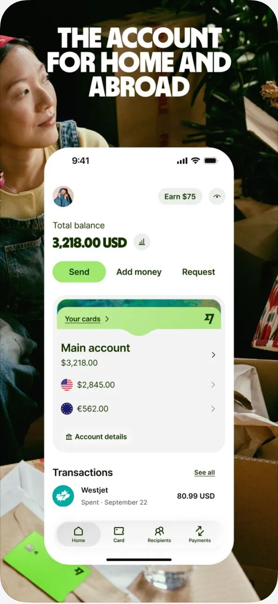
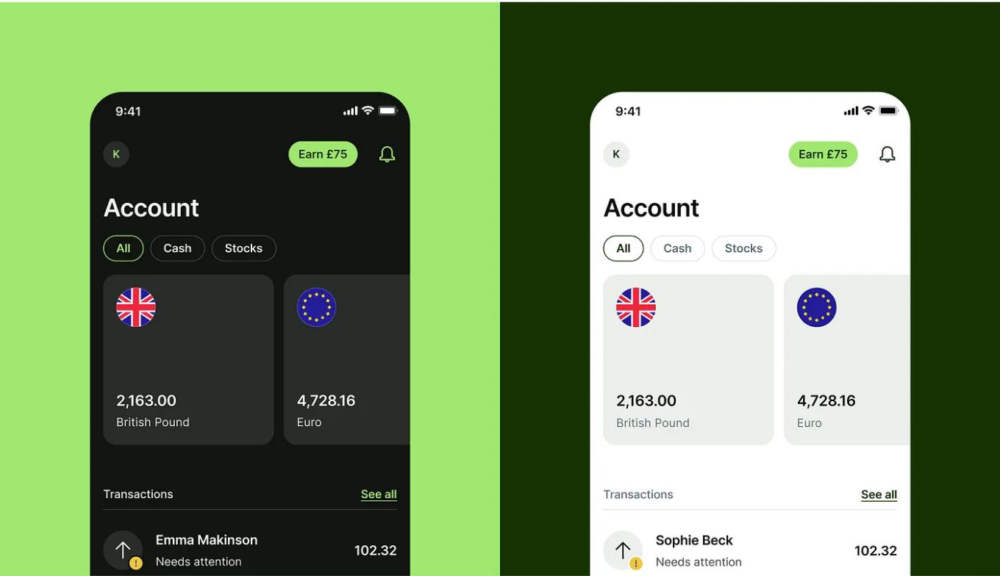
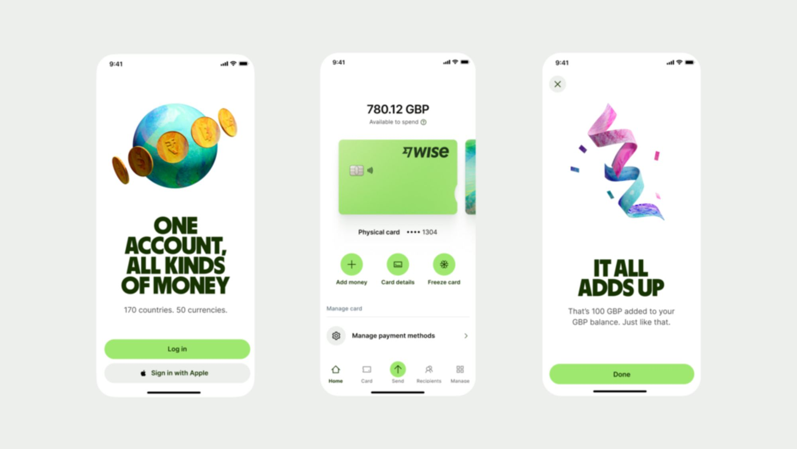
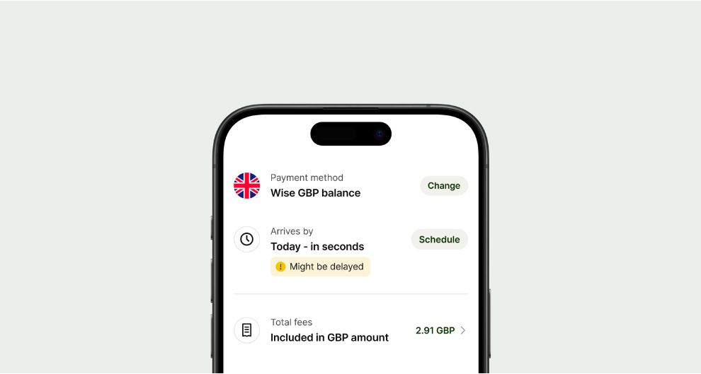
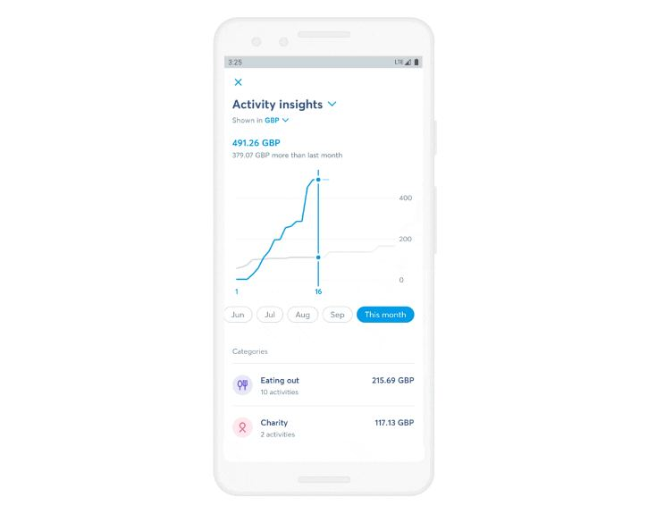

# Wise design

> Summary: Wise is a white, airy multi-currency account where color is rationed (forest green for interaction, bright green only for the main button, sentiment colors only in alerts) and every currency is a circular flag with its own balance; CoinKeeper should borrow its per-currency balance cards with flags, its documented color proportions and content-gray scale, and its list item anatomy with round avatars for flags, logos and category icons.

Wise holds money in dozens of currencies side by side, which makes it the closest bank to CoinKeeper's per-currency rule. It is in this research for three things: how a multi-currency home shows balances without hiding the currencies, how its transaction list uses merchant logos, and its public design system, which documents color roles, type and components in unusual detail. There is no feature study for Wise; this page covers design and hierarchy only.

## At a glance

|                  |                                                                                                                                                               |
| ---------------- | ------------------------------------------------------------------------------------------------------------------------------------------------------------- |
| Surfaces studied | iOS (App Store, press kit and design-blog screenshots), Android (2020 insights), the Wise Design system site (archived pages)                                 |
| Tone             | Friendly bank: plain, direct product copy and a calm UI, with loud uppercase display type kept for marketing and success screens                              |
| Color            | Mostly white; Forest Green `#163300` for interaction and links; Bright Green `#9FE870` for the primary button only; red, green and yellow reserved for alerts |
| Type             | Inter for product (semibold titles with tight tracking); Wise Sans, a bold uppercase display face, only for celebration and selling moments                   |
| Iconography      | Circular flags for currencies; round avatars holding merchant logos, category icons, initials or a flag; simple outline icons elsewhere                       |
| Best idea for us | One card per currency with a circular flag, the amount and the currency name, and no summed total inside the account list                                     |

## Visual identity

Wise's design system states the color balance of a product screen outright: white first, then a neutral green-tinted gray for surfaces, then the content grays, a smaller share of Forest Green for interactive elements and only an occasional pop of Bright Green. The documented tokens (exact values from the design system):

| Role                                   | Token and value                                                                 |
| -------------------------------------- | ------------------------------------------------------------------------------- |
| Primary text                           | Content Primary `#0E0F0C`                                                       |
| Body and supporting text               | Content Secondary `#454745`                                                     |
| Placeholders only                      | Content Tertiary `#6A6C6A`                                                      |
| Links, active items, text on green     | Forest Green `#163300` (Interactive Primary, Content Link, Interactive Control) |
| Primary button fill                    | Bright Green `#9FE870` (Interactive Accent), used sparingly                     |
| Input borders                          | Interactive Secondary `#868685`, never on text                                  |
| Neutral surfaces and avatar background | Background Neutral, Forest Green at 8% opacity                                  |
| Dividers and flag outlines             | Border Neutral, near-black at 12% opacity                                       |
| Sentiment                              | Negative `#A8200D`, Positive `#2F5711`, Warning `#EDC843` (background only)     |

The system tells designers to keep sentiment colors inside alerts and error states and to emphasize text with bold primary content instead of color. Amounts in the screenshots follow that: spending shows as plain dark text with the currency code (**80.99 USD**), not in red.

Type is Inter throughout the product: a 30 px semibold screen title with negative letter spacing, 22 px and 18 px section titles, 16 px and 14 px body text. Wise commissioned extra currency symbols for Inter. Wise Sans, the bold uppercase display face, appears in the app only on success screens (**IT ALL ADDS UP**). Radii are generous: 16 to 60 px on desktop and 10 to 48 px on mobile, so cards and buttons feel soft rather than bank-like.

Flags are a system of their own: circular, drawn from a 10-color palette, simplified below 150 px, and outlined with Border Neutral on white so a white flag does not bleed into the page. Illustration (3D textured objects) appears in marketing, onboarding and promotional cards, not in lists.

## Navigation and layout

The app uses a bottom tab bar (**Home**, **Card**, **Recipients**, **Payments**, and in the 2023 press screens a raised **Send** tab and **Manage**). The header is minimal: the profile avatar on the left, an **Earn** referral pill and a hide-balances eye on the right. The web app (`wise.com/home`) needs a sign-in and could not be captured.

## Home and overview

_Home, Wise App Store listing. What to notice: the converted total is labeled "Total balance" and sits above the real per-currency balances, each with its flag._

The home screen reads top to bottom: **Total balance** in one currency (**3,218.00 USD**) with a small chart button, three actions with **Send** as the only filled green pill, a **Main account** card on a neutral surface listing each currency with its flag and native amount (**$2,845.00**, **€562.00**) plus **Account details**, then the latest **Transactions**. Wise's help center says the redesign grouped everyday currencies into one main account and placed jars (money set aside) and groups next to it on Home, so every pot of money is visible without a separate accounts page.

_Account balances, Wise Design blog ("Accessible but never boring"). What to notice: each currency is its own card with a large flag, the amount and the currency name, and there is no summed figure on this screen._

## Accounts

Wise has no bank-style account types beyond the main account, jars and groups. Currencies are the "accounts": each gets a card or row with a circular flag, the amount in its own currency and the full currency name as a gray label. Filter chips (**All**, **Cash**, **Stocks**) split holdings by kind. A card screen shows the balance as **Available to spend** above the card image with three round green actions (**Add money**, **Card details**, **Freeze card**).

_App after the rebrand, Wise newsroom media kit. What to notice: the bold display face appears only on the welcome and success screens, while the working screen in the middle stays in calm Inter._

## Transactions and categorizing

Transaction rows are list items: a round avatar on the left (the merchant logo, such as Westjet's, or an icon for a transfer), the name in semibold, a gray subtitle with the type and date (**Spent · September 22**), and the amount right-aligned with its currency code. A small badge on the avatar marks a state (a yellow warning for **Needs attention**). Since 2020 Wise has sorted transactions automatically into 15 fixed categories, which the user can change afterwards.

_List item component, Wise Design system (archived). What to notice: every row has the same anatomy (round avatar, label over value, one tonal action or value on the right) whether the avatar holds a flag or an icon._

The design system's Avatar page shows the same round container holding a photo, initials, a flag, a brand logo (Airbnb, Google, Co-op in its examples) or a category icon, at sizes from 32 to 72 px, with optional badges such as a small flag or a status dot. Logos keep their own colors and are never stretched to fill the circle.

## Budgets

Wise has no budgets; jars set money aside for a goal but have no spending target or progress display in the screens studied.

## Reports and analytics

_Activity insights on Android (2020, before the rebrand), Wise blog. What to notice: the currency switcher sits under the title, so the whole report is in one currency at a time._

Wise's insights, launched in 2020, compare spending across months and categories and can be shown per currency. The screen has a title with a dropdown, **Shown in GBP** as a currency switcher, the month total with the difference from last month, a cumulative spending line against last month's line in gray, month chips (**Jun** to **This month**) and a category list with an icon, the number of activities and the amount. The screen predates the 2023 rebrand, so its blue colors are not current.

## What CoinKeeper could borrow

| Pattern                                                                                                        | Where in CoinKeeper                           | Why it helps                                                                                                | Effort |
| -------------------------------------------------------------------------------------------------------------- | --------------------------------------------- | ----------------------------------------------------------------------------------------------------------- | ------ |
| One card per currency with a circular flag, the amount and the currency name                                   | Dashboard, Accounts                           | Shows EUR and USD side by side without summing them, which is CoinKeeper's core rule                        | S      |
| A converted total only above the per-currency figures and clearly labeled, never inside the list               | Dashboard ("approximate converted" block)     | Gives the one number users want while keeping the real balances primary                                     | S      |
| Documented color roles: white first, neutral surfaces, content grays, one interaction color, one accent button | `theme.ts`, `tokens.scss`, `palette.ts`       | A single light theme with a clear hierarchy; sentiment colors kept for alerts calms every page              | M      |
| Three content grays with fixed jobs (primary, body, placeholder only)                                          | `tokens.scss`, all text                       | Makes Budgets figures and secondary labels distinguishable by weight and gray rather than by color          | S      |
| One list item anatomy: round avatar, label over value, right-aligned amount or one tonal action                | Transactions, Review inbox, Accounts, Budgets | Compact rows that look the same everywhere; the avatar can hold a merchant logo, category icon or flag      | M      |
| Round avatar that holds a merchant logo when known and the category icon otherwise, with small state badges    | Transactions, Review inbox                    | Brings the Rocket Money logo look the owner likes while keeping CoinKeeper's category icons as the fallback | M      |
| A currency switcher in the report header so each report is in one currency at a time                           | Analytics                                     | Respects per-currency reporting without splitting every chart                                               | S      |
| Display type only for success moments (import finished, budget met)                                            | Import, Budgets                               | Adds warmth without making working screens louder                                                           | S      |

## What not to copy

- Bright Green as a large surface: it works for Wise's brand but would overpower a data-heavy desktop app; keep any accent to the primary button.
- Very large radii (40 to 60 px on desktop) on data cards; they waste space in tables and dense lists.
- The mobile-only bottom tab bar; CoinKeeper is desktop first and keeps a sidebar.
- A headline **Total balance** in one currency without an "approximate" label; CoinKeeper must mark any converted total as approximate.
- 3D textured illustrations and uppercase display headlines in working screens.

## Sources

- [Wise on the App Store (UK)](https://apps.apple.com/gb/app/wise-international-money/id612261027)
- [Accessible but never boring, part 1 (Wise Design on Medium)](https://medium.com/transferwise-design/accessible-but-never-boring-part-1-ec8222f1f364)
- [Wise Design: Color (archived)](https://web.archive.org/web/20251130011055/https://wise.design/foundations/colour)
- [Wise Design: Typography (archived)](https://web.archive.org/web/20260204131441/https://wise.design/foundations/typography)
- [Wise Design: Radius (archived)](https://web.archive.org/web/20260204131441/https://wise.design/foundations/radius)
- [Wise Design: Flags (archived)](https://web.archive.org/web/20251117040801/https://wise.design/foundations/flags)
- [Wise Design: Avatar (archived)](https://web.archive.org/web/20251207123250/https://wise.design/components/avatar)
- [Wise Design: List item (archived)](https://web.archive.org/web/20260419174913/https://wise.design/components/list-item)
- [Wise app post-rebrand (Wise newsroom media kit)](https://newsroom.wise.com/en-NAM/images/470698/)
- [Your Wise account has a new look (Wise help center)](https://wise.com/help/articles/645Ve1Ah1Psi0srHGfKYmm/your-wise-account-has-a-new-look)
- [Android, say hello to insights (Wise blog)](https://wise.com/gb/blog/cheap-easy-and-insightful-android-say-hello-to-insights)
