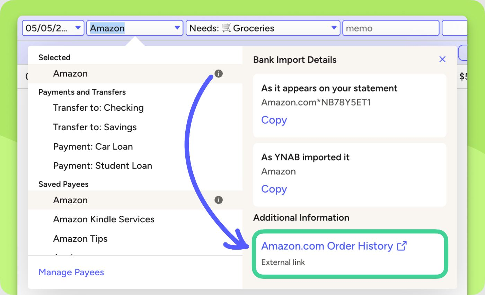
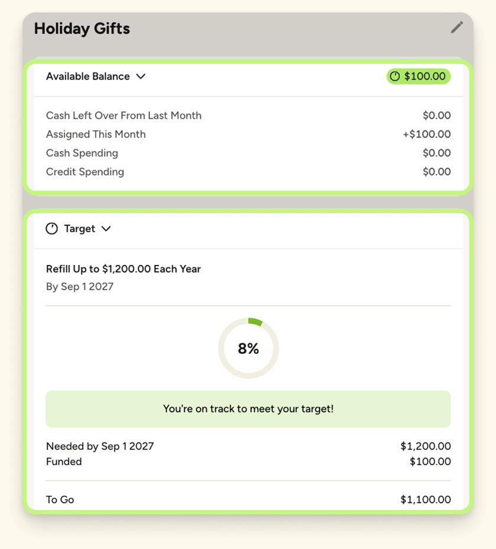

# YNAB design

> Summary: YNAB's web app is a dense, friendly spreadsheet where every budget row ends in one colored Available pill, the sidebar lists accounts grouped by type with group totals, and reports live in tabs under Reflect; CoinKeeper should borrow the status pill with a plain-language status line, the type-grouped account list and the right-hand inspector for the selected budget row.

YNAB is in the design research because its web layout is the closest match to CoinKeeper's desktop shell: a left sidebar that holds both navigation and an account list, a wide table as the main page, and a panel on the right for details. It solves three of the owner's complaints in ways CoinKeeper can copy: budget figures that look alike (O5), a sidebar where accounts and navigation blur together (O7) and one long analytics page (O4). The method behind the screens is described in the [YNAB feature study](../../apps/ynab.md). Owner issues are numbered O1 to O8 as in the [current UI review](../current-ui-review.md).

## At a glance

|                  |                                                                                                                                  |
| ---------------- | -------------------------------------------------------------------------------------------------------------------------------- |
| Surfaces studied | Web (primary); iOS shown next to it on the marketing site                                                                        |
| Tone             | A friendly coach on top of a working spreadsheet; halfway between formal bank and expressive                                     |
| Color            | Deep indigo sidebar, periwinkle blue for links and actions, and a traffic-light pill (green, yellow, red, gray) on every balance |
| Type             | Rounded geometric sans (Figtree on the marketing site); amounts right-aligned in fixed columns, always with two decimals         |
| Iconography      | Emoji chosen by the user in category names, line icons in navigation, no merchant or bank logos                                  |
| Best idea for us | One status pill per budget row whose color and icon tell you "fine, short or over" before you read the number                    |

## Visual identity

YNAB looks like a spreadsheet that has been given a personality. The table is plain: hairline row dividers, no card shadows, light gray group rows. The personality comes from three places: the colored pills, the emoji in category names and the short status sentences.

Colors (approximate hex values read from screenshots):

| Role                  | Approximate value                    | Where it appears                                               |
| --------------------- | ------------------------------------ | -------------------------------------------------------------- |
| Brand and actions     | periwinkle `#4b5cf0`                 | Links, toolbar actions, focus rings, mobile header             |
| Navigation            | deep indigo `#1f2060`, white text    | Sidebar background                                             |
| Positive (funded)     | lime `#c3ec8f` pill, dark green text | Available pill, Ready to Assign block, progress bars           |
| Warning (underfunded) | amber `#f6c445` pill                 | Available pill when a target or credit spending is not covered |
| Negative (overspent)  | red `#e0484f`                        | Available pill for cash overspending, negative credit balances |
| Neutral               | gray `#e6e6e6` pill                  | Available pill at zero                                         |
| Category colors       | blue, green, yellow, red, lilac      | Only in Reflect charts; the plan itself has no category colors |

The help center defines the pill colors as a priority order: red means act now, yellow means act soon, green means fine, gray means empty. Color is never the only signal on the web: the Available column adds an icon for credit overspending, an upcoming scheduled transaction, a target in progress (a partly filled pie), a met target (a green check) and a snoozed target.

- **Numbers**: amounts are the same size and weight as their labels; emphasis comes from the pill, not from type size. The only large number in the plan is **Ready to Assign**.
- **Radius and depth**: pills are fully rounded; inspector cards have a radius of about 12 px; the table is flat.
- **Density**: rows are about 32 px, yet each category row carries a name, an emoji, a status sentence and a thin progress bar.
- **Voice**: states are written as short sentences (**Funded**, **Fully Spent**, "$40.00 more needed by the 21st"), which makes the table readable without a legend.

On a scale from formal bank to expressive, YNAB sits in the middle: calm structure, warm words, emoji supplied by the user.

## Navigation and layout

The sidebar has four zones: the plan name and email (a switcher), three navigation items (**Plan**, **Reflect**, **All Accounts**), the account list, and a referral card with a collapse button at the bottom. Navigation and accounts are told apart by style: navigation items are large with icons, account groups are small uppercase headers (**CASH**, **CREDIT**, **LOANS**, **TRACKING**, **CLOSED**) with the group total on the right, and accounts are indented rows with a balance.

_Plan screen, YNAB features page. What to notice: every row ends in a colored Available pill and the account list in the sidebar is grouped by type with a total per group._

The Plan header follows one pattern: a month switcher with arrows on the left, the one number (**Ready to Assign**) with its primary action (**Assign**) in the center, and filter chips below (**All**, **Snoozed**, **Overfunded**, **Underfunded**, **Money Available**). A toolbar row above the table holds secondary actions (add category group, undo, redo, recent moves) and a density toggle. The right-hand inspector shows the month summary, or the selected category when one is selected.

## Home and overview

The web app has no dashboard: it opens on Plan, and the "one number" is Ready to Assign in the header. The mobile app has a Home tab with three blocks in a fixed order: transactions waiting for review with a **Review** button, the Ready to Assign pill with an **Assign** button, and a short list of top-priority categories with their pills. That order (what needs action, the one number, then a few watched categories) is a compact answer to CoinKeeper's crowded dashboard (O1).

## Accounts

YNAB has no accounts page on the web; the sidebar is the accounts overview. Types are told apart only by grouping (cash, credit, loans, tracking), not by icons or bank logos. Each group shows its total, so the user sees assets and debts without a separate summary.

- Credit card balances below zero appear in a red outlined pill in the sidebar; loans are negative numbers in plain text.
- Tracking accounts (401k, IRA) sit in their own group, apart from budget accounts.
- Change over time lives in Reflect › Net Worth, not next to the accounts; there are no sparklines.
- Clicking an account opens its register; **All Accounts** opens one register for everything.

## Transactions and categorizing

The register is a spreadsheet: one row per transaction, and editing happens in place. A row in edit mode becomes a line of fields (date, payee, category, memo, amounts), and each field is a type-ahead dropdown.

_Register edit row, YNAB help center (Categorizing transactions). What to notice: the dropdown groups options under headings and ends with a management link, and the category field reads as group, emoji and name._

- The payee list groups options under headings (the current choice, transfers and payments, saved payees) and ends with a **Manage Payees** link. The category field uses the same type-ahead pattern, grouped by category group, and shows the chosen value as group, emoji and name.
- A side panel next to the dropdown shows the bank's original text for imported transactions, which helps categorizing without leaving the row.
- The review step is compact: imported transactions wait for approval in the register, and mobile Home counts them. There is no separate tall card per transaction.

## Budgets

Budgeting happens in the Plan table with three money columns: **Assigned** (an editable input), **Activity** (plain text) and **Available** (the hero, drawn as a colored pill). The three are told apart by treatment, not by size: an input box, plain text, and a filled pill. Group rows repeat the three totals in bold on a gray band.

Under each category name a thin progress bar shows how far the target is funded: solid green when funded, striped green when fully spent, part-filled amber when money is still needed. The status sentence on the right of the name cell spells out the state. Filter chips above the table let the user show only underfunded or overfunded rows.

_Category inspector, YNAB help center (Getting started with targets). What to notice: the Available pill is repeated at the top, its breakdown is a short list, and the target gets a ring, a one-line verdict and "needed, funded, to go" figures._

States are consistent across table, inspector and mobile: on track (green pill, check icon), underfunded (amber pill with a pie or calendar icon), overspent (red pill), empty (gray pill) and snoozed (a Zz icon).

## Reports and analytics

Reports live under **Reflect**, split into tabs across the top of the page: **Spending Breakdown**, **Spending Trends**, **Net Worth**, **Income v Expense** and **Age of Money**. All tabs share one filter row: a period chip with previous and next arrows, a category filter, an account filter, and **Export** on the right.

_Reflect › Spending Breakdown, YNAB features page. What to notice: each report is a tab with the same filter row, and the donut is paired with a ranked list that carries the numbers._

- Spending Breakdown pairs a donut with a ranked list of categories (colored bar, percentage, total) and a row of plain facts: average monthly spending, average daily spending, most frequent category, largest outflow.
- A **Categories** / **Groups** switch changes the level without leaving the page.
- Spending Trends drills down from a month bar to a category and then to its transactions in place.

## What CoinKeeper could borrow

| Pattern                                                                                 | Where in CoinKeeper           | Why it helps                                                                                            | Effort |
| --------------------------------------------------------------------------------------- | ----------------------------- | ------------------------------------------------------------------------------------------------------- | ------ |
| Remaining as a colored pill with an icon (on track, near limit, over, empty)            | Budgets table and cards       | Makes one figure the hero and states it without a legend; fixes O5                                      | Small  |
| A status sentence and a thin progress bar in the category cell                          | Budgets                       | Replaces several look-alike figures with "12.40 € left for 9 days" or "Over by 20.00 €"                 | Medium |
| Account list grouped by type with small uppercase headers and group totals              | Sidebar, Accounts             | Separates data from navigation by style and shows cash, savings and credit at a glance; fixes O6 and O7 | Medium |
| Right-hand inspector for the selected budget (breakdown, pace, history)                 | Budgets                       | Keeps the table compact and puts detail one click away                                                  | Medium |
| Report tabs sharing one filter row (period, categories, accounts, export)               | Analytics                     | Turns the long page into sub-pages without repeating controls; fixes O4                                 | Medium |
| Filter chips above the budget table (all, over, near limit, no budget)                  | Budgets                       | Lets the user find problems in a long list                                                              | Small  |
| Type-ahead category field grouped by category group, value shown as "Group › icon name" | Category picker, Review inbox | A compact replacement for the modal grid; fixes O2 and O3                                               | Medium |

## What not to copy

- The dark indigo sidebar: the owner wants one light theme, and a light sidebar reads more like a bank.
- Zero-based vocabulary (**Ready to Assign**, **Assign**, Age of Money): CoinKeeper budgets are spending limits per category and currency, so the words would mislead.
- The referral card pinned to the bottom of the sidebar: it is the same kind of space-waster as CoinKeeper's promotional card (O8).
- Single-currency formatting: YNAB assumes one currency per plan; CoinKeeper must keep one pill per currency and never sum them.
- Meaning carried by stripes and pie icons alone: keep a text label on every state so it survives small screens and color blindness.

## Sources

- [YNAB features page](https://www.ynab.com/features): source of the plan and Reflect screenshots.
- [Colors and Icons in Your Plan](https://support.ynab.com/en_us/colors-and-icons-in-your-plan-HJQv_XHko): meaning of the pill colors and Available icons.
- [The Inspector in YNAB](https://support.ynab.com/en_us/the-inspector-an-overview-ryylY7OCq): right-hand panel sections.
- [Getting started with targets](https://support.ynab.com/en_us/getting-started-with-targets-ryAEP08xC): source of the category inspector screenshot.
- [Categorizing transactions](https://support.ynab.com/en_us/categorizing-transactions-a-guide-HyRl60sks): source of the register screenshot.
- [The Plan Header](https://support.ynab.com/en_us/the-plan-header-BkmiuJ_C9): month switcher and Ready to Assign.
- [Reflect in YNAB](https://support.ynab.com/en_us/reflect-in-ynab-B1GJsrWkj) and [Spending Breakdown](https://support.ynab.com/en_us/spending-breakdown-H1H7YxmD0): report tabs and filters.
