# Design comparison

> Summary: the app design studies compared side by side, screen by screen: where each app sits between formal bank and expressive, then navigation, the home screen, accounts, transactions and category picking, budgets and analytics, each with reference screenshots, a comparison table, CoinKeeper today next to the proposal, and what CoinKeeper takes from each app.

The [app design studies](README.md#app-design-studies) look at one app at a time. This page reads across them, one screen at a time, so the choices in the [UI proposal](ui-proposal.md) can be checked against what other products do. Each section ends with CoinKeeper today next to the proposed wireframe. Click any picture to open it at full size.

## Where each app sits

| App                                                   | Tone                                                       | Color                                                                                                               | Payees and categories                                                              |
| ----------------------------------------------------- | ---------------------------------------------------------- | ------------------------------------------------------------------------------------------------------------------- | ---------------------------------------------------------------------------------- |
| [Actual Budget](apps/actual-budget.md)                | Formal and utilitarian, a financial spreadsheet            | Navy grays, one purple accent, green and red only for money                                                         | No logos; users type emoji into category names                                     |
| [Mercury](apps/mercury.md)                            | A refined online bank, calm and exact                      | One indigo for the main action only; money in green, money out in ink with a minus sign; cents set smaller          | Merchant names with small avatars; accounts in a plain table                       |
| [Wise](apps/wise.md)                                  | A friendly bank with written color rules                   | Forest green for anything interactive, bright green only for the main button; red, green and yellow kept for alerts | Merchant logos in round avatars, flags for currencies                              |
| [YNAB](apps/ynab.md)                                  | A friendly coach on a working spreadsheet                  | Indigo sidebar, periwinkle actions, a traffic-light pill on every balance                                           | No logos; emoji chosen by the user in category names                               |
| [Monarch Money](apps/monarch-money.md)                | Close to a modern bank, warmed by a greeting and emoji     | One orange action color; green and red for money; group colors only in charts                                       | Round merchant and bank logos; one emoji per category                              |
| [Wallet by BudgetBakers](apps/wallet-budgetbakers.md) | Bank-like structure with a bright palette                  | Green brand; saturated colors for accounts and categories; red expenses                                             | No logos; white glyphs in colored circles                                          |
| [Quicken Simplifi](apps/quicken-simplifi.md)          | Friendly consumer fintech on a bank-like structure         | One purple brand color, green income, pastel categories                                                             | Colored letter tiles for payees; line icons for categories                         |
| [Lunch Money](apps/lunch-money.md)                    | Utilitarian with friendly checklist copy                   | Grayscale, teal links and income, amber actions, red overspending                                                   | No logos; optional emoji in category names                                         |
| [Rocket Money](apps/rocket-money.md)                  | Friendly, midway between bank and expressive               | Raspberry gradient headers, periwinkle charts, green good news, orange debt growth                                  | Company logos in circles, letter monograms as fallback                             |
| [Copilot Money](apps/copilot-money.md)                | Polished and friendly, leaning expressive                  | Navy ink, blue selection, pace colors from green to red, a color per category                                       | Institution logos for accounts; emoji categories in tinted chips                   |
| [Toshl Finance](apps/toshl-finance.md)                | Playful marketing around a plain, typographic app          | Warm off-white, berry red expenses, green left to spend                                                             | No icons: categories are words                                                     |
| [Emma](apps/emma.md)                                  | Expressive but orderly                                     | Violet actions and charts, one hue per account group, amounts near black                                            | Merchant and bank logos with a bank badge; duotone category glyphs                 |
| [PocketGuard](apps/pocketguard.md)                    | Bold consumer fintech with a dark theme and bright accents | Dark navy canvas, teal on pace, yellow expenses, purple budget bars                                                 | Line icons; date tiles for bills; outlined tags such as **BILL**                   |
| [Spendee](apps/spendee.md)                            | Expressive: bright category colors, emoji, jokey insights  | Green brand, one bright hue per category, red for every expense                                                     | Multi-colored category glyphs; bank logos on account rows                          |
| CoinKeeper today                                      | Soft and violet everywhere                                 | Violet for actions and data alike; red for every expense                                                            | A solid group-colored tile with a white icon; no payee visuals                     |
| CoinKeeper proposed                                   | Modern bank, direction B                                   | Violet for actions only; ink expenses, green income; red, amber and green for status                                | Brand logos or monograms for payees; tinted category icons; icons per account type |

The apps the owner likes (Monarch, Rocket Money, Wallet) sit in the middle of the scale: bank-like structure, one action color, and warmth from logos, emoji or plain-language figures rather than from decoration. The fully expressive apps (Spendee, PocketGuard) color every expense or use a dark theme, which is what the owner wants to avoid.

## Navigation

| Monarch: navigation only                                                                                                                                                                         | YNAB: accounts grouped under the navigation                                                                                                                                           |
| ------------------------------------------------------------------------------------------------------------------------------------------------------------------------------------------------ | ------------------------------------------------------------------------------------------------------------------------------------------------------------------------------------- |
| [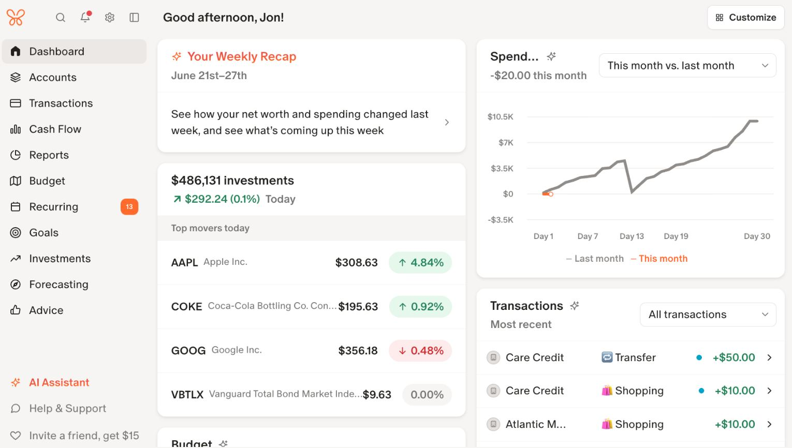](../../assets/design/references/monarch-money-dashboard.jpg ':ignore')          | [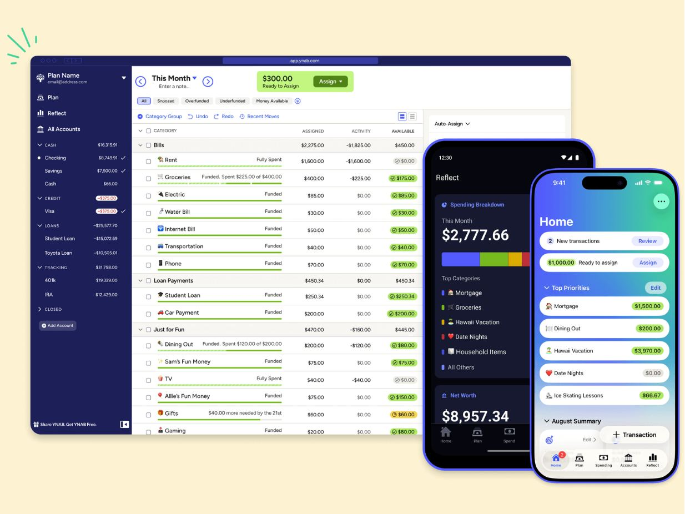](../../assets/design/references/ynab-plan.jpg ':ignore')                             |
| **Actual: accounts in their own framed zone**                                                                                                                                                    | **Copilot: a quiet account list under type headers**                                                                                                                                  |
| [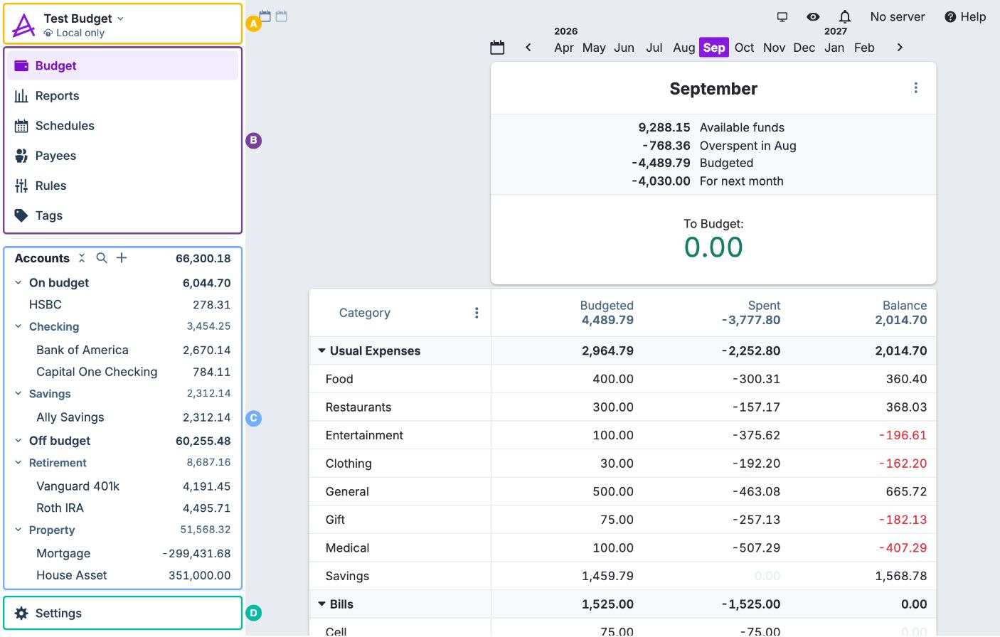](../../assets/design/references/actual-budget-sidebar-budget.jpg ':ignore') | [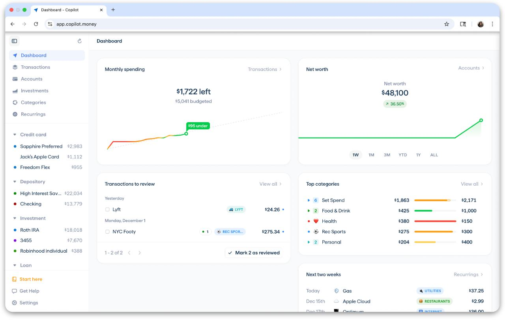](../../assets/design/references/copilot-money-dashboard.jpg ':ignore') |

| Approach                                                  | Apps                          | What it costs                                                              |
| --------------------------------------------------------- | ----------------------------- | -------------------------------------------------------------------------- |
| Sidebar holds navigation only                             | Monarch                       | Balances are one click away instead of always visible                      |
| Navigation only, plus accounts the user pins as bookmarks | Mercury                       | Balances appear only for the accounts the user chose                       |
| Accounts in a separate zone with its own header           | Actual, Simplifi (own column) | A second visual system in the sidebar; needs a frame to avoid confusion    |
| Accounts grouped by type under the navigation             | YNAB, Copilot                 | Works only with small, quiet rows that clearly differ from navigation rows |
| A live figure or count under a navigation item            | Toshl                         | Needs one currency, or a count instead of an amount                        |

CoinKeeper today puts accounts under the navigation without a frame, with totals repeated and debt shown as a positive number, which is why rows and links look alike. The proposal follows Monarch and keeps a count badge on Review; if the owner wants balances in the sidebar, Actual's framed zone is the model to copy.

| CoinKeeper today                                                                                                 | Proposed                                                                                                                |
| ---------------------------------------------------------------------------------------------------------------- | ----------------------------------------------------------------------------------------------------------------------- |
|  |  |

## Home: the first number

| Copilot: left of budgeted, with a pace line                                                                                                                              | Quicken Simplifi: left this month and per day                                                                                                                   |
| ------------------------------------------------------------------------------------------------------------------------------------------------------------------------ | --------------------------------------------------------------------------------------------------------------------------------------------------------------- |
|                  |  |
| **PocketGuard: Leftover first, with pace in words**                                                                                                                      | **Lunch Money: task cards for what to review**                                                                                                                  |
|  | [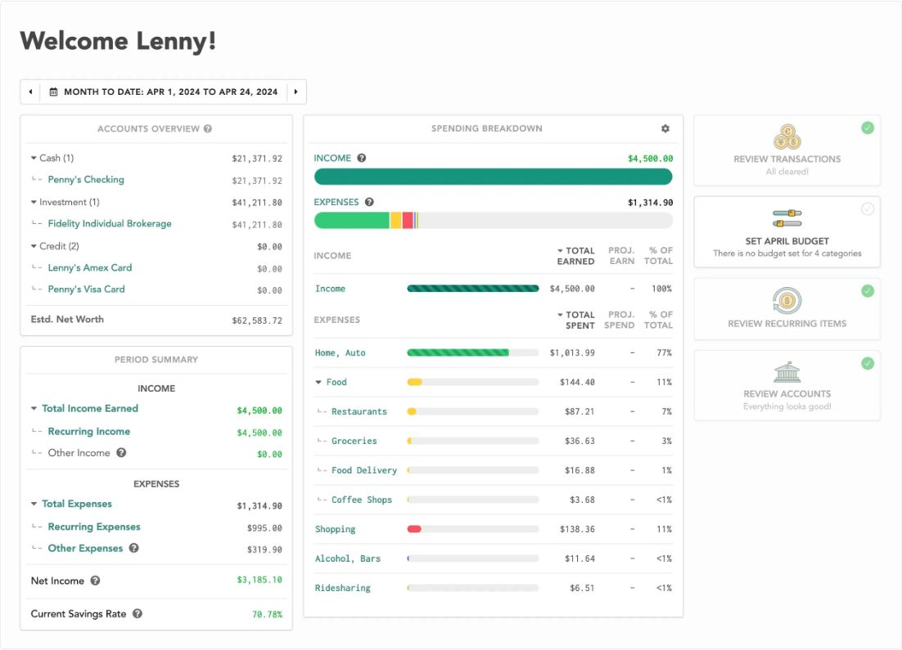](../../assets/design/references/lunch-money-overview.jpg ':ignore')           |

| App          | First thing on the screen                                              | Then                                                           |
| ------------ | ---------------------------------------------------------------------- | -------------------------------------------------------------- |
| Copilot      | "Left" of the budget, with spending against a dotted ideal-pace line   | Items to review, top categories                                |
| Simplifi     | "Left this month" with a per-day allowance                             | Recent spending, bills with letter tiles                       |
| PocketGuard  | Leftover, with the plan that produces it listed in formula order       | Pace in words, trend                                           |
| Emma         | Account-group totals, each in its own color                            | Transactions with merchant logos and bank badges               |
| Lunch Money  | Accounts and the period summary                                        | Task cards that turn into checks when done                     |
| Rocket Money | Current spend with plain-language phrases ("left to spend", "to earn") | Accounts, recent transactions with logos, an upcoming calendar |
| Monarch      | A greeting and a grid of equal widgets, no single figure               | Customizable order                                             |
| Wallet       | A row of colored account tiles and three gauges                        | Balance trend, last records                                    |

Copilot, Simplifi and PocketGuard lead with money left to spend, and Emma does the same on its budget screen. Monarch is the counter-example: its customizable grid has no headline, the same weakness as CoinKeeper's dashboard today. The proposal leads with **Left to spend** (Copilot, Simplifi, PocketGuard) and adds an attention strip in the spirit of Lunch Money's task cards.

| CoinKeeper today                                                                                                       | Proposed                                                                                                       |
| ---------------------------------------------------------------------------------------------------------------------- | -------------------------------------------------------------------------------------------------------------- |
|  |  |

## Accounts

| Monarch: groups, change, sparklines, summary                                                                                                          | Copilot: net worth, groups, utilization chips                                                                                                                                              |
| ----------------------------------------------------------------------------------------------------------------------------------------------------- | ------------------------------------------------------------------------------------------------------------------------------------------------------------------------------------------ |
| [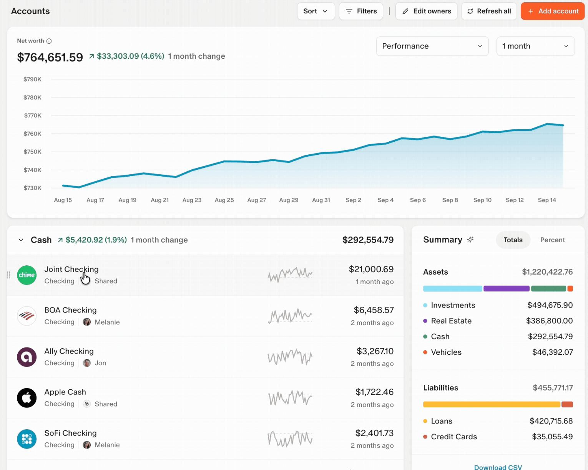](../../assets/design/references/monarch-money-accounts.jpg ':ignore') | [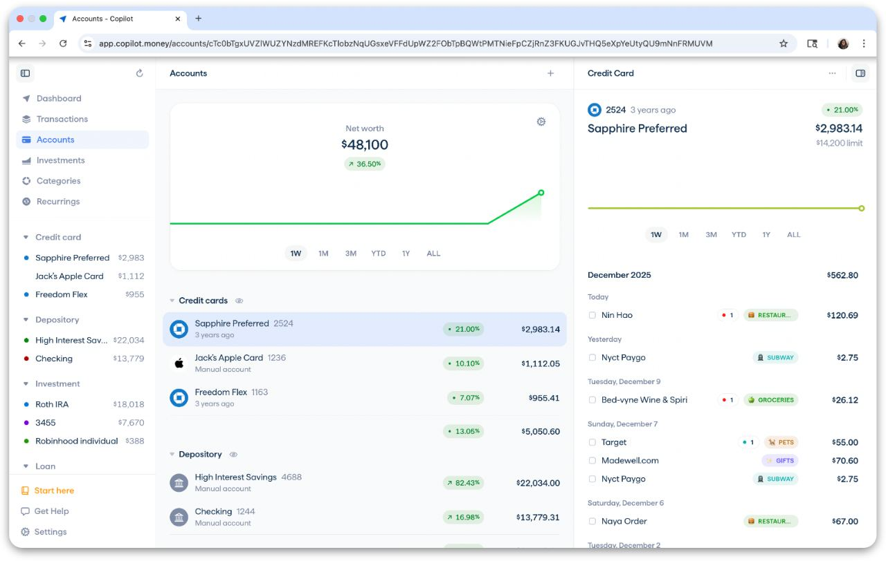](../../assets/design/references/copilot-money-accounts.jpg ':ignore')                                      |
| **Spendee: total wealth with a range control**                                                                                                        | **Simplifi: a projected balance with upcoming bills**                                                                                                                                      |
|              |  |

| App          | How account types are told apart                              | Change over time                            | Liabilities                                   |
| ------------ | ------------------------------------------------------------- | ------------------------------------------- | --------------------------------------------- |
| Monarch      | One card per type, institution logos                          | Group 1-month change, sparkline per account | Stacked Liabilities bar in the summary        |
| Copilot      | Groups with totals, institution logos                         | Net worth card                              | Utilization chip on credit cards              |
| Spendee      | A subtitle naming the type                                    | Monthly change under each balance           | Not covered by the study                      |
| Rocket Money | Gray outline icons per type                                   | Change chips colored by meaning             | Debt growth in orange; a "net cash" line      |
| Wallet       | Colors chosen by the user, so the type does not show          | Balance trend                               | Shown as a negative balance                   |
| Simplifi     | Nested groups with subtotals                                  | Past line and dotted projection             | Not covered by the study                      |
| Mercury      | A plain table with the type and masked number under each name | A 30-day balance chart on Home              | A usage bar with available credit on the card |
| Wise         | One card per currency with a flag, nothing summed in the list | A labeled total above the currency cards    | Not applicable                                |

The owner's complaint (O6) is Wallet's weakness: when color is a free choice, a credit card and a savings account look alike. The proposal fixes the icon and color per type, as Wallet does only in its add-account chooser, and takes Monarch's group totals, change, sparklines and summary.

| CoinKeeper today                                                                                                    | Proposed                                                                                                                   |
| ------------------------------------------------------------------------------------------------------------------- | -------------------------------------------------------------------------------------------------------------------------- |
|  |  |

## Transactions and picking a category

| Copilot: inline autocomplete on the row                                                                                                                                             | Actual: grouped autocomplete driven by the keyboard                                                                                                               |
| ----------------------------------------------------------------------------------------------------------------------------------------------------------------------------------- | ----------------------------------------------------------------------------------------------------------------------------------------------------------------- |
| [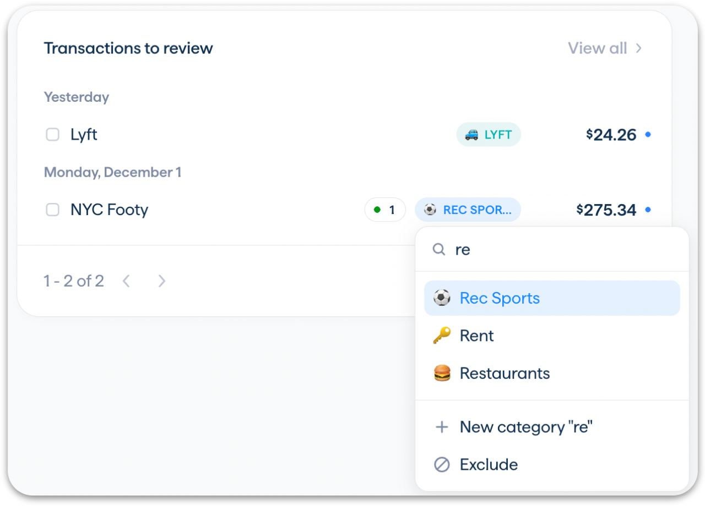](../../assets/design/references/copilot-money-category-picker.jpg ':ignore')          | [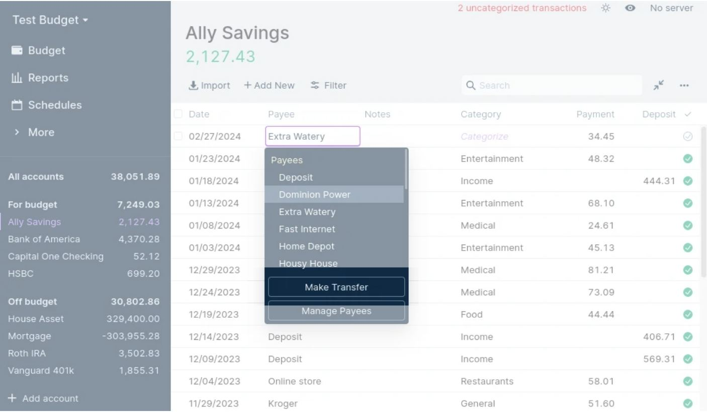](../../assets/design/references/actual-budget-autocomplete.jpg ':ignore')  |
| **Wallet: a list with Most frequent on top**                                                                                                                                        | **Monarch: one-line rows under date bands, with logos**                                                                                                           |
|  | [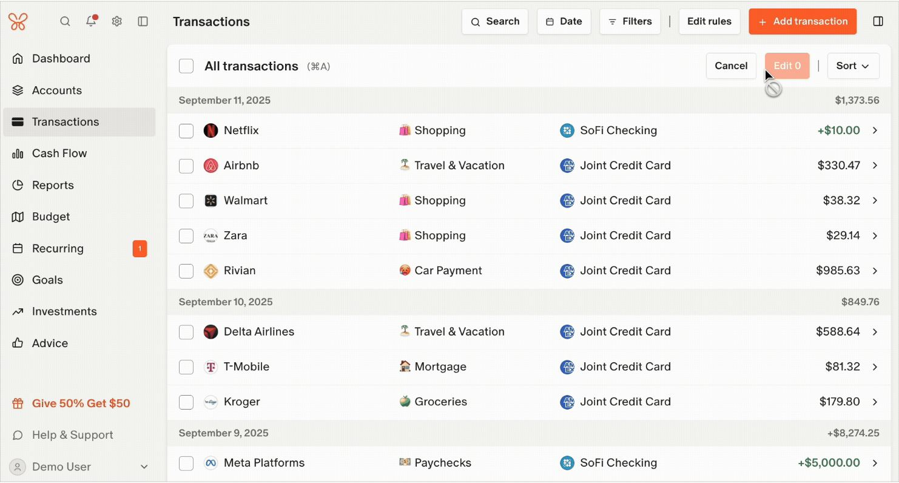](../../assets/design/references/monarch-money-transactions.jpg ':ignore') |

| App              | Picker                                   | Search              | Suggested or recent first           | Where it opens                               |
| ---------------- | ---------------------------------------- | ------------------- | ----------------------------------- | -------------------------------------------- |
| Copilot          | List in a popover                        | Yes                 | Suggestions on top                  | On the row                                   |
| Actual           | Autocomplete grouped by category group   | Yes, as you type    | Split option on top; balances shown | Under the cell                               |
| Mercury          | Type-ahead list inside the Category cell | Yes, as you type    | No                                  | In the row, with a detail panel on the right |
| YNAB             | Grouped dropdown                         | Yes, as you type    | No                                  | Under the cell                               |
| Wallet           | Full-screen list                         | No                  | Most frequent row                   | A new screen                                 |
| Emma             | Grid with subcategory chips              | No                  | No                                  | A separate screen                            |
| Toshl            | Word cloud                               | No                  | No                                  | A sheet                                      |
| CoinKeeper today | Two-column grid of 51 tiles              | Category names only | No                                  | A 540 px modal                               |

The apps whose pickers are fast (Copilot, Actual, YNAB, Mercury) all use a searchable list that opens where the category is shown. The grid pickers (Emma, CoinKeeper) have no search and need scrolling. For rows, Monarch and Toshl keep one line per transaction under date headers with a day total, Lunch Money uses a dense one-line table, and Rocket Money shows the logo first so the list reads as a list of companies.

| CoinKeeper today                                                                                                                         | Proposed                                                                                                             |
| ---------------------------------------------------------------------------------------------------------------------------------------- | -------------------------------------------------------------------------------------------------------------------- |
|  |  |

## Budgets

| Monarch: only Remaining is colored                                                                                                                            | Copilot: bars colored by pace                                                                                                                      |
| ------------------------------------------------------------------------------------------------------------------------------------------------------------- | -------------------------------------------------------------------------------------------------------------------------------------------------- |
| [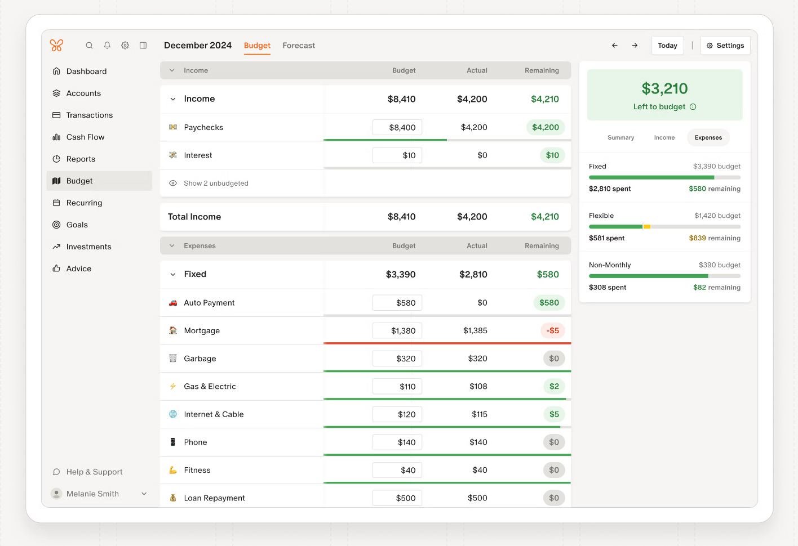](../../assets/design/references/monarch-money-budget.jpg ':ignore')               | [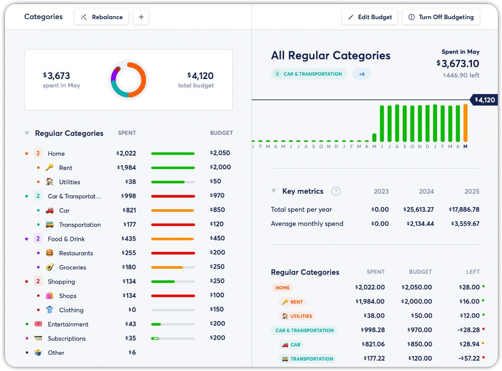](../../assets/design/references/copilot-money-budgets.jpg ':ignore') |
| **Wallet: status in words, bar in the status color**                                                                                                          | **PocketGuard: "left to spend" and "X of Y" apart**                                                                                                |
|  |  |

| App         | Hero figure                    | How spent and left are told apart                            | Status                       | Pace                         |
| ----------- | ------------------------------ | ------------------------------------------------------------ | ---------------------------- | ---------------------------- |
| Monarch     | Left to budget, in a green box | Budget editable, Actual plain, only Remaining colored        | Green, red or gray pill      | Thin bar under each row      |
| YNAB        | Ready to Assign                | Only Available is a colored pill                             | Pill with icon and word      | Target ring in the inspector |
| Copilot     | Left of budgeted               | Left large, spent small                                      | Bar color: green, amber, red | Bars colored by projection   |
| Wallet      | The status line of each budget | "Risk of overspend: 855 / 1,000"                             | Words plus bar color         | No                           |
| PocketGuard | Left to spend                  | "78 left to spend" under the name, "122 of 200" on the right | "On pace" with a dot         | Predicted month total        |
| Emma        | "763 left of 2,182"            | Left large, total small, legend for spent and committed      | Words                        | Daily allowance card         |
| Spendee     | Left per day as a sentence     | Spending line against an ideal-pace line                     | Today flag                   | Dashed ideal-pace line       |
| Toshl       | Left, colored                  | Left colored, used gray, at opposite ends of one bar         | Color                        | A today tick on every bar    |

No app shows five figures of equal weight. Each picks one hero figure (almost always what is left), states the rest as "X of Y" or in a sentence, and colors only the figure or pill that carries the status. The proposal does the same, draws the pace marker the way Toshl and Spendee do, and adds PocketGuard's "Everything else" as **Spending without a budget**.

| CoinKeeper today                                                                                                 | Proposed                                                                                                                |
| ---------------------------------------------------------------------------------------------------------------- | ----------------------------------------------------------------------------------------------------------------------- |
|  |  |

## Analytics

| Monarch: Cash Flow, Spending and Income tabs                                                                                                                          | YNAB: report tabs sharing one filter row                                                                                                                    |
| --------------------------------------------------------------------------------------------------------------------------------------------------------------------- | ----------------------------------------------------------------------------------------------------------------------------------------------------------- |
| [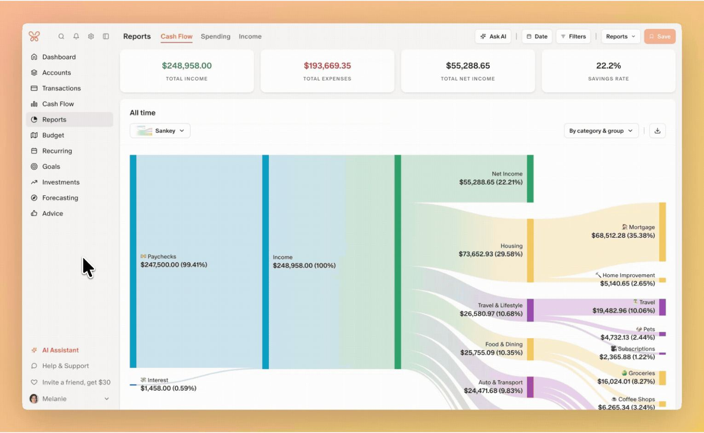](../../assets/design/references/monarch-money-reports.jpg ':ignore')                    | [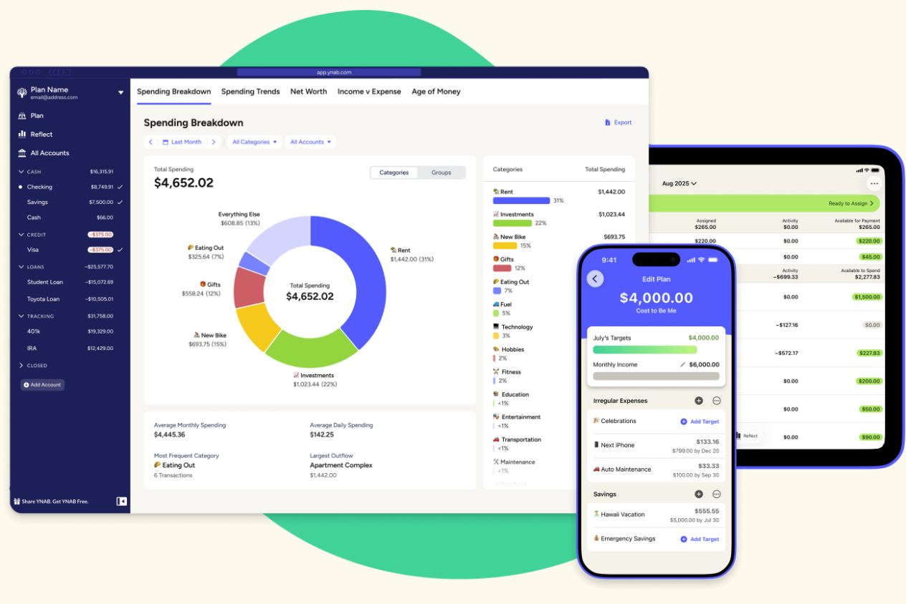](../../assets/design/references/ynab-reflect.jpg ':ignore')                               |
| **Actual: a dashboard of report widgets**                                                                                                                             | **Lunch Money: bars with a drill-down tooltip**                                                                                                             |
| [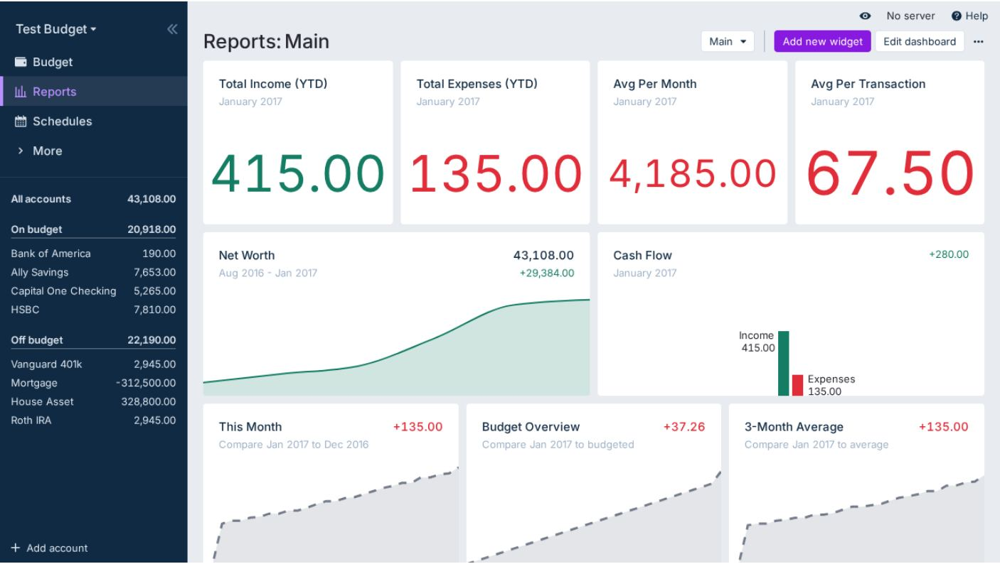](../../assets/design/references/actual-budget-reports-dashboard.jpg ':ignore') | [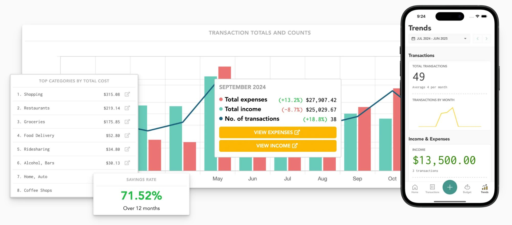](../../assets/design/references/lunch-money-stats-trends.jpg ':ignore') |

| App         | Organization                                               | Drill-down                                   |
| ----------- | ---------------------------------------------------------- | -------------------------------------------- |
| Monarch     | Three tabs, each with figure tiles and a chart selector    | Every chart part opens filtered transactions |
| YNAB        | Report tabs sharing one filter row                         | Categories open their transactions           |
| Simplifi    | A home of report tiles; each report opens as a tab         | Rows expand by category and subcategory      |
| Actual      | A dashboard of widgets with the figure and change on top   | Widgets open full reports                    |
| Wallet      | A hub of cards, each opening a sub-page                    | Per card                                     |
| Emma        | One ranked list with a category or merchant toggle         | Category bars against an average line        |
| PocketGuard | Insight tabs: pie, list, tags, merchants                   | Comparison with last month                   |
| Mercury     | An Insights sub-page with a month range for the whole page | "% of total" tables with a thin bar          |
| Wise        | One currency per report, with a switcher in the header     | Month chips and a category list              |

Every app splits analytics into views: tabs (Monarch, YNAB, PocketGuard), tiles that open reports (Simplifi, Wallet, Actual) or a toggle (Emma). None repeats the home screen, which is what CoinKeeper's Analytics does today. The proposal uses Monarch's and YNAB's shape: tabs that are sub-pages, one shared filter row, and drill-down from every amount.

| CoinKeeper today                                                                                                       | Proposed                                                                                                                                                 |
| ---------------------------------------------------------------------------------------------------------------------- | -------------------------------------------------------------------------------------------------------------------------------------------------------- |
|  |  |

## What CoinKeeper takes from each app

| App              | Takes                                                                                                                       | Leaves                                            |
| ---------------- | --------------------------------------------------------------------------------------------------------------------------- | ------------------------------------------------- |
| Monarch          | Accounts page (groups, change, sparklines, summary), one-line rows under date bands, report tabs                            | The customizable grid without a headline          |
| Rocket Money     | A logo or monogram at the start of every payee row; figures written as phrases; change colored by meaning                   | Gradient headers                                  |
| Wallet           | A fixed icon and color per account type; budget status in words                                                             | User-chosen account colors; red for every expense |
| Copilot          | The inline category autocomplete; bars colored by pace; the summary line over filtered rows                                 | Emoji as the only category mark                   |
| YNAB             | One status pill per budget; report tabs with one filter row                                                                 | The account list in the sidebar                   |
| Actual           | A keyboard-driven grouped autocomplete; a framed accounts zone if accounts ever return to the sidebar                       | The spreadsheet density                           |
| Mercury          | Strict color use (ink for money out, green for money in); the totals strip over filtered rows; the category list in the row | Cents set smaller, which hurts column alignment   |
| Wise             | One card per currency and a labeled converted total above them; one row layout everywhere                                   | A second bright green for the main button         |
| Quicken Simplifi | "Left this month" with a per-day allowance; letter tiles as a fallback                                                      | The emoji greeting                                |
| Lunch Money      | Task cards that tell you what to do first                                                                                   | Emoji inside category names                       |
| PocketGuard      | Leftover first; pace in words; the "Everything else" budget row                                                             | The dark theme and bright accents                 |
| Emma             | "Left of" as the hero; a daily allowance card; a bank badge on the payee avatar (later)                                     | The grid category picker without search           |
| Spendee          | The per-day sentence and a Today flag on budgets                                                                            | Red for every expense                             |
| Toshl            | A today tick on every budget bar; left colored and used gray                                                                | Word-only categories                              |
