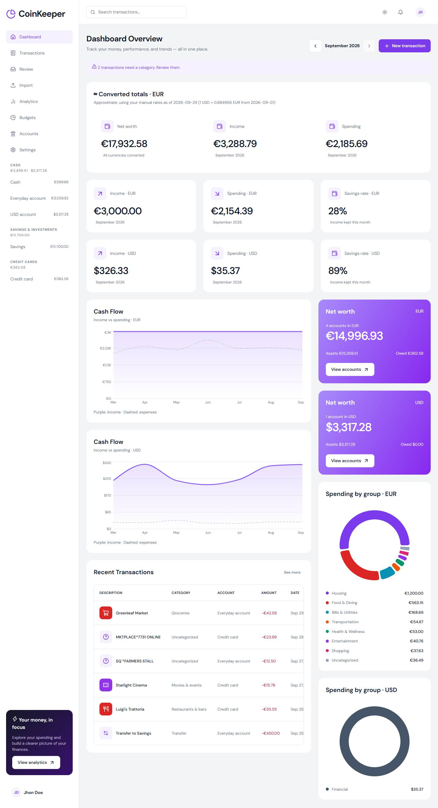
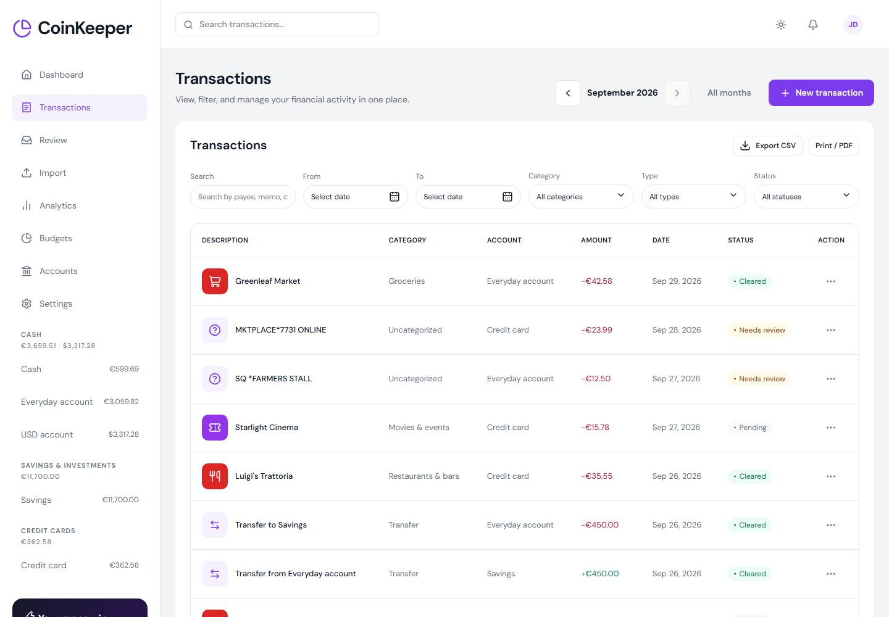
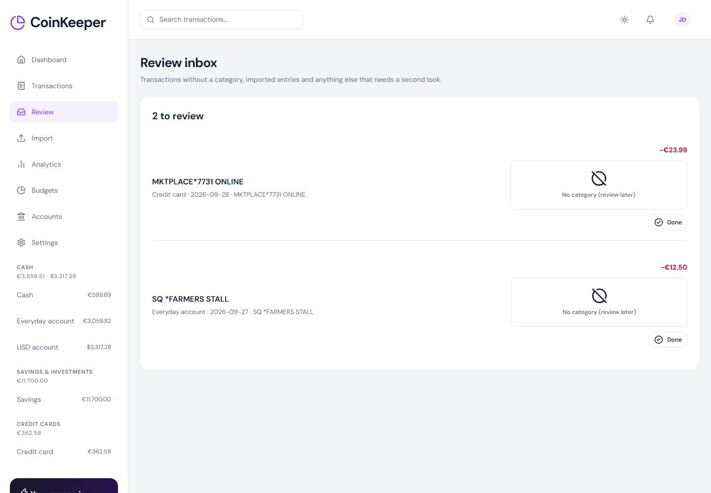
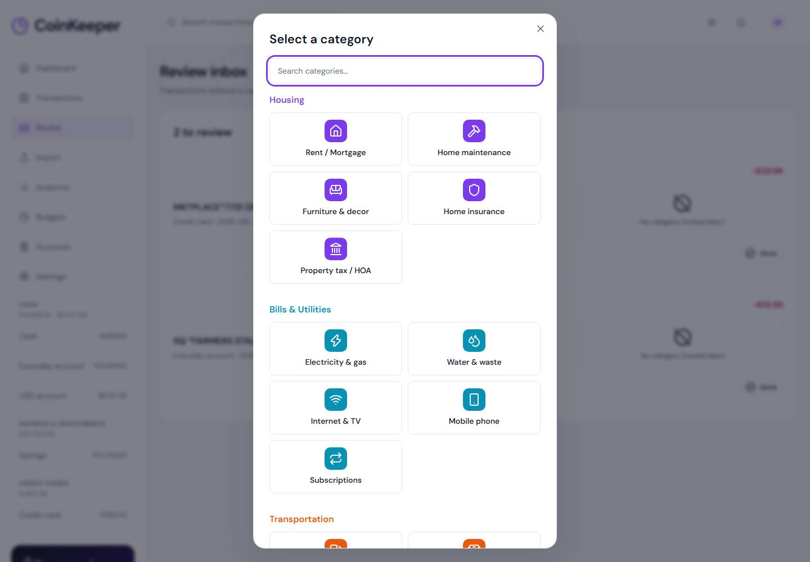
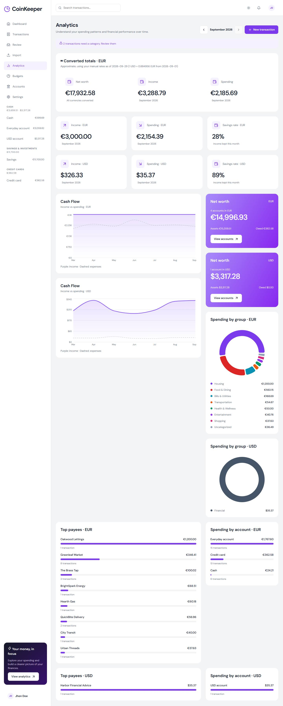
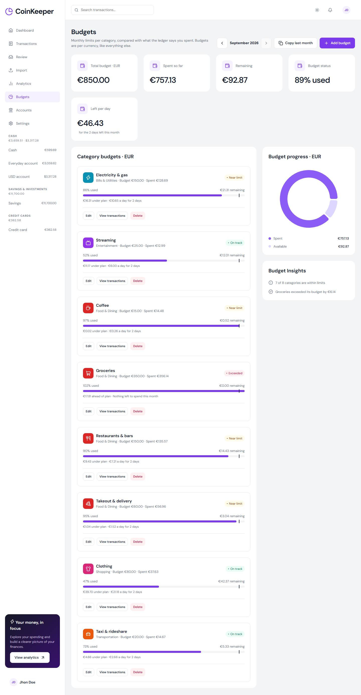
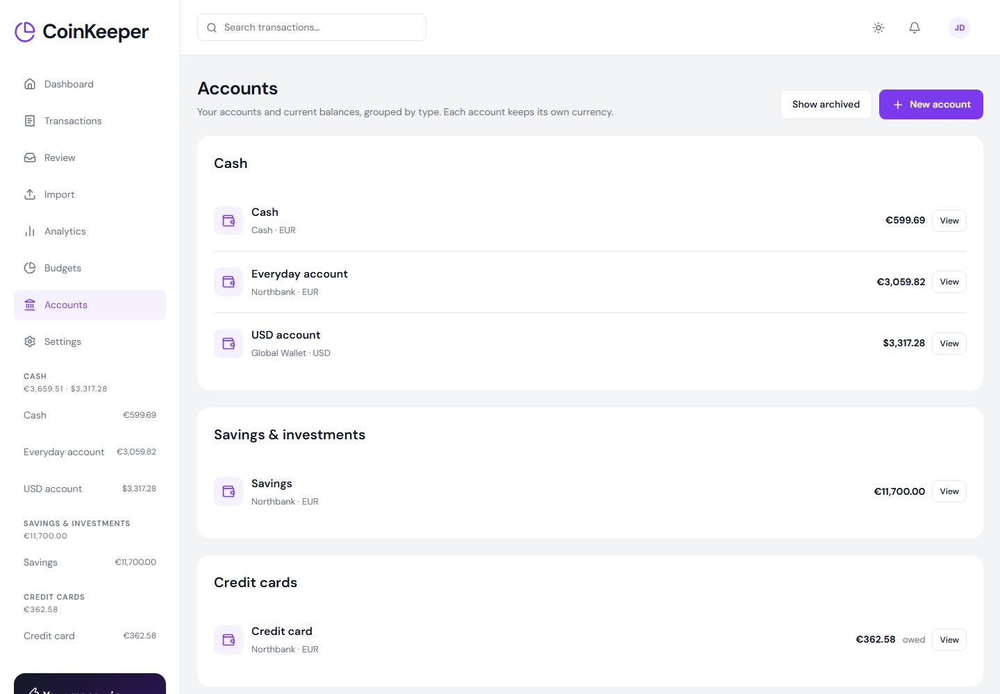
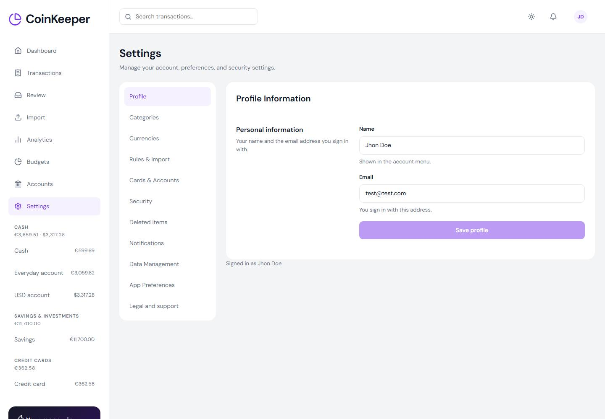
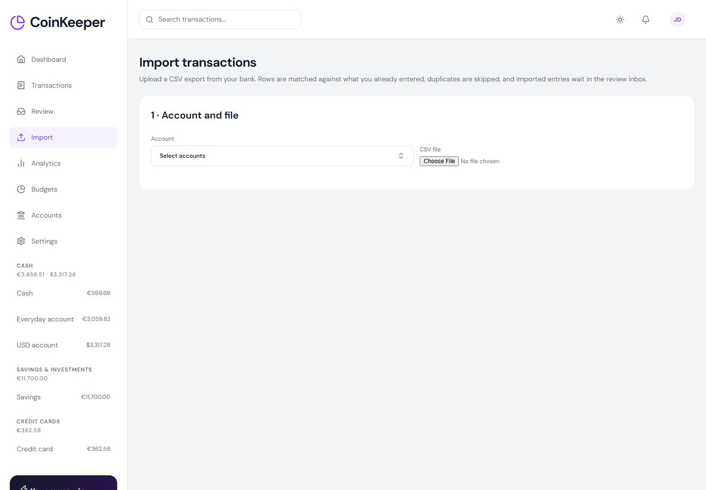
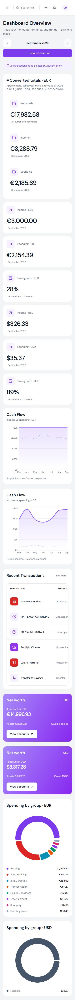

# Current UI review

> Summary: a user-centered review of CoinKeeper's web interface as built after roadmap phase 1: the theme and visual language (tokens, color roles, DM Sans without tabular figures, dark mode wiring), then each module (shell, dashboard, transactions, review and category picker, analytics, budgets, accounts, settings, mobile) with what the user needs to learn there, what the screen shows today, and the problems ranked by severity.

This page describes the interface as it is, so the [UI proposal](ui-proposal.md) can say precisely what changes and why. Every screenshot comes from the seeded [demo account](../../getting-started/demo-account.md) (September 2026, four EUR accounts and one USD account) at 1440 px wide unless marked as mobile. The component names and file paths come from reading `apps/web/src`.

## How the review was done

The review combined four inputs:

- the eight issues the product owner raised after using the app (numbered O1 to O8 below);
- a walk through every screen of the demo account on desktop and at 390 px wide, asking for each module "what does the user come here to learn, and how fast do they learn it";
- a read of the components that build each screen, to separate design problems from data problems;
- the patterns from the [app design studies](README.md#app-design-studies) and [Finance UI patterns](ui-patterns.md).

Severity uses three levels: **high** means the user misreads or cannot find the answer, **medium** means the answer is there but slow to find, **low** is polish.

| #   | Owner issue                                                                                    |
| --- | ---------------------------------------------------------------------------------------------- |
| O1  | The dashboard shows too much at once, and it is unclear what to check first                    |
| O2  | Review rows are too tall because of the category selector                                      |
| O3  | The category selector is a modal grid of big tiles; a searchable list or autocomplete would do |
| O4  | Analytics is long, hard to follow and has gaps; sub-pages could organize it                    |
| O5  | On Budgets, Total budget, Spent so far, Remaining and the rest look the same                   |
| O6  | Accounts is bland, and cash, savings and credit cards look alike                               |
| O7  | In the sidebar it is unclear what is a button and what is an account                           |
| O8  | The "Your money, in focus" card is irrelevant and takes space                                  |

## Findings at a glance

| #   | Finding                                                                                                                                                                  | Where                        | Severity | Owner issue |
| --- | ------------------------------------------------------------------------------------------------------------------------------------------------------------------------ | ---------------------------- | -------- | ----------- |
| F1  | Income and spending appear three times on the dashboard (converted block, EUR cards, USD cards), and every card looks the same, so nothing reads as the headline         | Dashboard, Analytics         | High     | O1          |
| F2  | Analytics renders the whole dashboard again and only adds two rankings at the bottom                                                                                     | Analytics                    | High     | O4          |
| F3  | Budget bars are always violet, even when the budget is exceeded; an overspend shows as **€0.00 remaining** in the card and as an uncolored number in the summary         | Budgets                      | High     | O5          |
| F4  | Every metric card and every account uses the same `Wallet` icon on the same violet tile                                                                                  | Dashboard, Budgets, Accounts | High     | O5, O6      |
| F5  | A budget can show **Near limit** and "€16.31 under plan" at the same time: the badge uses the share spent, the text uses the pace                                        | Budgets                      | High     | O5          |
| F6  | The category picker trigger is 100 px tall in review rows and in the transaction dialog, and the picker opens a 540 px modal with 51 tiles                               | Review, transaction dialog   | High     | O2, O3      |
| F7  | The sidebar lists accounts without icons, repeats group totals, and shows a credit card debt as a positive number with no "owed"                                         | Shell                        | Medium   | O7          |
| F8  | The accent color carries no meaning: it marks buttons, the active page, icon tiles, income in charts, every progress bar, the review notice and the net worth card       | Everywhere                   | Medium   | O1, O5      |
| F9  | Every expense is red, the color also used for danger, so a normal month of spending reads like a list of errors                                                          | Transactions, dashboard      | Medium   | O1          |
| F10 | DM Sans, as served by Google Fonts, has no tabular figures, so amounts in columns never line up                                                                          | Everywhere                   | Medium   | none        |
| F11 | The two-column layout stacks cards of different heights independently, which leaves large empty areas                                                                    | Analytics, dashboard         | Medium   | O4          |
| F12 | The header has a notifications bell with static content, a theme toggle, and a second account menu                                                                       | Shell                        | Low      | O8          |
| F13 | The mobile dashboard is about 5,200 px tall (six phone screens) and the recent transactions table scrolls sideways                                                       | Mobile                       | Medium   | O1          |
| F14 | Settings has 11 tabs, and Notifications, Data Management, App Preferences and Legal are previews that change nothing                                                     | Settings                     | Low      | none        |
| F15 | Some colors fail WCAG contrast: the chart gray `#9ca3af` (2.5:1 on white), the budget donut's "Available" `#ddd6fe` (1.4:1) and the yellow group color `#CA8A04` (2.9:1) | Charts, categories           | Medium   | none        |

## Theme and visual language

### Tokens today

The light theme in `apps/web/src/styles/tokens.scss` is sound as a base: a light gray canvas (`#f3f4f6`), white panels, near-black ink (`#111827`), a gray for secondary text (`#667085`) and soft status colors. The problems are in how the colors are used, not in the values.

| Role              | Token today                                                     | What happens on screen                                                                                                            |
| ----------------- | --------------------------------------------------------------- | --------------------------------------------------------------------------------------------------------------------------------- |
| Brand and actions | `--accent` `#7c3aed`                                            | Also used for icon tiles, the active page, income in charts, every progress bar and the review notice, so it signals nothing      |
| Negative money    | `--danger` `#be123c`                                            | Every expense amount is red, the same red as errors and overspending                                                              |
| Positive money    | `--success` `#047857`                                           | Income and "on track" badges; fine                                                                                                |
| Panels            | white, radius 18 px, no border, no shadow                       | Cards float on the gray canvas; with large radii and padding the page feels soft rather than precise                              |
| Gradients         | `--gradient-balance`, `--gradient-promotion`, `--gradient-card` | The purple net worth card and the dark promotion card are the loudest things on the page, and neither is the most important       |
| Group colors      | 16 hex values in `packages/shared/src/constants/palette.ts`     | Housing is violet like the brand, Food & Dining is red like danger, and violet and purple groups are hard to tell apart in charts |

### Icons and figures

Every `MetricCard` falls back to the `Wallet` icon because no screen passes another one, and `LinkedAccount` uses `Wallet` for every account type. The eye cannot use the icon to tell Income from Spending, Spent from Remaining, or a savings account from a credit card. The `trend` line on `MetricCard` exists but no screen uses it, so no metric shows a change against last month.

DM Sans renders every figure with proportional widths. Measured in the browser at 40 px, ten "1" digits are 103 px wide and ten "0" digits are 268 px wide, with or without `font-variant-numeric: tabular-nums`, because the font served by Google Fonts has no tabular figures. Inter, for comparison, sets both strings at 259 px with tabular figures on. Amounts in tables, budget lists and legends therefore jitter from row to row.

Several colors are below the WCAG 2.2 minimums (F15): chart marks need 3:1 against white and body text 4.5:1, and [Finance UI patterns › Color for a finance app](ui-patterns.md#color-for-a-finance-app) lists each failing value.

Headings mix title case ("Cash Flow", "Recent Transactions", "Budget Insights", "Profile Information") and sentence case ("Category budgets", "Top payees").

### Dark mode

The dark theme is a second set of 15 tokens under `:root[data-theme='dark']`, applied by `apps/web/src/lib/appearance.ts` and the header `ThemeToggle`. It has known gaps: panels are darker than the canvas (inverted elevation), `--shadow` and the gradients are not adapted, group colors and chart colors are fixed hex, there is no pre-paint script so dark users see a light flash, and toasts stay light. The owner prefers a single light theme. Removing dark mode touches `tokens.scss`, `lib/appearance.ts`, `shell/theme-toggle`, `application-header.tsx`, the Appearance select in `settings-panels.tsx`, their tests, and the color-scheme loop in `e2e/accessibility.spec.ts`.

## Shell and navigation

| Current sidebar                                                                                                  | What the user needs                                                                                                                                                                    |
| ---------------------------------------------------------------------------------------------------------------- | -------------------------------------------------------------------------------------------------------------------------------------------------------------------------------------- |
|  | Reach the four or five places they use every week in one click, see at a glance that something needs attention (two transactions to review), and never mistake a balance for a button. |

What the sidebar shows today, top to bottom:

1. The logo, whose icon is the same `ChartPie` as the Budgets item.
2. Eight equal navigation items in the order Dashboard, Transactions, Review, Import, Analytics, Budgets, Accounts, Settings. Import and Settings are setup tasks but sit between daily items.
3. The account list: group labels in small capitals with per-currency totals ("CASH €3,659.51 · $3,317.28"), then one line per account with a muted amount. The rows have no icon and no hover affordance, so they read as text rather than links, while the navigation items above look like links. A group with one account shows its total twice, and the credit card shows its debt twice as a positive number without "owed".
4. The "Your money, in focus" promotion card (`ui/promotion-panel`): a dark gradient card linking to Analytics, shown on every page including Analytics itself.
5. The account menu.

The header adds a search box, a theme toggle, a notifications bell whose popover always says "You're all caught up" (it has no data behind it), and a second account menu. Review has no count badge, so the only signal that transactions wait is the notice inside the dashboard.

## Dashboard

_The dashboard of the demo account in September 2026._

**What the user comes to learn**, in this order: am I OK this month; does anything need me; where did the money go; what happened recently. A person opening a budget app answers the first question in seconds or leaves ([Finance UI patterns › Dashboard hierarchy](ui-patterns.md)).

**What the screen shows**, top to bottom: a review notice; a "≈ Converted totals · EUR" panel with three cards (net worth, income, spending); three EUR cards (income, spending, savings rate); three USD cards; a cash flow chart per currency; the six most recent transactions (not filtered by the selected month); a purple net worth card per currency; a spending donut per currency.

**Problems:**

- **F1 (high).** Twelve cards and charts compete before the first scroll, all with the same icon, size and weight. Income and spending each appear three times: once converted, once per currency. Net worth appears three times (converted, EUR card, USD card) and $3,317.28 appears four times on the screen including the sidebar. The page never says which number matters most.
- **The loudest element is not the most important.** The gradient net worth cards and the dark promotion card draw the eye, while "how much can I still spend" (the question the phase 1 pace work answers) is not on the dashboard at all.
- **Per-currency repetition doubles everything.** Two cash flow charts, two net worth cards and two donuts follow each other. The USD donut has a single slice ("Financial"), which says nothing.
- **Charts rely on color alone.** The cash flow legend is the sentence "Purple: income · Dashed: expenses", and the donut has no total in its center.
- **The month label repeats** under every income and spending card, six times, next to the month picker that already shows it.

## Transactions

**What the user comes to learn:** what happened, where, and whether each entry is right; then fix or find something quickly.

**What works:** filters are all present (search, dates, category, type, status), the row menu has Duplicate, export and print exist.

**Problems:**

- Rows are 79 px tall with 18 px cell padding, so ten rows fill the screen and pagination (10 per page) is needed for a month of about 45 entries.
- Every row carries a solid 42 px tile in the group color with a white icon. With many rows the list becomes a column of red, purple and orange squares, and the payee, the thing the user recognizes, is not what stands out.
- All expenses are red (F9). Status badges repeat **Cleared** on almost every row, which is the normal state and adds no information.
- A transfer shows as two rows ("Transfer to Savings −€450.00" and "Transfer from Everyday account +€450.00"), which doubles the entry in an all-accounts list.
- The panel title "Transactions" repeats the page title, and dates show as "Sep 29, 2026" in a separate column instead of grouping rows by day.

## Review inbox and category picker

| Review inbox                                                                                                        | Category picker                                                                                                                          |
| ------------------------------------------------------------------------------------------------------------------- | ---------------------------------------------------------------------------------------------------------------------------------------- |
|  |  |

**What the user comes to learn:** which entries need a decision, and then make each decision in one or two keystrokes.

**Problems:**

- **F6 (high).** The category trigger is a 100 px tall button with a 32 px `CircleOff` icon, so each row is about 210 px tall and two entries fill the panel (O2).
- The bank text appears twice: as the title (the fallback when there is no payee) and again in the description. The date is raw ISO (`2026-09-28`).
- The picker is a 540 px modal with a search box and every expense group as a two-column grid of outline tiles: 51 tiles in 11 sections with the default taxonomy (O3). A tile is about 100 px tall, so the user scrolls through 26 rows of tiles; the search matches category names only, not group names; there is no "recent" or "suggested" section although rules and payee defaults could supply one.
- Nothing is suggested in the row, there is no bulk action, and **Done** re-sends the current category without saying what it does.

The same 100 px trigger and modal are used in the transaction dialog, where they make the form long.

## Analytics

**What the user comes to learn:** how this period compares with others, which categories and payees take the money, and where to cut.

**Problems:**

- **F2 (high).** The analytics page renders the dashboard's `Overview` component with `analytics` set, so it repeats the converted totals, six metric cards, both cash flow charts, both net worth cards and both donuts. The two new rankings (top payees, spending by account) appear only after about 2,600 px of scrolling (O4).
- **F11 (medium).** The left column (two cash flow charts) is much shorter than the right column (two net worth cards and two donuts), which leaves an empty area of about 800 px before the rankings.
- There is no comparison with the previous month, no trend per category, and no breakdown below group level; "Spending by account" adds up to the same total already shown three times.

## Budgets

**What the user comes to learn:** am I on track overall, which budgets need attention, and how much can I still spend today.

**What works:** phase 1 put the right data on the page: pace markers, the per-day allowance, the projection and suggested limits.

**Problems:**

- **O5 (high).** Five metric cards (Total budget, Spent so far, Remaining, Budget status, Left per day) share the same size, weight and `Wallet` icon (F4). The fifth card wraps onto a second row by itself.
- **F3 (high).** Every bar is violet whatever the status, so Groceries at 102% looks like Clothing at 47% until the user reads the badge. The card for an exceeded budget says **€0.00 remaining** instead of how much it is over.
- **F5 (high).** The badge and the pace sentence can disagree: Electricity & gas shows **Near limit** (86% used) and "€16.31 under plan" at once, because the badge uses the share spent and the sentence uses the share of the month that has passed.
- Each budget card is about 180 px tall with three buttons (Edit, View transactions, Delete), so eight budgets need four screens. Cards are sorted by group, not by urgency.
- The "Budget progress" donut repeats Spent and Remaining, and caps Spent at the limit so it disagrees with "Spent so far" once a budget is exceeded. **Budget Insights** marks warnings with a check icon.
- Spending without a budget (65% of September in the demo, mostly rent) is invisible.

## Accounts

**What the user comes to learn:** what I have, what I owe, and how it changes.

**Problems:**

- **O6 (high).** Every account has the same `Wallet` icon on the same violet tile, and the group panels have no totals, so cash, a current account, savings and a credit card look identical apart from their label. The `accounts.icon` and `accounts.color` columns exist in the schema but the API does not accept them and the UI never reads them.
- There is no net worth on the page, no assets and liabilities summary, and no sign of change over time.
- The group named **Cash** contains checking accounts and a cash account called "Cash", which is confusing.
- Each row has a **View** button although the whole row could open the account.

## Settings and import

| Settings                                                                                                            | Import                                                                                                        |
| ------------------------------------------------------------------------------------------------------------------- | ------------------------------------------------------------------------------------------------------------- |
|  |  |

Settings uses 11 vertical tabs. Four of them (Notifications, Data Management, App Preferences, Legal and support) show controls that change nothing, and **Cards & Accounts** shows sample payment cards only in demo mode. The import wizard works but its file input is the unstyled browser control. Neither screen is part of the owner's issues; the proposal trims Settings and leaves Import to a later pass.

## Mobile

At 390 px every dashboard card stacks into one column: the page is about 5,200 px tall, the converted totals and six metric cards come before any chart, and the recent transactions table scrolls sideways (F13). Navigation lives in a drawer behind a menu button, so there is no one-tap way to add a transaction or reach Budgets.
