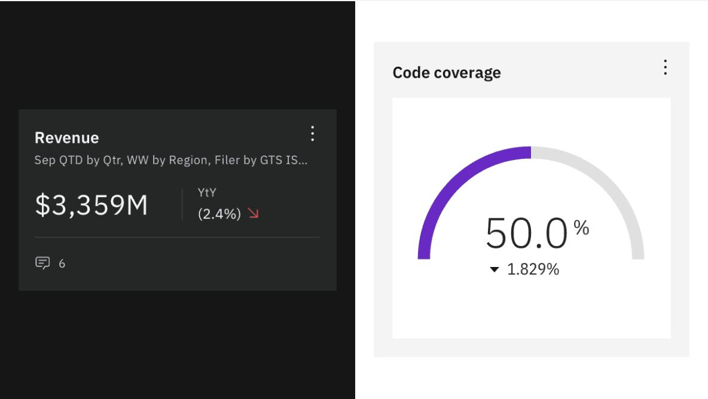
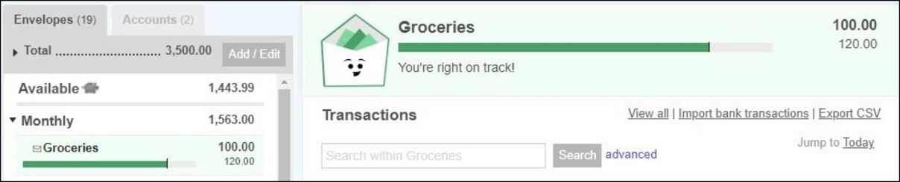
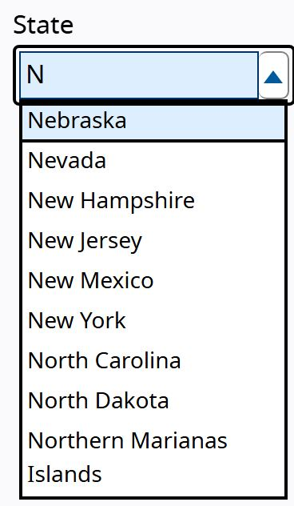
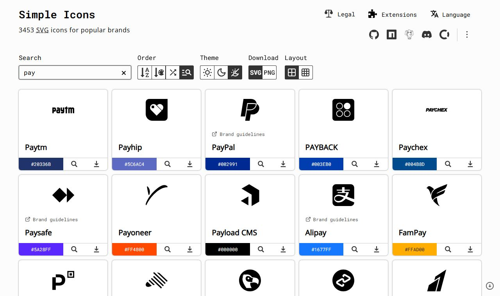
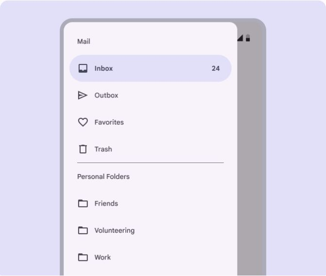
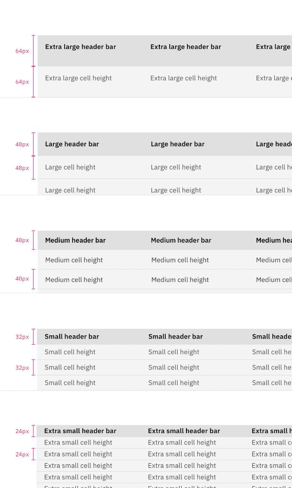

# Finance UI patterns

> Summary: evidence-backed interface patterns for CoinKeeper's light-only redesign (color and contrast, money typography and tabular figures, dashboard hierarchy, budget figures with pace, a searchable category combobox, privacy-first merchant logos, emoji versus icons, account types and liabilities, sidebar navigation, analytics sub-pages, density), each with a concrete recommendation.

This page collects what accessibility standards, design systems, usability research and finance apps say about the patterns the redesign touches, and turns each into a recommendation for CoinKeeper. It complements the feature studies listed in [Research](../README.md). Every section has the same three parts: the evidence, what finance apps do, and the recommendation. Contrast ratios were computed with the WCAG 2.2 formula against today's tokens in `apps/web/src/styles/tokens.scss`, `apps/web/src/styles/theme.ts` and `packages/shared/src/constants/palette.ts`; the DM Sans check rendered the font file CoinKeeper ships and measured digit widths in a browser.

## Color for a finance app

- **Evidence**: WCAG 2.2 asks for 4.5:1 for body text, 3:1 for large text (24 px, or 18.66 px bold) and 3:1 for input borders, icons and chart marks that carry meaning (1.4.3 and 1.4.11), and never color alone to carry meaning (1.4.1). NN/g notes that up to 8% of men have a color vision deficiency, so color should only reinforce what position, shape or text already says. Carbon's status pattern requires at least two of color, shape and symbol; its differential indicator, which Carbon describes as the financial-dashboard pattern for deltas, makes color optional as long as the value carries a plus or minus sign, a caret or an arrow. Stephen Few lists too many bright colors among the common dashboard mistakes, and Carbon asks for one consistent color per data set. Red also changes behavior: Bazley, Cronqvist and Mormann found in eight experiments that showing losses in red lowers risk-taking and return expectations, with no effect on color-blind participants, which argues against painting every expense red.
- **In finance apps**: formal finance products keep surfaces neutral (white cards on a pale gray canvas) and keep the brand color for actions. Monarch shows a change as an arrow, a green or red amount and the words "1 month change", and its transaction list shows income in green with a plus sign while spending stays in ink. YNAB's colored budget pills once failed contrast and relied on color alone; it darkened the text and enlarged minus signs, and its red and orange pills are still hard to tell apart for red-green color-blind users. Copilot colors budget bars green, yellow to orange and red by spending pace.
- **Recommendation**:
  - Keep one accent, violet, for interactive elements only (primary buttons, links, focus ring, the selected navigation item) and never for data. Use `#6d28d9` (7.1:1 on white) for accent text and links and `#7c3aed` (5.7:1) for filled buttons.
  - Give meaning to three semantic hues and nothing else: green `#047857` (5.5:1) for money in, amber `#b54708` (5.4:1) for near-limit and pace warnings, red `#be123c` (6.3:1) for over budget, overdrafts and errors. Spending stays in ink with a minus sign; only income gets color, always with a plus sign. The `Amount` component colors both signs today.
  - Pair every semantic color with a sign, an arrow or a word: "+1,250.00 €", "↑ 120.00 € vs last month", "Over by 40.00 €".
  - Neutrals for the light-only UI: canvas `#f3f4f6`; white cards with a 1 px `#e5e7eb` border, because a white card on that canvas is only 1.1:1 and the border carries the structure (borders also read more like a bank than soft shadows); ink `#111827` (17.7:1); secondary text `#4b5563` (7.6:1); tertiary `#667085` only on white (5.0:1, it drops to 4.5:1 on the canvas); input borders at least `#858c99` (3.4:1).
  - Fix today's data colors: the chart expense gray `#9ca3af` (2.5:1) and the budget "remaining" violet `#ddd6fe` (1.4:1) fail 1.4.11 as chart marks. The group colors amber, green, orange, cyan and emerald measure 3.2:1 to 3.8:1 on white, which is enough for icons and bars but not for text, and yellow `#CA8A04` fails even 3:1 (`#a16207` gives 4.9:1). Use group colors as tile tints, dots and bar fills, never as text color.

_Differential indicators, Carbon Design System (status indicator pattern). What to notice: the change reads correctly in grayscale because the parentheses, arrow and caret carry the direction and color only reinforces it._

## Typography for money

- **Evidence**: tabular figures give every digit the same width, so amounts line up in columns and do not shift when they update. Shopify Polaris uses tabular figures for every money amount and warns against a monospace font as a substitute. Numeric columns and their headers are right-aligned so digits of the same place value line up (Polaris data table, NN/g data tables). The position of the currency symbol is locale data: `Intl.NumberFormat` writes `€1,234.56` for `en-US` and `1.234,56 €` for `de-DE`, and CoinKeeper's `formatMoney` already delegates to it. GOV.UK drops `.00` from whole amounts in running text, which suits prose; a ledger keeps two decimals so columns align. NN/g recommends two or three type sizes to express hierarchy.
- **DM Sans check**: CoinKeeper loads DM Sans through `next/font/google`. Rendered at 100 px, `1111` measures 124.8 px and `0000` measures 273.6 px both with and without `font-variant-numeric: tabular-nums`: the Google Fonts build has proportional figures only and ignores the property (a request for tabular figures sits unanswered on the archived upstream repository). The same test with Inter, Geist, Figtree, Manrope, Plus Jakarta Sans and Public Sans gives equal digit widths once `tabular-nums` is set, and IBM Plex Sans is tabular by default.
- **In finance apps**: Wise sets product text in Inter and keeps its Wise Sans display face for short brand moments; Revolut pairs Inter with a brand display face in the same way. Vercel's Geist ships tabular figures and a slashed zero. SF Pro has proportional figures by default with tabular ones on request, and Apple licenses it for Apple platforms only, so it is not a web font option.
- **Recommendation**:
  - Replace DM Sans with Inter (the common fintech product face, with tabular figures, a slashed zero and wide language coverage), or with Figtree if the team prefers DM Sans's rounder geometric feel. Both load through `next/font/google`.
  - Set `font-variant-numeric: tabular-nums` in the `Amount` component and on every numeric table cell, right-align amount columns and their headers, and always show two decimals in lists and tables.
  - Use three sizes for money: the hero figure at 32 to 40 px semibold (one per screen), card figures at 20 to 24 px semibold, and row amounts at body size (14 to 15 px, medium weight). Put a 12 to 13 px label in the secondary color above each figure, in sentence case.
  - Keep locale-driven symbol placement through `formatMoney`. When EUR and USD blocks sit side by side, head each block with its currency code so the reader does not rely on the symbol.

## Dashboard information hierarchy

- **Evidence**: Stephen Few defines a dashboard as the most important information arranged on one screen and monitored at a glance, and lists running past one screen and arbitrary arrangement among the common failures. Carbon's dashboard guidance says to rank data by importance, give the most important item the highest contrast and the largest area at the top left, limit the number of metrics, and provide the rest on demand. NN/g's inverted pyramid puts the conclusion first, and progressive disclosure shows a few important items and defers the rest until asked. Working memory holds about four chunks (Cowan), which is why a row of three or four figures can be read at a glance and a wall of twelve cannot. NN/g's dashboard article prefers length and position (bars, lines) to area and angle (donuts, gauges).
- **In finance apps**: [PocketGuard](../apps/pocketguard.md) and [Quicken Simplifi](../apps/quicken-simplifi.md) open on one "left to spend" figure with a per-day version. Monarch's Accounts page opens on net worth and its change, then the detail. [Copilot](../apps/copilot-money.md)'s dashboard opens on a month-to-date spending line drawn against a dotted line for the ideal pace.
- **Recommendation**: order the dashboard as an inverted pyramid, each figure shown once:
  1. The answer: one hero per currency for the current month, **Left to spend** (budgets minus spending) with "About 27.00 € a day for 12 days" and a status word. Without budgets, the hero is **Net this month** (income minus spending).
  2. Three supporting figures: Income, Spending and Net, each with its change against last month (sign and arrow) and a link to the matching transactions.
  3. Things that need attention: the review count, budgets near or over their limit, unusual spending. The row disappears when it is empty.
  4. Detail: recent transactions, and spending by group as a ranked bar list instead of the donut.
  - Today income and spending appear three times (the converted block, the EUR cards and the USD cards). Keep per-currency figures as the truth, show the primary currency by default with a segmented currency switch instead of stacked duplicate blocks, and reduce the converted totals to one "≈ approximate" line under the hero or move them to Analytics.
  - The eight-month cash-flow chart and the net worth card answer "how am I trending", not "am I fine this month"; move them to Analytics and the Accounts page, or to the bottom of the dashboard.

## Budget figures

- **Evidence**: a figure is identified faster when it differs from its neighbors in size and position, not only in color (NN/g visual hierarchy). A spent-against-limit bar is a measurement within a known range, which WAI-ARIA models as a meter with a text value rather than a progress bar. Goodbudget draws a thin line on each envelope bar where the balance should be today if spending were even, and writes the verdict under the bar; Copilot colors each bar by pace; YNAB's green, yellow and red pills now come with signs.
- **In CoinKeeper today**: the page already computes pace, the month-end projection, **Left per day** and four statuses (**On track**, **Near limit** from 80%, **Spending too fast**, **Exceeded**), see [Budgets](../../features/budgets.md). The problem is presentation: Total budget, Spent so far, Remaining, Status and Left per day are five cards of equal weight.
- **Recommendation**:
  - Make **Left** the hero, per currency: "312.40 € left" in large type, because it is the number the user acts on. Under it one sentence carries the other two figures: "Spent 187.60 € of 500.00 €".
  - Write the allowance as a sentence, not a stat card: "About 26.00 € a day for 12 days".
  - Bar: the fill is what was spent, the existing tick marks the expected spend today, and anything over the limit shows as a hatched overflow. Either hide the bar from assistive technology and rely on the text, or give it `role="meter"` with an `aria-valuetext` such as "187.60 € of 500.00 € spent, on track".
  - Show the status as a chip with an icon and a word: **On track** (neutral with a check), **Near limit** and **Spending too fast** (amber with a warning icon or up arrow), **Exceeded** (red, "Over by 40.00 €"). Only the chip and the overflow get color; the fill stays neutral or accent while on track.
  - Page header: one hero line per currency ("Left this month") followed by a single secondary line, "Budgeted 2,000.00 € · Spent 1,240.00 € · 26.00 € a day". Drop the separate Status card, since status belongs to each category row.

_Envelope bar with the spending-pace line, Goodbudget help center. What to notice: the line marks where spending should be today, and a plain sentence states the verdict so color is not needed to read it._

## Choosing one category from 60+

- **Evidence**: NN/g finds dropdowns hard to use beyond about 15 options and recommends a combobox (a text field with a filtered list) so users type instead of scanning. GOV.UK recommends its accessible autocomplete over a long native select when users know what they want. The WAI-ARIA combobox pattern puts `role="combobox"` on the input with `aria-expanded`, `aria-controls`, `aria-activedescendant` and `aria-autocomplete="list"`; Down Arrow opens the list and moves through it, Enter accepts, Escape closes. The listbox pattern groups options in `role="group"` elements with a label and recommends type-ahead above seven options and Home and End above five. Baymard keeps suggestion lists short (at most 10 on desktop, 4 to 8 on mobile), highlights the active suggestion, supports arrow keys and styles group labels differently from options. For mobile, NN/g's bottom-sheet guidance expands long content to full screen, keeps a visible Close button, lets Back dismiss the sheet and never stacks sheets.
- **In finance apps**: Actual Budget's category autocomplete lists categories under group headers, ranks name matches above group-name matches and can show each category's balance at the right (see [Actual Budget](../apps/actual-budget.md)). YNAB's mobile picker lists the payee's default category first, then the five categories most recently used with that payee, then everything else. Command menus in the style of Linear show recent items on an empty query and fuzzy-match as you type; CoinKeeper already ships `cmdk` behind the `Command` and `EntityPicker` components.
- **Recommendation**:
  - Replace the modal grid of icon tiles with a combobox built on the existing `Command` component. The closed field shows the chosen category (icon on its group tint plus the name); focusing it or typing opens a popover list anchored to the field.
  - On an empty query, list **Suggested** first (payee memory and matching rules), then **Recent** (the last five used), then every category under its group header with the group's color dot. As soon as the user types, show one flat list fuzzy-matched on category name, group name and aliases, with the group name as secondary text and the first match highlighted.
  - Keyboard: type to filter, Up and Down to move, Enter to pick, Escape to close, Tab to continue. In the review inbox the combobox is the first control of each row, so a row is categorized without the mouse.
  - When nothing matches, the last option creates a category with the typed name (**Create "Coffee beans"**).
  - Below the tablet breakpoint the same list opens as a full-screen sheet: search field focused at the top, a Close button, Back closes it, rows 48 px high.
  - Check with axe and a screen reader that the `cmdk` markup exposes the combobox, the listbox, labeled groups and options.

_Editable combobox with list autocomplete, WAI-ARIA Authoring Practices Guide. What to notice: one typed letter narrows a list of more than 50 states and territories to the matches, and the first one is highlighted so Enter picks it._

## Merchant and brand logos

- **Evidence**: every way of getting a logo either ships the asset with the app or tells someone which merchants the user pays.

| Source                                                                        | Privacy cost                                                                                                                                              | Terms                                                                                                                                                                                                      | Verdict                   |
| ----------------------------------------------------------------------------- | --------------------------------------------------------------------------------------------------------------------------------------------------------- | ---------------------------------------------------------------------------------------------------------------------------------------------------------------------------------------------------------- | ------------------------- |
| Simple Icons bundled in the app (3,453 SVG brand marks with brand hex colors) | none: the files ship with CoinKeeper                                                                                                                      | the project is CC0, but CC0 covers the drawings, not the trademarks; some icons carry another license or link brand guidelines; brands can ask for removal (Microsoft had almost all of its icons removed) | use a curated subset      |
| Favicon fetched by the CoinKeeper API from the merchant's own website         | the merchant sees the server's IP address, nothing about the user or the amount                                                                           | the website's own asset, shown only to identify the merchant                                                                                                                                               | optional, off by default  |
| Google `s2/favicons` or DuckDuckGo `ip3` endpoints                            | each lookup sends the payee's domain, and from the browser the user's IP address, to a third party; DuckDuckGo's own browser was criticized for this leak | undocumented, no terms, no service level                                                                                                                                                                   | avoid                     |
| Brandfetch Logo API                                                           | the client ID and domain are in every image URL, hotlinking is required and caching needs a custom agreement, so every render reports the merchant        | free up to 1,000,000 requests a month                                                                                                                                                                      | avoid                     |
| logo.dev                                                                      | the token and domain are in every image URL                                                                                                               | free plan needs a visible link for commercial use; storing logos on your own servers only on paid plans                                                                                                    | avoid                     |
| Monogram (initials on a color derived from the name)                          | none                                                                                                                                                      | none                                                                                                                                                                                                       | always-available fallback |

- **In other privacy-minded apps**: password managers face the same trade-off. Bitwarden fetches site icons from its own icon server and lets users turn icons off; self-hosted Vaultwarden offers a built-in fetcher that caches icons on the server, a redirect to an external service, or no downloads at all. Clearbit's free logo endpoint, which many apps used, shut down in December 2025. Rocket Money gets its logos from its bank-data provider, which a self-hosted app does not have (see [Rocket Money](../apps/rocket-money.md)).
- **Recommendation**, a layered lookup where the first match wins:
  1. The user's choice: an emoji, a Lucide icon or an uploaded image per payee, stored in the database.
  2. A bundled brand mark: a curated map from normalized payee names and aliases to Simple Icons slugs (streaming, music, telecoms, utilities, supermarkets, transport), pinned to one package version, drawn as the white glyph on the brand color (or the brand-colored glyph on white when the brand color is too light). Skip icons whose license is not CC0 or whose guidelines forbid this use. Lucide 1.0 removed its brand icons and points to Simple Icons, so this is the only bundled source.
  3. An optional merchant favicon: a setting that is off by default; when on, the API (never the browser) fetches the icon from the website field of the payee, stores it and serves it from CoinKeeper's own origin.
  4. A monogram: one or two initials from the payee name on a background picked from a fixed palette of 8 to 12 colors by a stable hash of the normalized name, with text contrast of at least 4.5:1.
  - All four render in the same 32 px rounded square so rows align, and they are decorative (`alt=""`) because the payee name sits next to them.

_Search results for "pay", Simple Icons. What to notice: each mark comes with its brand color, and some carry a brand-guidelines link that a curated subset has to respect._

## Emoji versus icons for categories

- **Evidence**: NN/g finds most icons ambiguous without a text label, so the category name must always be visible and the glyph is a secondary cue. Emoji look different on each platform: a GroupLens study found that renderings of the same emoji by different vendors differed by more than 2 points on a −5 to 5 sentiment scale for 9 of 22 emoji, and people disagreed even about one rendering. Screen readers announce an emoji's Unicode name, which repeats or contradicts the visible label, so a decorative emoji needs `aria-hidden`. Consistent emoji across systems means bundling a set: Twemoji graphics (CC BY 4.0, attribution required), Microsoft Fluent Emoji (MIT) or Noto Color Emoji (OFL), each adding download weight.
- **In finance apps**: Monarch and Copilot give each category an emoji the user can change (Copilot also a color and, on recent iPhones, a generated Genmoji). YNAB users add emoji to category names. Actual Budget shows category names only. Emoji suit these apps' friendly tone and their mobile platforms, where the system renders them well.
- **Recommendation**: keep Lucide icons as the default category glyph. They share one stroke style, render the same on Windows and Apple devices, take the group color on a pale tile, and always sit next to the name. Offer an optional emoji per category, and per payee as described under logos, as a personal choice shown in the same tile with `aria-hidden`. Do not make emoji the default: the default taxonomy would look different on Windows and macOS, and emoji bring their own colors that clash with the group tint.

## Account types

- **Evidence**: grouping and position tell types apart faster than color, which should only reinforce (NN/g dashboards). Tufte describes sparklines as small, word-sized graphics that sit next to the number they explain. Carbon's differential indicator shows a change with a sign or arrow and optional color.
- **In finance apps**: Monarch groups accounts by type (Cash, Credit cards, Investments, Loans), shows each group's total and one-month change in the group header, and per row an institution logo, a sparkline and the balance; a Summary card splits Assets and Liabilities into stacked bars and lists liabilities as positive amounts under their heading. YNAB shows credit card balances as negative red numbers, and its help pages have to explain that this is normal. Actual Budget groups accounts into On budget and Off budget sections with group totals.
- **Recommendation**:
  - Two sections, Assets then Liabilities, with groups in a fixed order: Cash and checking, Savings, Investments, then Credit cards and Loans. Each group header shows the name, the number of accounts, the total per currency and the change this month with an arrow and a label.
  - Row: a 32 px tile with the institution monogram or a user-chosen logo, a small type badge from Lucide (`Wallet`, `Landmark`, `PiggyBank`, `TrendingUp`, `CreditCard`, `HandCoins`), the name, a subtitle such as "Credit card · EUR · last entry 3 days ago", a 30-day sparkline in neutral gray on desktop, and the balance right-aligned.
  - Show liabilities as positive amounts owed ("1,240.00 € owed") in ink, not red, because owing on a card is normal; CoinKeeper already labels them "owed". Reserve red for an asset account below zero. Net worth is assets minus liabilities per currency, with Monarch-style stacked bars in a summary panel.
  - Tell types apart by section, group and icon; do not add a color per type, since group colors already belong to categories.
  - Credit cards can show an optional limit with a utilization bar ("32% of 3,000.00 € limit").

## Sidebar navigation

- **Evidence**: NN/g's left-side navigation guidance: keep text labels next to icons, front-load keywords, show where the user is, and do not repeat the same navigation elsewhere. Material recommends a drawer for five or more destinations, short section labels and dividers to group related destinations, and a badge for counts (its newer Expressive update moves the same parts into an expanded navigation rail). Carbon's side navigation needs at least two links per category and has an expanded state (icons and text) and a collapsed state (icons only) toggled by a control. NN/g places indicators such as badges next to the item they describe, and Carbon caps numbered badges at three characters with a plus.
- **In finance apps**: YNAB and Actual Budget list every account with its balance in the sidebar because their workflow is per-account registers and reconciliation; Actual's redesigned sidebar needed sections, group totals, collapse and search to keep that list usable. Monarch keeps accounts out of the sidebar and gives them a page, which fits CoinKeeper's filter-based Transactions page; its sidebar is a flat list of destinations with a count badge on Recurring.
- **Recommendation**:
  - Remove the account list and the promotional card from the sidebar. Accounts live on the Accounts page, each row opens its account, and Transactions keeps its account filter.
  - Two labeled groups plus a footer: **Money** (Dashboard, Accounts, Transactions, Review) and **Plan** (Budgets, Analytics), with Import and Settings at the bottom next to the user menu. Accounts belongs with the everyday destinations because, once the sidebar list is gone, it is the place to check balances; Import is an occasional task.
  - Review badge: the number of rows waiting, as a neutral pill (accent-soft background, ink text) rather than red, capped at "99+", hidden at zero and included in the link's accessible name ("Review, 2 to review").
  - Active item: accent-soft background, accent text and `aria-current="page"`.
  - On desktop the sidebar collapses to an icon rail with tooltips and accessible names, toggled at the bottom and remembered per device. Below the tablet breakpoint it becomes a drawer opened from the header.

_Navigation drawer with section labels, Material Design 3. What to notice: short section labels and a divider group destinations, and the count sits at the right edge of the item it belongs to._

## Analytics

- **Evidence**: NN/g recommends tabs when content splits into a few clear groups with short labels and users do not need to see two groups at once. Carbon's exploration dashboards link charts so one filter updates them all, keep layout and legend positions consistent, and support drill-down; its tile guidance separates a standard layout, where tiles in a row share height and width, from a masonry layout chosen on purpose. NN/g's dashboard article prefers bars and lines to donuts and gauges.
- **In finance apps**: Monarch's Reports has three tabs (Cash flow, Spending, Income), a chart-type picker per tab, filters for time frame, category, merchant, account and tag, and a click on any part of a chart lists the transactions behind it; setups can be saved. Lunch Money's Trends and Stats pages share one period picker and link totals to the Transactions page.
- **Recommendation**:
  - Split Analytics into sub-pages under `/analytics`: Overview, Spending, Income, Cash flow, and Payees and accounts; net worth over time moves to the Accounts page. Render them as a row of links with `aria-current="page"`, not ARIA tabs, because each sub-page has its own URL.
  - One filter bar under the page header, shared by every sub-page: period (month, quarter, year, custom), currency (segmented control) and accounts. Keep it in the URL query so switching sub-pages, reloading and sharing a link keep the filters.
  - Drill down from every figure: totals, bars, legend items and ranking rows link to Transactions with the same filters. CoinKeeper already does this for the rankings and the group legend; extend it to charts.
  - Lay cards on a 12-column grid: full-width time series first, then pairs of half-width cards of the same kind in one row, stretched to equal height. No masonry. Each card has a title, a one-line takeaway ("Groceries up 18% on the 3-month average") and then the chart.
  - Prefer ranked horizontal bars to donuts for shares of spending.

## Density

- **Evidence**: Carbon's data table offers rows of 24, 32, 40 (default), 48 and 64 px, keeps the header row the same height as the rows, and reserves 64 px for two-line rows. Material's density scale removes 4 px of height per step, and its list items are 56 px for one line and 72 px for two. NN/g finds that lists and tables serve efficiency and cards serve browsing, and that tables support four tasks: finding records, comparing them, viewing or editing one row, and acting on rows. WCAG 2.2 requires pointer targets of at least 24 by 24 px or enough spacing (2.5.8). Atlassian builds spacing on an 8 px base with 4 px half steps; CoinKeeper's `space()` scale runs from 4 to 32 px in 4 px steps.
- **In finance apps**: Monarch's transaction list uses single-line rows (merchant logo and name, category with its emoji, account, amount) grouped under date headers that carry the day's total; Actual Budget's register is a dense spreadsheet-like table. Both keep cards for summaries.
- **Recommendation**:
  - Transaction and review rows are 48 px single-line on desktop (32 px logo, payee, category chip, account, date, amount) and 56 to 64 px two-line on mobile (payee and category above account and date). Put the review actions (category combobox, **Done**) inline in the row instead of a tall card. Group rows under date headers so the date is not repeated on every row.
  - Use tables for Transactions, Review and the import preview (sort, compare, act in bulk); lists for Accounts and budget categories; cards only for dashboard summaries and analytics charts. Do not wrap each row in its own card.
  - Keep 4 px steps and extend `space()` with 40, 48 and 64 px for section gaps: 16 px inside cards on mobile, 24 px on desktop, 24 to 32 px between dashboard rows.
  - Keep every target at least 24 by 24 px, and primary actions on touch screens at 44 px.

_Data table row sizes, Carbon Design System. What to notice: 40 to 48 px rows hold one line of text comfortably, and only the 64 px size is meant for two lines._

## Sources

Standards and accessibility:

- [WCAG 2.2 Understanding 1.4.1 Use of Color](https://www.w3.org/WAI/WCAG22/Understanding/use-of-color.html), [1.4.3 Contrast (Minimum)](https://www.w3.org/WAI/WCAG22/Understanding/contrast-minimum.html), [1.4.11 Non-text Contrast](https://www.w3.org/WAI/WCAG22/Understanding/non-text-contrast.html) and [2.5.8 Target Size (Minimum)](https://www.w3.org/WAI/WCAG22/Understanding/target-size-minimum.html)
- [WAI-ARIA APG combobox pattern](https://www.w3.org/WAI/ARIA/apg/patterns/combobox/), [editable combobox with list autocomplete example](https://www.w3.org/WAI/ARIA/apg/patterns/combobox/examples/combobox-autocomplete-list/) (screenshot source), [listbox pattern](https://www.w3.org/WAI/ARIA/apg/patterns/listbox/), [listbox with grouped options](https://www.w3.org/WAI/ARIA/apg/patterns/listbox/examples/listbox-grouped/) and [meter pattern](https://www.w3.org/WAI/ARIA/apg/patterns/meter/)
- [GOV.UK accessible autocomplete](https://github.com/alphagov/accessible-autocomplete) and [GOV.UK A to Z style guide (money)](https://guidance.publishing.service.gov.uk/writing-to-gov-uk-standards/style-guides/a-to-z-style-guide/)
- [Léonie Watson, Accessible emoji](https://tink.uk/accessible-emoji/) and [Rachele DiTullio, YNAB addresses color accessibility](https://racheleditullio.com/blog/2019/05/ynab-addresses-color-accessibility/)

Usability research:

- NN/g: [Dashboards: making charts and graphs easier to understand](https://www.nngroup.com/articles/dashboards-preattentive/), [Visual hierarchy in UX](https://www.nngroup.com/articles/visual-hierarchy-ux-definition/), [Inverted pyramid](https://www.nngroup.com/articles/inverted-pyramid/), [Progressive disclosure](https://www.nngroup.com/articles/progressive-disclosure/), [Dropdowns: design guidelines](https://www.nngroup.com/articles/drop-down-menus/), [Listboxes vs. dropdown lists](https://www.nngroup.com/articles/listbox-dropdown/), [Bottom sheets](https://www.nngroup.com/articles/bottom-sheet/), [Icon usability](https://www.nngroup.com/articles/icon-usability/), [Left-side vertical navigation](https://www.nngroup.com/articles/vertical-nav/), [Indicators, validations and notifications](https://www.nngroup.com/articles/indicators-validations-notifications/), [Tabs, used right](https://www.nngroup.com/articles/tabs-used-right/), [Cards component](https://www.nngroup.com/articles/cards-component/) and [Data tables: four major user tasks](https://www.nngroup.com/articles/data-tables/)
- [Baymard, 9 autocomplete design practices](https://baymard.com/blog/autocomplete-design)
- [Stephen Few, common pitfalls in dashboard design](https://www.perceptualedge.com/articles/Whitepapers/Common_Pitfalls.pdf)
- [Nelson Cowan, The magical number 4 in short-term memory](https://doi.org/10.1017/S0140525X01003922)
- [Bazley, Cronqvist and Mormann, Visual finance: the pervasive effects of red on investor behavior](https://pubsonline.informs.org/doi/abs/10.1287/mnsc.2020.3747)
- [GroupLens, Investigating the potential for miscommunication using emoji](https://grouplens.org/blog/investigating-the-potential-for-miscommunication-using-emoji/)
- [Edward Tufte, Sparkline theory and practice](https://www.edwardtufte.com/notebook/sparkline-theory-and-practice-edward-tufte/)

Design systems:

- Carbon: [Status indicators](https://carbondesignsystem.com/patterns/status-indicator-pattern/) (screenshot source), [Dashboards](https://carbondesignsystem.com/data-visualization/dashboards/), [Data table style](https://carbondesignsystem.com/components/data-table/style/) (screenshot source), [Tile](https://carbondesignsystem.com/components/tile/usage/) and [UI shell left panel](https://carbondesignsystem.com/components/UI-shell-left-panel/usage/)
- Material Design 3: [Navigation drawer](https://m3.material.io/components/navigation-drawer/guidelines) (screenshot source) and [Using Material density on the web](https://m3.material.io/blog/material-density-web)
- Shopify Polaris: [Using type](https://polaris-react.shopify.com/design/typography/using-type), [Formatting localized currency](https://polaris.shopify.com/foundations/foundations/formatting-localized-currency) and [Metrics card](https://shopify.dev/docs/api/app-home/latest/patterns/compositions/metrics-card)
- Atlassian: [Accessibility](https://atlassian.design/foundations/accessibility) and [Spacing](https://atlassian.design/foundations/spacing)

Typefaces:

- [Google Fonts, Implementing OpenType features on the web](https://fonts.google.com/knowledge/using_type/implementing_open_type_features_on_the_web) and [MDN, font-variant-numeric](https://developer.mozilla.org/en-US/docs/Web/CSS/font-variant-numeric)
- [DM Sans tabular figures request](https://github.com/googlefonts/dm-fonts/issues/25), [Inter](https://rsms.me/inter/), [Geist](https://vercel.com/font) and [Apple fonts](https://developer.apple.com/fonts/)
- [Wise Design, Creating a Wise typographic set](https://medium.com/transferwise-design/creating-a-wise-typographic-set-1052503f9f01) and [Fonts in Use, Revolut](https://fontsinuse.com/uses/61484/revolut)

Finance apps:

- Actual Budget: [category autocomplete source](https://github.com/actualbudget/actual/blob/master/packages/desktop-client/src/components/autocomplete/CategoryAutocomplete.tsx), [Redesigned sidebar](https://actualbudget.org/docs/experimental/redesigned-sidebar/) and [Accounts overview](https://actualbudget.org/docs/accounts/)
- YNAB: [Categorizing transactions](https://support.ynab.com/en_us/categorizing-transactions-a-guide-HyRl60sks), [Colors and icons in your plan](https://support.ynab.com/en_us/colors-and-icons-in-your-plan-HJQv_XHko) and [How to do credit cards](https://www.ynab.com/blog/how-to-do-credit-cards-in-ynab)
- Monarch: [Creating custom categories and groups](https://help.monarch.com/hc/en-us/articles/360048883771-Creating-Custom-Categories-and-Groups), [Edit accounts](https://help.monarch.com/hc/en-us/articles/360058636951-Edit-Accounts), [Using reports](https://help.monarch.com/hc/en-us/articles/21846787088916-Using-Reports) and [Tracking](https://www.monarch.com/features/tracking)
- Copilot: [Dashboard tab overview](https://help.copilot.money/en/articles/6045480-dashboard-tab-overview), [Categories tab overview](https://help.copilot.money/en/articles/9504513-categories-tab-overview) and [Genmojis in Copilot](https://help.copilot.money/en/articles/10269668-genmojis-in-copilot)
- [Goodbudget, What's that line on my envelope bar?](https://goodbudget.com/help/budgeting-with-goodbudget/black-line/) (screenshot source)
- [Lunch Money, Trends](https://support.lunchmoney.app/home/trends)

Brand marks, logos and icons:

- Simple Icons: [website](https://simpleicons.org/) (screenshot source), [license](https://github.com/simple-icons/simple-icons/blob/develop/LICENSE.md), [legal disclaimer](https://github.com/simple-icons/simple-icons/blob/develop/DISCLAIMER.md) and [Microsoft icons removal](https://github.com/simple-icons/simple-icons/issues/11236)
- [InfoQ, Lucide 1.0 removes brand icons](https://www.infoq.com/news/2026/06/lucide-v1-icons/)
- [Brandfetch Logo API](https://docs.brandfetch.com/logo-api/overview), [Brandfetch, migrating from the Clearbit Logo API](https://docs.brandfetch.com/migrations/migrate-from-clearbit-logo-api) and [logo.dev pricing and FAQ](https://www.logo.dev/pricing)
- [DuckDuckGo, How favicons stay anonymous](https://duckduckgo.com/duckduckgo-help-pages/privacy/favicons), [Changelog, DuckDuckGo favicon privacy leak](https://changelog.com/news/duckduckgos-favicon-mismanagement-leaks-user-privacy-for-2-years-M5Yr) and [the Google favicon endpoint explained](https://dev.to/derlin/get-favicons-from-any-website-using-a-hidden-google-api-3p1e)
- [Bitwarden, Data privacy for website icons](https://bitwarden.com/help/website-icons/) and [Vaultwarden configuration template (icon service)](https://github.com/dani-garcia/vaultwarden/blob/main/.env.template)
- Emoji sets: [Twemoji](https://github.com/twitter/twemoji), [Microsoft Fluent Emoji](https://github.com/microsoft/fluentui-emoji) and [Noto Emoji](https://github.com/googlefonts/noto-emoji)
