# UI proposal

> Summary: the proposed redesign of CoinKeeper's web interface: how each of the owner's eight issues is solved, the new navigation and page template, a wireframe with numbered callouts for every screen (Home, Transactions, Review with the category autocomplete, the four Analytics sub-pages, Budgets, Accounts, mobile), the components and data each change needs, a five-phase plan and the decisions left to the owner.

This page turns the [Current UI review](current-ui-review.md) into concrete screens. The look follows the [Visual direction](visual-direction.md) (direction B, modern bank). The patterns come from the [app design studies](README.md#app-design-studies) and [Finance UI patterns](ui-patterns.md).

Every wireframe uses the demo account's September 2026 data, so the numbers match the screenshots in the review. Red numbered circles mark the ideas explained under each picture. Each wireframe is a static HTML page in `docs/research/design/wireframes/`; open it from the link under the picture to see it at full size, and add `?clean` to the address to hide the callouts. Charts with history the demo does not store yet (net worth over time, spending per group before August) use illustrative values.

## What changes at a glance

| Area         | Today                                                                            | Proposed                                                                                                                                  |
| ------------ | -------------------------------------------------------------------------------- | ----------------------------------------------------------------------------------------------------------------------------------------- |
| Look         | Violet everywhere, red expenses, same icon on every card, two themes             | One light theme; color only for meaning; tinted category icons, account type icons, merchant logos; Inter with tabular figures            |
| Sidebar      | Eight flat items, an account list, a promotion card                              | Grouped navigation (Money, Plan) with a Review badge; Import and Settings at the bottom; no account list, no promotion card               |
| Currencies   | Every widget repeated per currency, plus a converted block                       | One switch per page: **EUR**, **USD** or **≈ All in EUR**; one set of widgets at a time                                                   |
| Home         | Twelve equal cards and charts                                                    | One hero (left to spend with pace), net worth, a strip of things that need attention, then spending, budgets to watch and recent activity |
| Transactions | 79 px rows, solid colored tiles, red amounts, two rows per transfer, 10 per page | 52 px rows grouped by day, payee avatars, category chips, ink amounts, one row per transfer, inline category for new entries              |
| Review       | 210 px rows with a 100 px category button and a modal grid                       | 64 px rows with a category autocomplete, suggestions, keyboard flow and undo                                                              |
| Analytics    | The dashboard again plus two rankings                                            | Four sub-pages: Overview, Spending, Cash flow, Payees & accounts, sharing one currency and period                                         |
| Budgets      | Five identical metric cards, violet bars, 180 px cards with three buttons        | One summary with four labeled figures and a status breakdown; compact rows grouped by status with colored bars; spending without a budget |
| Accounts     | One list with the same icon for every account                                    | Net worth over time, groups with totals and monthly change, one icon per account type, sparklines, assets and liabilities summary         |
| Mobile       | A drawer and a 5,200 px dashboard                                                | A bottom tab bar with a central add button and a Home that fits in two screens                                                            |

## The owner's issues, cross-checked

| #   | Issue                                            | Cause found in the review                                                                                                        | Change                                                                                                                        | Where                                           |
| --- | ------------------------------------------------ | -------------------------------------------------------------------------------------------------------------------------------- | ----------------------------------------------------------------------------------------------------------------------------- | ----------------------------------------------- |
| O1  | Too much on the dashboard, unclear where to look | Income and spending shown three times, twelve widgets of equal weight, per-currency repetition, loud gradient cards (F1, F8, F9) | A currency switch, one hero number, an attention strip and four supporting cards in a fixed reading order                     | [Home](#home)                                   |
| O2  | Review rows too tall                             | The 100 px category trigger (F6)                                                                                                 | 64 px rows with a 36 px combobox                                                                                              | [Review](#review-and-the-category-autocomplete) |
| O3  | Category picker is a big modal grid              | 51 tiles in a 540 px modal, search by name only, no recents (F6)                                                                 | An inline autocomplete: suggested, recent, then groups as a list; type to filter by category or group; Enter to pick          | [Review](#review-and-the-category-autocomplete) |
| O4  | Analytics long, hard to follow, with gaps        | It renders the dashboard again; two independent columns of different heights (F2, F11)                                           | Four sub-pages with one filter bar; rows of equal-height cards                                                                | [Analytics](#analytics)                         |
| O5  | Budget figures look the same                     | Same card, size and `Wallet` icon for five figures; violet bars in every state; badge and pace disagree (F3, F4, F5)             | One hero number plus four labeled figures with their own icon or swatch; bars colored by status; status from pace             | [Budgets](#budgets)                             |
| O6  | Accounts bland, types look alike                 | `Wallet` icon for every type, no group totals, no net worth or history (F4)                                                      | Icon and color per type, square frames for accounts, group totals and change, net worth chart, assets and liabilities summary | [Accounts](#accounts)                           |
| O7  | Sidebar mixes buttons and accounts               | Account rows without icons or hover next to navigation rows; totals repeated; debt shown as positive (F7)                        | Remove the account list; accounts live on their page and on Home                                                              | [Navigation](#navigation)                       |
| O8  | Promotion card irrelevant                        | Static marketing card on every page, plus a static bell and a theme toggle in the header (F12)                                   | Remove all three                                                                                                              | [Navigation](#navigation)                       |

## Navigation

| Today                                                                                                            | Proposed                                                                                                                |
| ---------------------------------------------------------------------------------------------------------------- | ----------------------------------------------------------------------------------------------------------------------- |
| [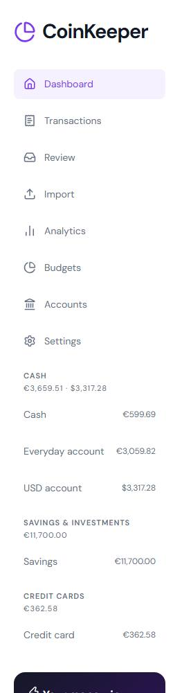](../../assets/design/current/sidebar.jpg ':ignore') | [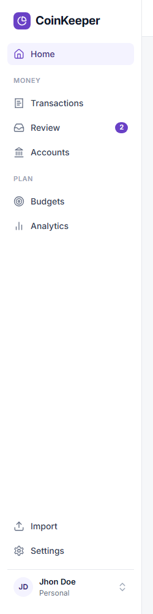](../../assets/design/wireframes/sidebar.png ':ignore') |

The sidebar holds only navigation, in the order people use it:

- **Home** on its own, then **Money** (Transactions, Review, Accounts) and **Plan** (Budgets, Analytics). Group labels make eight items read as three short lists.
- **Review** shows a count badge while transactions wait, so the review notice no longer has to live inside the dashboard.
- **Import** and **Settings** move to the bottom: they are setup tasks, used rarely.
- The account list goes. [YNAB](apps/ynab.md), [Actual](apps/actual-budget.md) and [Copilot](apps/copilot-money.md) keep one, but always in its own zone under a header, visibly apart from navigation; [Monarch](apps/monarch-money.md) keeps accounts only on its Accounts page. CoinKeeper's accounts are reached from **Accounts** and from the net worth card on Home. This removes the doubled totals and the positive debt.
- The promotion card goes, and so do the theme toggle (one theme) and the notifications bell (it has no data; it can return when insights exist in roadmap phase 5).
- The account menu appears once, at the bottom of the sidebar, with name, Settings, Deleted items and Sign out.

The header keeps a search box that also opens with <kbd>Ctrl</kbd> + <kbd>K</kbd>, and one global **New transaction** button, because adding a transaction is the most frequent action on every page.

### Page template

Every page uses the same header: an `h1`, one line saying what the page holds, and the page's tools on the right in a fixed order: currency switch, period, secondary actions. Content caps at 1180 px.

The **currency switch** replaces per-currency repetition. It offers each currency the user holds and, when converted totals are on in Settings, **≈ All in EUR** (the primary currency). The default is the primary currency and the choice is remembered. Each view still shows one currency at a time, and the converted view keeps its "approximate" label and the rate it used, so the rule that currencies are never summed silently holds.

## Home

[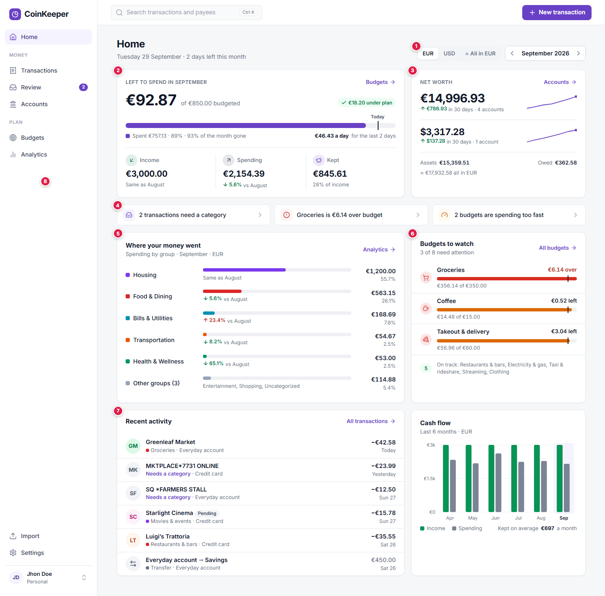](../../assets/design/wireframes/home.png ':ignore')

_Open [home.html](../../research/design/wireframes/home.html ':ignore')._

Home answers four questions in reading order: am I OK this month, does anything need me, where did the money go, what happened recently.

1. **Currency switch.** One currency at a time; USD has its own view and **≈ All in EUR** is one click away.
2. **Left to spend** is the hero, because it is the question budgeting users ask first and phase 1 already computes it. The bar shows spent against the month with a **Today** marker, the per-day allowance sits under it, and three labeled figures (Income, Spending, Kept) each have their own icon and a comparison with last month. Before the user has budgets, this card shows Income, Spending and Kept alone with a prompt to add budgets.
3. **Net worth** per currency with its 30-day change and a sparkline; assets, money owed and the approximate total sit in one line under it. It replaces the gradient cards.
4. **Needs attention.** Up to three actionable items (transactions to review, a budget over, budgets spending too fast), each linking to the place that fixes it. When nothing needs attention the strip disappears.
5. **Where your money went.** Spending by group as labeled bars, largest first, with the share and the change against last month, instead of an unlabeled donut. The last row folds small groups together.
6. **Budgets to watch.** Only budgets that are over or spending too fast, with colored bars; the rest are summarized in one line.
7. **Recent activity** for the selected month: payee avatars, the category as a colored dot, "Needs a category" for new entries, **Pending** only when pending, and a transfer as one gray row.
8. **Sidebar** as described in [Navigation](#navigation).

The cash flow chart stays small at the bottom right; the full version is on Analytics. Roadmap decision 2 (a customizable dashboard later) fits this layout: each card is a self-contained widget with a fixed default order.

## Transactions

[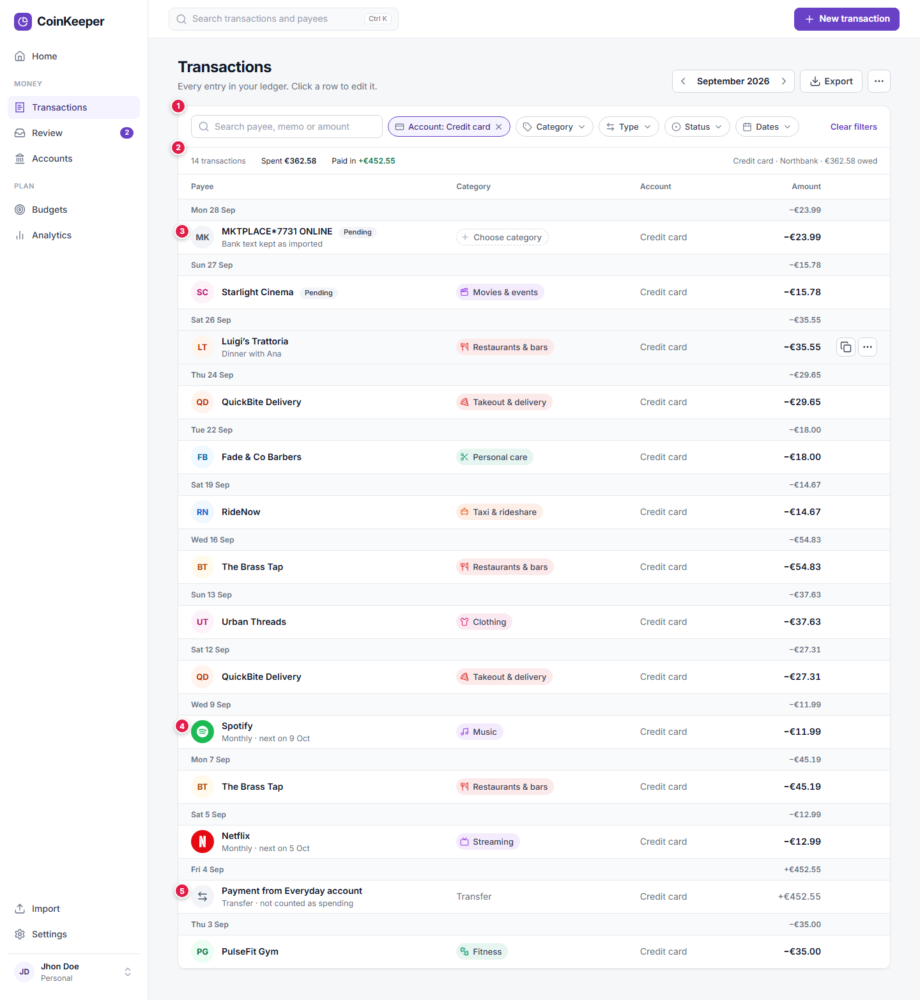](../../assets/design/wireframes/transactions.png ':ignore')

_Open [transactions.html](../../research/design/wireframes/transactions.html ':ignore'). The list is filtered to the credit card to show a month of card spending with two known brands._

1. **Filter chips** in one row: search, then Account, Category, Type, Status and Dates as chips that show their value when set and clear with one click. The labels above each field go.
2. **A summary of the filtered rows** (count, spent, paid in) and, when one account is selected, its balance. Export moves next to the month picker; print moves into the page menu.
3. **Inline category** for uncategorized entries: the dashed **Choose category** chip opens the same autocomplete as Review.
4. **Payee avatars.** Known brands show their logo; others show initials on a color taken from the name. The second line shows the memo, or, once recurring series exist (roadmap phase 2), "Monthly · next on 9 Oct".
5. **Transfers as one row**, gray, marked "not counted as spending". In an all-accounts view both legs collapse into "Everyday account → Savings"; filtered to one account, the row shows that side.

Rows are 52 px and grouped by day with a day total. Amounts are ink with a minus sign; income is green with a plus sign. **Cleared** is no longer shown because it is the normal state; **Pending**, **Needs review** and **Reconciled** still are. Hovering a row shows **Duplicate** and the row menu. With about 14 rows per screen, pagination changes to continuous loading by month.

## Review and the category autocomplete

[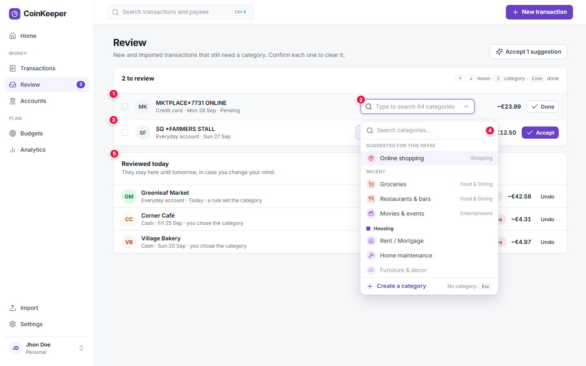](../../assets/design/wireframes/review.png ':ignore')

_Open [review.html](../../research/design/wireframes/review.html ':ignore')._

1. **A 64 px row** holds everything: a checkbox for bulk actions, the avatar, the bank text once, the account and a readable date, the category control, the amount and one button.
2. **The category autocomplete** replaces the 100 px button and the modal. It looks like a text field; typing filters categories and groups as you type ("gro" finds Groceries; "food" finds every Food & Dining category). It is a WAI-ARIA combobox built on the `cmdk` library the app already uses in `ui/command`.
3. **Suggestions.** When a rule or the payee's usual category gives an answer, the row shows it pre-filled and marked **Suggested**, and the button becomes **Accept**. **Accept 1 suggestion** in the page header accepts all of them.
4. **The list** opens with the suggestion for this payee, then the categories used most recently, then every group as a heading with its categories as 36 px rows. The footer offers **Create a category**, and <kbd>Esc</kbd> leaves the entry uncategorized. On a phone the list opens as a full-screen sheet.
5. **Reviewed today** keeps the entries you just cleared, with **Undo**, until the next day.

Keyboard flow: arrow keys move between rows, <kbd>C</kbd> opens the category, <kbd>Enter</kbd> accepts. The same autocomplete replaces the category picker in the transaction dialog, the budget dialog and the rules page, which also shortens the transaction dialog by about 70 px.

## Analytics

Analytics becomes four sub-pages under one heading, with tabs that are real routes (`/analytics`, `/analytics/spending`, `/analytics/cash-flow`, `/analytics/payees`), so each view has its own address and the browser back button works. All four share the currency switch, the period and the comparison period, kept in the URL.

### Overview

[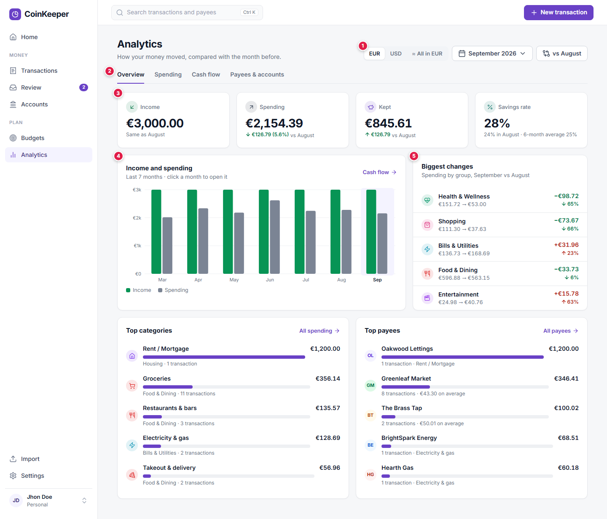](../../assets/design/wireframes/analytics-overview.png ':ignore')

_Open [analytics-overview.html](../../research/design/wireframes/analytics-overview.html ':ignore')._

1. **One filter bar**: currency, period (a month, a quarter, the last 6 or 12 months, or a custom range) and what to compare with.
2. **Tabs** for the sub-pages.
3. **Four figures** with a comparison each: Income, Spending, Kept and Savings rate. They appear here and on Home only, never a third time.
4. **Income and spending** per month; clicking a month opens it.
5. **Biggest changes** by group against the comparison period, with the amounts before and after. This is the "where can I cut" view that no screen offers today.

The two ranked lists at the bottom preview the Spending and Payees sub-pages.

### Spending

[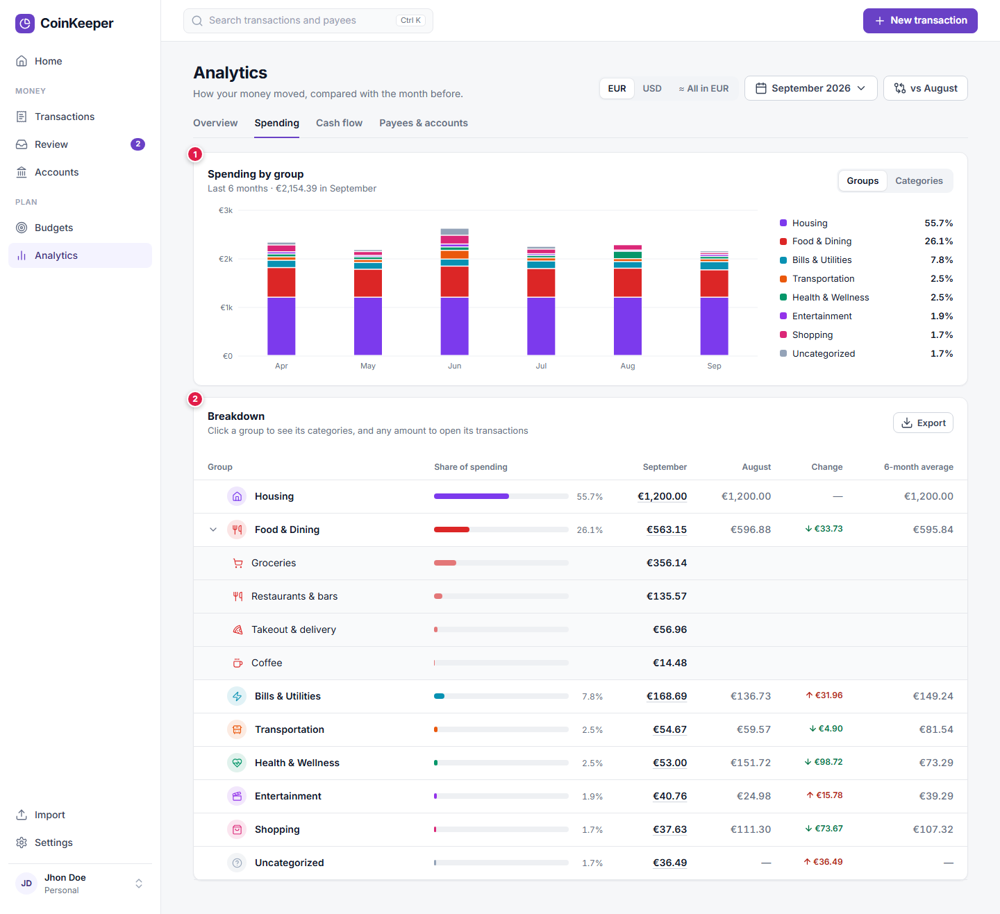](../../assets/design/wireframes/analytics-spending.png ':ignore')

_Open [analytics-spending.html](../../research/design/wireframes/analytics-spending.html ':ignore')._

1. **Spending by group over time** as stacked bars with the share of each group, switchable to categories.
2. **A breakdown table**: each group with its share, this period, the comparison period, the change and the 6-month average. A group expands into its categories; every amount opens the matching transactions, keeping phase 1's drill-down.

### Cash flow

[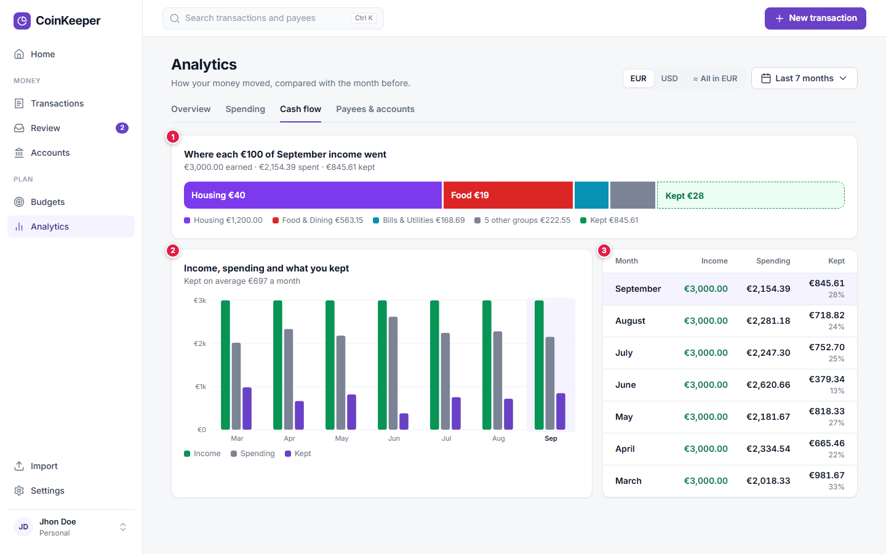](../../assets/design/wireframes/analytics-cash-flow.png ':ignore')

_Open [analytics-cash-flow.html](../../research/design/wireframes/analytics-cash-flow.html ':ignore')._

1. **Where each 100 of income went**: one bar that splits the month's income into the largest groups and the money kept. It is a readable stand-in for the Sankey diagram Monarch uses.
2. **Income, spending and kept** per month with the average kept.
3. **The same numbers as a table**, one row per month, with the selected month highlighted.

### Payees and accounts

[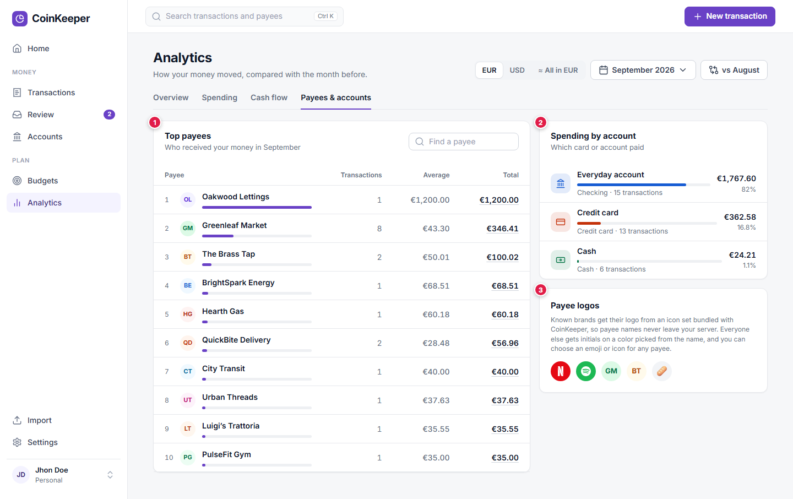](../../assets/design/wireframes/analytics-payees.png ':ignore')

_Open [analytics-payees.html](../../research/design/wireframes/analytics-payees.html ':ignore')._

1. **Top payees** as a table with the number of transactions and the average, which helps spot habits (eight trips to the same supermarket).
2. **Spending by account**, with the account type icons, showing which card or account paid.
3. **Payee logos**, explained on the page the first time a user sees them.

## Budgets

[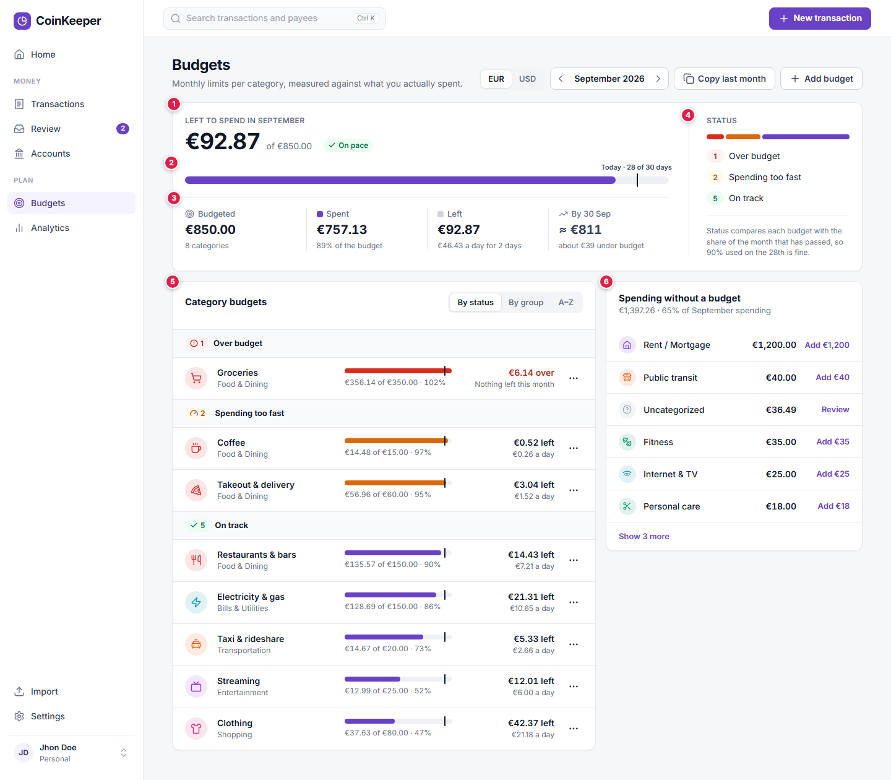](../../assets/design/wireframes/budgets.png ':ignore')

_Open [budgets.html](../../research/design/wireframes/budgets.html ':ignore')._

1. **Left to spend** is the one hero number, with the budget total next to it and one status tag.
2. **One bar for the whole month**, with the **Today** marker labeled with the day, so "89% spent" can be read against "93% of the month gone".
3. **Four labeled figures**, each with its own icon or swatch and a line that says what it means: **Budgeted** (8 categories), **Spent** (89% of the budget), **Left** (46.43 EUR a day for 2 days), and the projection **By 30 Sep** (about 39 EUR under budget). The swatches match the bar, so the figures and the bar explain each other.
4. **Status breakdown**: how many budgets are over, spending too fast and on track, with one sentence explaining that status follows the pace of the month.
5. **Category budgets grouped by status**, most urgent first (switchable to group or A to Z). Each row is 68 px: icon, name and group, a bar colored by status with the pace marker, "356.14 of 350.00 EUR", and on the right what matters: **€6.14 over** in red, or **€21.31 left** with the per-day allowance. Edit, View transactions and Delete move into the row menu; clicking the row opens its transactions.
6. **Spending without a budget**: categories with spending and no limit (1,397.26 EUR, 65% of September in the demo), each with **Add** and the limit suggested from the last three months, which reuses phase 1's suggestion. [PocketGuard](apps/pocketguard.md) shows the same idea as an **Everything else** row, so the page's totals match Analytics.

**Status follows the pace.** `budgetStatus` in `apps/web/src/components/finance/budget-card/budget-status.ts` already knows **Exceeded**, **Spending too fast** (the month-end projection passes the limit) and **On track**; it also returns **Near limit** from 80% spent, whatever the date. Dropping that one rule leaves three states that agree with the pace markers on the bars, and fixes the case where a budget shows **Near limit** and "under plan" at once. The labels become **Over budget**, **Spending too fast** and **On track**. The donut and the insights panel go: the summary says the same thing once.

## Accounts

[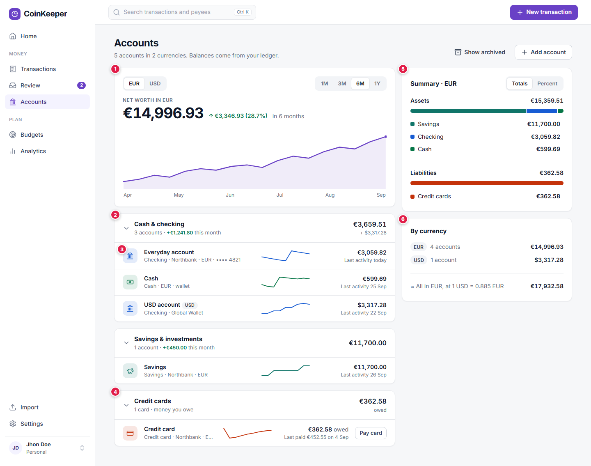](../../assets/design/wireframes/accounts.png ':ignore')

_Open [accounts.html](../../research/design/wireframes/accounts.html ':ignore')._

1. **Net worth over time** for the selected currency, with 1, 3, 6 and 12 month ranges and the change in money and percent.
2. **Groups with totals** and the change this month, collapsible. The group formerly called **Cash** becomes **Cash & checking**; a group that holds several currencies shows one total per currency.
3. **One icon and color per account type** in a rounded square (landmark for checking, banknote for cash, piggy bank for savings, card for credit cards), plus the institution, currency, last four digits when set, a sparkline of the balance and the last activity. The whole row opens the account; the **View** button goes.
4. **Credit cards read as money owed**: the amount is followed by "owed", the second line shows the last payment, and **Pay card** sits on the row.
5. **Summary** in the style of Monarch: assets and liabilities as stacked bars by account type, with totals or percentages.
6. **By currency**: the net worth in each currency and the approximate total with the rate used.

## Mobile

[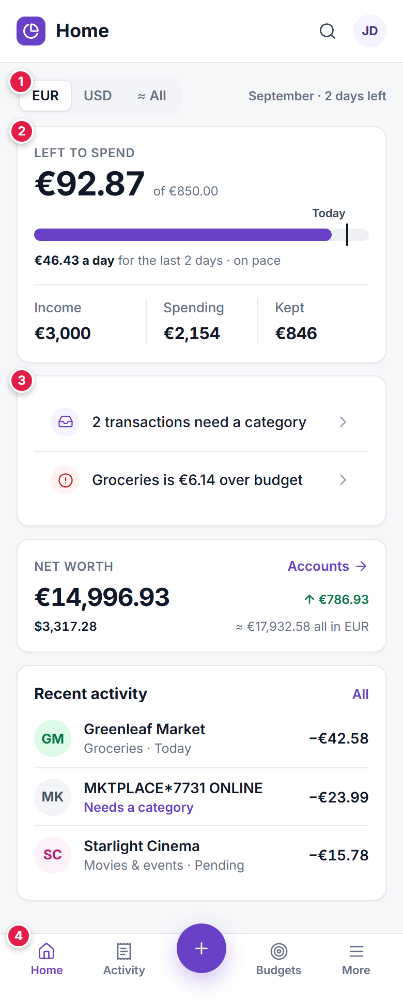](../../assets/design/wireframes/home-mobile.png ':ignore')

_Open [home-mobile.html](../../research/design/wireframes/home-mobile.html ':ignore')._

1. The currency switch and the period sit in one line.
2. The hero keeps the bar, the per-day allowance and the three figures in rounded amounts.
3. The attention items become a list.
4. **A bottom tab bar** (Home, Activity, add, Budgets, More) replaces the drawer, with the add button in the middle because adding a transaction is the main action on a phone.

The page fits in about two screens instead of six. Tables become lists below 768 px wide, and the category autocomplete opens as a full-screen sheet.

## Other screens

- **Transaction dialog.** The category autocomplete and the payee avatar replace the tall picker; field help moves into placeholders and appears as text only on error, so the form fits without scrolling on a laptop.
- **Settings.** Six tabs that do something (Profile, Categories, Currencies, Rules, Security, Deleted items). Export moves to Transactions, Appearance goes with dark mode, and the preview tabs (Notifications, Data Management, App Preferences, Legal and support) go until they are wired.
- **Import.** A styled drop zone replaces the browser's file input; the three steps stay. It is left for the last phase.
- **Loading.** Skeletons in the shape of each card replace the "Loading your finances…" text, so the layout does not jump.

## Components

| Component                                                                                                   | Change                                                                                                                | Used by                                                |
| ----------------------------------------------------------------------------------------------------------- | --------------------------------------------------------------------------------------------------------------------- | ------------------------------------------------------ |
| `ui/combobox` (new)                                                                                         | Text-field trigger, popover list with sections, filtering, keyboard support; wraps `ui/command`                       | Category autocomplete, later payee and account pickers |
| `ui/avatar` (new)                                                                                           | Circle or rounded square, tint from a color, content: logo, emoji, icon or initials; replaces `ui/icon-tile` in lists | Rows everywhere                                        |
| `ui/segmented-control` (new)                                                                                | Small tab-like switch                                                                                                 | Currency switch, budget sort, chart ranges             |
| `ui/stat` (replaces most of `finance/metric-card`)                                                          | Label with icon, tabular value, meta line, optional delta                                                             | Home, Budgets, Analytics                               |
| `ui/progress-bar`                                                                                           | Tone (brand, warning, danger), labeled pace marker                                                                    | Budgets, Home                                          |
| `ui/tabs`                                                                                                   | Underline style for page sub-navigation                                                                               | Analytics                                              |
| `finance/payee-avatar` (new)                                                                                | Bundled brand match, then user icon, then initials                                                                    | Transactions, Review, Analytics                        |
| `finance/category-picker`                                                                                   | Becomes the autocomplete with suggested and recent sections                                                           | Review, dialogs, rules                                 |
| `finance/budget-summary`, `finance/budget-row` (replace `budget-card`, `budget-insights`, the budget donut) | Hero, figures, status breakdown; compact row                                                                          | Budgets, Home                                          |
| `finance/attention-strip` (new)                                                                             | Up to three actionable items                                                                                          | Home                                                   |
| `finance/spending-bars` (replaces the donut on Home)                                                        | Labeled horizontal bars with change                                                                                   | Home, Analytics                                        |
| `finance/transaction-table`                                                                                 | Day groups, avatars, chips, one row per transfer, inline category                                                     | Transactions, account detail                           |
| `shell/application-shell`                                                                                   | Grouped navigation with badge, no account list, no promotion card, one account menu; mobile tab bar                   | Every page                                             |
| Removed                                                                                                     | `ui/promotion-panel`, `shell/theme-toggle`, `finance/balance-card` gradients, `finance/net-worth-cards`               | none                                                   |

Each new `ui` component needs its folder, test, barrel entry and a row in `docs/architecture/components.md`, as `apps/web/src/components/structure.test.ts` requires.

## Data the screens need

Most of the redesign reuses what the API returns today. The exceptions:

| Need                                     | Screen                    | How                                                                                                                           | Schema change |
| ---------------------------------------- | ------------------------- | ----------------------------------------------------------------------------------------------------------------------------- | ------------- |
| Comparison with the previous period      | Home, Analytics           | Request `GET /reports/summary` for both months, or add a `compare` parameter                                                  | None          |
| Net worth and balances over time         | Accounts, Home sparklines | New report `GET /reports/balances?months=6` computing month-end (or weekly) balances per account from the ledger              | None          |
| Spending per group or category per month | Analytics › Spending      | Add a `months` range to `GET /reports/breakdown`                                                                              | None          |
| Budget status by pace                    | Budgets, Home             | Change `budget-status.ts` and its tests; the pace data already exists                                                         | None          |
| Spending without a budget                | Budgets                   | Join `GET /reports/breakdown?by=category` with the month's budgets on the client                                              | None          |
| Suggested category per review item       | Review                    | Return the rule or payee-default suggestion with each item of the review list                                                 | None          |
| One row per transfer                     | Transactions              | Pair rows by `transferId` on the client; rows already carry the counterpart account                                           | None          |
| Brand logos                              | Every list                | Bundle the matching Simple Icons glyphs in the web app and match on the normalized payee name                                 | None          |
| A chosen icon or color per payee         | Every list                | `payees.icon` and `payees.color`, like `accounts` has; also expose the unused `accounts.icon` and `accounts.color` in the API | Yes, small    |

## Plan

Each phase ships on its own, keeps the app working, and updates tests and docs in the same change.

| Phase                      | Scope                                                                                                                                                                                                                                                 | Why this order                                                           | Status |
| -------------------------- | ----------------------------------------------------------------------------------------------------------------------------------------------------------------------------------------------------------------------------------------------------- | ------------------------------------------------------------------------ | ------ |
| D1. Foundation             | New tokens and Inter with tabular figures; remove dark mode; card style; meaningful icons on metrics and accounts; sidebar and header cleanup (groups, Review badge, no account list, no promotion card, no toggle or bell); rename Dashboard to Home | Changes the whole look with little logic; every later phase builds on it | Done   |
| D2. Pickers and lists      | `ui/combobox` and the category autocomplete everywhere; compact Review with suggestions and undo; the transactions list with avatars, day groups, one row per transfer and inline category; bundled brand logos                                       | Fixes O2 and O3, the most frequent friction                              | Done   |
| D3. Budgets and Home       | Budget summary, status by pace, compact rows by status, spending without a budget; the currency switch; Home rebuilt with the hero, attention strip, spending bars, budgets to watch and recent activity                                              | Fixes O1 and O5; needs the components from D1 and D2                     | Done   |
| D4. Analytics and Accounts | Analytics sub-routes and the four pages; the balances report; Accounts with net worth history, type groups and summary; the mobile tab bar                                                                                                            | Fixes O4 and O6; needs one new report                                    | Done   |
| D5. Polish                 | Settings trimmed to six tabs; styled import drop zone; skeleton loading; payee icon and color (schema change); optional emoji for categories and payees                                                                                               | Lower impact; the only schema change comes last                          | Done   |

The whole plan, D1 to D5, is implemented on the branch `feat/ui-redesign`.

Tests that pin today's layout change with it. The largest are the headings in `e2e/accessibility.spec.ts`, `e2e/demo-account.spec.ts` and `e2e/fixtures.ts` ("Dashboard Overview" becomes "Home"), the dark-mode pass in `e2e/accessibility.spec.ts`, and the component tests for `overview`, `budget-overview`, `budget-card`, `accounts-overview`, `review-inbox`, `category-picker`, `settings-view` (it counts 11 tabs) and `application-shell`. The feature pages in `docs/features/` (dashboard, budgets, accounts, transactions, review inbox, categories, multi-currency) change with each phase.

## Ideas kept for later

The studies surfaced good ideas that need a feature or a field CoinKeeper does not have yet:

| Idea                                                                                                  | Seen in                                                | Needs                                 |
| ----------------------------------------------------------------------------------------------------- | ------------------------------------------------------ | ------------------------------------- |
| Credit card utilization chip (green up to 33%, amber up to 90%, red above)                            | [Copilot](apps/copilot-money.md)                       | A credit limit on accounts            |
| A right-hand detail pane for the selected transaction or budget                                       | [Copilot](apps/copilot-money.md), [YNAB](apps/ynab.md) | A layout slot on wide screens         |
| Selection panel with count, total and average plus bulk actions                                       | [Lunch Money](apps/lunch-money.md)                     | Bulk update endpoints                 |
| Subscriptions grouped with a yearly total, and a week strip of logos for what is due                  | [Rocket Money](apps/rocket-money.md)                   | Recurring series (roadmap phase 2)    |
| A projected balance line with a dot per upcoming bill on the account page                             | [Quicken Simplifi](apps/quicken-simplifi.md)           | Recurring series (roadmap phase 2)    |
| Spending against a dotted ideal-pace line on Home                                                     | [Copilot](apps/copilot-money.md)                       | Daily spending totals from the ledger |
| A small account badge on the payee avatar, which can replace the Account column in all-accounts lists | [Emma](apps/emma.md)                                   | Avatars from phase D2                 |

## Decisions for the owner

| #   | Question                                                                           | Recommendation                                                                                                                                             |
| --- | ---------------------------------------------------------------------------------- | ---------------------------------------------------------------------------------------------------------------------------------------------------------- |
| 1   | Which visual direction?                                                            | B, modern bank ([Visual direction](visual-direction.md))                                                                                                   |
| 2   | Rename Dashboard to Home?                                                          | Yes: shorter and plainer; keeping Dashboard is also fine                                                                                                   |
| 3   | Remove the account list from the sidebar, or keep a collapsed Accounts section?    | Remove it; if kept, give it its own framed, collapsible zone with type icons and one total, as [Actual](apps/actual-budget.md) and [YNAB](apps/ynab.md) do |
| 4   | Currency switch: remember the last choice, or always open on the primary currency? | Remember it per browser, fall back to the primary currency                                                                                                 |
| 5   | Budget status by pace instead of by share spent?                                   | Yes                                                                                                                                                        |
| 6   | Bundle brand logos from Simple Icons?                                              | Yes, only the glyphs that match known payees, never fetched from a service                                                                                 |
| 7   | Bottom tab bar on phones?                                                          | Yes                                                                                                                                                        |
| 8   | Remove the Settings tabs that do nothing yet?                                      | Yes, until they are wired                                                                                                                                  |
| 9   | Offer emoji for categories and payees?                                             | Later (phase D5), off by default                                                                                                                           |
