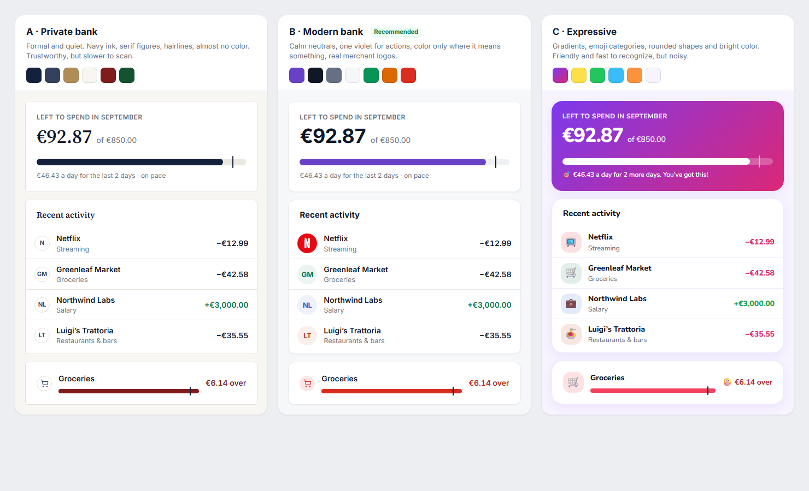

# Visual direction

> Summary: the look CoinKeeper should move to: three directions compared on the same screen (A private bank, B modern bank, C expressive), why B is recommended, and the design language that implements it: one light theme, color roles, the proposed tokens, Inter with tabular figures, spacing and shape, icons for categories and account types, merchant logos without third-party calls, and tone of voice.

The owner asked whether CoinKeeper should look more serious and formal, like a bank, or more expressive, with brighter colors and emoji. This page answers with a recommendation and the rules that make it concrete. The screens that use these rules are in the [UI proposal](ui-proposal.md); the evidence behind them is in the [app design studies](README.md#app-design-studies) and [Finance UI patterns](ui-patterns.md).

## Three directions on the same screen

The board below renders the same content (left to spend, four recent transactions and an overspent budget) in each direction. The HTML source is [directions.html](../../research/design/wireframes/directions.html ':ignore').

| Direction       | Looks like                                                                                                                      | Strengths                                                                                                                                        | Costs                                                                                                                                                                                 |
| --------------- | ------------------------------------------------------------------------------------------------------------------------------- | ------------------------------------------------------------------------------------------------------------------------------------------------ | ------------------------------------------------------------------------------------------------------------------------------------------------------------------------------------- |
| A. Private bank | [Mercury](apps/mercury.md), traditional bank portals                                                                            | Trustworthy and quiet; nothing competes with the numbers                                                                                         | Almost no color means no fast recognition: every row and every budget looks alike, which is the owner's current complaint in another form. Serif figures are slower to scan in tables |
| B. Modern bank  | [Monarch](apps/monarch-money.md), [Wise](apps/wise.md), [Copilot](apps/copilot-money.md), [Wallet](apps/wallet-budgetbakers.md) | Calm neutrals keep the page readable; color appears only where it means something (state, category, brand logo), so the eye goes to what matters | Needs discipline: every new color must earn a role                                                                                                                                    |
| C. Expressive   | [Emma](apps/emma.md), [Spendee](apps/spendee.md), and [Toshl](apps/toshl-finance.md)'s marketing                                | Friendly and fast to recognize; emoji and gradients make categories memorable                                                                    | Gradients and emoji compete with the numbers; emoji look different on Windows, macOS and Android; bright category colors collide with red and green states                            |

## Recommendation: B, modern bank

Direction B fits the owner's own references and fixes the problems found in the [Current UI review](current-ui-review.md):

- **It restores hierarchy.** Today violet marks everything (F8 in the review). In B the brand color is kept for actions and the current page, so the one hero number on each screen stands out by size and position, and red, amber and green mean over budget, spending too fast and on track.
- **It gets friendliness from real content, not decoration.** Rocket Money and Monarch feel approachable because Netflix looks like Netflix. Merchant logos and monograms give the same quick recognition that emoji give in C, without the noise.
- **It suits a product that handles money and multiple currencies.** Neutral surfaces, tabular figures and hairline borders read as precise, which matters when the same screen shows EUR and USD side by side.
- **It keeps the brand.** CoinKeeper's violet stays, slightly deeper and less saturated (`#6941c6` instead of `#7c3aed`), so the logo and existing screenshots still belong to the same product. Keeping today's `#7c3aed` for filled buttons with `#6d28d9` for links and text is an acceptable alternative with less change; both pass contrast on white.

Two ideas from the other directions are worth keeping. From A: hairline borders, restrained shadows and tables that line up. From C: an optional emoji per category or payee, chosen by the user, for people who want a warmer list. It stays off by default.

## One light theme

The app keeps a single light theme. Removing dark mode deletes the `:root[data-theme='dark']` block in `tokens.scss`, `lib/appearance.ts`, the `ThemeToggle` component and its header slot, the **Appearance** select in Settings, their unit tests and the dark pass in `e2e/accessibility.spec.ts`, and simplifies every contrast check to one set of colors. The ui-review skill's checklist item "contrast in both themes" becomes "contrast on white and on the canvas".

## Color roles

Color is assigned by role, never by component. A component asks for "negative text" or "category color", not for a hex value.

| Role                | Used for                                                             | Never used for                                      |
| ------------------- | -------------------------------------------------------------------- | --------------------------------------------------- |
| Neutrals            | Canvas, cards, borders, text in three strengths                      | none                                                |
| Brand violet        | Primary buttons, links, the current page, focus rings, selected tabs | Data: bars, charts, icons of categories or accounts |
| Positive green      | Income amounts, "on track", money kept, upward net worth             | Decoration                                          |
| Warning amber       | Budgets spending too fast, pending states that need a look           | Anything the user cannot act on                     |
| Negative red        | Overspending, negative balances, destructive actions, errors         | Ordinary expenses (they stay ink with a minus sign) |
| Category colors     | Tinted category icons, chart series for groups                       | Text on white below 4.5:1                           |
| Account type colors | The rounded-square icon of each account type                         | Anything else                                       |
| Brand logo colors   | The merchant's own logo background                                   | Anything else                                       |

Expenses stay ink colored with a minus sign, income is green with a plus sign, and transfers are gray with a transfer icon. This is how [Monarch](apps/monarch-money.md) and [Mercury](apps/mercury.md) list activity, and it makes red rare enough to mean "look here". Changes are colored by meaning, not direction: net worth or savings going up is green, but money owed going up is amber, as on [Rocket Money](apps/rocket-money.md)'s net worth screen. Color is never the only signal: every state also has a word (**over**, **left**, **spending too fast**) or an icon.

### Proposed tokens

The values below replace the current tokens in `apps/web/src/styles/tokens.scss` and `apps/web/src/styles/theme.ts`. They follow the same naming style; new names are marked.

| Token                             | Current                 | Proposed              | Note                                                                     |
| --------------------------------- | ----------------------- | --------------------- | ------------------------------------------------------------------------ |
| `--canvas`                        | `#f3f4f6`               | `#f6f7f9`             | Slightly lighter, so white cards separate by border rather than contrast |
| `--surface`                       | `#ffffff`               | `#ffffff`             | Unchanged                                                                |
| `--surface-soft`                  | `#f9fafb`               | `#f9fafb`             | Table day rows, hover                                                    |
| `--surface-sunken` (new)          | none                    | `#f2f4f7`             | Segmented controls, bar tracks                                           |
| `--border`                        | `#e5e7eb`               | `#e6e8ec`             | Card and row dividers                                                    |
| `--border-strong` (new)           | none                    | `#d0d5dd`             | Inputs, outline buttons                                                  |
| `--ink`                           | `#111827`               | `#101828`             | Titles and amounts                                                       |
| `--ink-2` (new)                   | none                    | `#344054`             | Body text                                                                |
| `--muted`                         | `#667085`               | `#667085`             | Secondary text (4.9:1 on white)                                          |
| `--faint` (new)                   | none                    | `#98a2b3`             | Placeholders and axis labels only, never body text                       |
| `--accent` / `--primary`          | `#7c3aed`               | `#6941c6`             | One brand token instead of two                                           |
| `--accent-hover`                  | `#6d28d9`               | `#53389e`             |                                                                          |
| `--accent-soft`                   | `#f5f1ff`               | `#f4f3ff`             | Current page, selected option                                            |
| `--success` / `--success-soft`    | `#047857` / `#ecfdf5`   | `#067647` / `#ecfdf3` | Text on white 5.7:1                                                      |
| `--success-mark` (new)            | none                    | `#079455`             | Bars and chart marks (3.9:1 on white)                                    |
| `--warning` / `--warning-soft`    | `#92400e` / `#fffbeb`   | `#b54708` / `#fffaeb` |                                                                          |
| `--warning-mark` (new)            | none                    | `#dc6803`             | Bars spending too fast                                                   |
| `--danger` / `--danger-soft`      | `#be123c` / `#fff1f2`   | `#b42318` / `#fef3f2` |                                                                          |
| `--danger-mark` (new)             | none                    | `#d92d20`             | Bars over budget                                                         |
| `--shadow`                        | `0 16px 48px #10182818` | `0 1px 2px #1018280d` | Cards; the large shadow stays for popovers and dialogs as `--shadow-pop` |
| `--gradient-*`                    | three gradients         | removed               | No gradient cards                                                        |
| `Colors.chart.income` / `expense` | `#8b5cf6` / `#9ca3af`   | `#079455` / `#7b8494` | Both at least 3:1 against white                                          |

Chart marks and bar fills need 3:1 against their background (WCAG 2.2, non-text contrast); the `-mark` tokens exist for that reason, because the text colors are too dark for large fills and the soft colors too light.

### Category colors

Group colors stay user data. Two changes make them work with the roles above:

- Category icons become **tinted**: the icon in the group color on a 12% tint of it, instead of a white icon on a solid tile. A list of transactions stops looking like a column of red and purple squares, and the payee becomes the first thing the eye reads.
- The default taxonomy stops using the brand violet and the negative red for groups. Housing and Food & Dining move to colors that do not carry a meaning elsewhere, and the violet and purple swatches in `GroupPalette` become one entry, since they are hard to tell apart in a chart.

## Type

Inter replaces DM Sans. Inter has tabular figures, which DM Sans as served by Google Fonts lacks (measured in the [Current UI review](current-ui-review.md#icons-and-figures)), Wise and Revolut use it for product text next to their brand display faces, and it stays legible at 12 px. It loads through `next/font/google` like DM Sans does today. Figtree is the alternative if the owner prefers to keep DM Sans's rounder shapes; it also has tabular figures ([Finance UI patterns › Typography for money](ui-patterns.md#typography-for-money)).

| Use                | Size / weight                        | Figures            |
| ------------------ | ------------------------------------ | ------------------ |
| Hero number        | 36 / 650                             | Tabular            |
| Card hero          | 28 / 650                             | Tabular            |
| Page title (`h1`)  | 24 / 650                             | none               |
| Stat value         | 20 / 650                             | Tabular            |
| Card title (`h2`)  | 15 / 650                             | none               |
| Body and row title | 14 / 400, 600                        | Tabular in amounts |
| Secondary and meta | 12.5 to 13 / 400                     | Tabular in amounts |
| Eyebrow label      | 12 / 600, uppercase, 0.4 px tracking | none               |

Amounts always use tabular figures and right alignment in tables. The `Amount` and `MetricValue` components apply `font-variant-numeric: tabular-nums` through one mixin. Weights shrink to 400, 500, 600 and 650. Headings use sentence case everywhere.

## Shape, space and density

- Cards: white, 1 px `--border`, radius 12 px (was 18 px), shadow `0 1px 2px`. Controls: radius 8 px. Pills: fully round.
- Spacing stays on the existing 4 px scale (`space()`); page padding 28 px on desktop, card padding 20 px, 16 px gaps between cards.
- The content column caps at 1180 px instead of 1680 px, so wide screens do not stretch rows until amounts drift away from their labels.
- List rows are 52 to 64 px tall; table cells 52 px; tags 22 px. That fits about 14 transactions on a laptop screen, against 10 today.
- Two-column layouts use rows of cards that share a height, instead of two independent stacks, so there are no gaps like the one on Analytics today.

## Icons and logos

Lucide stays the icon set. What changes is which icon goes where and how it is framed:

| Thing    | Frame                        | Content                                                                                                                         |
| -------- | ---------------------------- | ------------------------------------------------------------------------------------------------------------------------------- |
| Payee    | 36 px circle                 | Brand logo when known, otherwise a user-chosen emoji or icon, otherwise two-letter initials on a color picked from the name     |
| Category | 28 to 36 px circle, tinted   | The category's Lucide icon in the group color                                                                                   |
| Account  | 36 px rounded square, tinted | One fixed icon and color per account type (below)                                                                               |
| Metric   | 28 px circle, tinted         | A meaningful icon per metric: arrow down-left for income, arrow up-right for spending, piggy bank for kept, target for budgeted |

Circles are payees and categories; rounded squares are accounts. The shape alone tells the user what kind of thing a row is, which is why this page keeps two shapes where the patterns research suggests one. The account type colors stay on the icon only, as a light tint; balances stay ink, and the patterns research warns against coloring whole rows or amounts by type.

| Account type | Icon         | Color     |
| ------------ | ------------ | --------- |
| Checking     | `Landmark`   | `#175cd3` |
| Savings      | `PiggyBank`  | `#107569` |
| Cash         | `Banknote`   | `#067647` |
| Credit card  | `CreditCard` | `#c4320a` |
| Investment   | `TrendingUp` | `#6941c6` |
| Loan         | `HandCoins`  | `#475467` |
| Other        | `Wallet`     | `#667085` |

### Merchant logos without leaking payee names

CoinKeeper is self-hosted, and a payee list is private. Logo services such as favicon endpoints or logo APIs would receive every payee name, so the proposal uses layers that never leave the server:

1. **Bundled brand icons.** The open icon set Simple Icons (released under CC0) ships with the web app; a payee whose normalized name matches a known brand (Netflix, Spotify, Amazon, Uber) gets that glyph in white on the brand color. It needs no schema change.
2. **User choice.** A payee can have an emoji or a Lucide icon and a color, chosen in the payee dialog. This needs `icon` and `color` columns on `payees`, like accounts already have.
3. **Monogram.** Everyone else gets two initials on a soft color derived from the name, so the same payee always looks the same.

An optional fourth layer, off by default, lets the API (never the browser) fetch a favicon from a payee's own website and serve it from CoinKeeper's origin. Simple Icons releases its drawings under CC0, but the brands keep their trademarks and some icons link brand guidelines, so the bundled map is a curated subset used only to identify the payee. [Finance UI patterns › Merchant and brand logos](ui-patterns.md#merchant-and-brand-logos) compares every source, including the favicon and logo services to avoid.

## Tone of voice

- Say the number and what it means: **€6.14 over**, **€0.52 left**, **€46.43 a day for the last 2 days**, rather than **Exceeded** or **89% used** alone.
- Use the words a person uses: **Left to spend**, **Kept**, **Money you owe**, rather than **Remaining**, **Savings rate** or **Liability** in headings.
- Stay calm: no exclamation marks, no praise, no alarm. A red number is warning enough.
- Name pages after what they hold: **Home**, **Transactions**, **Review**, **Budgets**, **Analytics**, **Accounts**.
