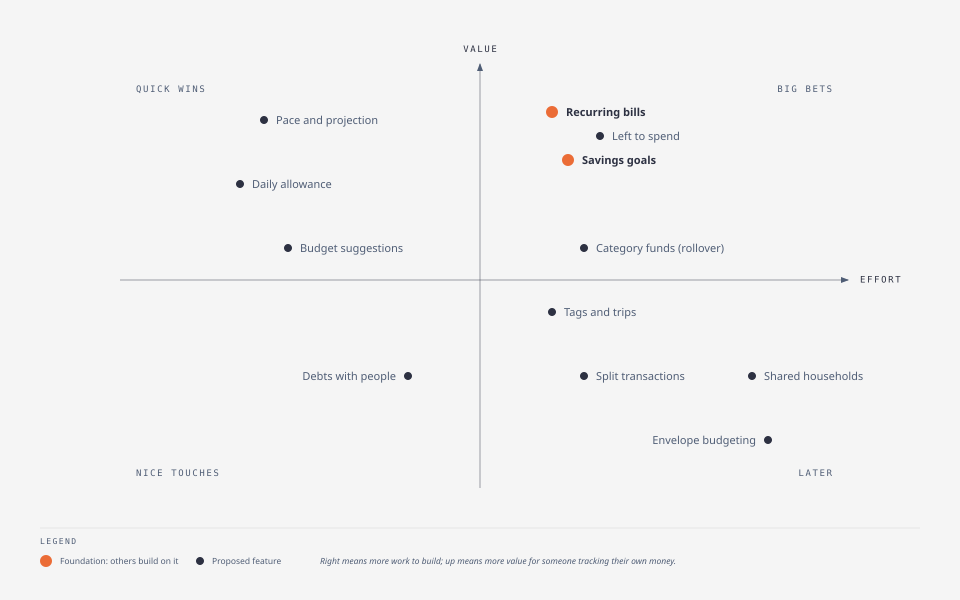
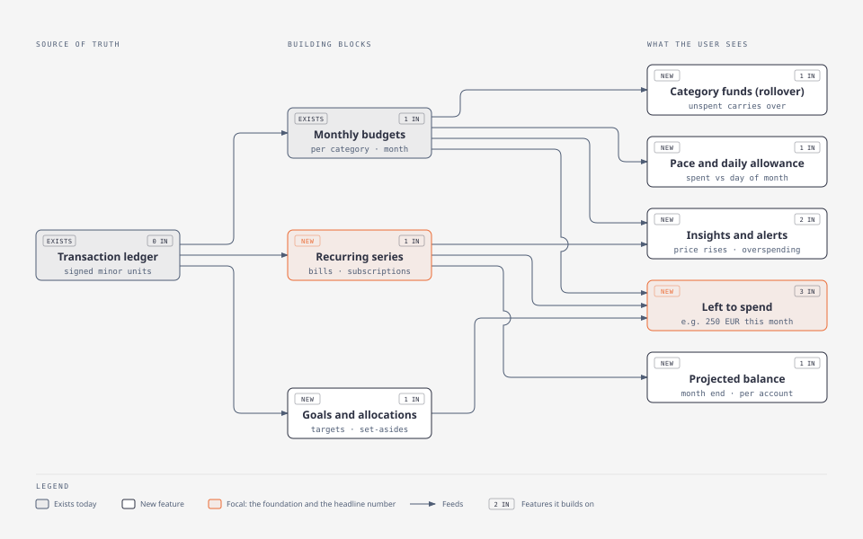
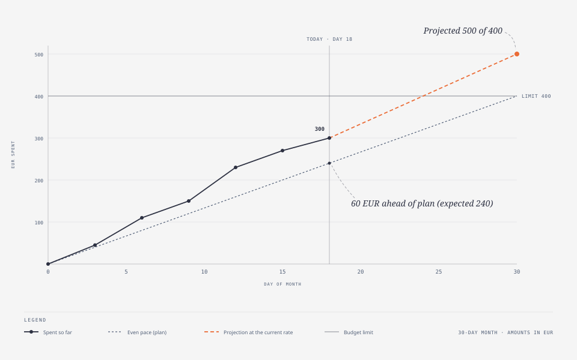
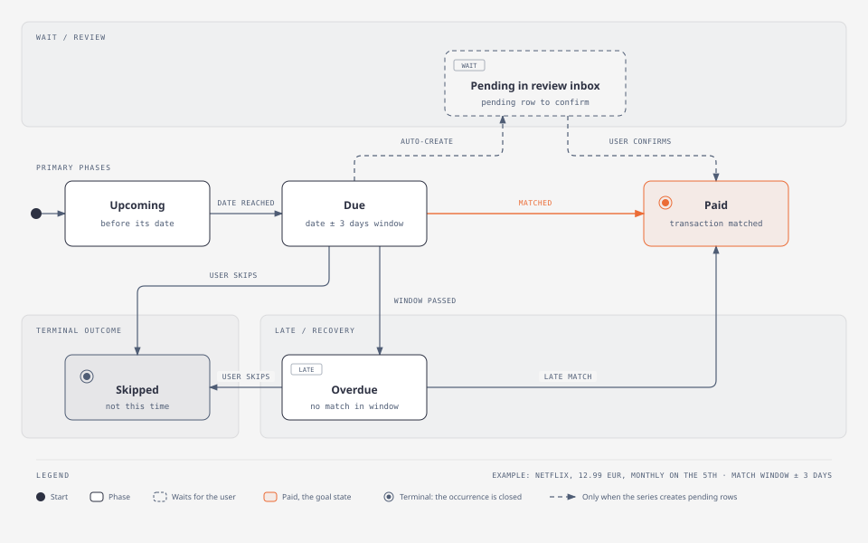
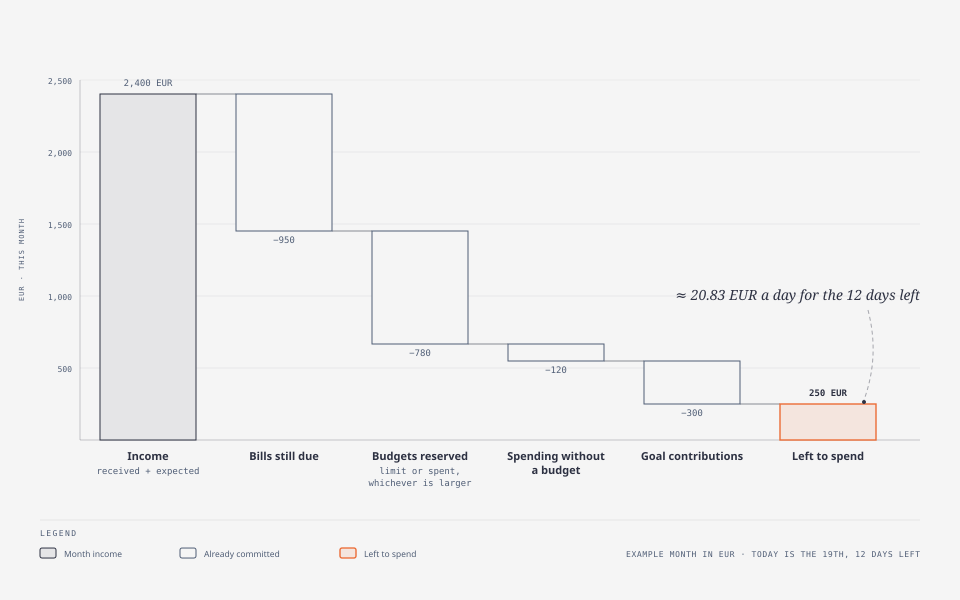
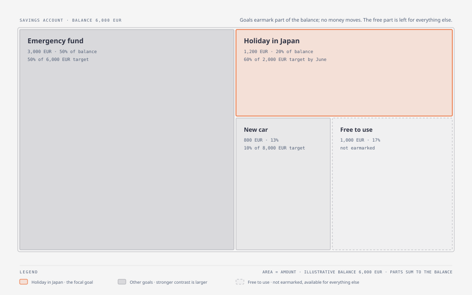
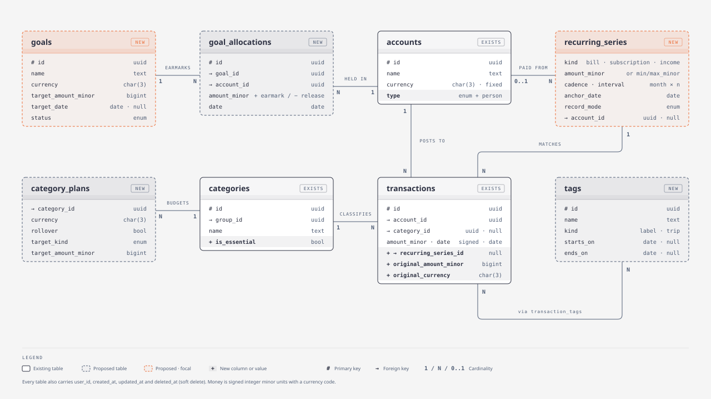

# Feature guide

> Summary: a plain-language walk through the competitor research: what the 20 apps taught us, where CoinKeeper stands, each proposed feature explained with an example and diagrams, and exactly how it would fit into CoinKeeper's data, server and screens.

This page explains the research so you can read it from start to finish without opening the 20 app studies. Every feature below says what it is, shows an example, names the apps that do it well and describes what would change in CoinKeeper. For the full tables, formulas and sources, see [Feature opportunities](feature-opportunities.md) and the studies listed in the [research index](README.md). Select any diagram to open it full size.

## The research in one minute

We studied 20 budgeting and spending apps, grouped by how they think about money:

| Family                            | Apps                                                                                                                                                             | Their idea in one line                                |
| --------------------------------- | ---------------------------------------------------------------------------------------------------------------------------------------------------------------- | ----------------------------------------------------- |
| Zero-based and envelope budgeting | [YNAB](apps/ynab.md), [EveryDollar](apps/everydollar.md), [Goodbudget](apps/goodbudget.md), [Actual Budget](apps/actual-budget.md)                               | Give every unit of income a job before you spend it   |
| Modern all-in-one planners        | [Monarch Money](apps/monarch-money.md), [Copilot Money](apps/copilot-money.md), [Quicken Simplifi](apps/quicken-simplifi.md), [Lunch Money](apps/lunch-money.md) | See everything in one place and plan the month ahead  |
| Spending control and coaching     | [Rocket Money](apps/rocket-money.md), [PocketGuard](apps/pocketguard.md), [Emma](apps/emma.md), [Cleo](apps/cleo.md)                                             | Find the leaks and tell me how much I can still spend |
| Global, manual-first trackers     | [Spendee](apps/spendee.md), [Wallet by BudgetBakers](apps/wallet-budgetbakers.md), [Money Lover](apps/money-lover.md), [Toshl Finance](apps/toshl-finance.md)    | Make entering money fast, in any currency, anywhere   |
| Saving automation and open source | [Monzo](apps/monzo.md), [Revolut](apps/revolut.md), [Qapital](apps/qapital.md), [Firefly III](apps/firefly-iii.md)                                               | Put money aside for things automatically and track it |

Three lessons came out of all of them:

1. **The best apps look forward, not only back.** They answer "am I on track?", "what is coming?" and "how much can I still spend?", not just "where did my money go?".
2. **Recurring payments are the foundation.** Once an app knows which bills, subscriptions and salaries repeat, it can show what is due, what is left and which subscriptions you forgot. Twelve of the 20 apps build on this.
3. **Saving needs a place to live.** People save for a holiday, a house or a car. The apps that help most let you name that money and watch it grow, without moving it anywhere.

## Where CoinKeeper stands today

CoinKeeper already answers the first question well: where your money went, per currency, with exact amounts. The proposed features add the other questions.

| The question you ask        | Today in CoinKeeper                                           | With the proposed features                                             |
| --------------------------- | ------------------------------------------------------------- | ---------------------------------------------------------------------- |
| Where did my money go?      | Dashboard, spending by group, analytics, budgets per category | Plus analytics by shop and account, trips, splits, essentials vs wants |
| Am I on track this month?   | Budget bars with On track, Near limit (80%) and Exceeded      | Pace against the calendar, month-end projection, daily allowance       |
| What is coming?             | Nothing                                                       | Bills, subscriptions and income calendar; projected balance            |
| How much can I still spend? | Nothing as one number                                         | Left to spend, per currency, with a per-day figure                     |
| Am I saving for my goals?   | Savings rate on the dashboard                                 | Goals with targets, progress and a suggested monthly amount            |
| Where am I wasting money?   | You spot it yourself in the transaction list                  | Subscription review, price-rise and duplicate-charge alerts, recaps    |

Some of what CoinKeeper does is better than well-known apps, and the proposals keep it that way: per-currency reporting (Monarch shows every amount as dollars), CSV import that works without bank sync (Copilot has none), soft delete and restore (Lunch Money deletes budget history when you change the period), and no paywall on core budgeting.

## Which features to build first

The chart places the main features by how much they help a typical user and how much work they are. The top-left corner holds quick wins that need no database change; the two highlighted features are the foundations most other ideas rely on.

## How the features build on each other

Features are not independent. Recurring series and goals feed the headline number, left to spend, so they come before it. Everything stays a calculation over the transaction ledger, as the [architecture](../architecture/overview.md) requires: nothing stores a balance that could drift.

## The features explained

Each feature has the same parts: what it is, an example, the apps that do it, and how it fits CoinKeeper. "Effort" is S (days), M (one to two weeks) or L (several weeks).

### 1. Spending pace and month-end projection

**What it is.** Your budget bar today says how much of the limit you used. Pace compares that with how far through the month you are, and projects where you will end if you keep spending at the same rate.

**Example.** A 400 EUR groceries budget, day 18 of 30. At an even pace you would have spent 240 EUR; you have spent 300 EUR, so you are 60 EUR ahead of plan. At this rate you finish the month at 500 EUR, 100 EUR over.

**Who does it.** [Goodbudget](apps/goodbudget.md) draws a pace line on every envelope, [Copilot](apps/copilot-money.md) colours budgets by pace, [Toshl](apps/toshl-finance.md) shows a "time passed" marker and [PocketGuard](apps/pocketguard.md) launched a Pace forecast in 2026.

**How it fits CoinKeeper.**

| Part    | Change                                                                                                 |
| ------- | ------------------------------------------------------------------------------------------------------ |
| Data    | None                                                                                                   |
| Server  | The budgets response adds `expectedToDate` and `projectedEnd` per category and currency                |
| Screens | A marker on each budget bar, "60 EUR ahead of plan" text, and a new status such as "Spending too fast" |
| Effort  | S                                                                                                      |

### 2. Daily allowance

**What it is.** The remaining budget divided by the days left: a number you can use at the till.

**Example.** 400 EUR groceries budget, 300 EUR spent, 12 days left: 100 ÷ 12 = 8.33 EUR a day.

**Who does it.** [Revolut](apps/revolut.md), [Spendee](apps/spendee.md), [Emma](apps/emma.md) and [Quicken Simplifi](apps/quicken-simplifi.md).

**How it fits CoinKeeper.** No data change. The budgets response adds `perDayLeft`; the budget card and the dashboard show "8.33 EUR a day for 12 days". The division uses integer minor units and rounds down, so the figure never promises money that is not there. Effort S.

### 3. Budget suggestions from history

**What it is.** When you create a budget or copy last month, CoinKeeper proposes a limit based on what you actually spent.

**Example.** Your restaurant spending over the last three full months was 180, 220 and 160 EUR, so the suggestion is their average, 186.66 EUR.

**Who does it.** [Copilot](apps/copilot-money.md), [Lunch Money](apps/lunch-money.md) (last period, three-period average or sum of recurring items) and [Monzo](apps/monzo.md).

**How it fits CoinKeeper.** No data change. A suggestion query in the budgets service returns the average of the last three completed months per category and currency; the **Add budget** dialog and **Copy last month** get a "Suggest" option. Effort S.

### 4. Recurring bills, subscriptions and income

**What it is.** CoinKeeper learns which payments repeat (rent, phone, streaming, gym, salary), shows what is due and when, and marks each one paid when the matching transaction arrives. It is the feature most apps build on, and the direct answer to "which subscriptions am I still paying for?".

**Example.** You pay Netflix 12.99 EUR on the 5th of each month. CoinKeeper finds three payments in a row with the same payee, a monthly gap and the same amount, and suggests "Netflix, monthly, about 12.99 EUR". Once you accept, every month has an expected Netflix payment that moves through these states:

A series itself can be suggested, active, paused or ended. If you enter everything by hand, you can ask CoinKeeper to create the transaction for you on the due date; it lands in the [review inbox](../features/review-inbox.md) as a pending row for you to confirm, never silently.

**Who does it.** Almost everyone. [Rocket Money](apps/rocket-money.md) is built around it (Upcoming, All and Inactive views), [Monarch](apps/monarch-money.md) has a calendar with paid, changed and missed states, [Actual Budget](apps/actual-budget.md) matches within ±2 days and ±7.5% of the amount, and [Firefly III](apps/firefly-iii.md) stores a minimum and maximum amount per subscription.

**How it fits CoinKeeper.**

| Part    | Change                                                                                                                                                                                                        |
| ------- | ------------------------------------------------------------------------------------------------------------------------------------------------------------------------------------------------------------- |
| Data    | New table `recurring_series` (name, kind, payee, category, account, currency, expected amount and range, cadence, next date, record mode, status); `transactions.recurring_series_id` links a paid occurrence |
| Server  | A detection query over the ledger (same payee and currency, regular gap, at least three hits), a matcher that runs on create and import, and an occurrence generator                                          |
| Screens | A **Recurring** page with a list and a month calendar, a "we found 5 subscriptions" review card, a badge on matched transactions                                                                              |
| Effort  | M                                                                                                                                                                                                             |

Occurrences are calculated, not stored, so editing a series never leaves stale rows behind.

### 5. Left to spend

**What it is.** One number that answers "can I afford this?": what you earn this month, minus bills still due, minus what your budgets reserve, minus spending without a budget, minus what you plan to put towards goals. With the number of days left it becomes a daily figure.

**Example.** On the 19th, with 12 days left:

**Who does it.** [PocketGuard](apps/pocketguard.md) is built on it (Leftover), [Quicken Simplifi](apps/quicken-simplifi.md) calls it the Spending Plan, [Monzo](apps/monzo.md) and [Emma](apps/emma.md) subtract upcoming bills, and [Monarch](apps/monarch-money.md) has a single "Flex" number.

**How it fits CoinKeeper.** No table of its own: it combines budgets, recurring series and goals, calculated per currency. A shared helper in `packages/shared/src/lib/` does the arithmetic, a plan endpoint runs one query per part, and the dashboard gets a headline card with a breakdown like the chart above. Effort M, after recurring series and goals exist. One decision is open: whether income means what already arrived or what you expect (see [Decisions for you](#decisions-for-you)).

### 6. Projected account balance

**What it is.** A line that shows each account's balance over the coming weeks, using the bills and income you expect.

**Example.** Your current account holds 900 EUR on the 20th. Rent (650 EUR) leaves on the 28th and salary arrives on the 30th. The projection shows the account dipping to 250 EUR on the 28th, so you know not to buy the new phone before payday.

**Who does it.** [Quicken Simplifi](apps/quicken-simplifi.md), [Actual Budget](apps/actual-budget.md) and [Wallet](apps/wallet-budgetbakers.md) ("expected balance after upcoming payments").

**How it fits CoinKeeper.** No data change beyond recurring series. A projection endpoint per account returns daily balances for the next 30 or 60 days; the account page gets a chart. Effort M.

### 7. Savings goals

**What it is.** A goal names part of the money in a real account and gives it a target: "of the 6,000 EUR in my savings account, 1,200 EUR is for Japan". Nothing moves between accounts; CoinKeeper records the earmark. Each goal shows progress, a status (on track, ahead, at risk) and how much to save per month to reach it in time.

**Example.**

The holiday goal needs 800 EUR more by June. With five months left, CoinKeeper suggests 160 EUR a month (800 ÷ 5, rounded up to the cent).

**Who does it.** [Monzo](apps/monzo.md) Pots, [Monarch](apps/monarch-money.md) save-up goals that earmark account balances, [Firefly III](apps/firefly-iii.md) piggy banks (the monthly formula above comes from its code) and [Qapital](apps/qapital.md), whose goals have a picture and a saving plan.

**How it fits CoinKeeper.**

| Part    | Change                                                                                                                                                                                      |
| ------- | ------------------------------------------------------------------------------------------------------------------------------------------------------------------------------------------- |
| Data    | New tables `goals` (name, icon, colour, currency, target amount and date, status) and `goal_allocations` (goal, account, signed amount, date, optional link to the transfer that funded it) |
| Server  | A goals service; a goal's saved amount is the sum of its allocations, never a stored number. It warns when allocations exceed the account balance                                           |
| Screens | A **Goals** page with cards and progress rings, an "earmarked / free" bar on the account page, an optional "for goal" field on transfers, a goals card on the dashboard                     |
| Effort  | M                                                                                                                                                                                           |

Contributions are not spending: the money stays in your account, so reports and budgets are unaffected.

### 8. Category funds (rollover budgets)

**What it is.** Some costs do not happen every month: car servicing, presents, the yearly insurance bill. A category fund lets the unspent part of a budget carry into next month, so it builds up until you need it. Overspending carries too, and reduces next month.

**Example.** You budget 50 EUR a month for car maintenance. After five quiet months the fund holds 250 EUR; the 230 EUR service in month six comes out of it without breaking that month's budget.

**Who does it.** [EveryDollar](apps/everydollar.md) Funds, [YNAB](apps/ynab.md) Available balances, [Goodbudget](apps/goodbudget.md) (with a choice between adding to or resetting the envelope), [PocketGuard](apps/pocketguard.md) and [Monarch](apps/monarch-money.md) rollover.

**How it fits CoinKeeper.** A new table `category_plans` holds, per category and currency, whether it rolls over and an optional target ("600 EUR by December"). The carried amount is a calculation over earlier months, never stored. The budget row gains a rollover badge and a "carried +250" figure. Effort M.

Goals and category funds sound alike but solve different problems:

|                     | Goal                                               | Category fund                                      |
| ------------------- | -------------------------------------------------- | -------------------------------------------------- |
| Question it answers | "Am I saving enough for the holiday?"              | "Will I have enough when the car needs a service?" |
| Where the money is  | Earmarked inside a real account                    | Unspent budget that carries over                   |
| Spending from it    | Not spending until you use it; then you release it | Ordinary spending in that category                 |
| Typical use         | Holiday, house deposit, car, emergency fund        | Presents, repairs, yearly bills, clothes           |

A holiday can use both in turn: a goal while you save, then a trip tag (next section) while you spend.

### 9. Tags and trips

**What it is.** A tag groups transactions across categories. A trip is a tag with dates: turn on travel mode and every transaction you add is tagged until you turn it off. Afterwards you see what the holiday really cost, per currency.

**Example.** "Japan 2027" from 3 to 17 April: flights (Transport), hotels (Housing), meals (Food) and a museum (Leisure) all carry the tag. The trip page shows 1,840 EUR and 96,500 JPY, with an optional converted total.

**Who does it.** [Toshl](apps/toshl-finance.md) (one category plus many tags), [Money Lover](apps/money-lover.md) (Events with Travel Mode), [Revolut](apps/revolut.md) (Trips detected by country) and [Lunch Money](apps/lunch-money.md).

**How it fits CoinKeeper.** New tables `tags` (name, colour, kind `label` or `trip`, optional start and end dates) and `transaction_tags`; `user_settings.active_trip_tag_id` powers travel mode. The transaction form gets a tag picker, the transaction list a tag filter, and a tags page shows totals per tag. Effort M.

### 10. Faster manual entry

**What it is.** Small touches that make typing a transaction quicker: templates for things you enter often ("Coffee, 3.20 EUR, Food, cash"), a **Duplicate** action, and a form that remembers your last account and currency.

**Who does it.** [Wallet](apps/wallet-budgetbakers.md) templates, [Toshl](apps/toshl-finance.md) sticky defaults, [Spendee](apps/spendee.md) and [Money Lover](apps/money-lover.md).

**How it fits CoinKeeper.** Duplicate and remembered defaults need no data change. Templates need a small `transaction_templates` table and chips at the top of the transaction dialog. Effort S.

### 11. The receipt amount in another currency

**What it is.** When you pay 3,200 JPY with a EUR card, the bank charges 19.85 EUR. CoinKeeper records 19.85 EUR (the account's currency stays the truth) and also keeps 3,200 JPY, so you recognise the payment and trip reports can show both.

**Who does it.** [Spendee](apps/spendee.md) and [Toshl](apps/toshl-finance.md), which remember the rate you used last time.

**How it fits CoinKeeper.** Two optional columns on `transactions`: `original_amount_minor` and `original_currency`. The transaction form gets an "amount on the receipt" field that suggests the account amount from your [exchange rates](../features/multi-currency.md). Balances and reports keep using the account amount, so the per-currency rules do not change. Effort M.

### 12. Split transactions

**What it is.** One payment, several categories: a 84.60 EUR supermarket receipt with 62.10 EUR of groceries and 22.50 EUR of household items.

**Who does it.** [Lunch Money](apps/lunch-money.md), [Firefly III](apps/firefly-iii.md), [Actual Budget](apps/actual-budget.md), [Wallet](apps/wallet-budgetbakers.md) and [Emma](apps/emma.md).

**How it fits CoinKeeper.** A `transaction_splits` table with lines whose amounts must add up to the parent amount. Reports and budgets read the lines when they exist. This touches every report query, which is why it is effort M and sits in a later phase.

### 13. Debts with people

**What it is.** Track money you lend to or borrow from friends and family, without it counting as spending.

**Example.** You lend Ana 50 EUR, then she pays back 20 EUR. With a "person" account for Ana, both are ordinary transfers:

| Step              | Current account | Ana (person account) | Ana's balance |
| ----------------- | --------------- | -------------------- | ------------- |
| You lend 50 EUR   | −50.00 EUR      | +50.00 EUR           | 50.00 EUR     |
| Ana repays 20 EUR | +20.00 EUR      | −20.00 EUR           | 30.00 EUR     |

Ana's balance is what she still owes you. Because these are transfers, your spending reports never see them.

**Who does it.** [Wallet](apps/wallet-budgetbakers.md) and [Money Lover](apps/money-lover.md) track debts and repayments; [Monzo](apps/monzo.md) and [Revolut](apps/revolut.md) split group bills.

**How it fits CoinKeeper.** One new account type, `person`, reusing [transfers](../features/transfers-and-credit-cards.md). The accounts page groups people separately ("Ana owes you 30 EUR"). A shared dinner where a friend owes half needs split transactions: one line to Restaurants and one line as a transfer to the friend. Effort S to M.

### 14. Smarter rules

**What it is.** Today a rule looks for text in the payee name, bank description or memo and sets a category. Richer rules combine conditions (payee, memo, amount range, account) and actions (set category, add a tag, rename the payee, link to a recurring series, send to review).

**Example.** "If the payee contains AMZN and the amount is under 20 EUR, set Books and add the tag Kindle."

**Who does it.** [Lunch Money](apps/lunch-money.md), [Firefly III](apps/firefly-iii.md) (around 50 triggers and actions) and [Actual Budget](apps/actual-budget.md).

**How it fits CoinKeeper.** [Rules](../features/rules.md) gain `conditions` and `actions` columns holding typed JSON validated by shared Zod schemas; the rule editor gets a simple builder, and editing a transaction's category can offer "create a rule from this". Effort M.

### 15. Insights, recaps and challenges

**What it is.** CoinKeeper points out waste instead of waiting for you to find it:

- **Alerts** such as "Spotify went up from 10.99 to 11.99 EUR", "you were charged twice by the gym" or "new subscription: Disney+".
- **Essentials versus wants**: each category is marked essential or not, so you see that 38% of spending was a choice.
- **A monthly recap**: what grew, what shrank, how the goals moved.
- **Challenges**: "spend 20% less on takeaways this month than your usual 150 EUR", with progress tracked from the ledger.

**Who does it.** [Rocket Money](apps/rocket-money.md) (price-increase and duplicate alerts), [Emma](apps/emma.md) (recaps), [Cleo](apps/cleo.md) (challenges, and a "roast or hype" tone that makes the recap fun), [EveryDollar](apps/everydollar.md) (Margin Finder, a guided waste review).

**How it fits CoinKeeper.** Insights are calculated when you open the page, from recurring series and budgets; only dismissals are stored (`insight_dismissals`). Essentials need `categories.is_essential`; challenges need a small `challenges` table later. The dashboard gets an insights card. Effort M overall, built in steps.

### 16. Budget months that start on payday

**What it is.** If your salary arrives on the 25th, your budget "month" runs from the 25th to the 24th.

**Who does it.** [Emma](apps/emma.md) and [Monzo](apps/monzo.md). Monzo users complained when weekly and four-weekly periods disappeared.

**How it fits CoinKeeper.** One setting, `user_settings.period_start_day`, but every budget and report query depends on it. That makes it expensive to add late, so the decision should be taken before building recurring series and left to spend, even if the feature ships later. Effort M to L.

### 17. Bigger ideas for later

| Idea                       | What it is                                                              | Why later                                                                           |
| -------------------------- | ----------------------------------------------------------------------- | ----------------------------------------------------------------------------------- |
| Shared household budgets   | Two people manage one set of accounts and budgets                       | Changes the per-user rule every query follows; needs real memberships               |
| Debt payoff planner        | Snowball or avalanche order with a debt-free date                       | Needs interest rate and minimum payment on loan and card accounts                   |
| Envelope (zero-based) mode | Assign every unit of income to a category before spending, as YNAB does | A different way of budgeting; valuable for some users, confusing for others         |
| Budget automations         | Fill the whole month's budget from per-category rules in one click      | Builds on category funds and targets                                                |
| Opt-in assistant           | Ask questions about your money in plain language                        | Deterministic insights give most of the value without sending data to a third party |

## How it all fits the data model

Every proposed table sits around the existing ledger. Existing tables gain a few columns; the new ones each hold one idea. All of them follow the [core rules](../architecture/overview.md): money in signed integer minor units with a currency, a `user_id` on every row, soft delete instead of hard delete, and no stored balances.

## Roadmap in five steps

Each step gives you something visible on its own and prepares the next one.

| Step                     | What you would notice                                                                                | Database changes                                                             |
| ------------------------ | ---------------------------------------------------------------------------------------------------- | ---------------------------------------------------------------------------- |
| 1. Make the budget talk  | Pace markers, month-end projections, daily allowance, suggested limits, analytics by shop, Duplicate | None                                                                         |
| 2. Know what is coming   | Recurring page and calendar, subscription review, left to spend, projected balance, templates        | `recurring_series`, `transaction_templates`                                  |
| 3. Save for what matters | Goals, category funds, essentials versus wants                                                       | `goals`, `goal_allocations`, `category_plans`, `categories.is_essential`     |
| 4. Organise real life    | Trips and travel mode, receipt currency, splits, debts with people, smarter rules                    | `tags`, `transaction_tags`, `transaction_splits`, new columns, `person` type |
| 5. Coach and share       | Insights, recaps, challenges, payday months, households, debt planner                                | `insight_dismissals`, `challenges`, households                               |

Step 1 can start straight away because it needs no migration.

## Decisions for you

These choices change how the features are built. Each is explained in [Feature opportunities](feature-opportunities.md) › Decisions to make before building.

1. **Payday months:** will budget months be able to start on another day? Decide before step 2.
2. **Income in left to spend:** count income already received (safe but low early in the month) or income you expect (useful but wrong if income is irregular)?
3. **Rollover and old edits:** when you edit a transaction from three months ago, should every later carried amount change (true to the ledger) or stay frozen?
4. **Goals above the balance:** block an earmark larger than the account balance, or allow it with a warning?
5. **One account per goal:** start with one account and one currency per goal, or allow a goal across accounts?
6. **Tags or events:** one `tags` table with a trip kind (recommended), or a separate events table?
7. **An assistant:** stay with deterministic insights, or add an opt-in assistant later?
