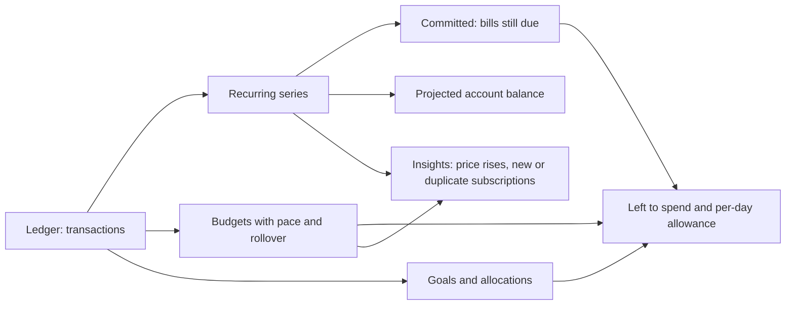
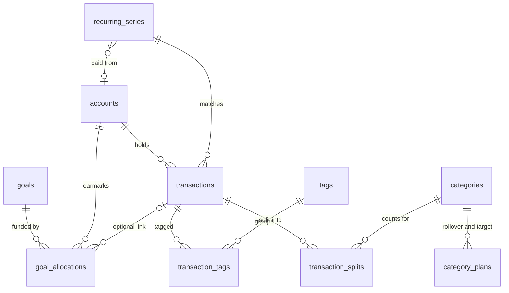
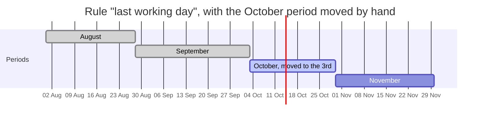

# Feature opportunities

> Summary: the synthesis of the 20 app studies: which ideas recur across budgeting apps, what CoinKeeper already does better, a ranked list of features for our target user with their model, API and UI impact, one reconciled data-model proposal, a phased roadmap, the decisions taken and the pay-cycle period design.

This page reads across every report in [the research index](README.md). Each idea links to the app studies that describe it in detail; the per-app pages hold the mechanics, formulas and sources.

## Who we are building for

A person anywhere in the world who wants control of their money without becoming a finance expert. They want to:

- see where their money goes, in the currencies they actually use;
- stop wasting money on forgotten subscriptions, impulse spending and slow leaks;
- know how much they can still spend this month without breaking their plan;
- save for concrete things: a holiday, a house deposit, a car, an emergency fund.

They enter transactions by hand or import a bank CSV. Nothing we build may depend on a country, a bank aggregator, a credit score or a tax system.

## What CoinKeeper already does better

The research shows several places where CoinKeeper is ahead of well-known apps, and these are worth protecting:

| Strength in CoinKeeper                            | Apps that lack it                                                                                                                                                                                         |
| ------------------------------------------------- | --------------------------------------------------------------------------------------------------------------------------------------------------------------------------------------------------------- |
| Per-currency reporting, never summing currencies  | Monarch shows every amount as "$" ([monarch-money.md](apps/monarch-money.md)); YNAB, Copilot and Simplifi are single-currency ([ynab.md](apps/ynab.md), [quicken-simplifi.md](apps/quicken-simplifi.md))  |
| CSV import with mapping, duplicates and transfers | Copilot has no CSV import ([copilot-money.md](apps/copilot-money.md)); most US apps treat import as a fallback to bank sync                                                                               |
| Works fully without bank sync                     | Rocket Money, PocketGuard, Emma, Qapital and Cleo are built around sync, and sync breakage is their top complaint ([pocketguard.md](apps/pocketguard.md), [rocket-money.md](apps/rocket-money.md))        |
| Soft delete and restore for financial data        | Lunch Money deletes budget history when the period changes ([lunch-money.md](apps/lunch-money.md)); Money Lover loses recurring entries on logout ([money-lover.md](apps/money-lover.md))                 |
| Transfers never count as spending                 | Several apps need manual "exclude" steps to stop transfers inflating spending ([pocketguard.md](apps/pocketguard.md), [money-lover.md](apps/money-lover.md))                                              |
| Transparent rules and learned payee categories    | Copilot and Monarch rely on opaque machine-learning categorisation ([copilot-money.md](apps/copilot-money.md))                                                                                            |
| No paywall on core budgeting                      | PocketGuard, YNAB, Qapital and Emma paywall basics or removed free tiers, and reviewers complain about it ([pocketguard.md](apps/pocketguard.md), [emma.md](apps/emma.md), [qapital.md](apps/qapital.md)) |

## Patterns across the apps

The same ideas appear again and again. The table counts how widely each one is used, which is a good signal of what users expect.

| Pattern                                   | What it means for the user                                                                              | Seen in                                                                                                                                                                                                                                                                                                                                                                                                            |
| ----------------------------------------- | ------------------------------------------------------------------------------------------------------- | ------------------------------------------------------------------------------------------------------------------------------------------------------------------------------------------------------------------------------------------------------------------------------------------------------------------------------------------------------------------------------------------------------------------ |
| Recurring bills, subscriptions and income | "What is coming out of my account, and which subscriptions am I still paying for?"                      | [Rocket Money](apps/rocket-money.md), [Monarch](apps/monarch-money.md), [Simplifi](apps/quicken-simplifi.md), [Lunch Money](apps/lunch-money.md), [Firefly III](apps/firefly-iii.md), [Actual](apps/actual-budget.md), [Wallet](apps/wallet-budgetbakers.md), [Money Lover](apps/money-lover.md), [Toshl](apps/toshl-finance.md), [Emma](apps/emma.md), [PocketGuard](apps/pocketguard.md), [Monzo](apps/monzo.md) |
| One "left to spend" number                | "How much can I still spend this month?", often with a per-day figure                                   | [PocketGuard](apps/pocketguard.md), [Simplifi](apps/quicken-simplifi.md), [Emma](apps/emma.md), [Monzo](apps/monzo.md), [Revolut](apps/revolut.md), [Spendee](apps/spendee.md), [EveryDollar](apps/everydollar.md), [Monarch](apps/monarch-money.md), [Cleo](apps/cleo.md)                                                                                                                                         |
| Savings goals                             | "Put money aside for a holiday, a house or a car, and tell me how much to save each month"              | [Monarch](apps/monarch-money.md), [Monzo](apps/monzo.md), [Qapital](apps/qapital.md), [Firefly III](apps/firefly-iii.md), [PocketGuard](apps/pocketguard.md), [Wallet](apps/wallet-budgetbakers.md), [Money Lover](apps/money-lover.md), [Copilot](apps/copilot-money.md), [Revolut](apps/revolut.md)                                                                                                              |
| Budget rollover and sinking funds         | Unspent money in irregular categories carries over; overspending costs next month                       | [YNAB](apps/ynab.md), [EveryDollar](apps/everydollar.md), [Goodbudget](apps/goodbudget.md), [Actual](apps/actual-budget.md), [PocketGuard](apps/pocketguard.md), [Monarch](apps/monarch-money.md), [Lunch Money](apps/lunch-money.md), [Toshl](apps/toshl-finance.md), [Firefly III](apps/firefly-iii.md)                                                                                                          |
| Spending pace                             | "Am I spending too fast for this point in the month?"                                                   | [Goodbudget](apps/goodbudget.md), [Copilot](apps/copilot-money.md), [Toshl](apps/toshl-finance.md), [PocketGuard](apps/pocketguard.md) (Pace), [Wallet](apps/wallet-budgetbakers.md), [Money Lover](apps/money-lover.md)                                                                                                                                                                                           |
| Tags, events and trips                    | Group spending across categories: a holiday, a wedding, a home renovation                               | [Toshl](apps/toshl-finance.md), [Lunch Money](apps/lunch-money.md), [Spendee](apps/spendee.md), [Wallet](apps/wallet-budgetbakers.md), [Money Lover](apps/money-lover.md), [Revolut](apps/revolut.md), [Firefly III](apps/firefly-iii.md)                                                                                                                                                                          |
| Richer rules                              | Several conditions (payee, amount, account) and several actions (category, tag, rename, link to a bill) | [Lunch Money](apps/lunch-money.md), [Firefly III](apps/firefly-iii.md), [Actual](apps/actual-budget.md), [Rocket Money](apps/rocket-money.md)                                                                                                                                                                                                                                                                      |
| Split transactions                        | One supermarket receipt covers groceries and household items                                            | [Lunch Money](apps/lunch-money.md), [Firefly III](apps/firefly-iii.md), [Actual](apps/actual-budget.md), [Wallet](apps/wallet-budgetbakers.md), [Emma](apps/emma.md), [EveryDollar](apps/everydollar.md)                                                                                                                                                                                                           |
| Fast manual entry                         | Templates, duplicate, remembered defaults                                                               | [Wallet](apps/wallet-budgetbakers.md), [Toshl](apps/toshl-finance.md), [Spendee](apps/spendee.md), [Money Lover](apps/money-lover.md)                                                                                                                                                                                                                                                                              |
| Foreign currency per transaction          | Record a café bill in JPY on a EUR card, keeping both amounts                                           | [Spendee](apps/spendee.md), [Toshl](apps/toshl-finance.md), [Lunch Money](apps/lunch-money.md), [Revolut](apps/revolut.md)                                                                                                                                                                                                                                                                                         |
| Debts with people                         | "I lent Ana 50; she paid back 20"                                                                       | [Wallet](apps/wallet-budgetbakers.md), [Money Lover](apps/money-lover.md), [Monzo](apps/monzo.md) (shared tabs), [Revolut](apps/revolut.md) (group bills)                                                                                                                                                                                                                                                          |
| Insights, alerts and recaps               | Price increases, duplicate charges, new subscriptions, weekly summaries                                 | [Rocket Money](apps/rocket-money.md), [Emma](apps/emma.md), [Cleo](apps/cleo.md), [Monarch](apps/monarch-money.md), [Simplifi](apps/quicken-simplifi.md) (watchlists)                                                                                                                                                                                                                                              |
| Budget periods that follow payday         | The month starts on the 25th because that is when salary arrives                                        | [Emma](apps/emma.md), [Monzo](apps/monzo.md), [Lunch Money](apps/lunch-money.md), [Money Lover](apps/money-lover.md)                                                                                                                                                                                                                                                                                               |
| Envelope or zero-based budgeting          | Give every unit of income a job before spending it                                                      | [YNAB](apps/ynab.md), [EveryDollar](apps/everydollar.md), [Goodbudget](apps/goodbudget.md), [Actual](apps/actual-budget.md)                                                                                                                                                                                                                                                                                        |
| Challenges and savings rules              | Commitments such as "spend 20% less on takeaways this month" or "save 10% of each payslip"              | [Cleo](apps/cleo.md), [Qapital](apps/qapital.md), [Monzo](apps/monzo.md), [EveryDollar](apps/everydollar.md) (Margin Finder)                                                                                                                                                                                                                                                                                       |
| Households and sharing                    | Two people manage one budget                                                                            | [Monarch](apps/monarch-money.md), [Goodbudget](apps/goodbudget.md), [Spendee](apps/spendee.md), [Wallet](apps/wallet-budgetbakers.md), [YNAB](apps/ynab.md)                                                                                                                                                                                                                                                        |

## Ranked opportunities

Ranked by value to the target user, then by how little new structure they need. "Phase" refers to the [roadmap](#roadmap) below.

| #   | Feature                                                       | Why it matters to our user                                                                                              | Model impact                                                   | Effort | Phase                 | Read                                                                                                                                                                 |
| --- | ------------------------------------------------------------- | ----------------------------------------------------------------------------------------------------------------------- | -------------------------------------------------------------- | ------ | --------------------- | -------------------------------------------------------------------------------------------------------------------------------------------------------------------- |
| 1   | Spending pace and month-end projection on budgets             | Turns "62% used" into "you are 40 EUR ahead of plan with 12 days left"; the earliest warning against overspending       | None                                                           | S      | 1                     | [goodbudget.md](apps/goodbudget.md), [copilot-money.md](apps/copilot-money.md), [pocketguard.md](apps/pocketguard.md)                                                |
| 2   | Daily allowance ("per day left")                              | A number you can use at the till: remaining budget divided by days left                                                 | None                                                           | S      | 1                     | [revolut.md](apps/revolut.md), [spendee.md](apps/spendee.md), [emma.md](apps/emma.md)                                                                                |
| 3   | Budget suggestions from history                               | New users do not know what a realistic limit is; the average of the last three months is a good start                   | None                                                           | S      | 1                     | [copilot-money.md](apps/copilot-money.md), [lunch-money.md](apps/lunch-money.md), [monzo.md](apps/monzo.md)                                                          |
| 4   | Recurring bills, subscriptions and income                     | Finds forgotten subscriptions, shows what is due, and feeds every forward-looking number below                          | `recurring_series`, `transactions.recurring_series_id`         | M      | 2                     | [rocket-money.md](apps/rocket-money.md), [monarch-money.md](apps/monarch-money.md), [actual-budget.md](apps/actual-budget.md), [firefly-iii.md](apps/firefly-iii.md) |
| 5   | Left to spend this month                                      | One honest answer to "can I afford this?": income minus bills still due, budgets and goal contributions                 | None beyond recurring and goals                                | M      | 2                     | [pocketguard.md](apps/pocketguard.md), [quicken-simplifi.md](apps/quicken-simplifi.md), [monzo.md](apps/monzo.md)                                                    |
| 6   | Savings goals that earmark account money                      | Holiday, house, car and emergency fund, with a suggested monthly amount and an on-track status                          | `goals`, `goal_allocations`                                    | M      | 3                     | [monzo.md](apps/monzo.md), [monarch-money.md](apps/monarch-money.md), [qapital.md](apps/qapital.md), [firefly-iii.md](apps/firefly-iii.md)                           |
| 7   | Category funds: rollover with an optional target              | Irregular costs (car service, gifts, yearly insurance) stop wrecking single months                                      | `category_plans`                                               | M      | 3                     | [everydollar.md](apps/everydollar.md), [ynab.md](apps/ynab.md), [goodbudget.md](apps/goodbudget.md), [pocketguard.md](apps/pocketguard.md)                           |
| 8   | Subscription review and waste insights                        | A guided look at every recurring charge, price increases and duplicate charges: the direct answer to "money in the bin" | Dismissals only (`insight_dismissals`)                         | M      | 2–5                   | [rocket-money.md](apps/rocket-money.md), [everydollar.md](apps/everydollar.md), [emma.md](apps/emma.md)                                                              |
| 9   | Tags with trips and a travel mode                             | Answer "what did the holiday really cost?" across categories and currencies                                             | `tags`, `transaction_tags`, `user_settings.active_trip_tag_id` | M      | 4                     | [toshl-finance.md](apps/toshl-finance.md), [money-lover.md](apps/money-lover.md), [revolut.md](apps/revolut.md)                                                      |
| 10  | Faster manual entry: templates, duplicate, sticky defaults    | Manual users stay only if entry is fast                                                                                 | `transaction_templates`                                        | S      | 1–2                   | [wallet-budgetbakers.md](apps/wallet-budgetbakers.md), [toshl-finance.md](apps/toshl-finance.md)                                                                     |
| 11  | Original currency on a transaction                            | Card spending abroad keeps the amount you saw on the receipt next to the amount the bank charged                        | `transactions.original_amount_minor`, `original_currency`      | M      | 4                     | [spendee.md](apps/spendee.md), [toshl-finance.md](apps/toshl-finance.md)                                                                                             |
| 12  | Projected balance per account                                 | "Will my account go below zero before payday?"                                                                          | None beyond recurring                                          | M      | 2                     | [quicken-simplifi.md](apps/quicken-simplifi.md), [actual-budget.md](apps/actual-budget.md), [wallet-budgetbakers.md](apps/wallet-budgetbakers.md)                    |
| 13  | Split transactions                                            | Correct category totals for mixed receipts and shared bills                                                             | `transaction_splits`                                           | M      | 4                     | [lunch-money.md](apps/lunch-money.md), [firefly-iii.md](apps/firefly-iii.md), [actual-budget.md](apps/actual-budget.md)                                              |
| 14  | Rules with several conditions and actions                     | Less time in the review inbox after each import                                                                         | `rules.conditions`, `rules.actions` (typed JSON)               | M      | 4                     | [lunch-money.md](apps/lunch-money.md), [firefly-iii.md](apps/firefly-iii.md)                                                                                         |
| 15  | Debts with people                                             | Track money lent to and borrowed from friends and family without counting it as spending                                | `accounts.type = 'person'`                                     | S–M    | 4                     | [wallet-budgetbakers.md](apps/wallet-budgetbakers.md), [money-lover.md](apps/money-lover.md)                                                                         |
| 16  | Essentials versus wants                                       | Shows how much of spending is needs versus choices, the lever for cutting waste                                         | `categories.is_essential`                                      | S      | 3                     | [cleo.md](apps/cleo.md), [monarch-money.md](apps/monarch-money.md)                                                                                                   |
| 17  | Analytics by payee and account, charts that open transactions | "Which shop takes most of my money?" in one click                                                                       | None                                                           | S      | 1                     | [revolut.md](apps/revolut.md), [monarch-money.md](apps/monarch-money.md)                                                                                             |
| 18  | Monthly recap and spending challenges                         | A habit loop: a short summary each month and an optional challenge for the category that grew most                      | `challenges` (later)                                           | M      | 5                     | [cleo.md](apps/cleo.md), [emma.md](apps/emma.md), [qapital.md](apps/qapital.md)                                                                                      |
| 19  | Budget period that starts on payday                           | Budgets match how money arrives, not the calendar                                                                       | `user_settings.period_start_day`                               | M–L    | 2 (decide), 5 (build) | [emma.md](apps/emma.md), [monzo.md](apps/monzo.md)                                                                                                                   |
| 20  | Debt payoff planner                                           | Snowball or avalanche with a debt-free date                                                                             | `accounts.apr_bps`, `accounts.minimum_payment_minor`           | M      | 5                     | [pocketguard.md](apps/pocketguard.md), [monarch-money.md](apps/monarch-money.md)                                                                                     |
| 21  | Shared household budgets                                      | Couples and families manage money together                                                                              | Households and memberships (changes per-user scoping)          | L      | 5                     | [monarch-money.md](apps/monarch-money.md), [spendee.md](apps/spendee.md)                                                                                             |
| 22  | Optional envelope mode and budget automations                 | For users who want zero-based budgeting                                                                                 | `user_settings.budget_mode`, automation rules                  | L      | 5                     | [ynab.md](apps/ynab.md), [actual-budget.md](apps/actual-budget.md)                                                                                                   |

## How the main ideas fit together

The strongest apps do not ship these features in isolation. They build a chain:

Recurring series are the foundation: left to spend, projected balances, subscription review and most insights need to know what is coming. Goals and rollover sit beside budgets and reduce what is free to spend. Every number stays a query over the ledger, per currency, as the [architecture](../architecture/overview.md) requires.

Goals and category funds solve different problems and should stay separate:

- A **goal** earmarks money that sits in an account for a future purchase or safety net (holiday, deposit, car, emergency fund). Contributions are allocations, not spending.
- A **category fund** is a budget category whose unspent amount rolls over for irregular spending (car service, presents, yearly insurance). Spending from it is ordinary spending.
- A holiday uses both in sequence: a goal while saving, then a trip tag while spending, after which the goal is marked reached and its allocations released.

## Proposed data model

The app studies propose overlapping tables under different names (`recurring_series`, `recurring_items`, `schedules`, `scheduled_transactions`). This is the reconciled proposal. Every table has `id`, `user_id`, `created_at`, `updated_at` and `deleted_at` (soft delete), money is signed `bigint` minor units with a `char(3)` currency, and nothing stores a derived balance.

| Table or change                                             | Columns                                                                                                                                                                                                                                                                                                                                                                                                                                          | Replaces the names used in                                                                                                                                                                                                                                                                          |
| ----------------------------------------------------------- | ------------------------------------------------------------------------------------------------------------------------------------------------------------------------------------------------------------------------------------------------------------------------------------------------------------------------------------------------------------------------------------------------------------------------------------------------ | --------------------------------------------------------------------------------------------------------------------------------------------------------------------------------------------------------------------------------------------------------------------------------------------------- |
| `recurring_series`                                          | `name`, `kind` (`bill`, `subscription`, `income`, `other`), `account_id?`, `payee_id?`, `category_id?`, `currency`, `amount_minor` (expected, signed), `amount_min_minor?`, `amount_max_minor?`, `cadence` (`weekly`, `monthly`, `yearly`, `every_n_days`), `interval`, `anchor_date`, `end_date?`, `match_window_days`, `record_mode` (`match_only`, `create_pending`), `source` (`manual`, `detected`), `status` (`active`, `paused`, `ended`) | `recurring_items` ([monzo.md](apps/monzo.md), [firefly-iii.md](apps/firefly-iii.md)), `schedules` ([actual-budget.md](apps/actual-budget.md), [goodbudget.md](apps/goodbudget.md)), `scheduled_transactions` ([spendee.md](apps/spendee.md), [wallet-budgetbakers.md](apps/wallet-budgetbakers.md)) |
| `transactions.recurring_series_id?`                         | links a paid occurrence to its series                                                                                                                                                                                                                                                                                                                                                                                                            | `recurring_item_id`, `schedule_id`                                                                                                                                                                                                                                                                  |
| `goals`                                                     | `name`, `icon`, `colour`, `currency`, `target_amount_minor?`, `target_date?`, `status` (`active`, `reached`, `archived`), `sort_order`                                                                                                                                                                                                                                                                                                           | same name in all studies                                                                                                                                                                                                                                                                            |
| `goal_allocations`                                          | `goal_id`, `account_id`, `amount_minor` (signed: positive earmarks, negative releases), `date`, `transaction_id?`, `memo`                                                                                                                                                                                                                                                                                                                        | same name in all studies                                                                                                                                                                                                                                                                            |
| `category_plans`                                            | `category_id`, `currency`, `rollover` (bool), `rollover_since` (month), `target_kind?` (`monthly`, `by_date`, `yearly`), `target_amount_minor?`, `target_date?`                                                                                                                                                                                                                                                                                  | `category_targets` ([ynab.md](apps/ynab.md), [goodbudget.md](apps/goodbudget.md)), `budgets.rollover` ([pocketguard.md](apps/pocketguard.md), [toshl-finance.md](apps/toshl-finance.md)), `rollover_mode` ([firefly-iii.md](apps/firefly-iii.md))                                                   |
| `tags`, `transaction_tags`                                  | `tags`: `name`, `colour`, `kind` (`label`, `trip`), `starts_on?`, `ends_on?`, `archived_at`; `transaction_tags`: `transaction_id`, `tag_id`                                                                                                                                                                                                                                                                                                      | `events` ([money-lover.md](apps/money-lover.md)), `trips` ([revolut.md](apps/revolut.md))                                                                                                                                                                                                           |
| `user_settings.active_trip_tag_id?`                         | travel mode: new transactions get this tag while it is set                                                                                                                                                                                                                                                                                                                                                                                       | `active_event_id` ([money-lover.md](apps/money-lover.md))                                                                                                                                                                                                                                           |
| `transactions.original_amount_minor?`, `original_currency?` | the amount and currency on the receipt; `amount_minor` in the account currency stays the truth                                                                                                                                                                                                                                                                                                                                                   | [spendee.md](apps/spendee.md), [toshl-finance.md](apps/toshl-finance.md)                                                                                                                                                                                                                            |
| `transaction_templates`                                     | `name`, `account_id?`, `category_id?`, `payee_id?`, `amount_minor?`, `memo`, `sort_order`                                                                                                                                                                                                                                                                                                                                                        | [wallet-budgetbakers.md](apps/wallet-budgetbakers.md)                                                                                                                                                                                                                                               |
| `transaction_splits`                                        | `transaction_id`, `category_id`, `amount_minor`, `memo`; the lines sum to the parent amount                                                                                                                                                                                                                                                                                                                                                      | parent and child rows ([actual-budget.md](apps/actual-budget.md))                                                                                                                                                                                                                                   |
| `rules.conditions`, `rules.actions`                         | typed JSON validated by shared Zod schemas; conditions on payee, memo, amount range, account; actions set category, add tag, rename payee, link to a recurring series, mark for review                                                                                                                                                                                                                                                           | `rule_conditions`, `rule_actions` tables ([lunch-money.md](apps/lunch-money.md), [firefly-iii.md](apps/firefly-iii.md))                                                                                                                                                                             |
| `accounts.type` gains `person`                              | a person you lend to or borrow from; lending and repayments are transfers, so they never count as spending                                                                                                                                                                                                                                                                                                                                       | `counterparties` and `debts` ([wallet-budgetbakers.md](apps/wallet-budgetbakers.md), [money-lover.md](apps/money-lover.md))                                                                                                                                                                         |
| `categories.is_essential`                                   | needs versus wants                                                                                                                                                                                                                                                                                                                                                                                                                               | `category_groups.is_essential` ([cleo.md](apps/cleo.md))                                                                                                                                                                                                                                            |
| `user_settings.period_start_day`                            | 1 to 28; budget and report periods start on this day                                                                                                                                                                                                                                                                                                                                                                                             | `budget_period_*` ([emma.md](apps/emma.md))                                                                                                                                                                                                                                                         |
| `insight_dismissals`                                        | `insight_key`, `dismissed_until?`; insights themselves are computed on read                                                                                                                                                                                                                                                                                                                                                                      | `insights` table ([rocket-money.md](apps/rocket-money.md))                                                                                                                                                                                                                                          |

Two choices in this proposal differ from what some studies suggest, on purpose:

- **Debts with people as `person` accounts** instead of separate `counterparties` and `debts` tables. Lending 50 EUR to Ana is a transfer from your current account to the "Ana" account; her repayment is a transfer back; the account balance is what she owes. This reuses paired transfers, keeps the ledger as the only truth and needs no new report rules. A shared dinner where a friend owes half needs split transactions (one line to the category, one line as a transfer), which is why splits come in the same phase.
- **Recurring rows are never created silently.** `record_mode = 'create_pending'` creates the due occurrence as a `pending` transaction with `needs_review = true`, so it lands in the existing [review inbox](../features/review-inbox.md) for confirmation. Wallet and Money Lover both separate payments you confirm from payments added automatically; in a manual-first app, confirmation keeps balances right when a payment is skipped or its amount changes.

## Algorithms worth fixing early

These formulas come from the studies and should live as tested pure helpers in `packages/shared/src/lib/`, in integer minor units:

| Helper                 | Formula                                                                                                                                                       | Source                                                                                 |
| ---------------------- | ------------------------------------------------------------------------------------------------------------------------------------------------------------- | -------------------------------------------------------------------------------------- |
| Expected spend to date | `limit × days_elapsed ÷ days_in_period`, rounded down; "ahead" or "behind" is `spent − expected`                                                              | [goodbudget.md](apps/goodbudget.md), [copilot-money.md](apps/copilot-money.md)         |
| Month-end projection   | `spent + daily_rate × days_left + bills_still_due`, with the daily rate blended with the historical median early in the month                                 | [pocketguard.md](apps/pocketguard.md)                                                  |
| Daily allowance        | `max(0, limit + carried − spent) ÷ days_left`                                                                                                                 | [revolut.md](apps/revolut.md), [spendee.md](apps/spendee.md)                           |
| Rollover carry         | window sum of `budget − spent` over earlier months since `rollover_since`; negative carry reduces the next month                                              | [pocketguard.md](apps/pocketguard.md), [firefly-iii.md](apps/firefly-iii.md)           |
| Goal monthly amount    | `ceil((target − saved) ÷ months_left)`                                                                                                                        | [firefly-iii.md](apps/firefly-iii.md), [goodbudget.md](apps/goodbudget.md)             |
| Left to spend          | `income − bills (max of expected and paid) − budgets (max of limit and spent) − unbudgeted spending − goal contributions`                                     | [pocketguard.md](apps/pocketguard.md), [quicken-simplifi.md](apps/quicken-simplifi.md) |
| Recurring detection    | group by payee and currency; median gap between dates mapped to a cadence; amount spread decides fixed subscription versus variable bill; at least three hits | [rocket-money.md](apps/rocket-money.md), [emma.md](apps/emma.md)                       |
| Recurring match        | same payee, amount inside `[amount_min, amount_max]` (default ±7.5%), date within ±`match_window_days` of the expected date                                   | [actual-budget.md](apps/actual-budget.md), [firefly-iii.md](apps/firefly-iii.md)       |

## Roadmap

Each phase ships something a user notices on its own, and each builds the foundation for the next.

| Phase                    | Goal for the user                        | Features                                                                                                                                                                                                                                  | Schema changes                                                                          |
| ------------------------ | ---------------------------------------- | ----------------------------------------------------------------------------------------------------------------------------------------------------------------------------------------------------------------------------------------- | --------------------------------------------------------------------------------------- |
| 1. Make the budget talk  | See whether I am on track today          | Pace marker and month-end projection on budget bars; per-day allowance; "suggest" limits from the last three months; analytics by payee and account; charts open filtered transactions; duplicate a transaction; remembered form defaults | None                                                                                    |
| 2. Know what is coming   | Bills, subscriptions and income ahead    | Recurring series (manual and detected), upcoming list and calendar with paid, due and overdue; subscription review; committed spending in budgets; left to spend; projected balance; transaction templates                                | `recurring_series`, `transactions.recurring_series_id`, `transaction_templates`         |
| 3. Save for what matters | Holiday, house, car, emergency fund      | Goals with allocations, suggested monthly amount and status; category funds with rollover and targets; essentials versus wants; sweep leftover budget into a goal at month end                                                            | `goals`, `goal_allocations`, `category_plans`, `categories.is_essential`                |
| 4. Organise real life    | Trips, receipts, friends, faster imports | Tags and trips with travel mode; original currency on transactions; split transactions; person accounts for debts; rules with conditions and actions; saved import profiles                                                               | `tags`, `transaction_tags`, split lines, `transactions.original_*`, rule JSON, `person` |
| 5. Coach and share       | Stay motivated, involve my partner       | Insights (price rises, new or duplicate subscriptions, unusual spending); monthly recap; challenges; pay-cycle periods; debt payoff planner; households; optional envelope mode                                                           | `insight_dismissals`, `challenges`, households, `period_start_day`                      |

Phase 1 needs no migration and can start immediately. Phase 2 is the foundation for most of what follows, so it deserves the most design care.

## Decisions

These questions came up in several studies and change the design. The product owner answered them after reading the research.

| #   | Question                                   | Decision                                                                                                                                                                                                       |
| --- | ------------------------------------------ | -------------------------------------------------------------------------------------------------------------------------------------------------------------------------------------------------------------- |
| 1   | Can budget periods start on payday?        | Yes. Paydays that move from month to month must be supported, and people paid every two weeks or with no fixed payday keep simple periods. The design is in [Pay-cycle periods](#pay-cycle-periods).           |
| 2   | Which income counts in left to spend?      | Income already received. Left to spend is built as a widget; a customisable dashboard, where each user picks the widgets they want, is decided later.                                                          |
| 3   | Rollover when an old transaction changes   | Carried amounts follow the ledger: editing an old transaction changes every later carry. The budgets documentation must say so.                                                                                |
| 4   | Goal allocations above the account balance | Allowed, with an "over-allocated" warning.                                                                                                                                                                     |
| 5   | Goals across accounts                      | One account and one currency per goal for now.                                                                                                                                                                 |
| 6   | Tags or events for trips                   | One `tags` table with a `trip` kind.                                                                                                                                                                           |
| 7   | AI assistant                               | Not before a minimum viable product. After that, an opt-in assistant or an MCP server that lets the user's own agents read and record transactions can be considered. Until then, insights stay deterministic. |

Phase 1 of the roadmap is approved. It starts after the [demo account](../getting-started/demo-account.md) is merged, so every screen can be checked against six months of realistic data.

## Pay-cycle periods

Most budgeting apps assume the month starts on the 1st. Many people are paid near the end of the month instead, and not always on the same day: a salary can land on the last working day, three days before the end, or five days before when a weekend intervenes. Others are paid every two weeks, or run a business with no payday at all. CoinKeeper should let each person choose, and let them move a single period when reality differs from the rule.

### Period rules

The user picks one rule in Settings:

| Rule                | How the period start is found                                                              | Suits                                                  |
| ------------------- | ------------------------------------------------------------------------------------------ | ------------------------------------------------------ |
| Calendar month      | The 1st of each month (the default, and what CoinKeeper does today)                        | Freelancers, company owners, anyone without one payday |
| Fixed day           | A day of the month (1 to 28); when it falls on a weekend, the working day before it        | Salaries paid on a set date, such as the 25th          |
| Before month end    | The last working day of the month, or a chosen number of working days before it            | Salaries paid "in the last days of the month"          |
| Every N weeks       | Every one, two or four weeks from an anchor date                                           | Weekly and bi-weekly pay                               |
| When salary arrives | The day the salary is recorded; until it arrives, the date given by one of the rules above | Paydays that move every month                          |

"When salary arrives" needs recurring series (phase 2): the user marks their salary series, and the period starts on the date of the transaction that matches it. If the salary is late, the current period stretches until it arrives and the dashboard says it is waiting for the salary. If it never arrives, the period falls back to the expected date after a few days' grace, so a missing salary never freezes the budget.

### Moving one period

Any single period can be moved by hand ("this month I was paid on the 3rd"). The move is stored as an override for that period only; the rule still decides the next one. Periods never overlap and never leave gaps: each one ends the day before the next one starts, so moving a start only shortens or lengthens its neighbour.

### Naming and keys

A monthly period is named after the month it ends in, with its dates: "October (3 Oct to 29 Oct)". That keeps today's `budgets.month` key working for every monthly rule: a budget for `2026-10` applies to the October period, whatever its exact dates. Every-N-weeks periods do not map to months; their budgets need a key by period start date, which is a later migration and one reason that rule comes last.

### Data model

| Change                                   | Contents                                                                                                                                                                                 |
| ---------------------------------------- | ---------------------------------------------------------------------------------------------------------------------------------------------------------------------------------------- |
| `user_settings.period_rule`              | Typed JSON validated by a shared Zod schema: `{ kind: 'calendar' }`, `{ kind: 'fixed_day', day }`, `{ kind: 'before_month_end', workingDays }`, `{ kind: 'every_weeks', weeks, anchor }` |
| `user_settings.period_income_series_id?` | The salary series whose arrival starts a period (only with recurring series)                                                                                                             |
| `user_settings.weekend_days`             | The days treated as the weekend, Saturday and Sunday by default, since some countries rest on Friday and Saturday. Public holidays are left out because they depend on the country       |
| `budget_period_starts`                   | Overrides: `user_id`, `period_key`, `starts_on`, soft delete                                                                                                                             |

### How the code should use it

- One shared helper module, `packages/shared/src/lib/periods.ts`, owns the rules: `periodFor(date, settings, overrides)` and `periodRange(periodKey, settings, overrides)` return `{ key, from, to, days }`.
- Every budget, report and dashboard query takes a date range from that helper instead of computing month boundaries itself.
- Pace, the daily allowance and rollover use the period's real number of days, which varies between 28 and 35.
- Changing the rule recalculates past periods from the ledger. Nothing is deleted or rewritten; Lunch Money deletes budget history when the period changes, which is the behaviour to avoid.

### Order of work

1. **Phase 1:** introduce the period helper with the calendar rule only, and write pace and the daily allowance against it. Nothing changes for users, but no new code assumes the 1st.
2. **Phase 2:** fixed day, before month end and manual moves, with the Settings screen and the override table.
3. **With recurring series:** "When salary arrives".
4. **Later:** every N weeks, with budgets keyed by period start.

The demo account already has a salary that moves around the last week of the month and avoids weekends, so each rule can be checked against it.

## What we will not copy

Rejected across the studies, with the reason:

| Pattern                                                            | Why not                                                                                                                      |
| ------------------------------------------------------------------ | ---------------------------------------------------------------------------------------------------------------------------- |
| Bank sync as the main way in (Plaid, Finicity, Salt Edge)          | Region-bound; sync breakage is the top complaint in every sync-first app                                                     |
| Bill negotiation for a share of savings, cash advances             | Fee-taking products that conflict with helping users save ([rocket-money.md](apps/rocket-money.md), [cleo.md](apps/cleo.md)) |
| Hard-to-cancel subscriptions, removed free tiers, constant upsells | Named in reviews of PocketGuard, Qapital, Emma and Cleo as reasons users leave                                               |
| Showing every currency as one currency                             | Breaks per-currency reporting ([monarch-money.md](apps/monarch-money.md))                                                    |
| Deleting history when a setting changes                            | Breaks soft delete ([lunch-money.md](apps/lunch-money.md))                                                                   |
| Sharing by sharing one login and password                          | Unsafe; households need real memberships ([goodbudget.md](apps/goodbudget.md))                                               |
| Silent auto-created transactions                                   | Wrong balances when a payment is skipped; use pending rows in the review inbox instead                                       |
| Credit scores, US tax exports, programme-specific content          | Country-specific ([everydollar.md](apps/everydollar.md), [monarch-money.md](apps/monarch-money.md))                          |
